# Citrix SD-WAN 远程代码执行复现与澄清说明

<!-- vulwiki-editorial:start -->
## 校订与适用边界

### 尚未解决的证据缺口

以下限制仍适用于后文历史材料；相关版本、结果或修复结论不能据此视为已验证：

- 缺CVE、具体端点、认证条件和根因
- python url whoami缺脚本名且未提供脚本
- 官方链接CTX285061末尾多等号
- 大量个人澄清争论与技术记录无关
- 应归网络设备

本页为文本校订，未执行代码、PoC 或目标请求；原图仅保留引用，未据此确认复现成功。
<!-- vulwiki-editorial:end -->

## 技术正文与历史材料

<meta name="referrer" content="no-referrer"/>

> 本文由 [简悦 SimpRead](http://ksria.com/simpread/) 转码， 原文地址 [mp.weixin.qq.com](https://mp.weixin.qq.com/s/ylKR7zdefIsSJ8y8Mi6KMw)

1 介绍

Citrix SD-WAN 作为软件、虚拟设备和硬件
--------------------------

Citrix SD-WAN 有可用的软件、虚拟或硬件设备版本。企业通过使用 Citrix 的产品将 SDN 和 NFV 引入其广域网，使其更具可扩展性、成本效益更好，同时确保强大的应用程序性能。Citrix SD-WAN 还可以通过集成路由、防火墙和 WAN 优化功能帮助企业简化其分支网络。

Citrix SD-WAN 安全功能
------------------

该产品附带的 Citrix 防火墙达到他们公司防火墙硬件标准，同时也已经通过了 ICSA 实验室的认证。根据 ICSA 的一份报告，Citrix SD-WAN 410 设备起初因为防火墙没有为记录的事件提供足够的信息。 最初未能满足 set 安全性和功能性要求。但后来的版本通过固件升级把两个问题都解决了。

通过 Citrix 的合作伙伴（如 Palo Alto Networks 或 Zscaler）合作，Citrix SD-WAN 编排服务可以在分支站点和基于公共云的安全网关之间创建 IPsec 隧道。提供针对高级威胁保护和威胁情报的优质服务。

大概长这个样子  

2 影响范围

**影响范围** : Citrix SD-WAN 11.2 before 11.2.2

Citrix SD-WAN 11.1 before 11.1.2b

Citrix SD-WAN 10.2 before 10.2.8

3 漏洞复现

使用福林表哥提供的脚本 脚本暂时不予提供 各位师傅可以去 github 找找  

python url 'whoami'  

4 修复方案

Citrix 公司已经针对该漏洞发布了更新，请访问以下链接并升级版本

https://support.citrix.com/article/CTX285061=

澄清说明

阿乐你好公众号一直与零组团队一起战斗 这个复现其实昨天都搞好了 因为这个憨批让我 tm 没心情发了  造谣一张嘴 辟谣跑断腿

暂时没有盈利例如公众号接一些广告 知识星球 昨天就出了一个神人 喷我公众号接盈利性广告  还有 2 个啥都不知道就就在那跟风 既然说从我公众号进来的 

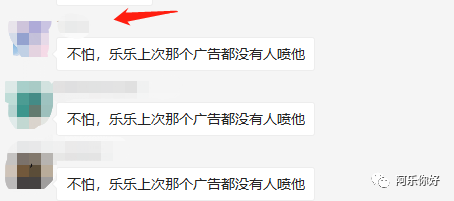

微信公众号有一个功能 就是被删的文章 也有记录 我就全部截图出来

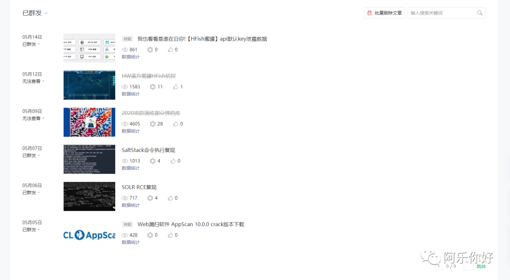

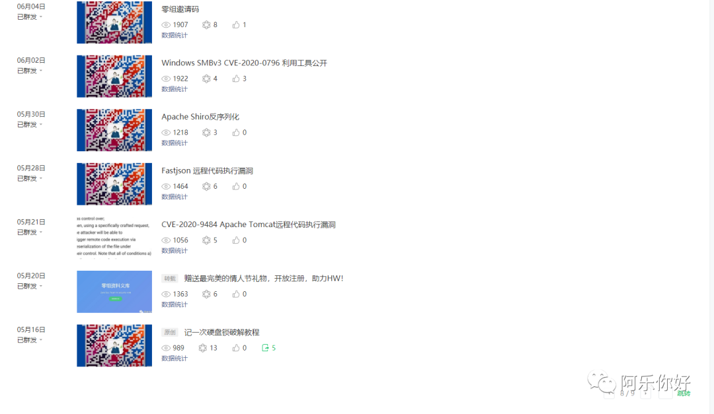

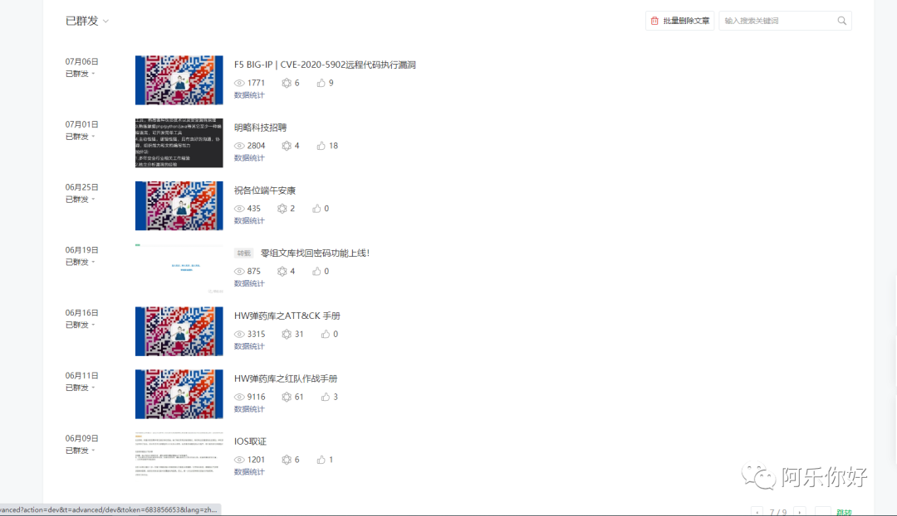

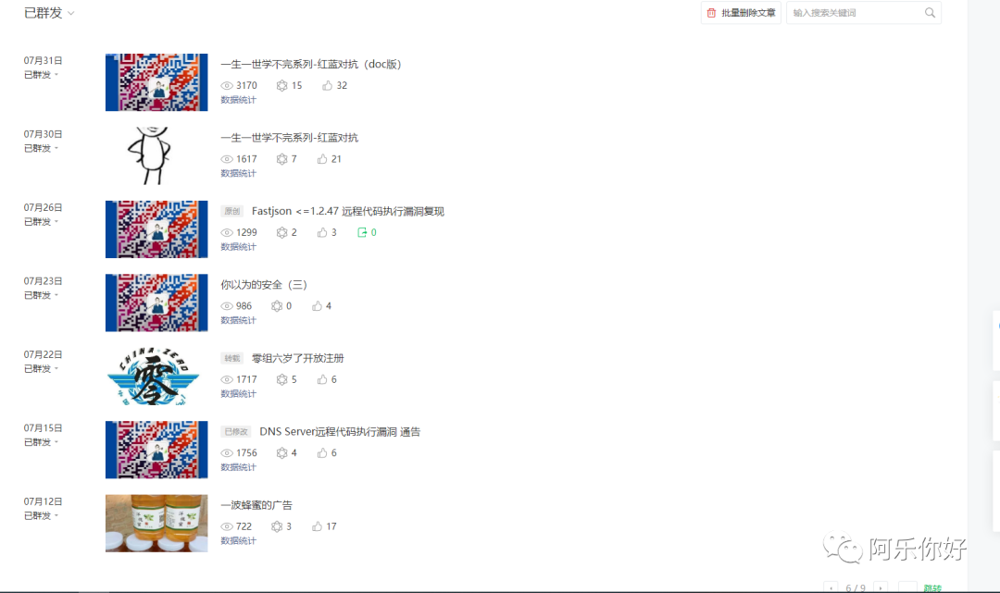

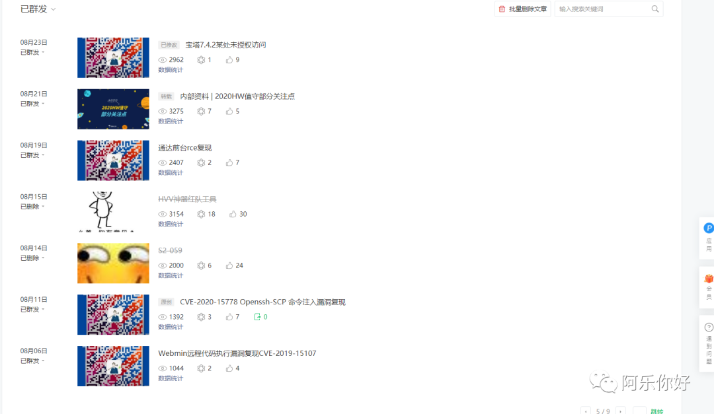

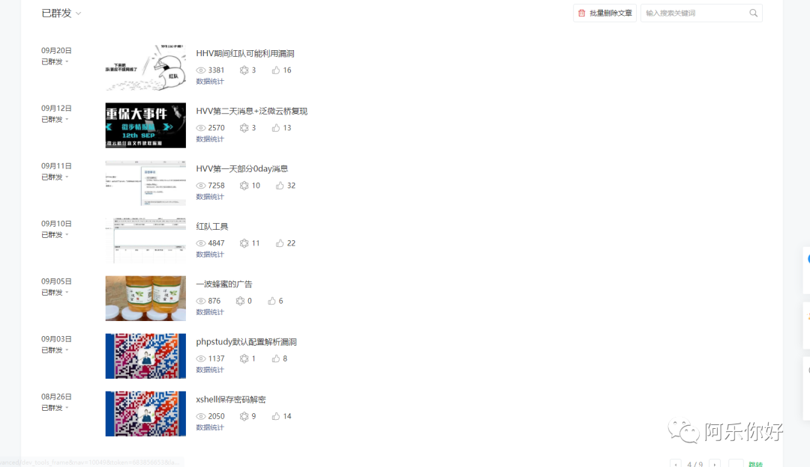

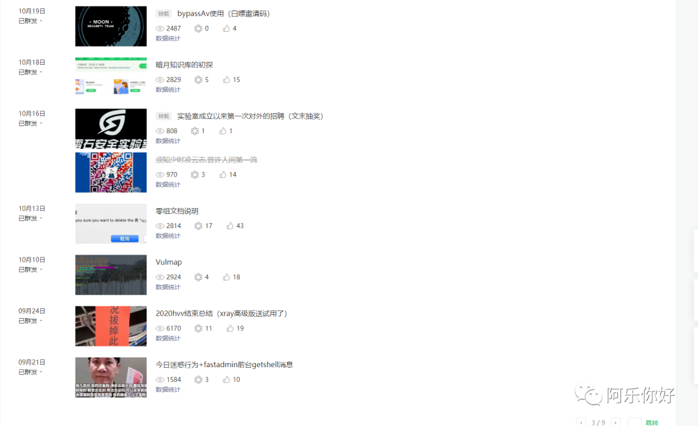

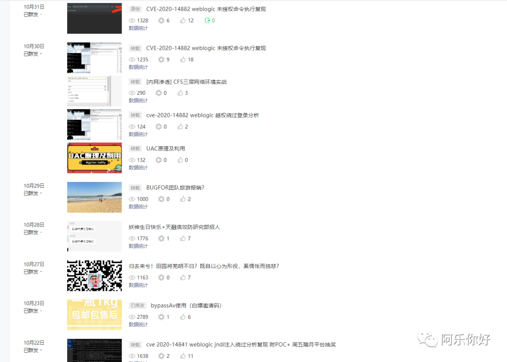

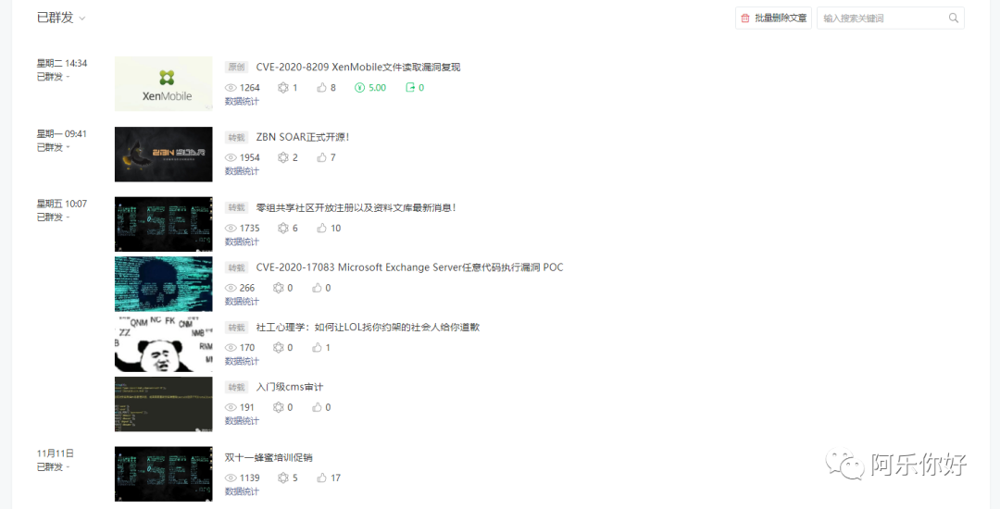

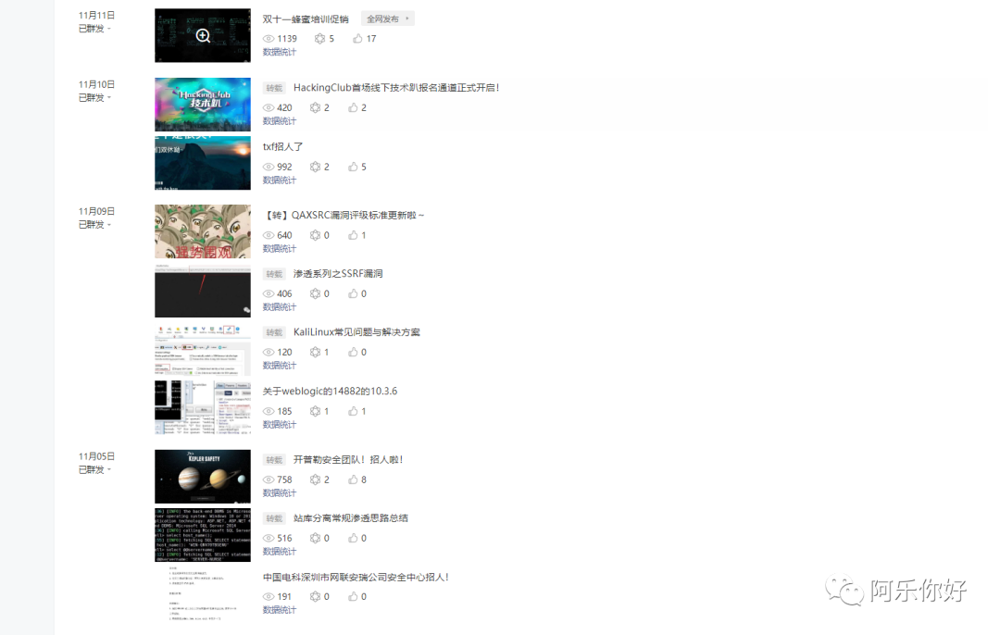

借用乌云的一句话  

与其相信谣言 不如相信阿乐

---

> 来源：MrWQ/vulnerability-paper（https://github.com/MrWQ/vulnerability-paper）
