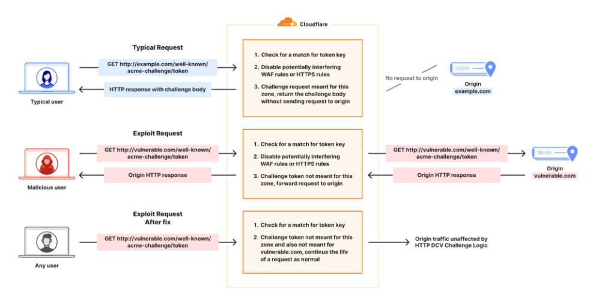

# Cloudflare修复了ACME验证漏洞，该漏洞允许绕过WAF访问源服务器

<!-- vulwiki-editorial:start -->
## 校订与适用边界

### 尚未解决的证据缺口

以下限制仍适用于后文历史材料；相关版本、结果或修复结论不能据此视为已验证：

- HTTP01描述用httpsURL却说HTTP80，需区分初始请求与重定向
- 绕WAF不等可读取所有源站敏感文件，须有可达路由/源站缺陷
- 这些特性前缺完整解释，疑截段
- 无Cloudflare原文URL/修复时间，托管修复无本地版本
- 保留无已知恶用为来源声明

本页为文本校订，未执行代码、PoC 或目标请求；原图仅保留引用，未据此确认复现成功。
<!-- vulwiki-editorial:end -->

## 技术正文与历史材料

原创 ZM
                    ZM  暗镜   2026-01-21 01:00  
  
Cloudflare 已修复影响其自动证书管理环境 ( ACME ) 验证逻辑的安全漏洞，该漏洞使得绕过安全控制和访问源服务器成为可能。  
  
“漏洞根源在于我们边缘网络处理发往 ACME HTTP-01 挑战路径 (/.well-known/acme-challenge/*) 的请求的方式，”网络基础设施公司的 Hrushikesh Deshpande、Andrew Mitchell 和 Leland Garofalo 表示。  
  
这家网络基础设施公司表示，他们没有发现任何证据表明该漏洞曾被恶意利用。  
  
ACME 是一种通信协议（RFC 8555），它能够自动颁发、续订和吊销 SSL/TLS 证书。证书颁发机构 (CA) 为网站提供的每个证书都会通过挑战进行验证，以证明域名所有权。  
  
此过程通常使用 ACME 客户端（例如Certbot）来实现，该客户端通过HTTP-01（或 DNS-01）质询来验证域名所有权并管理证书生命周期。HTTP-01 质询会检查位于 Web 服务器“`https://<YOUR_DOMAIN>/.well-known/acme-challenge/<TOKEN>`”的验证令牌和密钥指纹，并通过 HTTP 端口 80 进行通信。  
  
CA 的服务器会向该 URL 发送 HTTP GET 请求以检索文件。验证成功后，证书将被颁发，CA 会将 ACME 帐户（即其服务器上的注册实体）标记为有权管理该特定域名。  
  
如果该挑战来自 Cloudflare 管理的证书订单，则 Cloudflare 将按照上述路径响应，并将 CA 提供的令牌提供给调用方。但如果该挑战与 Cloudflare 管理的订单无关，则请求将被路由到客户源站，该源站可能使用不同的系统进行域名验证。  
  
  
  
这样做是因为这些特性可能会干扰 CA 验证令牌值的能力，并导致自动证书订购和续订失败。但是，如果使用的令牌与不同的区域关联，并且并非由 Cloudflare 直接管理，则请求将被允许继续发送到客户源服务器，而无需 WAF 规则集进行进一步处理。  
  
FearsOff 的创始人兼首席执行官 Kirill Firsov 表示，恶意用户可以利用此漏洞获取确定性的、长期有效的令牌，并访问 Cloudflare 所有主机上的源服务器上的敏感文件，从而打开侦察之门。  
  
Cloudflare 通过代码更改解决了该漏洞，该更改仅在请求与该主机名的有效 ACME HTTP-01 质询令牌匹配时才提供响应并禁用 WAF 功能。  
  
  

---

> 来源：gelusus/wxvl（微信公众号漏洞文章自动归档，原文见文首链接）
