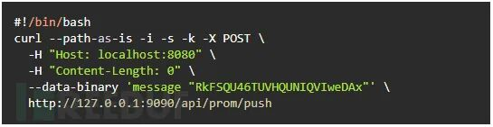
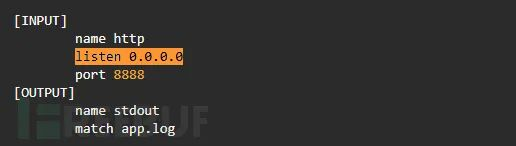
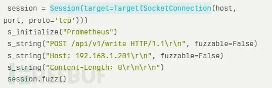

# Fluent Bit 0-day漏洞使数十亿生产环境面临网络攻击威胁

<!-- vulwiki-editorial:start -->
## 校订与适用边界

### 尚未解决的证据缺口

以下限制仍适用于后文历史材料；相关版本、结果或修复结论不能据此视为已验证：

- 两个主CVE缺元数据
- 开头均空指针与后文堆损坏/内存泄露机制混写
- 3.0.4/2.2.3补丁可能混另一漏洞需原公告核
- 下载量/日部署数不能推定数十亿受影响生产实例
- PoC配置与fuzzer均截图未转文字
- 缺原研究链接，作者归属Ebryx/Tenable混杂

### 操作风险与资料使用

- 含资源消耗、延时或崩溃验证：可能影响服务可用性；限制请求次数、并发与超时，保留无攻击负载的对照结果。

本页为文本校订，未执行代码、PoC 或目标请求；原图仅保留引用，未据此确认复现成功。
<!-- vulwiki-editorial:end -->

## 技术正文与历史材料

e安在线  e安在线   2025-02-26 03:26  
  
  
  
研究人员发现了 Fluent Bit 中的关键 0-day 漏洞，这款日志收集工具广泛应用于 AWS、Google Cloud 和 Microsoft Azure 等主要云服务提供商的云基础设施中。这两个漏洞被追踪为 CVE-2024-50608 和 CVE-2024-50609（CVSS 评分 8.9），利用了 Fluent Bit 的 Prometheus Remote Write 和 OpenTelemetry 插件中的空指针解引用弱点。  
  
  
  
  
  
Fluent Bit 拥有超过 150 亿次下载和每日 1000 万次部署，这些漏洞对全球企业和云生态系统构成严重威胁。  
  
  
**漏洞利用机制与攻击面**  
  
  
  
Prometheus Remote Write 漏洞允许未经身份验证的攻击者通过发送 Content-Length: 0 的 HTTP POST 请求，导致 Fluent Bit 服务器崩溃。这种情况在解析指标数据时触发了process_payload_metrics_ng()  
函数中的空指针解引用。以下是一个简单的利用示例：  
  
  
  
  
  
类似地，OpenTelemetry 插件在跟踪配置请求中未能验证输入类型。向/api/v1/traces  
端点发送非字符串值（例如整数）会导致堆内存损坏，从而引发拒绝服务（DoS）或部分敏感信息泄露。Tenable 的实验室测试证实了相邻内存暴露，偶尔会泄露敏感的指标数据。  
  
  
Fluent Bit 的架构通过涵盖输入解析、过滤和输出路由进一步放大了风险。例如，配置不当的 HTTP 输入插件会将 API 暴露给恶意负载：  
  
  
  
##   
  
**影响：云基础设施与企业面临的风险**  
  
  
## Fluent Bit 已集成到 Kubernetes 和云监控堆栈中，这意味着这些漏洞会波及多个服务。Cisco、Splunk 和 VMware 是其重要用户，而 AWS Elastic Kubernetes Service (EKS) 等超大规模企业默认将其嵌入。攻击者利用这些漏洞可能会破坏日志管道，导致事件响应和合规工作流程瘫痪。  
  
  
Ebryx 使用 Boofuzz 进行的模糊测试揭示了系统性缺陷。例如，以下脚本对 Prometheus 插件的 HTTP 处理程序进行了模糊测试：  
  
  
  
  
  
flb_sds_create_len()  
函数中缺乏输入验证，使得简单的 DoS 攻击成为可能。  
##   
  
**缓解措施与行业响应**  
  
  
## Fluent Bit 维护者在 v3.0.4 版本中发布了补丁，并将修复内容回溯到 v2.2.3 版本。关键的缓解措施包括：  
  
- 立即为 Fluent Bit 实例打补丁。  
  
- 通过网络策略或身份验证限制 API 访问。  
  
- 禁用未使用的端点，例如/api/v1/traces  
。  
  
企业必须审核 Fluent Bit 配置、分割监控网络，并采用持续的模糊测试策略。正如 Tenable 的披露时间表所示，行业与 AWS、Google 和 Microsoft 协作的补丁发布工作避免了漏洞的大规模利用。  
  
  
然而，鉴于每日有 1000 万次部署面临风险，未打补丁的系统响应时间极其有限。  
  
  
  
  
声明：除发布的文章无法追溯到作者并获得授权外，我们均会注明作者和文章来源。如涉及版权问题请及时联系我们，我们会在第一时间删改，谢谢！文章来源：  
FreeBuf  
  
  
  
  
  
  
  

---

> 来源：gelusus/wxvl（微信公众号漏洞文章自动归档，原文见文首链接）
