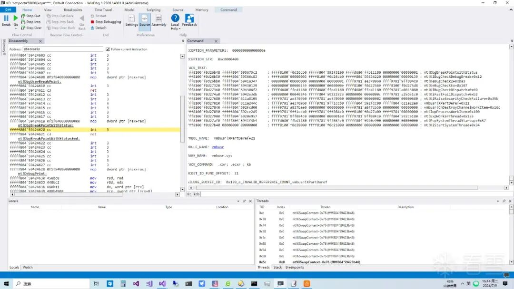

# Hyper-V拒绝服务漏洞CVE-2024-43633分析

<!-- vulwiki-editorial:start -->
## 校订与适用边界


### 尚未解决的证据缺口

以下限制仍适用于后文历史材料；相关版本、结果或修复结论不能据此视为已验证：

- 2025发文今年7月/11月实际指2024需绝对日期
- Win11 22H2/23H2仅系列未给构建或修复KB
- 作者明言未公开完整PoC，调试栈不能当可执行PoC
- 反编译片段有未声明变量嵌套函数/未注释中文，应标说明性伪码
- 23H2和24H2结构偏移不同不能通用
- 需要来宾UEFI程序及重置能力，影响为宿主BSOD应明确破坏性
- 保留MSRC和看雪来源，去推荐广告

### 操作风险与资料使用

- 含资源消耗、延时或崩溃验证：可能影响服务可用性；限制请求次数、并发与超时，保留无攻击负载的对照结果。

本页为文本校订，未执行代码、PoC 或目标请求；原图仅保留引用，未据此确认复现成功。
<!-- vulwiki-editorial:end -->

## 技术正文与历史材料

王cb  看雪学苑   2025-01-02 10:02  
  
这篇文章的目的是介绍今年11月发布的的Hyper-V拒绝服务漏洞CVE-2024-43633分析。文章结合了逆向代码和调试结果分析了CVE-2024-43633漏洞利用过程和漏洞成因。  
  
## 复现环境  
  
Win11 23h2  
  
Win11 22h2  
##   
## CVE-2024-43633漏洞分析  
  
CVE-2024-43633是笔者今年7月向微软MSRC提交的Hyper-V拒绝服务漏洞，漏洞可在Win11 23h2上复现,漏洞致谢发布于11月，漏洞的成因主要存在于Hyper-V根分区的vmbusr.sys驱动未正确处理虚拟机重置后vmbus通道分区的引用与解引用次数不一致导致触发内核崩溃断言的拒绝服务结果。  
  
  
```
00 ffffcd04`0d0d7460 fffff800`872daeef     vmbusr!ChDereferenceChannelInternal+0x9c
01 ffffcd04`0d0d7490 fffff800`872b5173     vmbusr!ChServerChannelReleasedByClientLocked+0x57
02 ffffcd04`0d0d74c0 fffff800`872da012     vmbusr!ChpPartitionWaitChannelClosed+0xc7
03 ffffcd04`0d0d7500 fffff800`872d8c87     vmbusr!ChResetPartition+0x3e
void __fastcall ChDereferenceChannelInternal(__int64 a1, int a2, __int16 a3)
{
 IoQueueWorkItem(
        ChLocalOfferRemoveWorkItem,
        (PIO_WORKITEM_ROUTINE)ChDestroyChannelWorkItem,
        DelayedWorkQueue,
        0i64);

}
void __fastcall ParentReleaseInterruptResources(PVOID Channel)
{
//这里也会调用 XPartDeref
 XPartDeref(Channel);
}
void __fastcall ChpDestroyChannel(PVOID P)
{
  XPartDeref(*((_QWORD *)P + 26));
}
//通道析构时会对分区会加引用一次解引用三次
void __fastcall ChDestroyChannelWorkItem(PDEVICE_OBJECT DeviceObject, PVOID Context)
{
//加引用一次
 _InterlockedIncrement64((volatile signed __int64 *)(Channel + 0x88)) <= 1
//call ChDereferenceChannelInternal and ParentReleaseInterruptResources
ChpDestroyChannel(Channel);
 XPartDeref(Channel);
}
void __fastcall XPartDeref(__int64 Channel)
{
  signed __int64 v1; // rax
  bool v2; // cc
  signed __int64 v3; // rax
  //+0x88是引用计数字段
  v1 = _InterlockedExchangeAdd64((volatile signed __int64 *)(Channel + 0x88), 0xFFFFFFFFFFFFFFFFui64);
  v2 = v1 <= 1;
  v3 = v1 - 1;
  if ( v2 )
  {
  //
  导致最后的引引用次数会变成负数-1
    if ( v3 )
      __fastfail(0xEu);  
  }
}

```  
  
  
  
当运行在虚拟机中的程序通过hypercall类型HvCallPostMessage向运行在Hyper-V根分区的vmbus通道提供程序Virtualization Service Providers (VSP)发送CHANNELMSG_INITIATE_CONTACT消息后，vmbusr.sys驱动为将要创建的vmbus通道创建一个新的vmbus通道分区XPart分配给虚拟机。  
  
  
在这之前虚拟机启动时自带的vmbus服务已经向vsp申请过分区，每个分区独立管理它所属的通道互相并不冲突，所有创建的通道通过一个链表结构维护在win11 23h2的虚拟机上下文偏移量为XPart+3b8，所有可以连接的通道必须是在Hyper-V根分区通过vmbus api向vmbusr.sys驱动申请分配的。  
  
  
一般是hyper-v集成服务的系统保留通道，或者是host端调用vmbuspiper.dll的api手动申请的通道，所有通道的CLASSID和INSTANCEID会在CHANNELMSG_OFFERCHANNEL回调sint消息中在synic_message页面通知虚拟机中的Virtualization Service Consumers(vsc)程序，之后vsc可以创建并映射gpadl共享页面和vsp建立vmbus通道通信，具体细节可以参考笔者之前的vmbus通道相关文章。  
  
  
复现此漏洞并不需要产生实际的通道通信，只需要建立通道并在uefi程序中调用__fastfail触发重置虚拟机就能复现漏洞，笔者使用的通道是hyper-v自带的集成服务Hyper-V Data Exchange Service (KVP)通道默认配置下启用可以复现，在默认情况下不管的通道的建立还是创建通信或者是销毁通道的相关操作引用与解引用次数都是对称的，当vsc客户端发送CHANNELMSG_GPADL_TEARDOWN和CHANNELMSG _CLOSECHANNEL消息以触发与通道关联的资源被释放时，通常会对通道进行解引用，当通道的解引用次数降为0后会调用通道销毁例程，在销毁例程会解引用通道所在的分区，分区的解引用次数降为0后会调用分区销毁例程，直到完成整个虚拟机资源释放。  
  
  
这里有个检查是当分区的解引用次数降为0继续解引用，这个引用次数会变成负数-1导致进入内核崩溃断言__fastfail的拒绝服务结果。一般情况下虚拟机退出时分区销毁例程调用完成后引用次数解引用为0，导致这个现象出现只存在于虚拟机重置后对分区的复用这个不安全的调用中，在win11 23h2及以下的版本中虚拟机重置后所有分配的分区并没有真正的销毁。  
  
  
也就是说没有移出虚拟机对象的分区链表，而是再次复用并调用一次多余的解引用，导致分区的引用与解引用次数不一致，在虚拟机重置恢复运行后这个复用的分区再次分配给虚拟机资源，但这些重新分配的分区和通道引用计数还是正常的受影响的还是那一次多余的解引用。  
  
  
当关闭虚拟机时所有的引用析构后这多余的一次解引用会将分区引用次数会变成负数-1导致拒绝服务，而在win11 24h2版本中虚拟机重置后所有分配的分区自动析构所有相关联对象并移出链表，这样就不存在复用和多余的解引用漏洞，因此笔者的漏洞不能在win11 24h2版本中复现。  
下面我们通过逆向代码了解一下漏洞的成因。  
  
## CVE-2024-43633漏洞逆向分析  
  
```
//在win11 23h2逆向代码
00 ffffbb0f`5a82ee30 fffff803`3e0b888b     vmbusr!XPartDeref+0x11
01 ffffbb0f`5a82ee60 fffff803`3e0d7f62     vmbusr!XPartRemovePartition+0x1bb
02 ffffbb0f`5a82eec0 fffff803`3e0d6bb7     vmbusr!ChResetPartition+0x5e
03 ffffbb0f`5a82eef0 fffff803`3e0aea6a     vmbusr!RootIoctlVdevReset+0xe3
04 ffffbb0f`5a82ef30 fffff803`26dfe7b8     vmbusr!RootIoctlDeviceControlPreprocess+0xea
//虚拟机重置会调用,关闭虚拟机也会调用
void __fastcall XPartRemovePartition(LIST_ENTRY *SubPartcreated, __int64 a2, __int64 a3)
{
bool __fastcall XPartIsSubPartition(__int64 a1)
{
  return *(_QWORD *)(a1 + 0x4F0) != 0i64;
}
  if ( SubPartcreated.SubPartition_4f0 )
  {
    if ( prevpartitionlinkptr )
      goto pengding;
  }
  else if ( prevpartitionlinkptr )
  {
    // (SubPart + 8)+0,prevpartitionlinkptr
    if ( prevpartitionlinkptr->Blink != SubPartcreated
      || (prevpartitionlinkptrnext = SubPartcreated->Blink, prevpartitionlinkptrnext->Flink != SubPartcreated) )
    {
LABEL_12:
      __fastfail(3u);
    }
    prevpartitionlinkptrnext->Flink = prevpartitionlinkptr;
    prevpartitionlinkptr->Blink = prevpartitionlinkptrnext;
    SubPartcreated->Flink = 0i64;
  }
  pengding:
  ...
  //解引用
   XPartDeref((__int64)SubPartcreated);
}

//在win11 24h2逆向代码
void __fastcall XPartRemovePartition(LIST_ENTRY *thispart, __int64 a2, __int64 a3)
{
if ( thispart->Flink )
  {
    // removeentryPLIST_ENTRY
    if ( thisFlink->Blink != thispart )
      goto LABEL_13;
    thisBlink = thispart->Blink;
    if ( thisBlink->Flink != thispart )
      goto LABEL_13;
    thisBlink->Flink = thisFlink;
    thisFlink->Blink = thisBlink;
  }
   }
  // +378parentpart
  // bool __fastcall XPartIsSubPartition(__int64 a1)
  // {
  //   return *(_QWORD *)(a1 + 0x378) != 0i64;
  // }
  parentpart = thispart[0x37].Blink;
  if ( parentpart )
  {
    linkpart368ptr = (_LIST_ENTRY *)((char *)parentpart + 0x368);
    linkpart368ptrFlink = linkpart368ptr->Flink;
    if ( linkpart368ptr->Flink->Blink == linkpart368ptr )
    {
      thispart->Flink = linkpart368ptrFlink;
      thispart->Blink = linkpart368ptr;
      linkpart368ptrFlink->Blink = thispart;
      linkpart368ptr->Flink = thispart;
      goto pendging;
    }
LABEL_13:
    __fastfail(3u);
  }
  pengding:
  ...
  //解引用
   XPartDeref((__int64)SubPartcreated);
}

```  
  
  
  
通过上面的逆向代码可以看出在win11 23h2版本中与虚拟机重置后移除分区的逻辑如果要移除分区SubPartition_4f0是个有效的指针，会直接跳出if和else代码块，并没有进入后面的else分支将当前分区没有移出分区链表，导致虚拟机重置后时会再次调用这个函数对复用的分区再次分配给虚拟机，并再次调用XPartDeref多解引用一次导致分区的引用与解引用次数不一致。  
  
  
而在win11 24h2中XPartRemovePartition直接将当前分区移出链表尽管有对子分区的判断，但是因为分区已经被移出链表了，就不存在复用的情况，自然也不存在多余的解引用漏洞。  
  
## CVE-2024-43633漏洞调试分析  
  
```
//先下断点
3: kd>bp  vmbusr!XPartDeref; ba w1 rcx+88  " r;k;r $t1=rcx+3b8;r $t2=$t1; dc $t2-3b8+88;r $t1=poi($t1); .for(r $t3=0;$t1 > $t2 or $t1 < $t2;r $t3=$t3+1){r $t1=poi($t1); };.printf \"%p Channel count %p\r\n\",$t2-3b8+88, $t3;gc"

//正常析构时分区引用次数为通道的数量*2次引用次数数加上分区本身的一次引用1e=e*2+1+1
rax=ffffe60151627928 rbx=ffffe60151627850 rcx=000000000000001d
rdx=ffffe60151627928 rsi=ffffe6014ff9c0e8 rdi=ffffe6015125a000
rip=fffff8033e0b1a76 rsp=ffffbb0f55517200 rbp=0000000000000000
 r8=fffff8033e0c6780  r9=ffffe60151627928 r10=fffff8033e0b1a20
r11=0000000000000000 r12=ffffe6012e9f43b0 r13=ffffe6012ff8d000
r14=fffff8033e0b1a20 r15=fffff80322403980
iopl=0         nv up ei pl nz na po nc
cs=0010  ss=0018  ds=002b  es=002b  fs=0053  gs=002b             efl=00040206
vmbusr!ChDestroyChannelWorkItem+0x56:
fffff803`3e0b1a76 48ffc1          inc     rcx # Child-SP          RetAddr               Call Site00 ffffbb0f`55517200 fffff803`22403a80     vmbusr!ChDestroyChannelWorkItem+0x5601 ffffbb0f`55517250 fffff803`22552315     nt!IopProcessWorkItem+0x10002 ffffbb0f`555172c0 fffff803`22554d07     nt!ExpWorkerThread+0x15503 ffffbb0f`555174b0 fffff803`2261ae24     nt!PspSystemThreadStartup+0x5704 ffffbb0f`55517500 00000000`00000000     nt!KiStartSystemThread+0x34//分区引用计数ffffe601`5125a088  0000001e 00000000 00050000 00050003  ................
ffffe601`5125a098  00000000 00000000 00000000 00000000  ................ffffe601`5125a0a8  00000000 00000000 b0cad258 000019fe  ........X.......
ffffe601`5125a0b8  4fae8000 ffffe601 4ff8fd60 ffffe601  ...O....`..O....
ffffe601`5125a0c8  00020101 000002e0 00000000 00000000  ................ffffe601`5125a0d8  00000000 00000000 4ea30000 ffffe601  ...........N....
ffffe601`5125a0e8  00000000 00000000 00000000 00000000  ................ffffe601`5125a0f8  00000000 00000000 00000000 00000000  ................
//通道引用计数
ffffe6015125a088 Channel count 000000000000000e 

//虚拟机重置后引用次数比正常少了1
rdx=0000000000000001 rsi=ffffe6014ea30000 rdi=0000000000000000
rip=fffff8033e0b7795 rsp=ffffbb0f5a82ee30 rbp=0000000000000000
 r8=ffffe6014e9c419c  r9=0000000000000014 r10=fffff8032245e560
r11=00000000000099b0 r12=0000000000000000 r13=0000000000000000
r14=ffffe6014e967b48 r15=ffffe601516760f0
iopl=0         nv up ei pl nz ac po cy
cs=0010  ss=0018  ds=002b  es=002b  fs=0053  gs=002b             efl=00040217
vmbusr!XPartDeref+0x11:
fffff803`3e0b7795 4883e801        sub     rax,1 # Child-SP          RetAddr               Call Site00 ffffbb0f`5a82ee30 fffff803`3e0b888b     vmbusr!XPartDeref+0x1101 ffffbb0f`5a82ee60 fffff803`3e0d7f62     vmbusr!XPartRemovePartition+0x1bb02 ffffbb0f`5a82eec0 fffff803`3e0d6bb7     vmbusr!ChResetPartition+0x5e03 ffffbb0f`5a82eef0 fffff803`3e0aea6a     vmbusr!RootIoctlVdevReset+0xe304 ffffbb0f`5a82ef30 fffff803`26dfe7b8     vmbusr!RootIoctlDeviceControlPreprocess+0xea05 ffffbb0f`5a82ef60 ffffe601`4dc4fb20     0xfffff803`26dfe7b8
06 ffffbb0f`5a82ef68 00000000`0000000e     0xffffe601`4dc4fb20//分区引用计数ffffe601`5125a088  0000001d 00000000 00050000 00050003  ................
ffffe601`5125a098  00000000 00000000 00000000 00000000  ................ffffe601`5125a0a8  00000000 00000000 b0cad258 000019fe  ........X.......
ffffe601`5125a0b8  4fae8000 ffffe601 4ff8fd60 ffffe601  ...O....`..O....
ffffe601`5125a0c8  00020101 000002e0 00000000 00000000  ................ffffe601`5125a0d8  00000000 00000000 4ea30000 ffffe601  ...........N....
ffffe601`5125a0e8  00000000 00000000 00000000 00000000  ................ffffe601`5125a0f8  00000000 00000000 00000000 00000000  ................
//通道引用计数
ffffe6015125a088 Channel count 000000000000000e 

//虚拟机关闭
rdx=ffffe601513a9701 rsi=ffffe6014ea30000 rdi=0000000000000000
rip=fffff8033e0b7795 rsp=ffffbb0f56f76dc0 rbp=ffffe6014e967a00
 r8=000000000000054b  r9=0000000000000000 r10=fffff8032245e560
r11=000000000000a5b0 r12=fffff8033e0c2100 r13=0000000000000000
r14=0000000000000000 r15=ffffe60147a57760
iopl=0         nv up ei pl nz na po cy
cs=0010  ss=0018  ds=002b  es=002b  fs=0053  gs=002b             efl=00040207
vmbusr!XPartDeref+0x11:
fffff803`3e0b7795 4883e801        sub     rax,1 # Child-SP          RetAddr               Call Site00 ffffbb0f`56f76dc0 fffff803`3e0b888b     vmbusr!XPartDeref+0x1101 ffffbb0f`56f76df0 fffff803`3e0b9073     vmbusr!XPartRemovePartition+0x1bb02 ffffbb0f`56f76e50 fffff803`3e0b8843     vmbusr!ParentCleanupPartition+0x7303 ffffbb0f`56f76e80 fffff803`3e0d69c1     vmbusr!XPartRemovePartition+0x17304 ffffbb0f`56f76ee0 fffff803`3e0aea4d     vmbusr!RootIoctlVdevPowerOff+0x12d05 ffffbb0f`56f76f30 fffff803`26dfe7b8     vmbusr!RootIoctlDeviceControlPreprocess+0xcd06 ffffbb0f`56f76f60 ffffe601`4ed13de0     0xfffff803`26dfe7b8
07 ffffbb0f`56f76f68 00000000`0000000e     0xffffe601`4ed13de0//分区引用计数ffffe601`5125a088  00000010 00000000 00050000 00050003  ................
ffffe601`5125a098  00000000 00000000 00000000 00000000  ................ffffe601`5125a0a8  00000000 00000000 b0cad258 000019fe  ........X.......
ffffe601`5125a0b8  4fae8000 ffffe601 4ff8fd60 ffffe601  ...O....`..O....
ffffe601`5125a0c8  00020101 000002e0 00000000 00000000  ................ffffe601`5125a0d8  00000000 00000000 4ea30000 ffffe601  ...........N....
ffffe601`5125a0e8  00000000 00000000 00000000 00000000  ................ffffe601`5125a0f8  00000000 00000000 00000000 00000000  ................
//通道引用计数
ffffe6015125a088 Channel count 0000000000000008 

//导致最后的引引用次数会变成负数-1
rax=0000000000000000 rbx=ffffe6014e213960 rcx=ffffe6015125a000
rdx=0000000000000000 rsi=0000000000000000 rdi=ffffe6015125a000
rip=fffff8033e0b7795 rsp=ffffbb0f555171d0 rbp=0000000000000000
 r8=0000000000000000  r9=7ffffffffffffffc r10=fffff80322462170
r11=ffffe6014e213950 r12=ffffe6012e9f43b0 r13=ffffe6012ff8d000
r14=0000000000000000 r15=0000000000000000
iopl=0         nv up ei ng nz na po nc
cs=0010  ss=0018  ds=002b  es=002b  fs=0053  gs=002b             efl=00040286
vmbusr!XPartDeref+0x11:
fffff803`3e0b7795 4883e801        sub     rax,1 # Child-SP          RetAddr               Call Site00 ffffbb0f`555171d0 fffff803`3e0b1b8c     vmbusr!XPartDeref+0x1101 ffffbb0f`55517200 fffff803`22403a80     vmbusr!ChDestroyChannelWorkItem+0x16c02 ffffbb0f`55517250 fffff803`22552315     nt!IopProcessWorkItem+0x10003 ffffbb0f`555172c0 fffff803`22554d07     nt!ExpWorkerThread+0x15504 ffffbb0f`555174b0 fffff803`2261ae24     nt!PspSystemThreadStartup+0x5705 ffffbb0f`55517500 00000000`00000000     nt!KiStartSystemThread+0x34//分区引用计数ffffe601`5125a088  ffffffff ffffffff 00050000 00050003  ................
ffffe601`5125a098  00000000 00000000 00000000 00000000  ................ffffe601`5125a0a8  00000000 00000000 b0cad258 000019fe  ........X.......
ffffe601`5125a0b8  4fae8000 ffffe601 4ff8fd60 ffffe601  ...O....`..O....
ffffe601`5125a0c8  00020101 000002e0 00000000 00000000  ................ffffe601`5125a0d8  00000000 00000000 4ea30000 ffffe601  ...........N....
ffffe601`5125a0e8  00000000 00000000 00000000 00000000  ................ffffe601`5125a0f8  00000000 00000000 00000000 00000000  ................
//通道引用计数
ffffe6015125a088 Channel count 0000000000000000  

//bsod
rax=ffffffffffffffff rbx=0000000000000000 rcx=000000000000000e
rdx=0000000000000000 rsi=0000000000000000 rdi=0000000000000000
rip=fffff8033e0b77a5 rsp=ffffbb0f555171d0 rbp=0000000000000000
 r8=0000000000000000  r9=7ffffffffffffffc r10=fffff80322462170
r11=ffffe6014e213950 r12=0000000000000000 r13=0000000000000000
r14=0000000000000000 r15=0000000000000000
iopl=0         nv up ei ng nz na po nc
vmbusr!XPartDeref+0x21:
fffff803`3e0b77a5 cd29            int     29hResetting default scopeEXCEPTION_RECORD:  ffffbb0f55516f98 -- (.exr 0xffffbb0f55516f98)ExceptionAddress: fffff8033e0b77a5 (vmbusr!XPartDeref+0x0000000000000021)   ExceptionCode: c0000409 (Security check failure or stack buffer overrun)  ExceptionFlags: 00000001NumberParameters: 1   Parameter[0]: 000000000000000eSubcode: 0xe FAST_FAIL_INVALID_REFERENCE_COUNT PROCESS_NAME:  SystemERROR_CODE: (NTSTATUS) 0xc0000409 - <Unable to get error code text>EXCEPTION_CODE_STR:  c0000409EXCEPTION_PARAMETER1:  000000000000000eEXCEPTION_STR:  0xc0000409STACK_TEXT:  ffffbb0f`55516508 fffff803`22767092     : ffffbb0f`55516670 fffff803`224bdda0 ffff9781`82511180 00000000`00000001 : nt!DbgBreakPointWithStatusffffbb0f`55516510 fffff803`22766753     : ffff9781`00000003 ffffbb0f`55516670 fffff803`2262fd20 00000000`00000139 : nt!KiBugCheckDebugBreak+0x12ffffbb0f`55516570 fffff803`22615db7     : ffffe601`2b0ff040 00000000`00000000 ffffe601`4e213960 00000000`00000000 : nt!KeBugCheck2+0xba3ffffbb0f`55516ce0 fffff803`2262bc29     : 00000000`00000139 00000000`0000000e ffffbb0f`55517040 ffffbb0f`55516f98 : nt!KeBugCheckEx+0x107ffffbb0f`55516d20 fffff803`2262c1f2     : 00000000`00000000 00000000`00000000 00000000`00000000 00000000`00000000 : nt!KiBugCheckDispatch+0x69ffffbb0f`55516e60 fffff803`22629edb     : 00000000`00040246 fffff803`2253f0b3 00000000`0000000c ffffe601`2e5f1180 : nt!KiFastFailDispatch+0xb2ffffbb0f`55517040 fffff803`3e0b77a5     : ffffe601`4e213960 ffffe601`4e213960 00000000`00000002 00000000`00000680 : nt!KiRaiseSecurityCheckFailure+0x35bffffbb0f`555171d0 fffff803`3e0b1b8c     : ffffe601`4e213960 ffffe601`2b0c94a0 fffff803`22403980 fffff803`3e0b1a20 : vmbusr!XPartDeref+0x21ffffbb0f`55517200 fffff803`22403a80     : ffffe601`2e9f43b0 00000000`00000000 ffffe601`47a58450 00000000`00000000 : vmbusr!ChDestroyChannelWorkItem+0x16cffffbb0f`55517250 fffff803`22552315     : ffffe601`2b0c94a0 ffffe601`2ff8c040 ffffbb0f`555173c0 00020000`00000000 : nt!IopProcessWorkItem+0x100ffffbb0f`555172c0 fffff803`22554d07     : ffffe601`2ff8c040 00000000`000000d8 ffffe601`2ff8c040 fffff803`225521c0 : nt!ExpWorkerThread+0x155ffffbb0f`555174b0 fffff803`2261ae24     : ffff9781`82511180 ffffe601`2ff8c040 fffff803`22554cb0 11ef5c6a`588718e0 : nt!PspSystemThreadStartup+0x57ffffbb0f`55517500 00000000`00000000     : ffffbb0f`55518000 ffffbb0f`55511000 00000000`00000000 00000000`00000000 : nt!KiStartSystemThread+0x34
```  
  
  
  
使用如上脚本下断点调试，从结合CVE-2024-43633漏洞分析逆向代码可以得出一个结论，当通道销毁例程ChDestroyChannelWorkItem被调用时分区会加引用一次解引用三次，所有当通道没有析构时分区的引用计数正常数值为它包含所有通道的数量乘以2次引用次数数加上分区本身的一次这个引用计数也就是通道Channel count*2+1，调试看到的是XPartDeref调用引用次数减1之前的计数，这个是没有析构之前正常的引用计数。  
  
  
在虚拟机重置后由于存在多余的解引用分区的引用计数比正常的引用计数少了1和正常的引用计数并不匹配,导致虚拟机关闭最后的一次解引用后引用次数会变成负数-1，进入bsod内核崩溃断言。  
  
## 漏洞复现  
  
笔者漏洞poc采用uefi程序复现,出于安全原因笔者不能提供完整的poc代码，下图是笔者在打了8月补丁的Win11 23h2物理机上成功复现了CVE-2024-43633。  
  
  
  
##   
## 结论  
  
CVE-2024-43633漏洞的复现过程重现了虚拟机重置后，虚拟机vmbus通道和分区的引用计数不匹配导致了hyper-v宿主机崩溃bsod的过程。  
##   
## 相关引用  
  
vmbus相关文章1  
（https://bbs.kanxue.com/thread-281707.htm）  
  
  
vmbus相关文章2  
（https://bbs.kanxue.com/thread-282766.htm）  
  
  
CVE-2024-43633致谢  
（https://msrc.microsoft.com/update-guide/vulnerability/CVE-2024-43633）  
  
  
  
  
  
  
  
  
看雪ID：王cb  
  
https://bbs.kanxue.com/user-home-609565.htm  
  
*本文为看雪论坛精华文章，由 王cb 原创，转载请注明来自看雪社区  
  
  
  
# 往期推荐  
  
1、[PWN入门-SROP拜师](http://mp.weixin.qq.com/s?__biz=MjM5NTc2MDYxMw==&mid=2458579476&idx=2&sn=4f9adc1e7d61c7357bdc85ba654f24cb&chksm=b18dc29e86fa4b88c483a581131de043b076918cd7c7436a82e9bb56bc37c8f1edf6c87d8350&scene=21#wechat_redirect)  
  
  
2、[一种apc注入型的Gamarue病毒的变种](http://mp.weixin.qq.com/s?__biz=MjM5NTc2MDYxMw==&mid=2458579387&idx=1&sn=9d6fbf25f11b3d99c92c5ac8de0587d5&chksm=b18dc13186fa4827ae7a7bf909e0d2b9490c6df4417c1d7eebc27127133daa9771c212b4f310&scene=21#wechat_redirect)  
  
  
3、[野蛮fuzz：提升性能](http://mp.weixin.qq.com/s?__biz=MjM5NTc2MDYxMw==&mid=2458579145&idx=1&sn=9134327916f678cfe7e2bc3371cedeaf&chksm=b18dc04386fa49557abc8c7e6ce3410dd4042ed88635c48961fda72b7fa4425698e56bb86ff6&scene=21#wechat_redirect)  
  
  
4、[关于安卓注入几种方式的讨论，开源注入模块实现](http://mp.weixin.qq.com/s?__biz=MjM5NTc2MDYxMw==&mid=2458579138&idx=1&sn=fef09513ae9f594e68a503f69a312f4f&chksm=b18dc04886fa495e440990cd2dbddb24693452562e53bd8cb565063ddee921b7e288477f4eea&scene=21#wechat_redirect)  
  
  
5、[2024年KCTF水泊梁山-反混淆](http://mp.weixin.qq.com/s?__biz=MjM5NTc2MDYxMw==&mid=2458579017&idx=2&sn=a97dacde8a6c913108999da8a96a667f&chksm=b18dc0c386fa49d57ce9f0ce6923690d6eb8efb3ccb8032e8c6b923184af3dd29b1b4471f9a2&scene=21#wechat_redirect)  
  
  
  
  
  
  
  
  
  
  
**球分享**  
  
  
  
**球点赞**  
  
  
  
**球在看**  
  
  
  
  
  
点击阅读原文查看更多  
  


---

> 来源：gelusus/wxvl（微信公众号漏洞文章自动归档，原文见文首链接）
