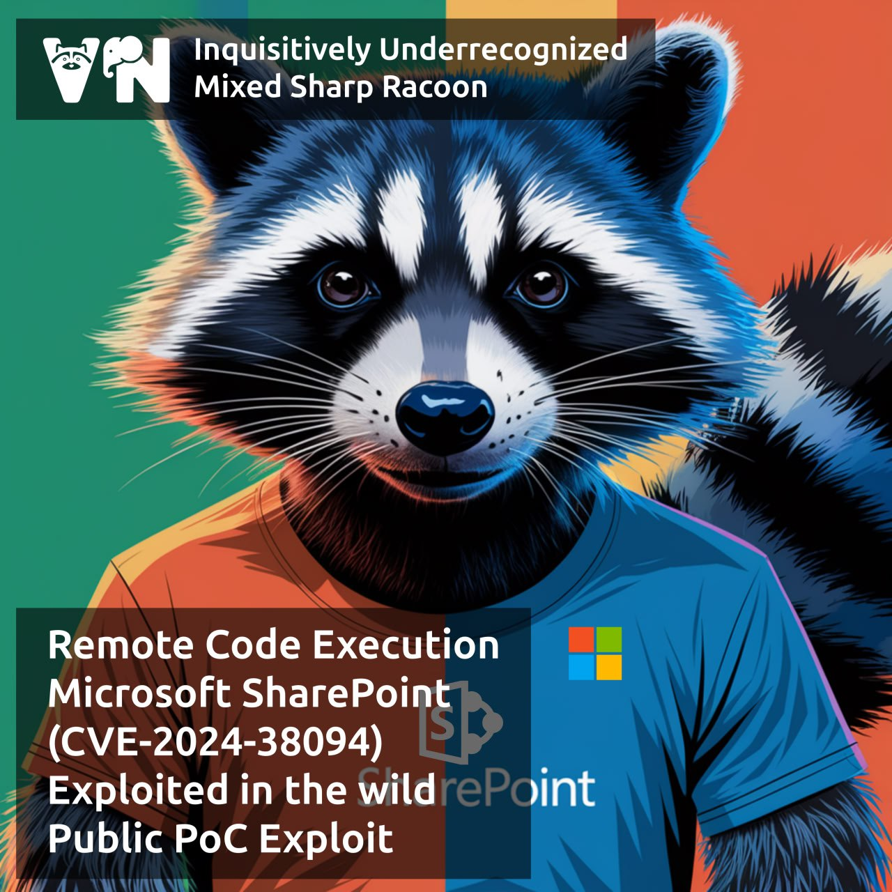

# （CVE-2024-38094）SharePoint Server反序列化RCE漏洞

<!-- vulwiki-editorial:start -->
## 校订与适用边界

### 尚未解决的证据缺口

以下限制仍适用于后文历史材料；相关版本、结果或修复结论不能据此视为已验证：

- 正文把2024年10月在野披露与漏洞首次披露/修复混写，需核MSRC
- 精确build和10月补丁断言无厂商链接
- PoC只rustsploit release未指源码命令
- SiteOwner权限重要，source仅批次
- 不可由流程概要称本库复现成功

本页为文本校订，未执行代码、PoC 或目标请求；原图仅保留引用，未据此确认复现成功。
<!-- vulwiki-editorial:end -->

## 技术正文与历史材料

一、漏洞简介
------------

2024年10月披露的 Microsoft SharePoint Server 反序列化漏洞。拥有 Site Owner 权限的已认证攻击者可上传恶意 `.bdcm`（Business Data Connectivity Model）文件，并发送特制 XML 触发不安全的反序列化，在 SharePoint 服务器上执行任意代码。

CISA 于 2024年10月22日确认该漏洞已在野利用，并将其列入 KEV（已知被利用漏洞）目录。

二、漏洞影响
------------

-   产品：Microsoft SharePoint Enterprise Server 2016 / SharePoint Server 2019 / SharePoint Server Subscription Edition
-   版本：**2016 < 16.0.5456.1000；2019 < 16.0.10412.20001；Subscription Edition < 16.0.17328.20424**（修复版：2024年10月安全更新）
-   组件/攻击向量：BDC 模型解析，反序列化 gadget 链
-   前提条件：需要 Site Owner 权限的已认证账户（攻击者常先通过钓鱼/弱口令获取）

三、复现过程
------------

### 漏洞分析

SharePoint 的 Business Data Connectivity 服务在解析上传的 `.bdcm` 模型文件时，对其中嵌入的序列化数据未做安全校验。攻击者构造包含恶意 gadget 链的 `.bdcm`，上传后通过特定 XML 请求触发反序列化，将代码执行上下文提升到服务器进程权限。

### PoC（来源：https://github.com/s-b-repo/rustsploit/releases/tag/v0.4.4，仅限授权测试）

rustsploit v0.4.4 版本中包含该漏洞的 PoC 实现，具体用法见该 release 页面说明。利用流程概要：

1.  以 Site Owner 身份登录目标 SharePoint；
2.  上传构造好的恶意 `.bdcm` 文件；
3.  发送触发反序列化的特制 XML 请求，执行任意命令。

四、修复建议
------------

1.  安装微软 2024年10月（及之后）安全更新；
2.  收紧 Site Owner 权限分配，启用多因素认证，防范凭据被盗后被用作跳板；
3.  监控异常的 `.bdcm` 上传行为与 BDC 服务错误日志。

### 附录

参考链接：

-   公开 PoC（rustsploit v0.4.4）：https://github.com/s-b-repo/rustsploit/releases/tag/v0.4.4
-   https://thehackernews.com/2024/10/cisa-warns-of-active-exploitation-of.html
