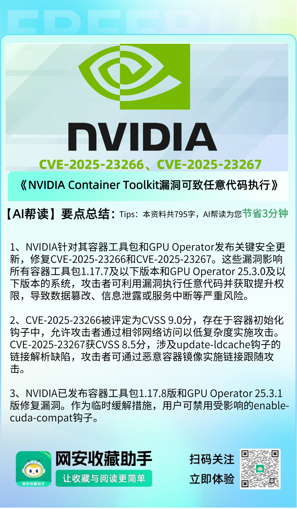
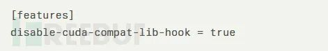
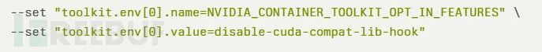

# NVIDIA Container Toolkit漏洞可导致权限提升任意代码执行

<!-- vulwiki-editorial:start -->
## 校订与适用边界

### 尚未解决的证据缺口

以下限制仍适用于后文历史材料；相关版本、结果或修复结论不能据此视为已验证：

- 两CVE均未提取
- 两个钩子不同，禁enable-cuda-compat不能未核就视均缓解
- CDI例外/版本应逐组件逐CVE矩阵
- 与AI文GPUOperator25.3.1受影响说法冲突需厂商核
- Nir/Shir报告者与ZDI/Wiz归属需准确
- 缓解仅截图，只有二手来源

### 操作风险与资料使用

- 含资源消耗、延时或崩溃验证：可能影响服务可用性；限制请求次数、并发与超时，保留无攻击负载的对照结果。

本页为文本校订，未执行代码、PoC 或目标请求；原图仅保留引用，未据此确认复现成功。
<!-- vulwiki-editorial:end -->

## 技术正文与历史材料

 FreeBuf   2025-07-18 10:31  
  
  
  
  
  
  
  
NVIDIA已发布关键安全更新，  
修复NVIDIA Container Toolkit和  
GPU Operator中的两个高危漏洞，攻击者可利用这些漏洞以提升的权限执行任意代码。  
  
  
这两个编号为CVE-2025-23266和CVE-2025-23267的漏洞，影响所有运行  
NVIDIA Container Toolkit  
   
1.17.7及以下版本和GPU Operator 25.3.0及以下版本的平台，可能导致权限提升、数据篡改、信息泄露和拒绝服务攻击等严重风险。  
  
  
**Part01**  
## 关键容器漏洞分析  
##   
  
最严重的漏洞CVE-2025-23266获得CVSS v3.1基础评分9.0，属于严重级别。该漏洞存在于部分用于初始化容器的钩子中，攻击者可借此以提升权限执行任意代码。  
  
  
攻击向量描述为"AV:A/AC:L/PR:L/UI:N/S:C/C:H/I:H/A:H"，表明需要相邻网络访问且攻击复杂度较低。该漏洞归类于CWE-426，涉及不受信任的搜索路径问题。  
  
  
第二个漏洞CVE-2025-23267被评为高危，CVSS评分为8.5。该漏洞影响update-ldcache钩子，攻击者可通过特制容器镜像实施链接跟随攻击。该漏洞归类于CWE-59，代表文件访问前存在不当链接解析。  
  
  
这两个漏洞均通过负责任的披露流程发现：CVE-2025-23266由趋势科技零日计划（Trend Zero Day Initiative）的Nir Ohfeld和Shir Tamari报告；CVE-2025-23267由华为云星云安全实验室（Nebula Security Lab）  
的  
Lei Wang  
和  
Min Yao  
发现。  
  
  
**Part02**  
## 安全更新措施  
  
  
NVIDIA已发布新版本来修复这些漏洞。  
NVIDIA Container Toolkit   
用户需从1.17.7及以下版本升级至1.17.8版本。Linux平台上的NVIDIA GPU Operator用户需从25.3.0及以下版本升级至25.3.1版本。值得注意的是，CDI模式漏洞仅影响容器工具包1.17.5之前版本和GPU Operator 25.3.0之前版本。  
  
  
企业可通过禁用存在漏洞的enable-cuda-compat钩子实施临时缓解措施。对于  
NVIDIA Container Toolkit  
运行时（Container Runtime）用户，需要编辑/etc/nvidia-container-toolkit/config.toml文件，将features.disable-cuda-compat-lib-hook功能标志设为true：  
  
  
  
  
  
GPU Operator用户可通过Helm安装参数实施缓解：  
  
  
  
  
  
NVIDIA强烈建议用户按照官方  
NVIDIA Container Toolkit  
和GPU Operator文档说明安装安全更新。  
  
  
**参考来源：**  
  
NVIDIA Container Toolkit Vulnerability Allows Elevated Arbitrary Code Execution  
  
https://cybersecuritynews.com/nvidia-container-toolkit-vulnerability-2/  
  
  
###   
###   
###   
  
**推荐阅读**  
  
  
  
### 电台讨论  
  
****  
  
  
  
  
  
   
  

---

> 来源：gelusus/wxvl（微信公众号漏洞文章自动归档，原文见文首链接）
