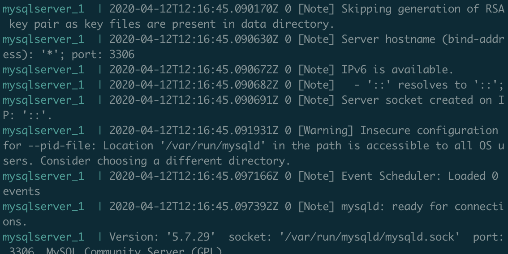
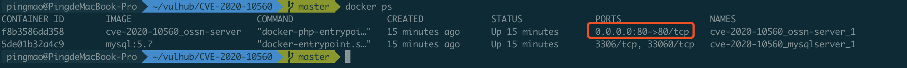
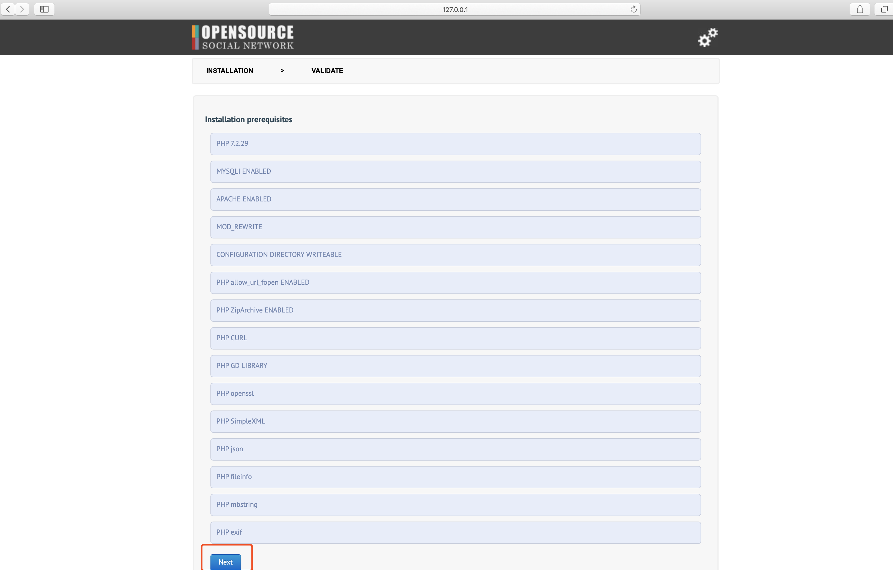
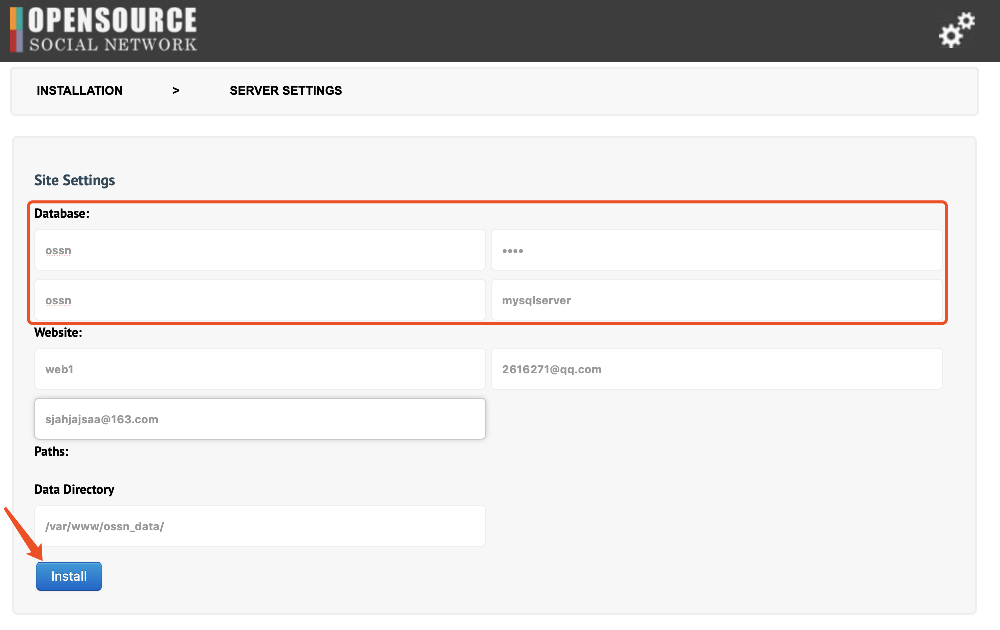
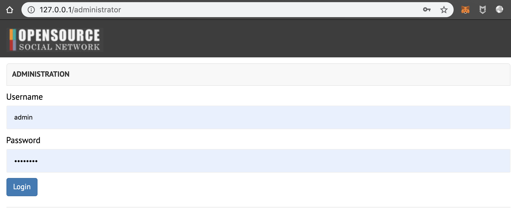
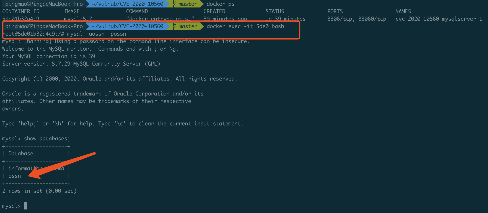
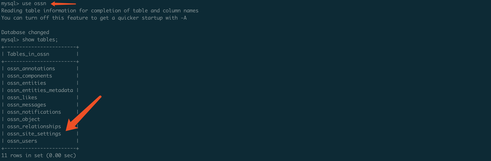
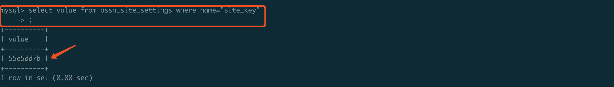
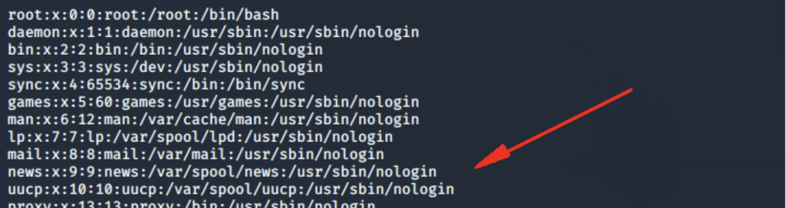

# OSSN任意文件读取漏洞（CVE-2020-10560）

<!-- vulwiki-editorial:start -->
## 校订与适用边界


### 本次正文校订

- 按实际内容修正 1 处代码围栏语言标记，保留其中方法与请求内容。

### 尚未解决的证据缺口

以下限制仍适用于后文历史材料；相关版本、结果或修复结论不能据此视为已验证：

- 非云平台
- 原 15 个图片说明含转存失败文字，完整语法见页末；已另补 9 张注明来源的步骤图，原附件尚未恢复。命令中的行号1和12345保持原值。
- 已知site_key的本地实验不能代表完成远程key恢复
- 表名ossn_ site_settings含多余空格
- 卸载Docker降级建议过度且无具体兼容版本
- 修复只给主页无固定版本
- PoC操作主要在图片中需文字化

### 操作风险与资料使用

- 含落盘脚本或账户创建：会留下持久状态。记录本次生成的路径或账户，测试后清理这些对象并撤销关联令牌；不要删除既有业务对象。

本页为文本校订，未执行代码、PoC 或目标请求；原缺失附件保留完整字面引用，新增来源配图经静态查看，但未据此确认复现成功。
<!-- vulwiki-editorial:end -->

## 技术正文与历史材料

## 【漏洞详情】

- CVE-2020-10560 OSSN任意文件读取漏洞，问题出现在Open Source Social  Network(OSSN)5.3及之前版本中。攻击者可通过对Site_Key实施暴力破解攻击来为components/OssnComments/ossn_com.php和libraries/ossn.lib.upgrade.php插入特制的URL，然后利用该漏洞读取任意文件。

## 【环境搭建】

> 配图补充（2026-10-03）：下列 9 张新增步骤图来自 [Guko 于 2020-04-10 发布的同题文章](https://pingmaoer.github.io/2020/04/10/CVE-2020-10560-OSSN%E4%BB%BB%E6%84%8F%E6%96%87%E4%BB%B6%E8%AF%BB%E5%8F%96%E6%BC%8F%E6%B4%9E%E5%A4%8D%E7%8E%B0/)。已按图像内容与步骤核对；它们不是原归档 15 个附件的精确恢复，也不是本库重新复现的截图。原附件引用完整保留在页末。


- 1.首先通过git命令从github上下载OSSN环境，这里是通过docker搭建漏洞复现环境。

```shell
git clone https://github.com/kevthehermit/CVE-2020-10560
1
```

> 原附件 1 未找到；完整原引用见页末「缺失附件原始记录」。

- 2.然后使用docker-compose编译启动OSSN环境。
   注意：如果这里编译时，提示api版本不匹配，建议卸载安装旧版本docker。

> 补充配图：Docker Compose 启动输出（Guko 公开文章）。



> 原附件 2 未找到；完整原引用见页末「缺失附件原始记录」。

- 3.编译启动完成，使用docker ps查看，表示环境启动成功。

> 补充配图：容器状态（Guko 公开文章）。



> 原附件 3 未找到；完整原引用见页末「缺失附件原始记录」。

- 4.使用通过浏览器访问OSSN环境，需要进行安装，点击下一步。

> 补充配图：安装前置检查（Guko 公开文章）。



> 原附件 4 未找到；完整原引用见页末「缺失附件原始记录」。
 > 原附件 5 未找到；完整原引用见页末「缺失附件原始记录」。

- 5.点击下一步。

> 原附件 6 未找到；完整原引用见页末「缺失附件原始记录」。
 > 原附件 7 未找到；完整原引用见页末「缺失附件原始记录」。

- 6.进行网站设置，需要填写数据库信息和网站信息（网站名称和邮箱可以随便填写），点击下一步。

  ```
    注意：这里的数据库信息填写如下：
    DB: ossn
    username: ossn
    password: ossn 
    host: mysqlserver
  12345
  ```

> 补充配图：数据库与站点配置（Guko 公开文章）。



> 原附件 8 未找到；完整原引用见页末「缺失附件原始记录」。

- 7.创建管理账户，按要求填写即可。

> 原附件 9 未找到；完整原引用见页末「缺失附件原始记录」。

- 8.环境搭建完成。

> 补充配图：安装后的管理员登录界面（Guko 公开文章）。



> 原附件 10 未找到；完整原引用见页末「缺失附件原始记录」。

## 【验证详情】

- ### 验证条件

- 首先需要获取site_key的值，在实际环境中可以通过脚本爆破的方式来获取，site_key爆破脚本参考链接：
   https://github.com/LucidUnicorn/CVE-2020-10560-Key-Recovery/releases

- 因为这里我们是在本地使用docker搭建的复现环境，我们直接取数据库查询site_key值即可。

- 1.可以看到这里有一个mysql的主机，使用mysql用户名和密码连接数据库（ossn/ossn）。

> 补充配图：本地 MySQL 数据库检查（Guko 公开文章）。



> 原附件 11 未找到；完整原引用见页末「缺失附件原始记录」。

- 2.查询数据库中的表ossn_ site_settings，找到site_key的值。

> 补充配图：ossn_site_settings 表列表（Guko 公开文章）。



> 补充配图：site_key 查询及原公开测试值 55e5dd7b（Guko 公开文章）。



> 原附件 12 未找到；完整原引用见页末「缺失附件原始记录」。

 > 原附件 13 未找到；完整原引用见页末「缺失附件原始记录」。


- ### 验证过程

- 1.复制刚才我们从github上下载的poc进行漏洞利用。

> 原附件 14 未找到；完整原引用见页末「缺失附件原始记录」。

- 2.然后使用python3执行脚本，依次填写site_key，读取的文件，目标网站地址，可以看到成功读取到了目标系统的passwd文件内容。

> 补充配图：原作者文件读取输出（Guko 公开文章）。



> 原附件 15 未找到；完整原引用见页末「缺失附件原始记录」。

## 【防御方式】

- 目前厂商已发布升级补丁以修复漏洞，详情请关注厂商主页：
   https://www.opensource-socialnetwork.org/

## 【参考资料】

- https://techanarchy.net/blog/cve-2020-10560-ossn-arbitrary-file-read


---

> 来源：白阁文库 BaizeSec/bylibrary

## 缺失附件原始记录

原 15 个附件仍未找到，以下按归档顺序完整保存图片语法、说明和路径；这些是字面记录，不再发起无效图片请求。新增配图不能证明原附件内容相同。

1. `![[外链图片转存失败,源站可能有防盗链机制,建议将图片保存下来直接上传(img-AaxDKi0o-1586504452408)(./images/0.png)]](OSSN任意文件读取漏洞（CVE-2020-10560）/20200410163252247.png)`

2. `![[外链图片转存失败,源站可能有防盗链机制,建议将图片保存下来直接上传(img-H1akYXOa-1586504452412)(./images/0-1.png)]](OSSN任意文件读取漏洞（CVE-2020-10560）/20200410163733774.png)`

3. `![[外链图片转存失败,源站可能有防盗链机制,建议将图片保存下来直接上传(img-aL9o7XHB-1586504452414)(./images/0-2.png)]](OSSN任意文件读取漏洞（CVE-2020-10560）/20200410163741293.png)`

4. `![[外链图片转存失败,源站可能有防盗链机制,建议将图片保存下来直接上传(img-2jQu4RrH-1586504452416)(./images/1.png)]](OSSN任意文件读取漏洞（CVE-2020-10560）/20200410164810782.png)`

5. `![[外链图片转存失败,源站可能有防盗链机制,建议将图片保存下来直接上传(img-MlM54vtJ-1586504452417)(./images/1-1.png)]](OSSN任意文件读取漏洞（CVE-2020-10560）/2020041016482081.png)`

6. `![[外链图片转存失败,源站可能有防盗链机制,建议将图片保存下来直接上传(img-XBOCEftD-1586504452418)(./images/2.png)]](OSSN任意文件读取漏洞（CVE-2020-10560）/2020041016553183.png)`

7. `![[外链图片转存失败,源站可能有防盗链机制,建议将图片保存下来直接上传(img-oOTHrbty-1586504452422)(./images/2-1.png)]](OSSN任意文件读取漏洞（CVE-2020-10560）/20200410165538585.png)`

8. `![[外链图片转存失败,源站可能有防盗链机制,建议将图片保存下来直接上传(img-i94kb9rc-1586504452425)(./images/3.png)]](OSSN任意文件读取漏洞（CVE-2020-10560）/20200410165549282.png)`

9. `![[外链图片转存失败,源站可能有防盗链机制,建议将图片保存下来直接上传(img-iITRurDd-1586504452426)(./images/5.png)]](OSSN任意文件读取漏洞（CVE-2020-10560）/20200410170609550.png)`

10. `![[外链图片转存失败,源站可能有防盗链机制,建议将图片保存下来直接上传(img-k5rlhpMh-1586504452433)(./images/6.png)]](OSSN任意文件读取漏洞（CVE-2020-10560）/20200410170617191.png)`

11. `![[外链图片转存失败,源站可能有防盗链机制,建议将图片保存下来直接上传(img-CjriiAMV-1586504452435)(./images/7.png)]](OSSN任意文件读取漏洞（CVE-2020-10560）/20200410170625966.png)`

12. `![[外链图片转存失败,源站可能有防盗链机制,建议将图片保存下来直接上传(img-i5y4RPqa-1586504452436)(./images/8.png)]](OSSN任意文件读取漏洞（CVE-2020-10560）/20200410172845396.png)`

13. `![[外链图片转存失败,源站可能有防盗链机制,建议将图片保存下来直接上传(img-xIS7E5WI-1586504452439)(./images/9.png)]](OSSN任意文件读取漏洞（CVE-2020-10560）/20200410172853620.png)`

14. `![[外链图片转存失败,源站可能有防盗链机制,建议将图片保存下来直接上传(img-aYVSXNUA-1586504452441)(./images/9-1.png)]](OSSN任意文件读取漏洞（CVE-2020-10560）/20200410172902676.png)`

15. `![[外链图片转存失败,源站可能有防盗链机制,建议将图片保存下来直接上传(img-pqVfO4GB-1586504452443)(images/10.png)]](OSSN任意文件读取漏洞（CVE-2020-10560）/20200410172909952.png)`
