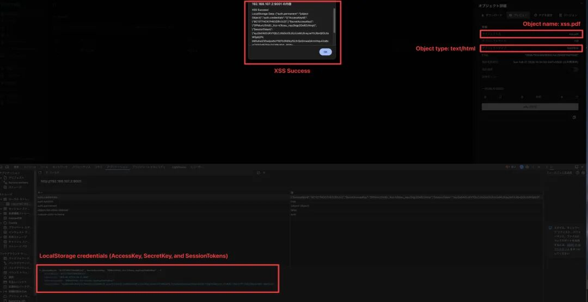

# RustFS 控制台中的存储型 XSS 漏洞使 S3 管理员凭据面临风险

<!-- vulwiki-editorial:start -->
## 校订与适用边界

### 本次正文校订

- 将正文讲解中的活动 HTML 标签改成可见代码，避免文档渲染为嵌入框。
- 将原有 XSS 载荷完整显示为代码文字，不删除参数与表达式。
- 按该篇完整正文及逐篇审阅区分主问题与背景编号，补全结构化主标识；不把标识归属校订等同运行复现。

### 尚未解决的证据缺口

以下限制仍适用于后文历史材料；相关版本、结果或修复结论不能据此视为已验证：

- 正文低于alpha82与表格修复alpha83留下alpha82边界不明
- 称Rust软件包应明确RustFS非Rust语言
- CVSSv3 10.0未给向量且上传权限/管理员预览条件需核GHSA
- alert显示localStorage不等于已经外传窃取
- iframe/script未代码围栏可能被渲染过滤
- GHSA只纯编号需补官方直链与补丁
- 结尾无完整修复建议

本页为文本校订，未执行代码、PoC 或目标请求；原图仅保留引用，未据此确认复现成功。
<!-- vulwiki-editorial:end -->

## 技术正文与历史材料

原创 网络安全9527
                    网络安全9527  安全圈的那点事儿   2026-02-28 06:29  
  
RustFS 控制台中发现了一个严重的安全漏洞，使管理员面临账户被盗用的高度风险。  
  
该存储型跨站脚本 (XSS) 漏洞被追踪为 CVE-2026-27822，其CVSS v3 评分为 10.0，属于严重漏洞，影响 Rust 软件包 1.0.0-alpha.82 之前的版本。  
  
该漏洞允许攻击者在管理控制台的上下文中执行任意 JavaScript 代码，从而可能导致系统完全被攻陷。  
  
该漏洞源于两个主要问题：文件预览期间对响应内容类型的验证不当，以及 S3 对象交付和管理控制台之间缺乏源分离。  
  
RustFS 通常将管理控制台和S3 API 托管在同一源（IP 和端口）上。这种设置会造成同源漏洞。  
  
<table><thead style="box-sizing: border-box;border-bottom-width: 3px;border-bottom-style: solid;border-bottom-color: currentcolor;"><tr style="box-sizing: border-box;"><th class="has-text-align-left" data-align="left" style="box-sizing: border-box;padding: 2px 8px;text-align: left;border: 1px solid rgba(0, 0, 0, 0);word-break: break-word;">技术指标</th><th class="has-text-align-left" data-align="left" style="box-sizing: border-box;padding: 2px 8px;text-align: left;border: 1px solid rgba(0, 0, 0, 0);word-break: break-word;">漏洞详情</th></tr></thead><tbody style="box-sizing: border-box;"><tr style="box-sizing: border-box;background-color: rgb(240, 240, 240);"><td class="has-text-align-left" data-align="left" style="box-sizing: border-box;padding: 2px 8px;border: 1px solid rgba(0, 0, 0, 0);text-align: left;word-break: break-word;"><strong style="box-sizing: border-box;font-weight: bold;">CVE ID</strong></td><td class="has-text-align-left" data-align="left" style="box-sizing: border-box;padding: 2px 8px;border: 1px solid rgba(0, 0, 0, 0);text-align: left;word-break: break-word;">CVE-2026-27822</td></tr><tr style="box-sizing: border-box;"><td class="has-text-align-left" data-align="left" style="box-sizing: border-box;padding: 2px 8px;border: 1px solid rgba(0, 0, 0, 0);text-align: left;word-break: break-word;"><strong style="box-sizing: border-box;font-weight: bold;">GitHub 安全公告</strong></td><td class="has-text-align-left" data-align="left" style="box-sizing: border-box;padding: 2px 8px;border: 1px solid rgba(0, 0, 0, 0);text-align: left;word-break: break-word;">GHSA-v9fg-3cr2-277j</td></tr><tr style="box-sizing: border-box;background-color: rgb(240, 240, 240);"><td class="has-text-align-left" data-align="left" style="box-sizing: border-box;padding: 2px 8px;border: 1px solid rgba(0, 0, 0, 0);text-align: left;word-break: break-word;"><strong style="box-sizing: border-box;font-weight: bold;">漏洞类型</strong></td><td class="has-text-align-left" data-align="left" style="box-sizing: border-box;padding: 2px 8px;border: 1px solid rgba(0, 0, 0, 0);text-align: left;word-break: break-word;">存储型跨站脚本攻击（XSS）</td></tr><tr style="box-sizing: border-box;"><td class="has-text-align-left" data-align="left" style="box-sizing: border-box;padding: 2px 8px;border: 1px solid rgba(0, 0, 0, 0);text-align: left;word-break: break-word;"><strong style="box-sizing: border-box;font-weight: bold;">已打补丁版本</strong></td><td class="has-text-align-left" data-align="left" style="box-sizing: border-box;padding: 2px 8px;border: 1px solid rgba(0, 0, 0, 0);text-align: left;word-break: break-word;">1.0.0-alpha.83</td></tr><tr style="box-sizing: border-box;background-color: rgb(240, 240, 240);"><td class="has-text-align-left" data-align="left" style="box-sizing: border-box;padding: 2px 8px;border: 1px solid rgba(0, 0, 0, 0);text-align: left;word-break: break-word;"><strong style="box-sizing: border-box;font-weight: bold;">严重程度评分</strong></td><td class="has-text-align-left" data-align="left" style="box-sizing: border-box;padding: 2px 8px;border: 1px solid rgba(0, 0, 0, 0);text-align: left;word-break: break-word;">关键（/10）</td></tr></tbody></table>  

当预览文件时，应用程序会 `<iframe>` 根据文件扩展名渲染内容。但是，它未能严格验证实际提供的内容类型。  
## 攻击机制  
  
RustFS 控制台将高度敏感的 S3 凭据（包括 AccessKey、SecretKey 和 SessionToken）不安全地存储在浏览器中 localStorage。  
  
由于 `<iframe>` 预览窗口与控制台本身位于同一源，因此在该窗口内执行的任何脚本都可以不受限制地访问父窗口的数据。  
  
根据 RustFS 的说法，攻击者可以通过上传恶意文件来利用这一点，例如，上传一个包含 JavaScript 的 HTML 文件，但将其命名为带有 .pdf 扩展名的文件。  
  
至关重要的是，攻击者必须将文件的 Content-Type 元数据设置为 text/html。当管理员尝试预览这个看似无害的 PDF 文件时，浏览器会将内容解释为 HTML 并执行嵌入的 JavaScript。  
  
  
  
概念验证 (PoC) 证明了这种攻击的简单性。  
1. 攻击者创建类似这样的有效载荷 ``。  
1. 他们将此文件上传到目标存储桶，确保文件名是 xss.pdf ，属性是 --attr "Content-Type=text/html"。  
1. 当管理员登录 RustFS 控制台并点击“预览”时 xss.pdf，JavaScript 会执行，立即窃取 localStorage 包含管理员凭据的数据。  

---

> 来源：gelusus/wxvl（微信公众号漏洞文章自动归档，原文见文首链接）
