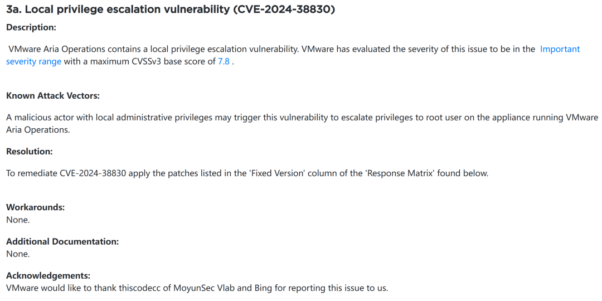
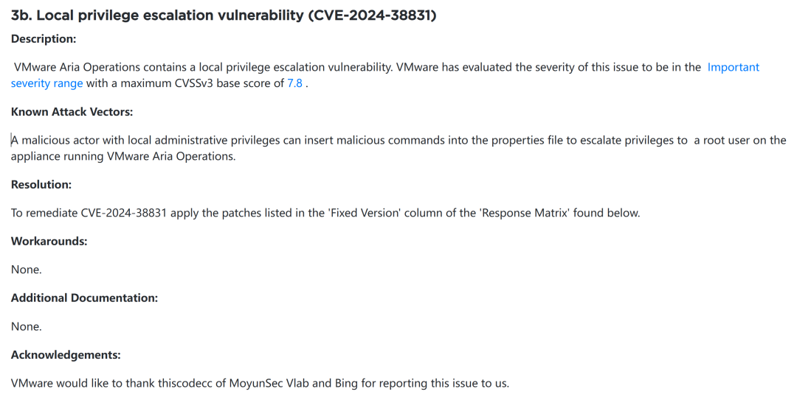

# VMware发布更新,修复墨云科技报告的高危漏洞

<!-- vulwiki-editorial:start -->
## 校订与适用边界

### 尚未解决的证据缺口

以下限制仍适用于后文历史材料；相关版本、结果或修复结论不能据此视为已验证：

- 38830和38831未元数据化
- 本地管理到root与无认证远程完全不同应保留
- 8.18.2修复需按公告核实范围
- 有厂商链接但具体接口/PoC无文本，公告用途
- 大量商业联系与广告可剥离

本页为文本校订，未执行代码、PoC 或目标请求；原图仅保留引用，未据此确认复现成功。
<!-- vulwiki-editorial:end -->

## 技术正文与历史材料

 关键信息基础设施安全保护联盟   2024-12-03 23:30  
  
  
  
****  
******VMware发布更新,修复墨云科技报告的漏洞****CVE-2024-38830、****CVE-2024-38831****。墨云建议广大用户做好资产自查以及预防工作，以免遭受恶意攻击。**  
  
  
  
  
**墨云安全应急响应中心**  
  
**时间：2024.12.03**  
  
****  
  
  
  
**漏洞描述**  
  
墨云科技VLab实验室监测到VMware官方发布了VMSA-2024-0022安全公告,其中修复了墨云科技VLab实验室提交的  
VMware Aria Operations  
产品漏洞  
CVE-2024-38830、CVE-2024-38831  
。  
  
**本地提权漏洞 （CVE-2024-38830）**  
  
恶意行为者如果拥有本地管理权限，可能会利用这个漏洞将其权限提升至运行 VMware Aria Operations 的设备上的 root 用户级别。漏洞风险等级为**高危**  
漏洞。  
  
**本地提权漏洞 （CVE-2024-38831）**  
  
恶意行为者若拥有本地管理权限，可通过将恶意命令插入属性文件，从而提升权限至运行 VMware Aria Operations 的设备上的 root 用户级别。****  
漏洞风险等级为**高危**  
漏洞。  
  
墨云科技VLab实验室向VMware公司提交报告后，协助其修复相关漏洞。VMware于北京时间11月26日发布了补丁,并公开致谢了墨云科技VLab实验室。  
  
  
  
  
  
  
**影响版本**  
  
VMware Aria Operations < VMware Aria Operations 8.18.2  
  
**修复建议**  
  
VMware官方已提供漏洞修补方案，请按照升级说明升级该系统最新补丁。  
https://support.broadcom.com/web/ecx/support-content-notification/-/external/content/SecurityAdvisories/0/25199  
  
  
**墨云科技技术支持**  
  
墨云科技后续将积极为用户提供技术支持，进行持续跟踪并及时通报进展。如需要帮助请拨打电话400-096-0509，或搜索“墨云安全”公众号，获取墨云科技更多资讯，期待您的关注！  
  
  
  
  
  
  
  
  
  
   
  
**理事服务 |  会员服务**  
  
      **请联系：13810321968（微信同号）**    
  
      
  
  **商务合作 |  开白转载 | 媒体交流 | 文章投稿**  
  
**请联系：13810321968（微信同号）**  
     
  
  
  
  
  
  
  
  
  
  

---

> 来源：gelusus/wxvl（微信公众号漏洞文章自动归档，原文见文首链接）
