# 【技术干货】CVE-2022-22954 VMware Workspace ONE Access SSTI RCE 漏洞分析

<!-- vulwiki-editorial:start -->
## 校订与适用边界

### 尚未解决的证据缺口

以下限制仍适用于后文历史材料；相关版本、结果或修复结论不能据此视为已验证：

- 保留FreeMarker eval和异常调用链独立分析，不与22972认证绕过合并
- 关键payload/源码多为截图应文字化
- / ui/view/error空格损坏路径
- 具体版本结构化并核88099/VMSA2022-0011修复矩阵
- 清机构宣传

本页为文本校订，未执行代码、PoC 或目标请求；原图仅保留引用，未据此确认复现成功。
<!-- vulwiki-editorial:end -->

## 技术正文与历史材料

<meta name="referrer" content="no-referrer"/>

> 本文由 [简悦 SimpRead](http://ksria.com/simpread/) 转码， 原文地址 [mp.weixin.qq.com](https://mp.weixin.qq.com/s/PDxbQKm7CLRjjlA4d-55kA)

**xxhzz**

**@PortalLab 实验室**

  

**前言**

4 月 6 日和 5 月 18 日，VMware 官方发布的两则安全公告中显示，关乎旗下产品的 CVE 漏洞多达 10 个，其中不乏有 CVSSv3 评分 9.8 的高危漏洞！如此高频的出洞速率，吸引了笔者注意。继上篇 [CVE-2022-22972  VMware Workspace ONE Access 身份认证绕过漏洞分析](http://mp.weixin.qq.com/s?__biz=Mzg3NDcwMDk3OA==&mid=2247483810&idx=1&sn=48063cb1d5271a9b9668a6848be09c2e&chksm=cecd887ff9ba016909849b0e941f69f409d547ca94389a37f50dec9d7dccfa537368c673fb33&scene=21#wechat_redirect)之后，笔者将对 CVE-2022-22954 VMware Workspace ONE Access SSTI RCE 漏洞进行细致分析。

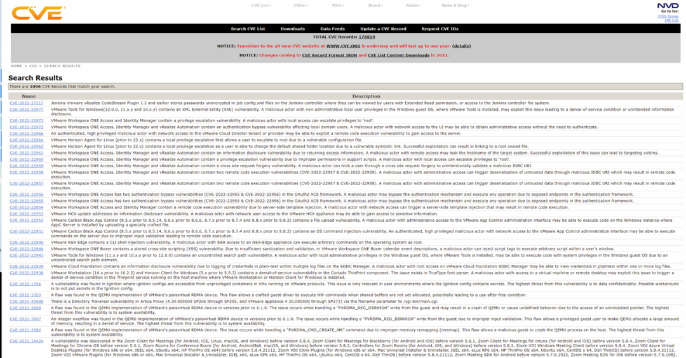

**漏洞描述**

根据 4 月 6 日 VMware 官方发布的安全公告，官方已更新解决了多个产品的安全问题。其中 CVE-2022-22954，CVSS 评分为 9.8，危害等级为严重。该漏洞是由于 VMware Workspace ONE Access and Identity Manager 包含一个服务器端模板注入漏洞，导致具有网络访问权限的恶意攻击者可进行远程代码执行。

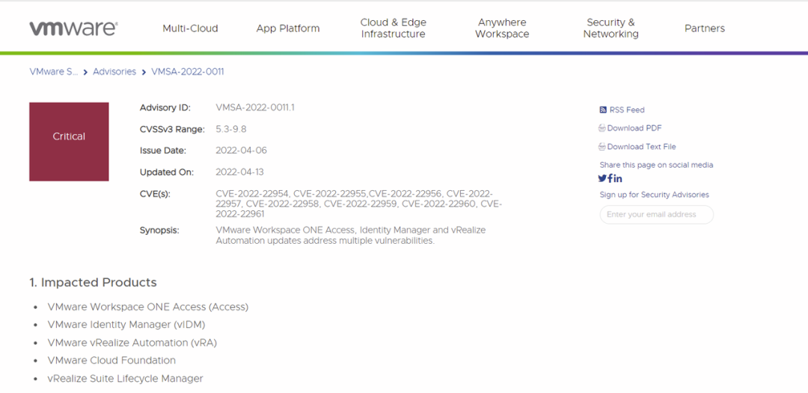

**利用范围**

*   VMware Workspace ONE Access 21.08.0.1, 21.08.0.0，20.10.0.1, 20.10.0.0
    

*   VMware Identity Manager（vIDM） 3.3.6, 3.3.5, 3.3.4, 3.3.3
    

*   VMware vRealize Automation(vIDM)  7.6
    

*   VMware Cloud Foundation (vIDM) 4.x
    

**漏洞分析**

根据 freemarker 官网文档（https://freemarker.apache.org/docs/ref_builtins_expert.html#ref_builtin_eval）中给出了安全问题的提示。

使用内置函数将字符串计算为 FTL 表达式，FTL 表达式可以访问变量，并调用 Java 方法，例如 "1+2"?eval 将返回数字 3，所以`?eval`前的字符串因来自不受信任的来源，可能就会成为攻击媒介。

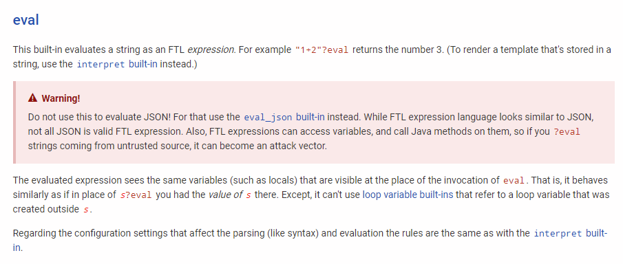

在 Vmware 中的 endusercatalog-ui-1.0-SNAPSHOT-classes.jar 自带的模板 customError.ftl 就调用了 freemarker 引擎的 eval 函数来渲染 errObj，这就导致了本次 SSTI 注入漏洞。

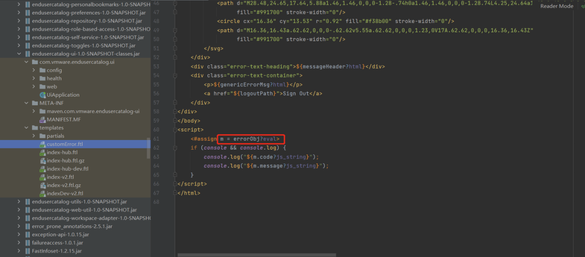

**环境搭建**
--------

可参考 [CVE-2022-22972 VMware Workspace ONE Access 身份认证绕过漏洞分析](http://mp.weixin.qq.com/s?__biz=Mzg3NDcwMDk3OA==&mid=2247483810&idx=1&sn=48063cb1d5271a9b9668a6848be09c2e&chksm=cecd887ff9ba016909849b0e941f69f409d547ca94389a37f50dec9d7dccfa537368c673fb33&scene=21#wechat_redirect)。

本次漏洞分析源码所在位置：/opt/vmware/horizon/workspace/webapps/catalog-portal/WEB-INF/lib。

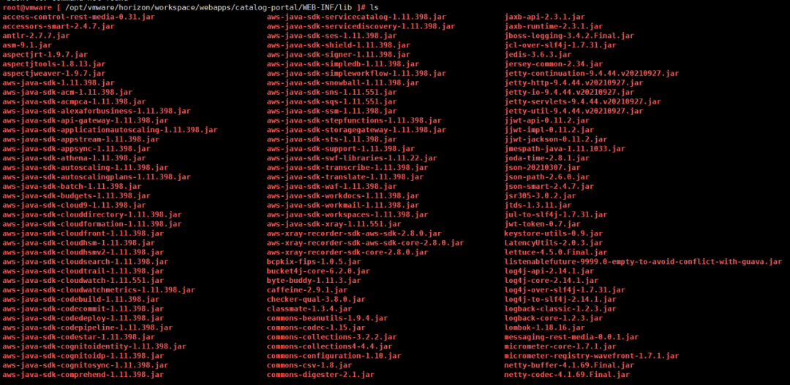

**动态调式**
--------

已经定位到安全问题所在，接下来寻找渲染 customError.ftl 模板的相关代码。

在 com.vmware.endusercatalog.ui.web.UiErrorController#handleGenericError 函数中。

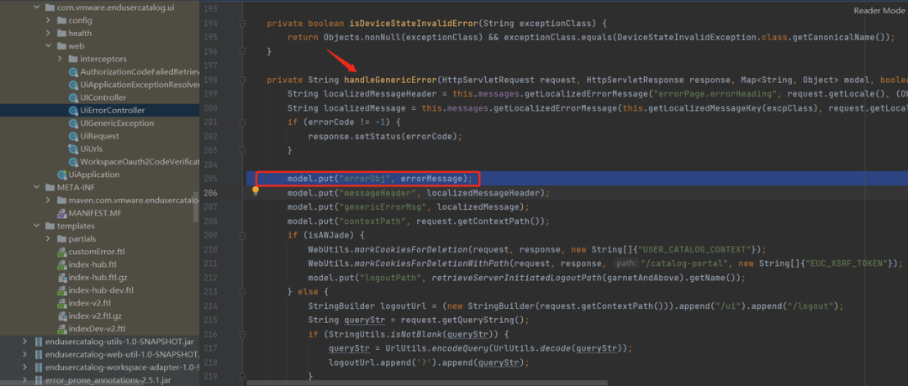

errorObj 由参数传入。

查找 handleGenericError 函数的被调用关系发现。

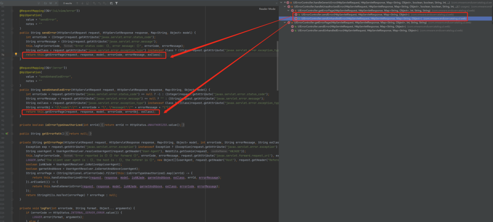

handleGenericError 函数受如上图所示的两个 requestMapping 所在的控制器 UiErrorController 调用。

跟进其中出现的 getErrorPage 函数，位于 com.vmware.endusercatalog.ui.web.UiErrorController#getErrorPage。

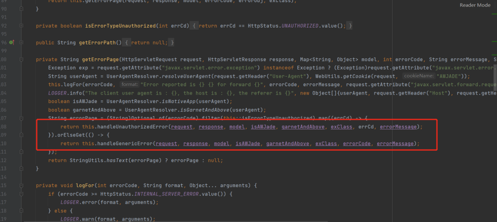

除了直接用 handleGenericError 函数拿到需要渲染的模板，还存在 handleUnauthorizedError 函数通过条件判断，只有一个分支进入 handleGenericError

如何构造参数？

在两个 requestMapping 中，其中的 / ui/view/error 为 API 接口，直接访问无法从请求中提取 javax.servlet.error.message，从而无法控制 errorObj。

寻找 / ui/view/error 的其他调用，位于 com.vmware.endusercatalog.ui.web.UiApplicationExceptionResolver#resolveException 函数。

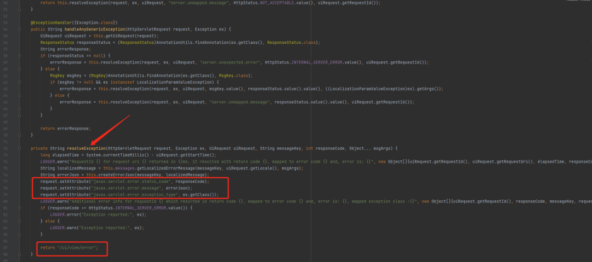

存在对 javax.servlet.error.message 赋值的过程。

查看 resolveException 函数的被调用关系，受上方 handleAnyGenericException 函数调用。

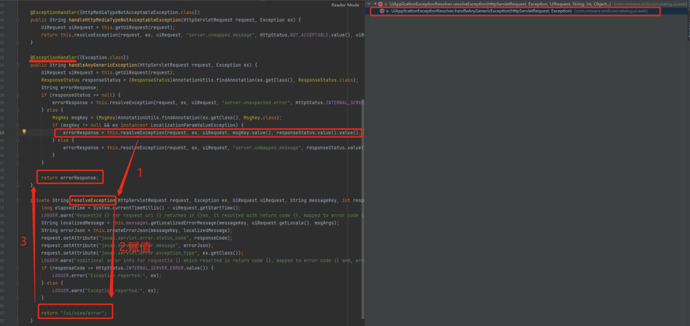

其中 @ExceptionHandler 表明，该处为异常处理器，当程序直接抛出 Exception 类型的异常时会进入 handleAnyGenericException，再通过调用 resolveException 函数，进行赋值，最终都会返回 / ui/view/error。

而在 handleAnyGenericException 中，进入 resolveException 时会根据异常的类型传入不同的参数，如果异常类不是 LocalizationParamValueException 子类的话则传入 uiRequest.getRequestId()，所以我们需要构造参数可控的地方还需要抛出 LocalizationParamValueException 异常类或其子类异常，这样 errorObj 所需 Attribute errorJson 来自 LocalizationParamValueException 异常的 getArgs。

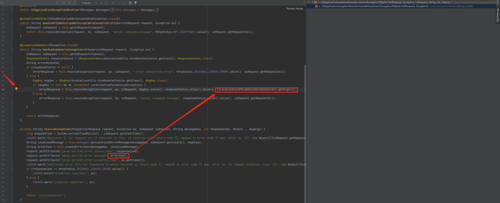

在 LocalizationParamValueException 函数，如果可以控制抛出异常的参数，就可以把 payload 传入 errorObj。

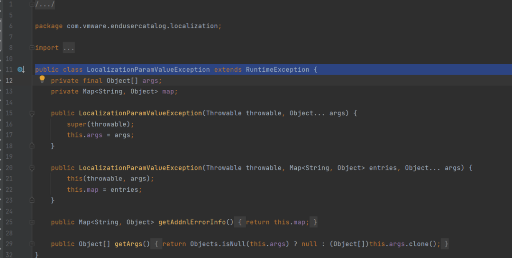

在 endusercatalog-auth-1.0-SNAPSHOT.jar 中 com.vmware.endusercatalog.auth.InvalidAuthContextException，存在一个 InvalidAuthContextException 异常，继承于 LocalizationParamValueException。

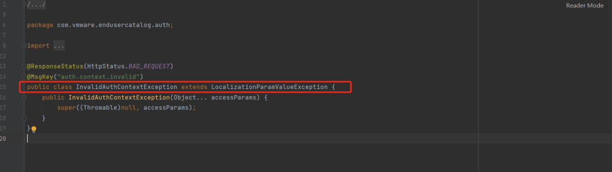

在 com.vmware.endusercatalog.auth.AuthContext 构造函数中抛出异常。

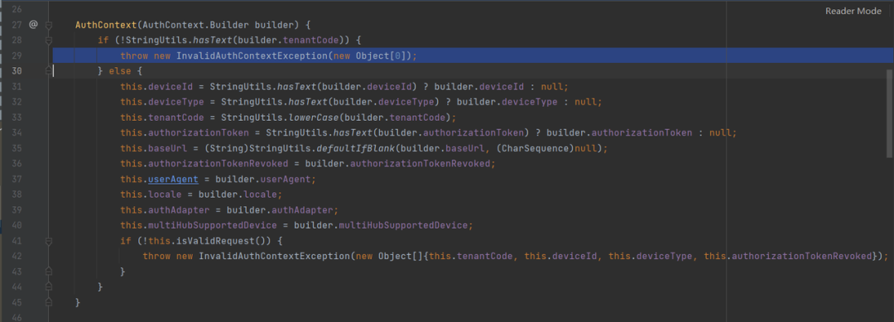

生成 AuthContext 对象的地方在 AuthContextPopulationInterceptor 拦截器中，而且各项参数均是从请求中获取，这里可构造注入点。

但正常情况下，在 endusercatalog-auth-1.0-SNAPSHOT.jar 中的拦截器类无法访问到类。

但在 com.vmware.endusercatalog.ui.UiApplication，使用 @ComponentScan 注解声明自动将 com.vmware.endusercatalog.auth 包的类装配进 bean 容器。

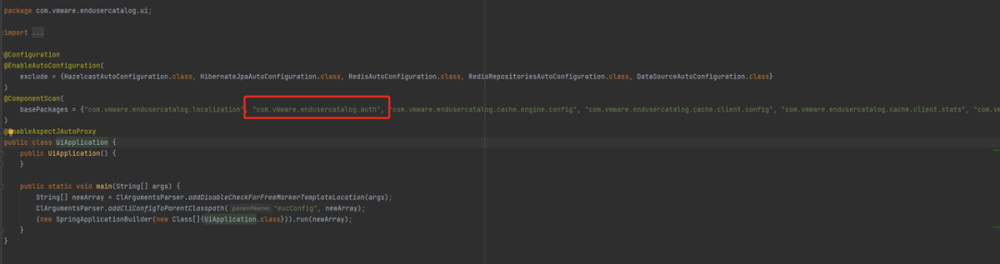

在包中 com.endusercatalog.ui.config.WebConfig 可查找到。

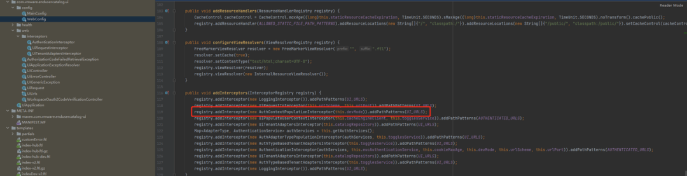

可进行构造的 url。

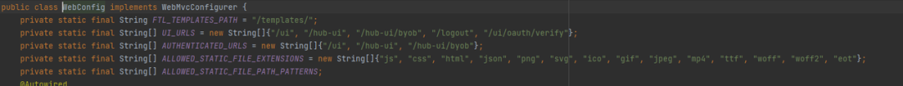

通过如上分析，可构造 payload，进行命令执行。

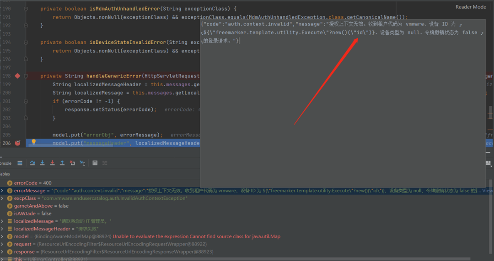

**漏洞复现**
--------

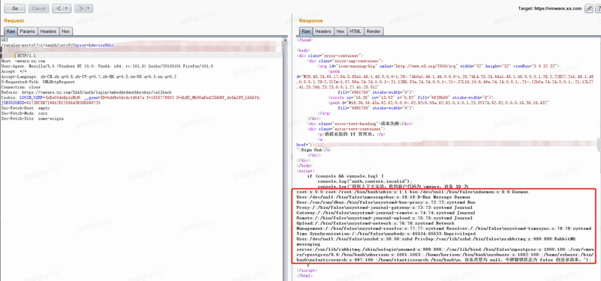

**修复建议**

参考漏洞影响范围进行排查，目前官方已发布修复补丁：

https://kb.vmware.com/s/article/88099

**参考材料**

1.https://www.vmware.com/security/advisories/VMSA-2022-0011.html

2.https://cve.mitre.org/cgi-bin/cvekey.cgi?keyword=vmware

3.https://mp.weixin.qq.com/s/X_E0zWONLVUQcgP6nZ78Mw?scene=21#wechat_redirect

4.https://mp.weixin.qq.com/s/zVYQQgDjcwJKAnX8SZJ5Cw

**关于 Portal Lab**

星阑科技 Portal Lab 致力于前沿安全技术研究及能力工具化。主要研究方向为 API 安全、应用安全、攻防对抗等领域。实验室成员研究成果曾发表于 BlackHat、HITB、BlueHat、KCon、XCon 等国内外知名安全会议，并多次发布开源安全工具。未来，Portal Lab 将继续以开放创新的态度积极投入各类安全技术研究，持续为安全社区及企业级客户提供高质量技术输出。

---

> 来源：MrWQ/vulnerability-paper（https://github.com/MrWQ/vulnerability-paper）
