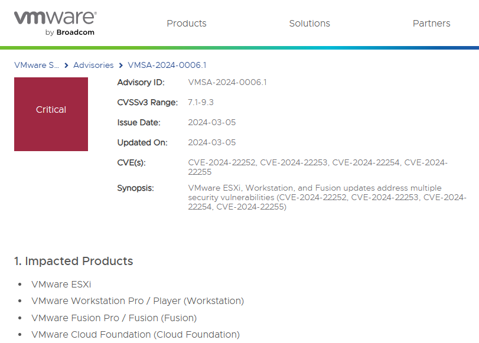
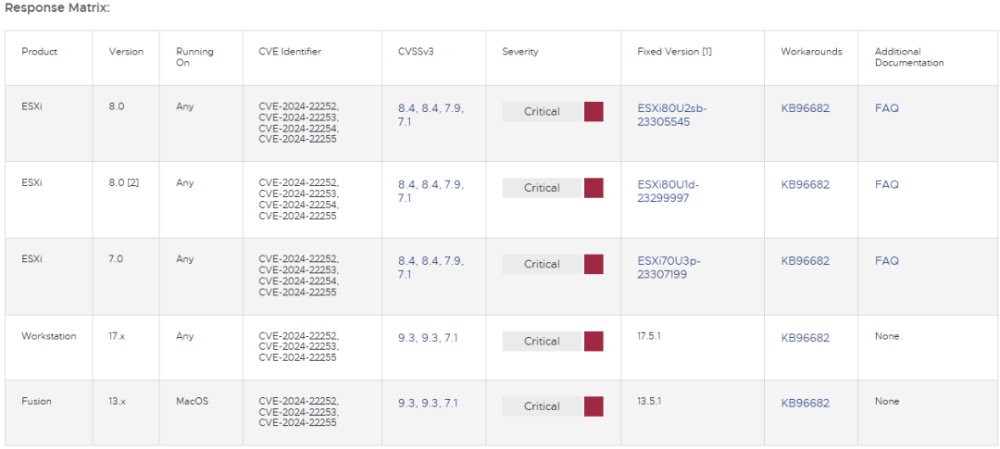

# 更新VMware！多个漏洞可导致沙箱逃逸

<!-- vulwiki-editorial:start -->
## 校订与适用边界

### 尚未解决的证据缺口

以下限制仍适用于后文历史材料；相关版本、结果或修复结论不能据此视为已验证：

- 四主CVE未元数据化
- guest管理员到VMX和VMX逃逸是不同边界不能概括均直接宿主root
- 修复列表VCF3.x仅分支无具体补丁
- 移除USB只适用相关控制器漏洞需逐项
- 有VMSA原始链接保留，后门通识广告删除

本页为文本校订，未执行代码、PoC 或目标请求；原图仅保留引用，未据此确认复现成功。
<!-- vulwiki-editorial:end -->

## 技术正文与历史材料

看雪学苑  看雪学苑   2024-03-07 17:59  
  
3月5日，虚拟化巨头VMware针对虚拟机逃逸漏洞发布了紧急安全更新，漏洞影响范围包括VMware的ESXi、Workstation、Fusion和Cloud Foundation。  
  
  
  
  
  
  
据VMware公告，四个漏洞中有两个（CVE-2024-22252、CVE-2024-22253，CVSS评分皆为9.3）可能导致代码执行，它们分别是XHCI USB控制器和UHCI USB 控制器中的释放后使用漏洞（Use After Free）。在虚拟机上具有本地管理权限的攻击者通过利用该漏洞，能够在主机上以虚拟机的VMX进程执行代码。  
  
  
同时，VMware还修复了如下两个漏洞：  
  
CVE-2024-22254（CVSS评分7.9）-VMware ESXi中的越界写入漏洞，在VMX进程中具有特权的攻击者，能够利用此漏洞触发越界写入，从而导致沙箱逃逸。  
  
CVE-2024-22255（CVSS评分7.1）-VMware ESXi、Workstation和Fusion的UHCI USB控制器中的信息泄露漏洞，在虚拟机上具有管理访问权限的攻击者，能够利用此漏洞从vmx进程中泄露内存。  
  
  
  
  
  
VMware表示，上述漏洞使得攻击者有可能突破沙箱保护，违背了VMware产品的基本目的——在与主机相隔离的虚拟机内运行敏感操作。鉴于问题的严重性，VMware已在以下版本将之修复，包括已经达到生命周期终点（EoL）的版本：  
  
- ESXi 6.5 - 6.5U3v  
  
- ESXi 6.7 - 6.7U3u  
  
- ESXi 7.0 - ESXi70U3p-23307199  
  
- ESXi 8.0 - ESXi80U2sb-23305545和ESXi80U1d-23299997  
  
- VMware Cloud Foundation (VCF) 3.x  
  
- Workstation 17.x - 17.5.1  
  
- Fusion 13.x (macOS) - 13.5.1  
  
  
VMware敦促客户尽快为受影响的产品打上补丁。作为一种临时解决方案，用户可以选择从受影响的虚拟机中移除USB控制器。  
  
  
此链接查看公告详情：  
https://www.vmware.com/security/advisories/VMSA-2024-0006.html  
  
  
  
编辑：左右里  
  
资讯来源：VMware  
  
转载请注明出处和本文链接  
  
  
**每日涨知识**  
  
 后门(backdoor)  
  
后门是没有被记录到文挡的命令序列，允许软件开发人员绕过正常的访问限制。后门可  
以由制造商放置和留下，或者由黑客使用漏洞来放置。  
  
  
﹀  
  
﹀  
  
﹀  
  
  
  
  
  
  
**球分享**  
  
  
  
**球点赞**  
  
  
  
**球在看**  
  
****  
****  
  
  
  
戳  
“阅读原文  
”  
一起来充电吧！  
  

---

> 来源：gelusus/wxvl（微信公众号漏洞文章自动归档，原文见文首链接）
