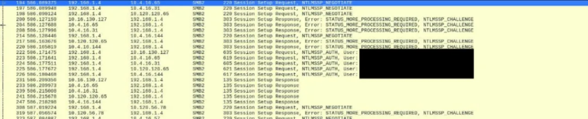

## 2026-10-03 技术核验

CVE-2024-37085 的认证绕过有明确域管理前提：ESXi 主机此前已接入 AD 用户管理，攻击者须具备足够 AD 权限，在配置组被删除后重新创建该组（默认 ESXi Admins）。文章中的 VPN 入口与被盗凭据是攻击链背景，单凭网络可达或任意域账号不能推出满足该条件。

# 勒索软件正在利用VMware漏洞，通过VPN访问发动攻击

<!-- vulwiki-editorial:start -->
## 校订与适用边界

### 本次正文校订

- 按该篇完整正文及逐篇审阅区分主问题与背景编号，补全结构化主标识；不把标识归属校订等同运行复现。

### 尚未解决的证据缺口

以下限制仍适用于后文历史材料；相关版本、结果或修复结论不能据此视为已验证：

- 目录为新闻句子不是产品
- 省略AD域集成及相关组控制前提容易误读为纯远程认证绕过
- VPN凭据入口与ESXi漏洞为攻击链不同阶段
- 无受影响/修复版本
- 缺Talos原始研究链接
- 大段HTML调查推广应剔除

本页为文本校订，未执行代码、PoC 或目标请求；原图仅保留引用，未据此确认复现成功。
<!-- vulwiki-editorial:end -->

## 技术正文与历史材料

 信息安全大事件   2024-08-30 20:16  
  
Hackread报道，近期Cisco Talos（思科威胁情报团队）发现，BlackByte勒索软件正在对全球企业发起新一轮攻击。  
  
BlackByte组织利用VMware ESXi虚拟机监控程序中最近被修补的漏洞，通过VPN访问发动攻击。  
  
思科建议各组织实施多因素认证（MFA）并加强安全措施以降低风险。  
  
被利用的漏洞为CVE-2024-37085，它允许攻击者绕过身份验证并控制易受攻击的系统。  
  
除了这个漏洞之外，还观察到BlackByte组织使用受害者授权的远程访问机制，例如VPN。这种策略使得BlackByte在可见性较低的情况下运营，并逃避安全监控系统。  
  
另一个令人担忧的事态发展是该组织使用被盗的Active Directory凭据来传播其勒索软件。这意味着他们可以更快、更有效地在网络内传播感染，从而增加潜在的损害。  
  
  
  
思科团队研在8月28日星期三研究结果发布前，与Hackread分享了他们的发现。  
  
研究人员认为，BlackByte实际活动比公共数据泄露网站上显示的更活跃。网站只显示了他们成功发起攻击的一小部分，可能掩盖了他们行动的真实范围。  
  
BlackByte针对的5个最主要目标行业：制造业；运输/仓储；专业人士、科学和技术服务；信息技术；公共行政。  
  
研究人员建议各个组织优先考虑修补系统，包括VMware ESXi虚拟机管理程序，为所有远程访问和云连接实施多因素身份验证（MFA），应审核VPN配置，并限制对关键网段的访问。  
  
限制或禁用NTLM的使用，并选择更安全的身份验证方法也非常重要。部署可靠的端点检测和响应（EDR）解决方案可以大大提高安全性。  
  
此外，全面的安全策略应包括主动威胁情报和事件响应能力，以有效保护系统免受BlackByte和类似攻击等威胁。  
  
<table><tbody style="-webkit-tap-highlight-color: transparent;outline: 0px;visibility: visible;"><tr class="ue-table-interlace-color-single js_darkmode__0" data-style="-webkit-tap-highlight-color: transparent; outline: 0px; background-color: rgb(28, 28, 28); visibility: visible; color: rgb(205, 205, 205) !important;" style="-webkit-tap-highlight-color: transparent;outline: 0px;background-color: rgb(28, 28, 28);visibility: visible;color: rgb(205, 205, 205) !important;"><td width="557" valign="top" data-style="-webkit-tap-highlight-color: transparent; outline: 0px; word-break: break-all; hyphens: auto; border-color: rgb(76, 76, 76); background-color: rgb(255, 218, 169); visibility: visible; color: rgb(25, 25, 25) !important;" class="js_darkmode__1" style="-webkit-tap-highlight-color: transparent;outline: 0px;word-break: break-all;hyphens: auto;border-color: rgb(76, 76, 76);background-color: rgb(255, 218, 169);visibility: visible;color: rgb(25, 25, 25) !important;"><section style="-webkit-tap-highlight-color: transparent;outline: 0px;line-height: normal;visibility: visible;">尊敬的读者： 感谢您花时间阅读我们提供的这篇文章。我们非常重视您的时间和精力，并深知信息对您的重要性。 我们希望了解您对这篇文章的看法和感受。我们真诚地想知道您是否认为这篇文章为您带来了有价值的资讯和启示，是否有助于您的个人或职业发展。 如果您认为这篇文章对您非常有价值，并且希望获得更多的相关资讯和服务，我们愿意为您提供进一步的定制化服务。请通过填写我们提供的在线表单，与我们联系并提供您的邮箱地址或其他联系方式。我们将定期向您发送相关资讯和更新，以帮助您更好地了解我们的服务和文章内容。</section><section style="-webkit-tap-highlight-color: transparent;outline: 0px;line-height: normal;visibility: visible;"> </section><section style="-webkit-tap-highlight-color: transparent;outline: 0px;line-height: normal;text-indent: 0em;visibility: visible;">                   </section><section style="-webkit-tap-highlight-color: transparent;outline: 0px;line-height: normal;text-indent: 0em;">                               扫描二维码，参与调查</section><section style="-webkit-tap-highlight-color: transparent;outline: 0px;line-height: normal;"> </section></td></tr></tbody></table>  
  
  

---

> 来源：gelusus/wxvl（微信公众号漏洞文章自动归档，原文见文首链接）
