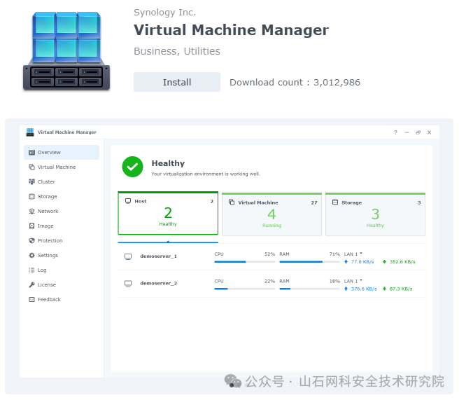
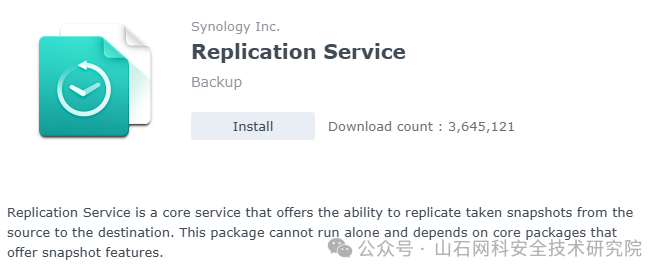
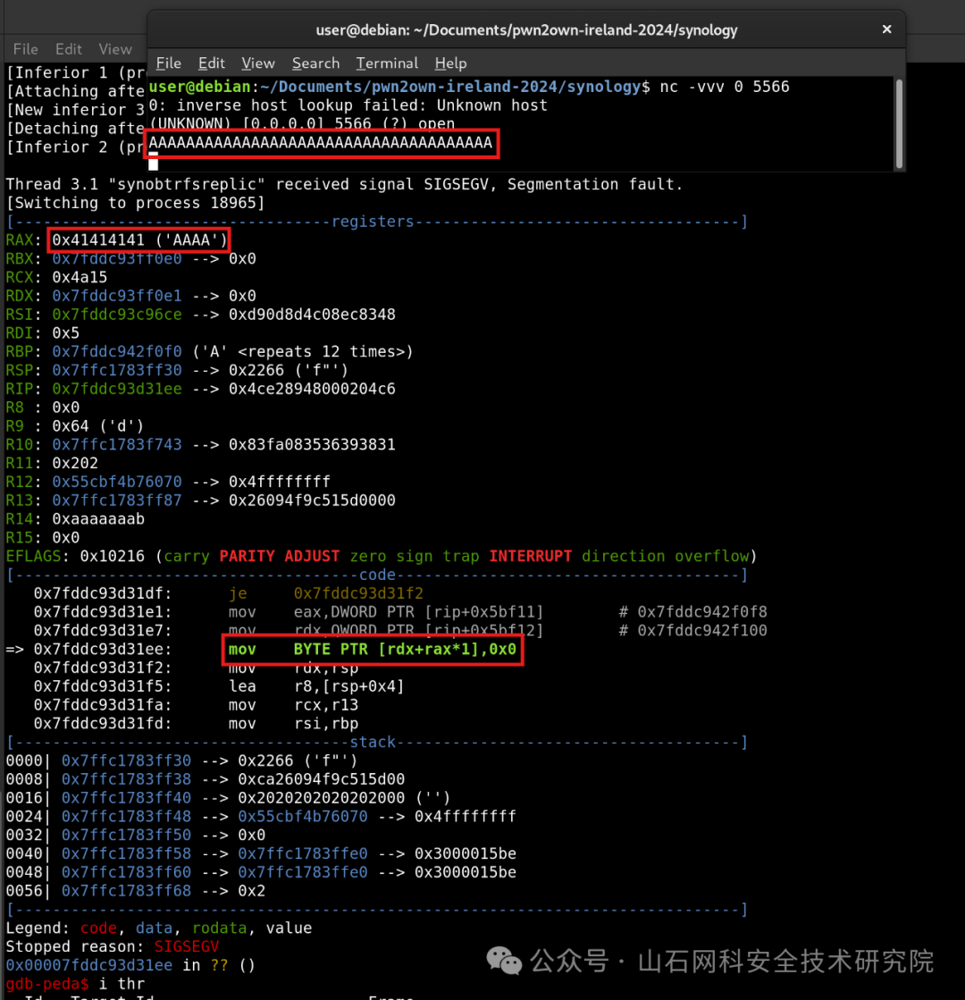
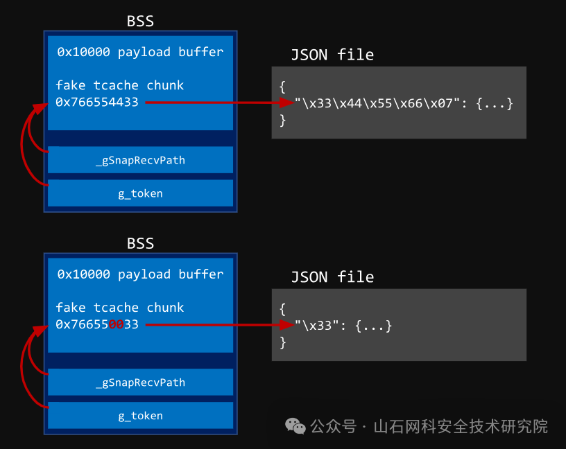

# 群晖DiskStation漏洞利用：从CVE-2024-10442到远程代码执行

<!-- vulwiki-editorial:start -->
## 校订与适用边界


### 尚未解决的证据缺口

以下限制仍适用于后文历史材料；相关版本、结果或修复结论不能据此视为已验证：

- 组件是可选Replication Service依赖且需5566可达，非所有DSM默认受影响
- 缺套件受影响/修复版本和厂商公告链接
- C伪码压单行使注释吞逻辑，文字先说返回非零再解释返回0应直接写错误返回0
- BSS泄漏推导全部mmap地址需限定设备固件布局，不作通用结论
- 后段tcache任意next省略safe-linking编码与前文保护机制须衔接
- 称完整代码公开未给对应PoC链接
- 不记录日志/服务不中断为实验观察而非无影响保证
- 清广告

本页为文本校订，未执行代码、PoC 或目标请求；原图仅保留引用，未据此确认复现成功。
<!-- vulwiki-editorial:end -->

## 技术正文与历史材料

原创 GKDf1sh  山石网科安全技术研究院   2025-06-03 09:11  
  
  
  
  
  
  
  
****  
****  
**如何从简单的空字节写入漏洞演变为远程代码执行的致命攻击？**  
  
****  
****  
  
  
  
  
在网络安全领域，每一个新发现的漏洞都可能成为攻击者手中的利刃。2024年10月，安全研究人员在群晖科技（Synology）的DiskStation DS1823xs+型号设备上发现了一个严重的安全漏洞（CVE-2024-10442）[1]，允许攻击者以root用户身份远程执行代码。这一发现不仅揭示了群晖DiskStation在安全性上的潜在风险，也对广泛部署该设备的组织和个人用户敲响了警钟。  
  
  
  
  
**一、背景**  
  
  
10月份，作者参加了Pwn2Own Ireland 2024，并利用了一个漏洞成功攻破了群晖DiskStation DS1823xs+，实现了以root权限执行远程代码。目前该漏洞已被修复，漏洞编号为CVE-2024-10442。  
  
  
DiskStation是群晖科技（Synology）推出的一款广受欢迎的NAS（网络附加存储）产品系列。在过去几次Pwn2Own活动中，它也曾被成功攻破过几次，但在去年的活动（Pwn2Own Toronto 2023）中未被成功攻破。2024年的Pwn2Own Ireland，有三个攻击案例成功了，并且每支队伍都利用了不同的漏洞。  
  
  
本文将详细介绍作者研究Synology DiskStation的过程，以及为此次比赛编写漏洞利用程序的经历。  
  
  
  
  
图注：准备向Synology DiskStation发起攻击——Pwn2Own Ireland 2024  
  
  
  
  
**二、审计软件包**  
  
****  
  
如前所述，在过去一两年的Pwn2Own活动中，群晖DiskStation均未被选手攻破。因此，2024年ZDI（Zero Day Initiative）特别将一些非默认但由Synology官方开发的软件包纳入比赛目标范围：  
  
  
对于目标群晖DiskStation来说，以下这些软件包被安装在目标上，并且属于比赛范围内：  
- MailPlus  
  
- Drive  
  
- Virtual Machine Manager  
  
- Snapshot Replication  
  
- Surveillance Station  
  
- Photos  
  
这里的“软件包”指的是可通过Synology管理界面（DiskStation Manager）中的“套件中心”（Package Center）便捷安装的可选附加应用/服务等。  
  
  
这也意味着更大的攻击面。由于这是这些软件包首次被纳入比赛范围，作者推测它们可能存在相对基础的安全漏洞——毕竟这些组件此前可能未经过充分的安全性审查。事实也证明这一判断完全正确。  
  
  
作者首先研究的是Virtual Machine Manager（虚拟机管理器），通过物理设备上的内置“套件中心”直接安装该软件包。  
  
  
  
  
  
随后，作者通过SSH登录测试设备的Shell接口，利用netstat  
命令枚举新增的网络监听端口。结果显示，大部分服务仅绑定于本地回环接口（localhost-only），但有一个服务例外，它以root权限运行着：  
  
```
/var/packages/ReplicationService/target/sbin/synobtrfsreplicad  --port 5566
```  
  
  
该服务实际属于Replication Service（复制服务），它是Virtual Machine Manager的依赖组件（同时也是Snapshot Replication的依赖组件）。考虑到其高权限级别及与服务通信的便捷性，作者对其产生了浓厚兴趣。  
  
  
  
  
  
下一步是分析二进制文件。由于作者在真实设备上安装了该服务，因此可通过SSH直接提取相关文件。  
  
  
另一种方法是直接从Synology官网下载[2]DSM（系统核心操作系统）及软件包的安装文件。随后使用专用解压工具[3]解析Synology自定义的存档格式，提取其中的软件包、固件镜像或更新文件。需要注意的是，此类工具本质上是基于Synology官方共享库的FFI封装器（FFI wrapper），这些库文件可从真实设备中提取，或通过分离工具[4]从DSM固件中分离。  
  
  
  
  
**三、寻找漏洞**  
  
  
在获取到二进制文件后，开始分析监听端口5566的TCP服务。主程序synobtrfsreplicad  
仅是一个用于调用libsynobtrfsreplicacore.so.7  
中功  
能的驱动程序适配层。  
  
  
该服务是一个基于L  
inux的forking server，主进程持续调用accept()  
并通过fork  
创建子进程来处理每个新连接的客户端。随后，子进程运行一个基础命令循环（command loop），解析接收到的消  
息：  
  
  
每条命令采用简单的二进制格式，包含操作码（opcode）和可选的变长数据负载  
：  
  
```
unsigned cmd    // 命令操作码unsigned seq    // 序列号unsigned lenchar data[len]
```  
  
  
为了解析此类命令消息，定义了两个全局结构体：  
  
1.一个用于存储命令本身；  
  
2.另一个类似环形缓冲区（ring-buffer-esque）的结构，可容纳最多3个变长命令负载：  
  
```
struct {    unsigned char sector;      // 环形缓冲区索引    char bufs[3][65536];       // 3 个负载的缓冲区    unsigned buf_lens[3];      // 每个负载的实际长度} g_recvbuf;struct {    ReplicaCmdHeader header;    // 操作码、序列号、长度    char *data;                // 指向 g_recvbuf 中某个缓冲区} g_cmd;
```  
  
  
命令循环的核心逻辑如下：  
  
```
void runcmdloop() {    while(1) {        g_cmd.data = g_recvbuf.bufs[g_recvbuf.sector];        int err = recvcmd(&g_cmd);        if (err) break;        // 错误则退出循环        g_cmd.data[g_cmd.header.len] = 0; // 在负载末尾添加空字符终止符        // ... 处理命令 ...    }}// 接收消息头和负载的函数int recvcmd(ReplicaCmd* cmd) {    int err = raw_tcp_recv(cmd->header, 12); // 先接收前 12 字节头    if (err) return err;    if (cmd->header.len > 0x10000) return err; // 若负载长度过大则返回错误    // 接收实际负载数据    err = raw_tcp_recv(cmd->data, cmd->header.len);    // ...}
```  
  
  
若攻击者提供的负载长度超出限制（如大于0x10000），recvCmd  
会  
直接返回错误码（即非零值）而不接收任何数据。然而，其返回值被设计为0（表示无错误），这一行为存在矛盾——实际上，当检测到无效的头长度时本应触发错误。回到调用方后，由于未感知到错误，程序继续正常执行，将任意大的头长度值用于在负载末尾写入空字节。  
  
  
对于初始概念验证（POC），可通过netcat  
发  
送全为'A'  
的数据包（至少12字节），以经典方式触发漏洞。此时：  
- 若未通过gdb  
附加服务调试，设备上不会显示任何异常  
；  
  
- 故障信息既未记录到syslog  
，也未出现在DSM日志中；  
  
- 由于服务器采用forking mode运行，服务功能亦不会中断。  
  
  
  
  
此漏洞允许重复向共享库的BSS段（数据段）中任意偏移量写入空字节（null byte），类似于CTF题目中的常见技巧。尽管漏洞本身较为简单，但其利用过程颇具挑战性。  
  
  
此外，由于所有防护机制（如ASLR、DEP）均启用，作者优先将其转化为信息泄露漏洞（info leak）  
。  
  
  
  
  
**四、forking server**  
  
  
在深入分析前，需明确我们面对的是一个  
forking server  
，其特性对绕过ASLR（地址空间布局随机化）具有重要意义。每当服务器通过fork()  
创建子进程处理客户端请求时，子进程会继承父进程的完整地址空间布局。即使子进程崩溃，也不会导致整个服务中断——只需重新连接即可触发新子进程的创建，相当于重置状态并获得一次新的尝试机会。这种机制类似于“时间循环”，每次连接都能以累积方式逐步推断地址空间的细节。  
  
  
从高层次来看，漏洞利用的迭代流程通常包含以下步骤：  
  
**1.猜测目标值（如内存地址）**  
  
**2.让程序基于猜测值执行操作**  
，若猜测错误则触发异常行为（如地址无效导致崩溃）  
  
**3.观察程序行为判断猜测是否正确**  
  
4.若  
成  
功，则确认目标值；否则重复上述流程。  
  
  
这一思路将在后续分析具体二进制文件时得到体现。  
  
  
  
  
**五、功能概述**  
  
  
由于当前漏洞发生在输入解析阶段，作者尚未深入分析程序的核心功能，但这些功能将在后续构建漏洞利用链时发挥关键作用。  
  
  
从网络读取命令后，服务通过switch-case  
语句处理不同的操作码（opcode）。部分需要输入的操作码会从变长的命令负载中解析数据。作者遍历了所有可用操作码及其功能：  
- CMD_DSM_VER  
：无输入，返回DSM版本号  
  
- CMD_SSL  
：初始化SSL连接  
  
- CMD_TEST_CONNECT / CMD_NOP / CMD_COUNT / CMD_CLR_BKP / CMD_SYNCSIZE / CMD_END  
：无需特殊输入  
  
- CMD_VERSION  
：输入整数，用于设置连接的兼容版本  
  
- CMD_TOKEN  
：输入字符串"token"，需存在于磁盘上的JSON文件中；该命令会初始化全局变量 std::string g_token  
  
- CMD_NAME  
：输入字符串"name"，可能触发btrfs相关操作，并/或利用g_token  
修改JSON文件  
  
- CMD_SEND  
：输入原始数据，代理至文件描述符（疑似预置的btrfs命令管道）  
  
- CMD_UPDATE / CMD_STOP  
：输入token字符串，用于删除JSON中的对应条目  
  
显然，许多代码路径依赖于提供有效的"token"。该token需预先存在于/usr/syno/etc/synobtrfsreplica/btrfs_snap_replica_recv_token  
的JSON文件中。此JSON文件以键值对形式存储属性，其中token是键：  
  
```
{    "<token>": {"<attribute>": value, ... other attributes ...},    ... other tokens ...}
```  
  
  
推测某些外部服务会分发此类token并写入文件，但具体实现尚不明确。  
  
  
然而，有一个代码路径可能被非预期地利用：CMD_NAME  
操作码使用当前g_token  
并向JSON写入属性，其行为有两个关键点：  
  
1.未验  
证**g_token是否已初始化**  
（即是否调用过CMD_TOKEN  
）；  
  
2.若token尚未作为键存在，则创建新键并写入属性  
。  
  
  
通常情况下，未初  
始化的g_token  
为空字符串，但在内存破坏（memory   
corruption）场景下，这一限制失效，将在后续分析中看到这一特性的实际应用价值。  
  
  
  
  
**六、ASLR Oracle**  
  
****  
  
**（一）释放伪造的堆块**  
  
  
  
作者的原始漏洞是一个**空字节写入（null byte write）**  
，攻击者可以通过提  
供任意偏移量向命令负载缓冲区写入空字节。由于偏移量为无符号整数，只能覆盖位于负载缓冲区之后的内存区域。  
  
  
负载缓冲区后紧跟的是共享库BSS段中g_recvbuf  
全局变量的三个0x10000 字节缓冲区之一。除了少量std::string  
实例外，此处没有其他全局变量。std::string  
的结构如下：  
  
```
struct std::string {    char* ptr; // 对于短字符串，指向 inline_buffer    unsigned long length;    char inline_buffer[16];}
```  
  
  
默认构造函数会将长度设为0，并将ptr  
指向inline_buffer  
。换句话说，BSS中的std::string  
实例会拥有指向自身BSS地址（加上偏移量16）的指针。  
  
  
如果利用空字节写入漏洞，将某个std::string  
指针的低2字节置零，则前一个0x10000字节的负载缓冲区足以保证该指针指向缓冲区内某一位置（尽管具体偏移未知）。由于ASLR的粒度为页级（12位），此偏移量的熵值集中在4位（即可能为0x0000  
,0x1000  
,...,0xf000  
）  
。  
  
  
其中一个可篡改的全局字符串是_gSnapRecvPath  
，其可通过CMD_NAME  
命令重新赋值。当重新分配std::string  
时，若ptr  
不指向inline_buffer  
，则会对旧值调用delete  
。这允许对伪造的堆块调用free  
，而负载缓冲区的内容可控。  
  
  
当free  
被触发时，若伪造的堆块大小合法，则会被放入glibc的tcache；若大小非法（如零），则调用abort  
导致进程崩溃。这一行为构成了第一个“Oracle”（验证机制），结合forking server的特性，现在可以遍历所有16种可能的偏移量：  
  
1.在负载缓冲区填充至猜测偏移处，随后放置伪造的堆块元数据（仅伪造大小  
）；  
  
2.触发两次空字节写入，将_gSnapRecvPath  
的指针  
低  
2字节置零；  
  
3.使用CMD_NAME  
释放被篡改的ptr  
，若连接保持活跃且收到响应，则猜测偏移正确；若连接关闭（即触发abort  
），则继续尝试下一偏移。  
  
  
通过此流程，解析了一个ASLR熵值的nibble（半字节），并可靠地将伪造堆块放入tcache。  
  
  
**（二）泄露Token**  
  
  
  
tcache是由自由堆块组成的单链表，每个堆块包含next  
指  
针。由于glibc的加  
固机制，该指针的实际存储方式为：  
  
```
chunk->next = (&chunk->next >> 12) ^ next
```  
  
  
在此案例中，tcache初始为空（next=0  
），因此写入的值为&chunk->next >> 12  
——即将BSS段指针右移12位后存入负载缓冲区。目前需要找到一种方法泄露此值。  
  
  
在伪造堆块被释放后，作者将第二个全局std::string  
（g_token  
）的指针低2字节置零，使其指向与_gSnapRecvPath  
相同的位置（即右移后的BSS指针）。结合CMD_NAME  
的功能（将未初始化的g_token  
写入JSON文件），此时JSON中会记录右移后的BSS指针值。  
  
  
此外，可在写入磁盘前多次触发空字节写入，截断该指针的不同片段。例如，若指针为0x766554433  
，则可逐段写  
入33、3344  
...  
完  
整的3344556607  
。  
  
  
  
  
  
一旦JSON包含泄露的指针值，即可调用CMD_TOKEN  
验证token是否存在。  
  
根据返回的错误码差异，可  
实施逐字节暴力破解：  
  
1.循环遍历指针的每5个字节（b从0到4）；  
  
2.截断指针至当前长度b+1，写入JSON；  
  
3.遍历可能的字节值（0-0xff）发送CMD_TOKEN  
请求，观察响应确定正确字节；  
  
4.重复直至完整解析右移后的  
BSS指针。  
  
  
最终，我们获得了共享库的基地址，进而推导出所有 mmap 映射（包括 libc）的地址。  
  
  
  
  
**七、劫持控制流**  
  
****  
在获取地址泄露后，我们已准备好构建最终载荷以劫持程序控制流。  
  
  
现在已能通过CMD_SEND  
在负载缓冲区中释放伪造堆块，并通过后续命令任意篡改其内容。此时可标准利用tcache链表机制：  
  
1.篡改伪造堆块的next  
指针为任意地址；  
  
2.申请与伪造堆块相同大小的对象，malloc  
会返回伪造堆块并将tcache头指  
针更新为该任意地址；  
  
3.再  
次申请  
相  
同大小对象，malloc  
将返  
回任意地址。  
  
  
幸运的是，CMD_TOKEN  
处理逻辑恰好匹配这一模式。当两次分配完成后，包含用户输入参数的std::string  
被析构，触发对受控字符串的delete  
调用。  
  
  
由此形成以下攻击策略：  
  
1.将伪造  
的  
tcache  
堆块next  
指针指向共享库GOT表中delete  
的入口地址  
附近  
；  
  
2.发送CMD_TOKEN  
命令，其处理流程会从被篡改的tcache分配两次内存，最终将delete  
的GOT条目覆盖为system  
函数地址；  
  
3.后续析构函数调用delete  
时，实际执行system  
并传入受控的输入字符串。  
  
  
至此，攻击者可直接执行/bin/sh  
并将标准输入/输出重定向至当前连接的客户端套接字（无需反向连接）。  
  
  
完整漏洞利用代码已公开。  
  
  
  
  
**八、漏洞修复**  
  
****  
该  
漏洞被编号为CVE-2024-10442。群晖于2024年11月5日（Pwn2Own Ireland事件发生于10月22日）快速发布针对复制服务的补丁。补丁修改了recvCmd  
函数，当检测到头部长度过大时返回错误码而非0：  
  
```
if (cmd->header.len > 0x10000)    return 1; // 替代原先的 return 0
```  
  
  
调用方据此检测错误并终止无效命令的处理流程。  
  
  
  
  
**九、总结**  
  
****## 尽管此漏洞易于发现，但利用过程颇具挑战性。空字节写入的原始能力较弱，更接近CTF风格的题目设计，而tcache操控与暴力破解Oracle的组合也延续了此类题目的特征。  
##   
  
更值得关注的是，即使漏洞存在于非默认安装的组件中，其暴露于网络且以root权限运行的特性仍构成重大风险。考虑到Synology是广泛用于消费级与企业场景的NAS设备，且设备常暴露于互联网环境，此类简单漏洞的存在令人担忧。  
  
  
  
  
**十、相关链接**  
  
****  
  
[1]https://blog.ret2.io/2025/04/23/pwn2own-soho-2024-diskstation/  
  
[2]https://www.synology.com/en-us/support/download  
  
[3]https://github.com/K4L0dev/Synology_Archive_Extractor  
  
[4]https://github.com/technorabilia/syno-extract-system-patch  
  
  
  
  
山石网科是中国网络安全行业的技术创新领导厂商，由一批知名网络安全技术骨干于2007年创立，并以首批网络安全企业的身份，于2019年9月登陆科创板（股票简称：山石网科，股票代码：688030）。  
  
现阶段，山石网科掌握30项自主研发核心技术，申请560多项国内外专利。山石网科于2019年起，积极布局信创领域，致力于推动国内信息技术创新，并于2021年正式启动安全芯片战略。2023年进行自研ASIC安全芯片的技术研发，旨在通过自主创新，为用户提供更高效、更安全的网络安全保障。目前，山石网科已形成了具备“全息、量化、智能、协同”四大技术特点的涉及  
基础设施安全、云安全、数据安全、应用安全、安全运营、工业互联网安全、信息技术应用创新、安全服务、安全教育等九大类产品服务，50余个行业和场景的完整解决方案。  
  
  
  
  


---

> 来源：gelusus/wxvl（微信公众号漏洞文章自动归档，原文见文首链接）
