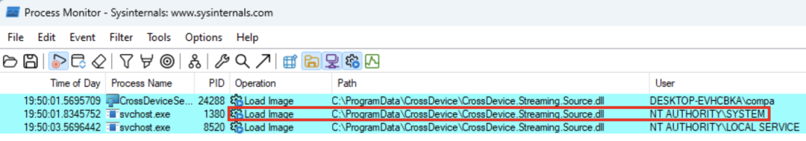
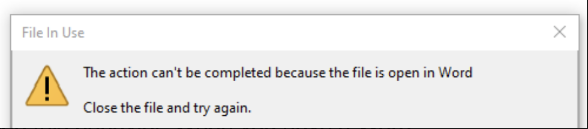
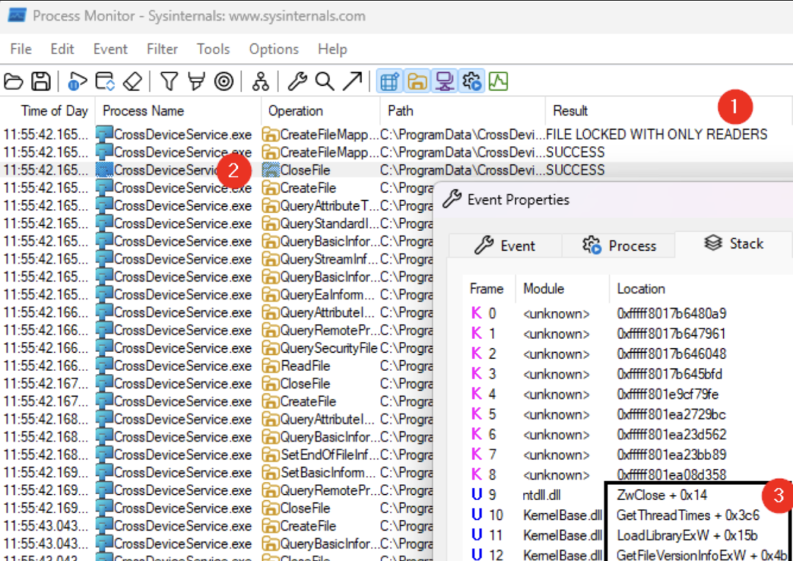

# DLL 劫持与 Hook 技术分析（CVE-2025-24076、CVE-2025-24994；竞态窗口与提权耗时分别记录）

<!-- vulwiki-editorial-rebuild:system-misc -->
## 条目范围与校订

- 本文对象：Windows11跨设备移动设备功能
- 文献类型：DLL加载竞态利用研究转载
- 版本、权限及部署边界：本地低权限触发移动摄像头组件安装，CrossDevice DLL可替换；24076 SYSTEM加载，24994跨用户加载
- 核验状态：仅重建文本校订；未执行文中代码、PoC 或扫描，未把截图或转载声明记为本站复现

### 具体结论与待核项

以下为原归档的逐项勘误与证据缺口；可由文本确定的问题已在下文订正，仍缺来源的事实保持待核。

1. 元数据仅24076，两个不同权限边界漏洞需独立实体并共享加载链
2. 标题300毫秒是竞态窗口非完整提权耗时，原文含3毫秒勘误应保留
3. C盘根创建文件不必然只有管理员，需以whoami实际身份输出证明；程序执行上下文与本地管理员/SYSTEM要区分
4. 点击此处查看hook代码无链接，原始Compass技术文未链接，缺完整PoC和测试OS/应用构建
5. 扫描结果仅ProgramData上可创建子目录不能单独证明现有DLL可写，具体安装时ACL和替换窗口须结合证据
6. 固定DLL导出/转发与Oplock/Detours经验有独立价值，保留MSRC两链接及披露时间线，补具体KB

### 操作风险

原文技术操作的实际副作用未复现核验；按其请求/代码评估状态变更、凭据暴露和业务影响

技术请求、代码与实验方法按原文保留；其中的破坏性动作仅限授权、可恢复的隔离环境。缺失代码、参数或版本事实不猜补。

### 来源追溯

- 原文参考链接（未重新核验）：<https://github.com/itm4n/PrivescCheck>
- 原文参考链接（未重新核验）：<https://github.com/googleprojectzero/symboliclink-testing-tools/tree/main/SetOpLock[1]>
- 原文参考链接（未重新核验）：<https://github.com/erocarrera/pefile>
- 原文参考链接（未重新核验）：<https://msrc.microsoft.com/update-guide/vulnerability/CVE-2025-24076[3]>
- 原文参考链接（未重新核验）：<https://msrc.microsoft.com/update-guide/vulnerability/CVE-2025-24994[4]>
- 原文参考链接（未重新核验）：<https://github.com/googleprojectzero/symboliclink-testing-tools/tree/main/SetOpLock:>
- 原始披露 URL 未确认；既有归档来源标签保留，不能替代原始公告

### 归档技术正文

JOHN OSTROWSKI  securitainment   2025-04-17 08:20  
  
> 300 Milliseconds to Admin Mastering DLL Hijacking and Hooking to Win the Race (CVE-2025-24076 and CVE-2025-24994)  
  
  
作为渗透测试人员，有时你会被分配到一些项目，完全不知道最终会发现什么。这个项目就是这样，客户提供了一台笔记本电脑，目标是"找到一些有趣的东西"，可能是客户端的某种错误配置。问题在于，提供的笔记本电脑被当作瘦客户端使用，主要用于访问远程桌面和浏览器，没有安装额外的软件。  
  
当拿到笔记本电脑时，我开玩笑地对我的经理说："所以我们要在一个工作日内找到 Windows 11 的漏洞？"结果证明——我们确实做到了（当然，实际花费的时间比我们最初计划的要长得多）。  
  
这篇博文讨论了 CVE-2025-24076，该漏洞允许攻击者通过利用众所周知的动态链接库（DLL）劫持技术，从低权限用户获取本地系统权限。博文还涵盖了作为副产品的 CVE-2025-24994。  
  
该漏洞已通过 Microsoft 的负责任披露计划报告，并已修复。  
## 起点  
  
像往常一样，我们开始进行常规检查，并运行了自动扫描工具，如 https://github.com/itm4n/PrivescCheck 这引起了我们的注意：>  
```
┏━━━━━━━━━━┳━━━━━━━━━━━━━━━━━━━━━━━━━━━━━━━━━━━━━━━━━━━━━━━━━━┓
┃ CATEGORY ┃ TA0004 - Privilege Escalation                    ┃
┃ NAME     ┃ COM server image file permissions                ┃
┣━━━━━━━━━━┻━━━━━━━━━━━━━━━━━━━━━━━━━━━━━━━━━━━━━━━━━━━━━━━━━━┫
┃ Check whether the current user has any modification rights  ┃
┃ on a COM server module file. This may not necessarily result┃
┃ in a privilege escalation. Further analysis is required.    ┃
┗━━━━━━━━━━━━━━━━━━━━━━━━━━━━━━━━━━━━━━━━━━━━━━━━━━━━━━━━━━━━━┛
[*] Status: Vulnerable - Medium
Id : {E9F83CF2-E0C0-4CA7-AF01-E90C70BEF496}
Path : HKLM\SOFTWARE\Classes\CLSID\{E9F83CF2-E0C0-4CA7-AF01-E90C70BEF496}
Value : InProcServer32
Data : %PROGRAMDATA%\CrossDevice\CrossDevice.Streaming.Source.dll
DataType : FilePath
ModifiablePath : C:\ProgramData
IdentityReference : VORDEFINIERT\Benutzer
Permissions : WriteAttributes, AddSubdirectory, WriteExtendedAttributes, AddFile

```  
  
上述 PrivescCheck 发现表明，权限较低的用户可能会修改可能被具有提升权限的 COM 服务器加载的 DLL 文件。然而，他们必须弄清楚如何触发 COM 服务器来执行此操作。  
  
我们在机器上没有找到任何相关的 COM 对象，但我们进一步调查了为什么会创建这个对象。事实证明，Windows 11 通过 Windows 设置附带了相对较新的"移动设备"功能。如果您还不知道，此功能允许用户将手机与 Windows 计算机关联，以发送消息、通过计算机拨打电话并访问图像。此外，它还允许用户将手机摄像头用作网络摄像头。就在这时，我们找到了突破口！  
  
在分析"移动设备"功能时，我们注意到一个用户可修改的 DLL 首先被普通用户 compa  
 加载，然后被高权限用户加载：  
  
  
  
由于动态链接库 (DLL) 允许将功能加载到正在运行的程序中，修改此文件可以让我们改变其行为并指示它执行我们想要的任何操作。由于普通用户可以修改 DLL 文件，并且随后由高权限用户执行，我们可以利用这一点在本地机器上获取管理员权限。  
  
通常，这种情况可以通过将 DLL 存储在低权限用户无法修改的位置或通过验证 DLL 的签名来确保它没有被更改来防止。DLL 位于用户可修改的位置，但它由 Microsoft 签名。幸运的是，加载 DLL 的进程没有验证签名。  
  
CVE-2025-24994 发生是因为用户进程未能验证加载的 DLL，可能会导致用户到用户的攻击。然而，更有趣的漏洞 CVE-2025-24076 涉及系统进程加载 DLL，将在下面讨论。  
  
找到这个功能是最困难的部分，因为利用这种类型的漏洞已经有详细的文档。然而，我们遇到了一些障碍，并使用了一些巧妙的技巧使这种攻击更加可靠。  
## 时机至关重要  
  
我们的第一个想法是简单地覆盖文件并用我们自己的程序替换它。然而，这比说起来要难得多。如上面的截图所示，我们只有 300 毫秒的时间窗口来用我们的恶意版本替换文件。（有趣的是，由于我的虚拟机 (VM) 有时非常慢，我能够使用可靠的快捷键 CTRL-C 和 CTRL-V 手动完成这个操作几次。）  
  
然而，我们显然不能依赖于慢速 VM，所以我们必须想出一个技巧来减缓操作。幸运的是，James Forshaw 发现我们可以在文件上使用机会锁（Opportunistic Lock）(  
https://github.com/googleprojectzero/symboliclink-testing-tools/tree/main/SetOpLock[1]  
) 来暂停程序的执行。只有在我们移除锁定后，程序才能继续。  
  
我们现在可以在访问 DLL 时暂停程序，但我们很快遇到了下一个问题：在文件打开时覆盖文件是不允许的。  
## 使用 Detours 拦截 WinAPI  
  
您可能已经体验过这种行为。当您打开 Word 文档（或类似文件）并尝试覆盖它时，通常会看到以下警告：  
  
  
  
这是由于 Windows 的限制，防止在其他程序已经打开文件时覆盖文件（请注意，此行为取决于文件句柄的 ShareMode  
，可能并不总是适用）。  
  
因此，我们的时间框架实际上比 300 毫秒小得多，因为大部分时间文件被阻止覆盖。这里的技巧是等到文件不再被另一个进程使用。在我们的概念验证中，我们拦截了用户应用程序 CrossDeviceService.exe  
 中的 Close  
 操作调用。因此，我们只需等待轮到我们，直到程序完成，然后覆盖文件。  
  
查看我们当前的情况，我们可以观察到以下几点：  
- ① 文件被锁定，只允许其他程序读取，但不允许修改或覆盖它。  
  
- ② 文件最终将被关闭。  
  
- 更详细地检查 Close ② 操作，我们可以确定为什么首先打开文件。具体来说，我们看到调用了 GetFileVersionInfoExW  
 ③ 来检索有关文件的信息。  
  
  
  
现在的想法是拦截 GetFileVersionInfoExW  
 函数，等待文件关闭，然后用我们的恶意版本覆盖它。  
  
Microsoft 提供了一个强大的软件库 Detours，它使拦截 Windows API 调用变得容易。这不仅对调试 Windows 应用程序有用，还允许我们利用我们发现的漏洞。  
  
我们编写了一个小程序，拦截调用并用我们的自定义功能替换它。  
  
对于那些对技术感兴趣的人，您可以点击此处查看代码。  
  
然后，我们将此代码加载到用户进程中，如果一切顺利，我们会在短暂的时间窗口内用我们的恶意代码替换 DLL。我们不再依赖持续不到 300 毫秒的竞争条件，而是将漏洞利用转变为每次都能可靠工作的方法。不需要祈求演示之神的眷顾！  
## 继续正常操作  
  
我们还没有完成；程序假设在加载 DLL 时实现了相关函数。如果我们简单地用授予管理员权限的恶意 DLL 替换原始 DLL，程序将崩溃，因为原始 DLL 函数不再存在。  
  
因此，我们需要创建一个代理，拦截程序的请求并将其转发到原始函数。  
  
原始 DLL 暴露了两个函数 DllCanUnloadNow  
 和 DllGetClassObject  
：  
```
# https://github.com/erocarrera/pefile
$ readpe CrossDevice.Streaming.Source.dll

Exported functions
    Library
        Name:                            CrossDevice.Streaming.Source.dll
        Functions
            Function
                Ordinal:                         1
                Address:                         0x12c0
                Name:                            DllCanUnloadNow
            Function
                Ordinal:                         2
                Address:                         0x13a0
                Name:                            DllGetClassObject

```  
  
通过以下定义文件，我们可以指定我们的恶意版本暴露两个具有相同名称的函数，并在内部将函数调用传递给原始文件 target_original  
。  
```
EXPORTS
DllCanUnloadNow=target_original.DllCanUnloadNow @1 
DllGetClassObject=target_original.DllGetClassObject @2

```  
  
现在我们可以编译我们的恶意 DLL，它将直接在 C:  
 目录中创建一个新文件，使用命令 gcc -shared -o poc.dll malicious.c malicious.def  
。  
```
#include <windows.h>
BOOL APIENTRY DllMain(HMODULE hModule, DWORD ul_reason_for_call, LPVOID lpReserved) {
 switch (ul_reason_for_call) {
  case DLL_PROCESS_ATTACH:
   system("whoami >> C:\\poc_only_admin_can_write_to_c.txt");
 }
 return TRUE;
}

```  
## 整合所有步骤  
  
通过上述技巧，我们能够触发漏洞并在 Windows 11 机器上获得管理员权限：  
1. 以低权限用户身份触发"移动设备"网络摄像头功能的安装。  
  
1. 等待 DLL 关闭，以便我们可以用恶意 DLL 替换它。  
  
1. 最终，我们可以看到高权限系统用户在 C:  
 位置创建了我们的文件。只有高权限用户才能写入该目录。  
  
## 总结与要点  
  
本文解释了我们如何通过利用 Windows 11 功能中的一个弱点，在最新的 Windows 11 机器上获得本地管理员权限。  
  
幸运的是，Microsoft 已经修复了这个漏洞，您只需要继续安装 Windows 更新即可。  
  
虽然保持系统更新是至关重要的，但您还可以采取其他步骤来保护您的机器。通过使用端点检测和响应（EDR）解决方案，您可以主动检测异常行为并识别不规则活动。即使漏洞尚未修补，这些工具也可能帮助您及早发现威胁并保持领先一步。  
  
附：如果您收到此类指标，请不要忘记实际收集相关信息并采取行动。我们过去发布了一篇博文，帮助您的 EDR 团队更上一层楼，您可以通过以下链接找到：  
Hitchhiker's Guide to Managed Security – Compass Security Blog[2]  
。  
## 披露时间线  
  
2024-09-20：发现   
  
2024-10-07：初步供应商通知   
  
2024-10-08：供应商初步回应   
  
2025-03-11：发布修复版本/补丁   
  
2025-04-15：协调公开披露日期  
  
Microsoft 公告： –   
https://msrc.microsoft.com/update-guide/vulnerability/CVE-2025-24076[3]  
–   
https://msrc.microsoft.com/update-guide/vulnerability/CVE-2025-24994[4]  
## 勘误  
  
在本文的早期版本中，我们声称此攻击的时间框架为 3 毫秒，而不是第一张截图中显示的 300 毫秒。感谢一位眼尖的读者指出这个错误。  
## 参考资料  
  
[1]   
https://github.com/googleprojectzero/symboliclink-testing-tools/tree/main/SetOpLock: https://github.com/googleprojectzero/symboliclink-testing-tools/tree/main/SetOpLock  
  
[2]   
Hitchhiker's Guide to Managed Security – Compass Security Blog: https://blog.compass-security.com/2025/01/hitchhikers-guide-to-managed-security/  
  
[3]   
https://msrc.microsoft.com/update-guide/vulnerability/CVE-2025-24076: https://msrc.microsoft.com/update-guide/vulnerability/CVE-2025-24076  
  
[4]   
https://msrc.microsoft.com/update-guide/vulnerability/CVE-2025-24994: https://msrc.microsoft.com/update-guide/vulnerability/CVE-2025-24994  
  
  


---

> 来源：gelusus/wxvl（微信公众号漏洞文章自动归档，原始披露 URL 尚未确认，现有链接按来源追溯区分别标注）
