# CVE-2013-0750详细分析

<!-- vulwiki-editorial-rebuild:system-misc -->
## 条目范围与校订

- 本文对象：Mozilla Firefox SpiderMonkey字符串替换
- 文献类型：缺代码的历史Firefox调试分析
- 版本、权限及部署边界：Windows7 x86、Firefox17源码debug与VS2010实验；声称Firefox18前所有版本，实际分支需核验
- 核验状态：仅重建文本校订；未执行文中代码、PoC 或扫描，未把截图或转载声明记为本站复现

### 具体结论与待核项

以下为原归档的逐项勘误与证据缺口；可由文本确定的问题已在下文订正，仍缺来源的事实保持待核。

1. PoC和多处断点/汇编代码围栏为空，关键证据只截图，无法按正文复现
2. mozconfig所有选项和cd/make命令粘连不可运行；未给源码/工具具体下载来源与哈希
3. 字符串替换说明出现替换字符与重复句，x/rep示例及实际乘积关系需恢复
4. 将参数从2^16改2^17同样崩溃不足以证明所有大字符串普适；应明确32位溢出计算和内存限制
5. 没有Mozilla原始安全公告/补丁，作者主页不能替代原技术文章；保留独立调用链与调试观察

### 操作风险

将参数从2^16改2^17同样崩溃不足以证明所有大字符串普适；应明确32位溢出计算和内存限制

技术请求、代码与实验方法按原文保留；其中的破坏性动作仅限授权、可恢复的隔离环境。缺失代码、参数或版本事实不猜补。

### 来源追溯

- 原文参考链接（未重新核验）：<https://bbs.kanxue.com/user-home-971539.htm>
- 原文参考链接（未重新核验）：<http://mp.weixin.qq.com/s?__biz=MjM5NTc2MDYxMw==&mid=2458531931&idx=1&sn=a2e067d472b7fd5420aefa695255890a&chksm=b18d08d186fa81c7c42d0cb8493d548f3129aae790f33b1a981ab03273a6e557deb921fbdaeb&scene=21#wechat_redirect>
- 原文参考链接（未重新核验）：<https://mp.weixin.qq.com/s?__biz=MjM5NTc2MDYxMw==&mid=2458528996&idx=1&sn=87d4e209d548bfc47208563edfa3b23b&scene=21#wechat_redirect>
- 原文参考链接（未重新核验）：<https://mp.weixin.qq.com/s?__biz=MjM5NTc2MDYxMw==&mid=2458528916&idx=1&sn=8b47dbc44f3f2bf79428209fffa5a650&scene=21#wechat_redirect>
- 原文参考链接（未重新核验）：<https://mp.weixin.qq.com/s?__biz=MjM5NTc2MDYxMw==&mid=2458528881&idx=1&sn=b788c56ab84467832a26388f8c0d8aec&scene=21#wechat_redirect>
- 原文参考链接（未重新核验）：<https://mp.weixin.qq.com/s?__biz=MjM5NTc2MDYxMw==&mid=2458528787&idx=1&sn=947b0b7f9ade1cbf249f29ee345237e3&scene=21#wechat_redirect>
- 原始披露 URL 未确认；既有归档来源标签保留，不能替代原始公告

### 归档技术正文

zer0_o  看雪学苑   2023-12-26 17:59  
  
前言  
  
  
该漏洞属于一个整数溢出漏洞，影响范围波及firefox18.0之前的所有版本。对该漏洞的分析参考了《漏洞战争》。  
  
# 漏洞成因  
  
  
火狐浏览器的javascript引擎在进行字符串的正则替换时由于过大的字符串导致的申请空间大小过大造成整数溢出，使得实际上申请了极小的空间造成了溢出。  
  
# 环境配置  
  
  
由于火狐浏览器属于开源软件，因此这里直接下载源码进行编译。  
  
环境：windows 7 32位 Ultimate版Visual Studio 2010  
  
编译步骤：  
  
1.在32位win7环境中首先点击MozillaBuildSetup-1.7.exe，（我之后的mozilla-build和mozilla-release两个文件夹都位于D盘根目录下），安装完成后将会在D:\下生成mozilla-build文件夹。  
  
2.使用7-zip（不要使用WinRAR等解压）解压firefox-17.0.source.tar.bz2，要解压两次，直到出现mozilla-release文件夹，并将其移动至D:\下。  
  
3.用记事本打开D:\mozilla-release\xulrunner\config下的mozconfig文件并修改其内容为：ac_add_options --enable-application=browserac_add_options --enable-debugac_add_options --enable-testsac_add_options --disable-webgl之后复制mozconfig到mozilla-build\和mozilla-release\两个路径下（mozconfig中若是加上ac_add_options -trace-malloc后make编译时总是会提示没有这个选项，所以这里将其去掉）。  
  
4.由于这里使用的是VS2010，所以点击mozilla-build下的start-msvc10.bat，之后依次输入：cd d:cd mozilla-releasemake -f client.mk build  
  
  
之后就是漫长的等待时间（我这里等待了近4个小时）。  
  
结束后会出现：  
  
  
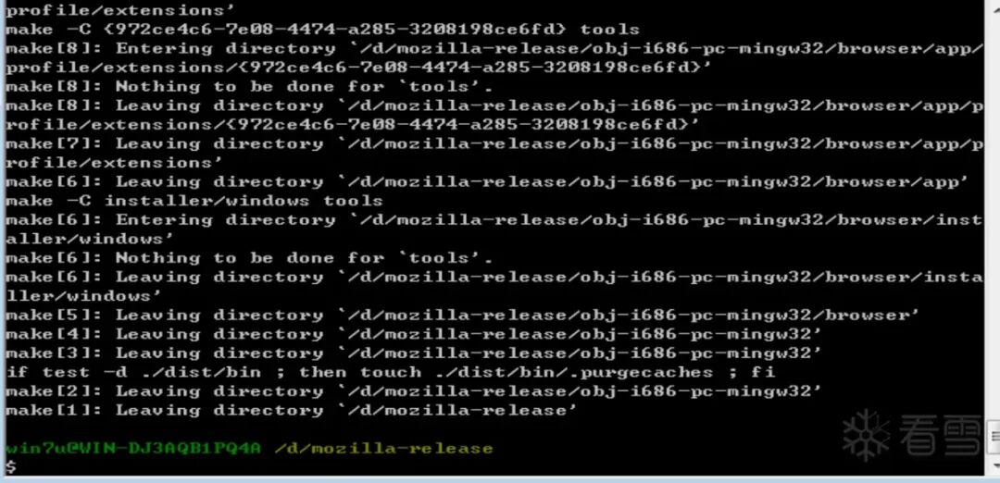  
  
  
这时可以去D:\mozilla-release\obj-i686-pc-mingw32\dist\bin下点击firefox.exe执行。  
  
若打开后出现以下场景则成功编译。  
  
  
  
#   
# POC分析  
  
  
> 原文此处代码块为空，内容未归档；无法从空块证明或复现所述结果。
  
  
  
这里举个例子解释一下，比如说x="11111"，而rep="111",那么y最终会等于"1111111111",即1的个数就是最终拼接的字符串里�代表的字符串的个数，以上例子中由于有两个1的个数就是最终拼接的字符串里x代表的字符串的个数，以上例子中由于有两个1，所以由两个x拼接而成"1111111111"在这个poc中由于x中1的个数为1<<20,且$1的个数为1<<16，那么这里就可以理解为超大数额。  
  
# 漏洞调试  
  
  
点击刚刚的firefox.exe，并使用windbg附加进程，之后ctrl+s输入符号表，再ctrl+p输入mozilla-release文件夹的路径后，输入g继续运行，在firefox中打开poc.html。  
  
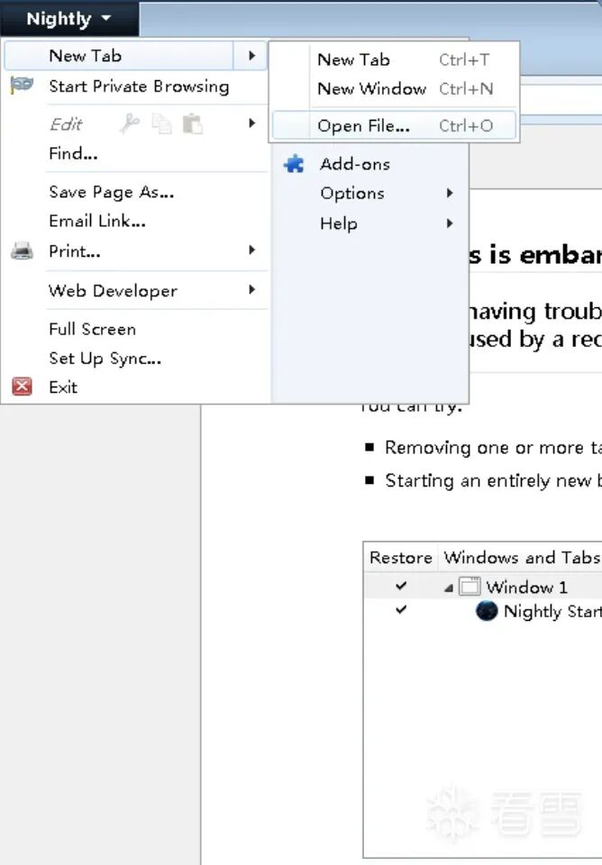  
  
  
之后程序会被异常中断，发现漏洞触发点位于Vector函数中。  
  
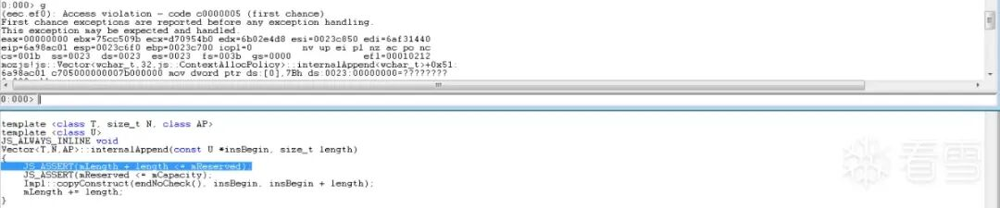  
  
  
使用kb命令查看栈回溯（由于有源码所以会显示调用点具体位于哪个文件的哪一行，注意实际要为显示的行的上一行）。  
  
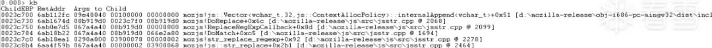  
  
  
发现函数调用链为ReplaceRegExpCallback->DoReplace->Vector由于有源码，所以直接查看mozilla-release\js\src\jsstr.cpp的2067行。  
  
  
  
  
说明是和rdata.sb有关，向上查看代码发现DoReplace中没有相关rdata.sb相关空间操作的代码，于是查看ReplaceRegExpCallback函数。  
  
  
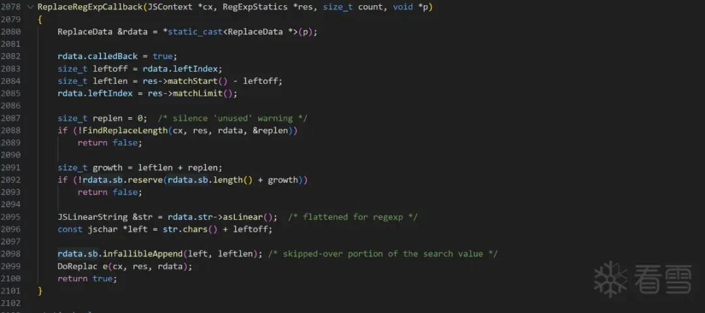  
  
  
而rdata.sb的sb实际是StringBuffer的缩写，查看相关文档可知StringBuffer类的操作空间的函数包含reserve，于是重点分析ReplaceRegExpCallback中的rdata.sb.reserve。  
  
重新附加进程进行动态调试，  
并在ReplaceRegExpCallback处设置断点。  
  
首先依旧按照上面步骤点击刚刚的firefox.exe，并使用windbg附加进程，之后ctrl+s输入符号表后输入。  
  
  
> 原文此处代码块为空，内容未归档；无法从空块证明或复现所述结果。
  
  
  
之后可能要输入多次g，直到可以在浏览器打开poc.html，断下后按p运行并观察源码页看看，看看是否停止在：  
  
  
> 原文此处代码块为空，内容未归档；无法从空块证明或复现所述结果。
  
  
  
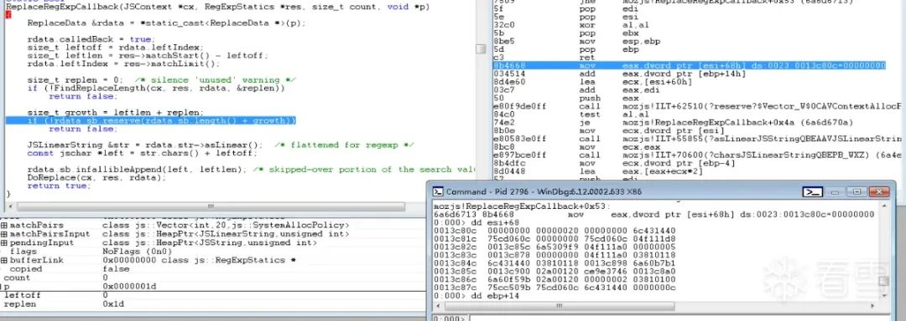  
  
  
这里可以看出[esi+68h]的内容为0，且[ebp+14h]不为0，这里判断出growth为0，向上回溯growth可知growth来源于replen。  
  
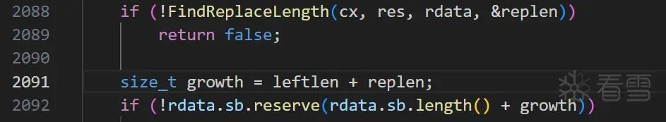  
  
  
对于replen又来源于FindReplaceLength函数，遂分析FindReplaceLength函数。  
  
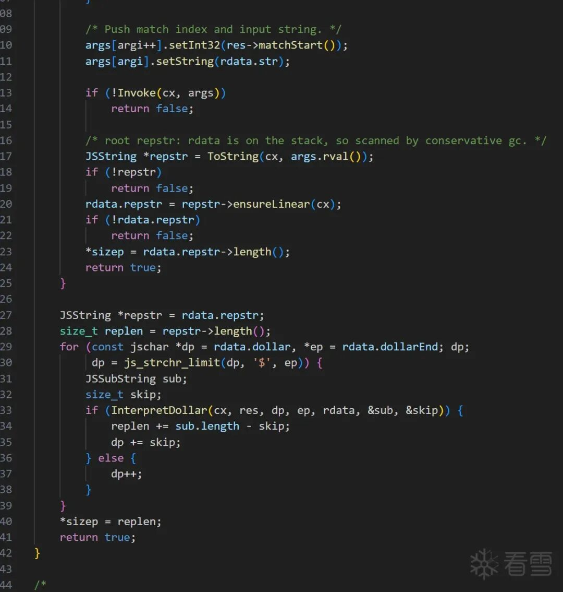  
  
  
对该函数的源码分析可知，该函数有多个分支点，于是动态调试该函数重新附加进程，依旧在ReplaceRegExpCallback处设置断点，并单步执行至FindReplaceLength函数内部，多次p单步执行后发现对于该漏洞，执行在FindReplaceLength的最后一个分支。  
  
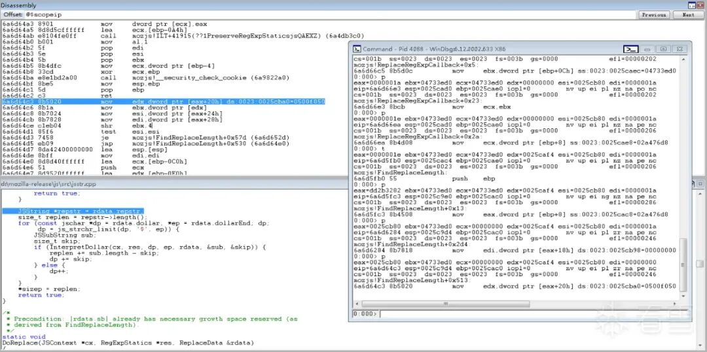  
  
  
分析该段代码，由于已知这是整数溢出漏洞，于是重点关注。  
  
  
> 原文此处代码块为空，内容未归档；无法从空块证明或复现所述结果。
  
  
  
这段代码对应的汇编代码为：  
  
> 原文此处代码块为空，内容未归档；无法从空块证明或复现所述结果。
  
  
  
重新调试，当单步运行到：  
  
> 原文此处代码块为空，内容未归档；无法从空块证明或复现所述结果。
  
  
  
打开反汇编窗口查找到上面所述的汇编代码。  
  
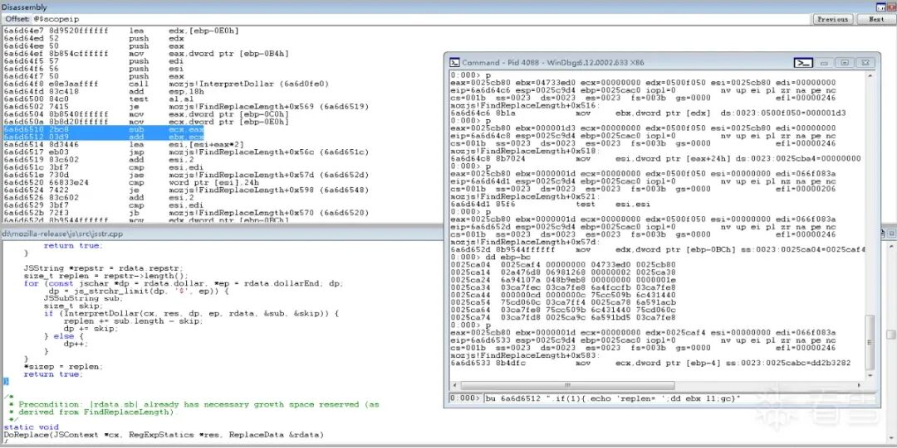  
  
  
设置条件断点：  
  
> 原文此处代码块为空，内容未归档；无法从空块证明或复现所述结果。
  
  
  
6ac96514代表着add ebx,ecx后面一条指令的位置。  
  
接着  
  
> 原文此处代码块为空，内容未归档；无法从空块证明或复现所述结果。
  
  
  
删除刚刚的ReplaceRegExpCallback的断点，接着g运行就会发现：  
  
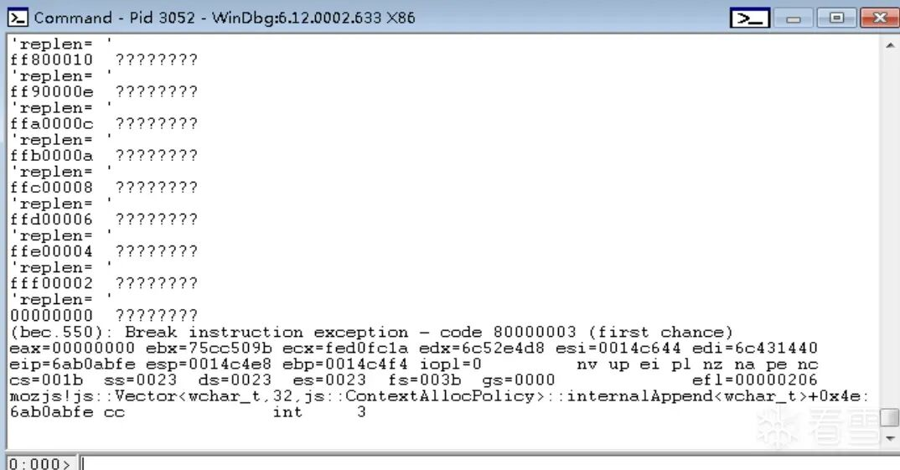  
  
  
replen会已知递增，最终replen会等于00000000，（由于条件断点设置的是dd ebx l1，所以右边的内存内容忽略不要管，递增看左边数据）因此最终造成申请的空间过小，复制内容过大造成溢出。  
  
# 关于POC  
  
  
可以尝试修改poc中rep = puff(rep, 1<<16);这里我修改为rep = puff(rep, 1<<17);  
  
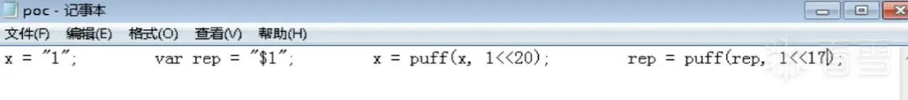  
  
  
再次调试发现结果相同，说明该poc的替换字符串的超大概念具有普适性。  
  
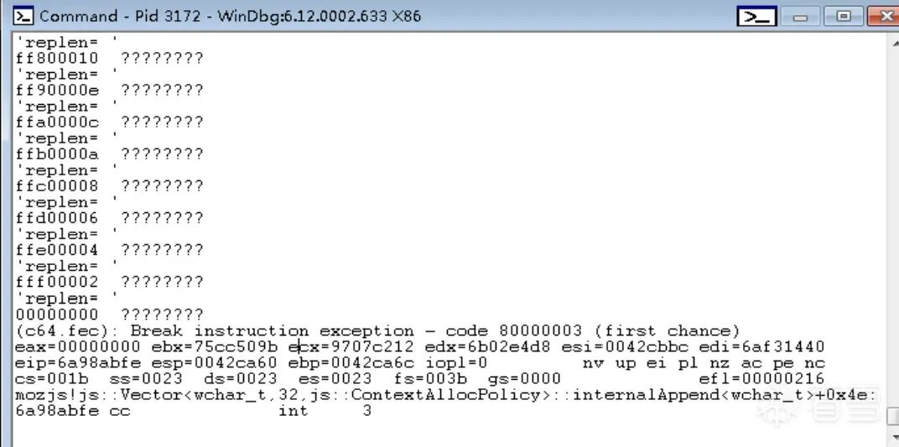  
  
  
  
  
  
  
  
**看雪ID：zer0_o**  
  
https://bbs.kanxue.com/user-home-971539.htm  
  
*本文为看雪论坛优秀文章，由 zer0_o 原创，转载请注明来自看雪社区  
  
  
  
  
  
**#****往期推荐**  
  
1、[2023 SDC 议题回顾 | 芯片安全和无线电安全底层渗透技术](https://mp.weixin.qq.com/s?__biz=MjM5NTc2MDYxMw==&mid=2458528996&idx=1&sn=87d4e209d548bfc47208563edfa3b23b&scene=21#wechat_redirect)  
  
  
2、[SWPUCTF 2021 新生赛-老鼠走迷宫](https://mp.weixin.qq.com/s?__biz=MjM5NTc2MDYxMw==&mid=2458528916&idx=1&sn=8b47dbc44f3f2bf79428209fffa5a650&scene=21#wechat_redirect)  
  
  
3、[OWASP 实战分析 level 1](https://mp.weixin.qq.com/s?__biz=MjM5NTc2MDYxMw==&mid=2458528881&idx=1&sn=b788c56ab84467832a26388f8c0d8aec&scene=21#wechat_redirect)  
  
  
4、[【远控木马】银狐组织最新木马样本-分析](https://mp.weixin.qq.com/s?__biz=MjM5NTc2MDYxMw==&mid=2458528787&idx=1&sn=947b0b7f9ade1cbf249f29ee345237e3&scene=21#wechat_redirect)  
  
  
5、[自研Unidbg trace工具实战ollvm反混淆](https://mp.weixin.qq.com/s?__biz=MjM5NTc2MDYxMw==&mid=2458528764&idx=1&sn=763f334b243afadb238cb5bb15bfce29&scene=21#wechat_redirect)  
  
  
6、[2023 SDC 议题回顾 | 深入 Android 可信应用漏洞挖掘](https://mp.weixin.qq.com/s?__biz=MjM5NTc2MDYxMw==&mid=2458528715&idx=1&sn=627dc9f855b26a2b12023ae265d144bf&scene=21#wechat_redirect)  
  
  
  
  
  
  
  
  
  
**球分享**  
  
  
  
**球点赞**  
  
  
  
**球在看**  
  

---

> 来源：gelusus/wxvl（微信公众号漏洞文章自动归档，原始披露 URL 尚未确认，现有链接按来源追溯区分别标注）
