# CVE-2019-13288复现笔记及其国产化pdf生成挖掘

<!-- vulwiki-editorial-rebuild:system-misc -->
## 条目范围与校订

- 本文对象：Xpdf pdftotext
- 文献类型：fuzz入门及崩溃实验
- 版本、权限及部署边界：Linux/WSL、Xpdf3.02实际构建而概述写4.01.01；处理变异PDF导致进程崩溃
- 核验状态：仅重建文本校订；未执行文中代码、PoC 或扫描，未把截图或转载声明记为本站复现

### 具体结论与待核项

以下为原归档的逐项勘误与证据缺口；可由文本确定的问题已在下文订正，仍缺来源的事实保持待核。

1. 对3.02的segfault没有堆栈/根因/补丁对照，不能确认就是4.01.01描述的13288无限递归
2. 国产软件仅产生种子PDF，后续崩溃的是Xpdf解析器，不能称国产PDF生成器存在漏洞
3. 初始cd..在HOME下载源码，后续cd fuzzing_xpdf/xpdf-3.02路径不一致；apt命令和代码围栏粘连
4. AFL插桩失败改-n无反馈模式应明确能力差异，8个crash不等于8独立漏洞；缺样本哈希、最小化、调用栈和ASAN结果
5. 没有修复版/原始CVE来源；保留失败调试经验但重命名为探索记录

### 操作风险

国产软件仅产生种子PDF，后续崩溃的是Xpdf解析器，不能称国产PDF生成器存在漏洞

技术请求、代码与实验方法按原文保留；其中的破坏性动作仅限授权、可恢复的隔离环境。缺失代码、参数或版本事实不猜补。

### 来源追溯

- 原文参考链接（未重新核验）：<https://dl.xpdfreader.com/old/xpdf-3.02.tar.gz>
- 原文参考链接（未重新核验）：<https://github.com/mozilla/pdf.js-sample-files/raw/master/helloworld.pdf>
- 原文参考链接（未重新核验）：<http://www.africau.edu/images/default/sample.pdf>
- 原文参考链接（未重新核验）：<https://www.melbpc.org.au/wp-content/uploads/2017/10/small-example-pdf-file.pdf>
- 原文参考链接（未重新核验）：<https://github.com/AFLplusplus/AFLplusplus>
- 原始披露 URL 未确认；既有归档来源标签保留，不能替代原始公告

### 归档技术正文

原创 秋风  秋风的安全之路   2024-12-11 06:11  
  
CVE-2019-13288复现  
简述在 Xpdf 4.01.01 中 Parser.cc 中的 Parser::getObj() 函数可能会通过精心设计的文件导致无限递归 远程攻击者可以利用它进行 DoS 攻击  
Download and build your target

```
cd $HOME # 创建目录
mkdir fuzzing_xpdf && cd fuzzing_xpdf/
sudo apt install build-essential
cd ..
wget https://dl.xpdfreader.com/old/xpdf-3.02.tar.gz # 获取xpdf
tar -xvzf xpdf-3.02.tar.gz
cd xpdf-3.02 # 编译&安装xpdf
sudo apt update && sudo apt install -y build-essential gcc
./configure --prefix="$HOME/fuzzing_xpdf/install/"
make
make install
cd $HOME/fuzzing_xpdf # 下载一些PDF示例
mkdir pdf_examples && cd pdf_examples

wget https://github.com/mozilla/pdf.js-sample-files/raw/master/helloworld.pdf
wget http://www.africau.edu/images/default/sample.pdf
wget https://www.melbpc.org.au/wp-content/uploads/2017/10/small-example-pdf-file.pdf
```  
  
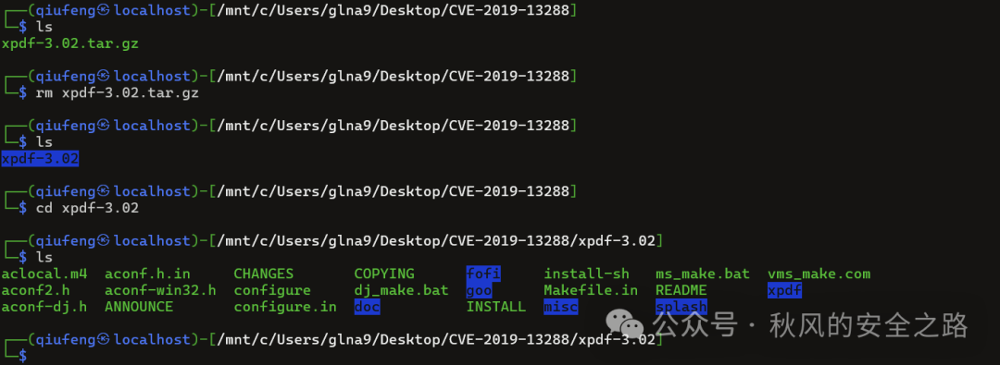  
  
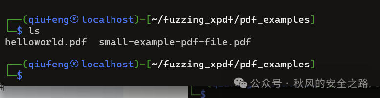  
-box 要求显示 PDF 文件中每一页的边框框架-meta 表示显示 PDF 文件的元数据  
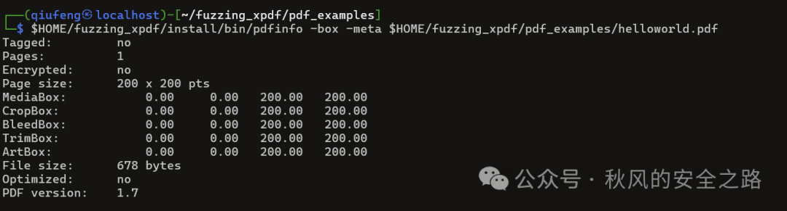  
安装 AFL + + fuzzer 的最新版本sudo apt-get updatesudo apt-get install -y build-essential python3-dev automake git flex bison libglib2.0-dev libpixman-1-dev python3-setuptoolssudo apt-get install -y lld-11 llvm-11 llvm-11-dev clang-11 || sudo apt-get install -y lld llvm llvm-dev clang sudo apt-get install -y gcc-$(gcc --version|head -n1|sed 's/.* //'|sed 's/\..*//')-plugin-dev libstdc++-$(gcc --version|head -n1|sed 's/.* //'|sed 's/\..*//')-dev检验和构建AFL++

```
cd $HOME
git clone https://github.com/AFLplusplus/AFLplusplus && cd AFLplusplus
export LLVM_CONFIG="llvm-config-11"
make distrib
sudo make install
```  
AFL-Fuzz 简介AFL（American Fuzzy Lop）是一种现代化的模糊测试（Fuzzing）工具，专为发现程序中的安全漏洞和崩溃设计。afl-fuzz 是 AFL 的核心部分，负责对目标程序进行模糊测试。Fuzzing 是一种通过向程序输入随机或半随机数据，观察程序的行为是否异常（如崩溃或未处理的错误）的技术。AFL-Fuzz 在此基础上进行了增强，支持高效的输入生成和路径发现。常见应用案例漏洞发现PDF/图片处理工具模糊测试协议模糊测试然后试运行afl-fuzz  
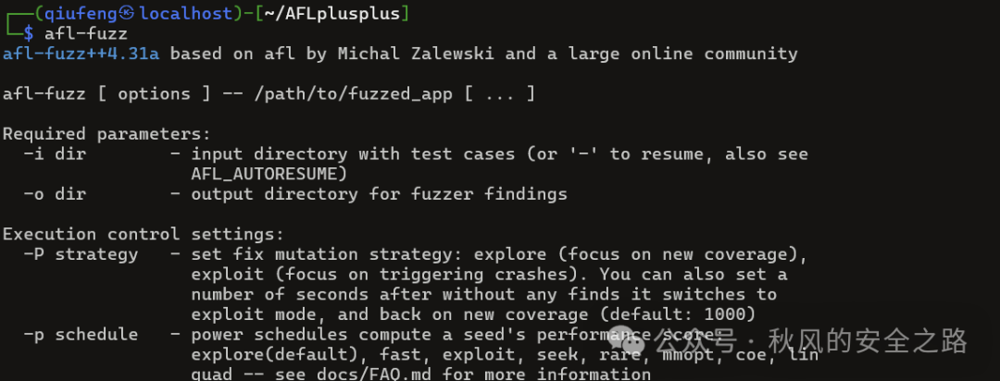  
  
Meet AFL++AFL++ 简介AFL++ 是 AFL（American Fuzzy Lop）的增强版本，由社区开发和维护。它基于原版 AFL，并加入了大量现代化特性和改进，进一步提升了模糊测试（fuzzing）的效率和灵活性。AFL++ 不仅保留了原版 AFL 的优秀特性（如智能输入生成和代码覆盖反馈机制），还引入了新功能以支持更多的目标和更高效的模糊测试。

```
rm -r $HOME/fuzzing_xpdf/install
cd $HOME/fuzzing_xpdf/xpdf-3.02/
make clean
```  
现在我们将使用afl-clang-fast 编译器构建 xpdf:

```
export LLVM_CONFIG="llvm-config-11"
CC=$HOME/AFLplusplus/afl-clang-fast CXX=$HOME/AFLplusplus/afl-clang-fast++ ./configure --prefix="$HOME/fuzzing_xpdf/install/"
make
make install
```  
运行fuzzerafl-fuzz -i $HOME/fuzzing_xpdf/pdf_examples/ -o $HOME/fuzzing_xpdf/out/ -s 123 -- $HOME/fuzzing_xpdf/install/bin/pdftotext @@ $HOME/fuzzing_xpdf/output发现报错  
  
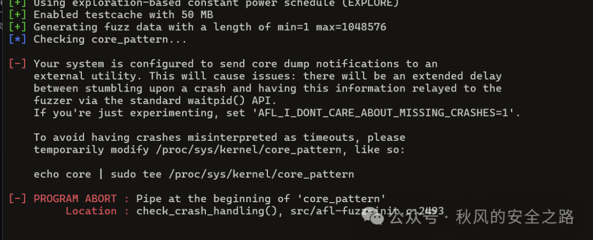  
  
改了一堆东西发现不行  
  
我们非插桩跑吧  
```
afl-fuzz -n -i $HOME/fuzzing_xpdf/pdf_examples/ -o $HOME/fuzzing_xpdf/out/ -s 123 -- $HOME/fuzzing_xpdf/install/bin/pdftotext @@ $HOME/fuzzing_xpdf/output
```  
效果看起来还行5分钟8崩溃了  
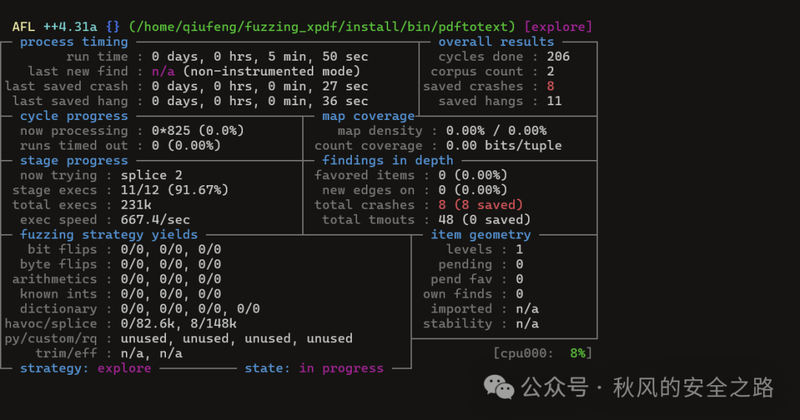  
断掉  
  
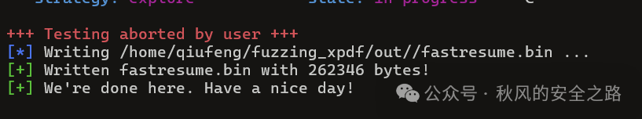  
  
然后找到\wsl.localhost\kali-linux\mnt\wslg\distro\home\qiufeng\fuzzing_xpdf\out\crashes  
  
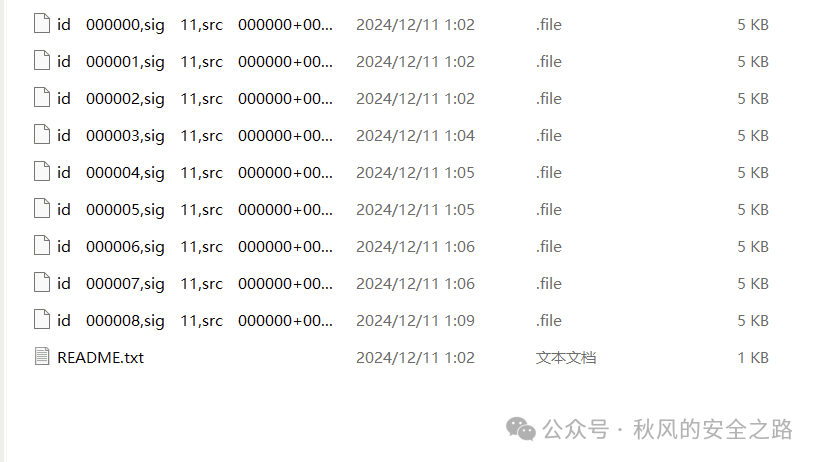  
  
然后  
```
$HOME/fuzzing_xpdf/install/bin/pdftotext 'id:000000,sig:11,src:000000+000001,time:37954,execs:24267,op:splice,rep:25' $HOME/fuzzing_xpdf/output
```  
  
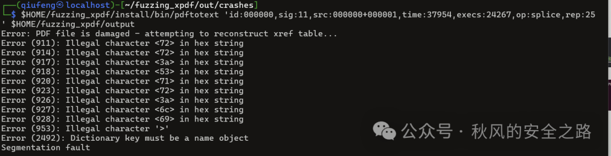  
  
  
ok确实导致pdftotext  
段错误从而崩溃  
然后用国产生成一个pdf  
  
  
然后fuzz  
  
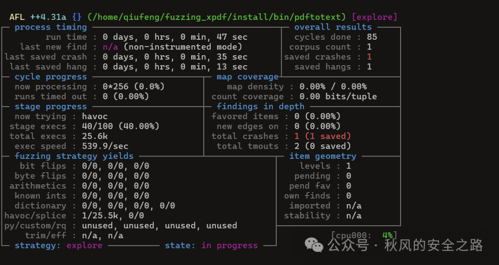  
  
```
$HOME/fuzzing_xpdf/install/bin/pdftotext 'id:000000,sig:11,src:000000,time:11835,execs:6529,op:havoc,rep:25' $HOME/fuzzing_xpdf/output
```  
  
  
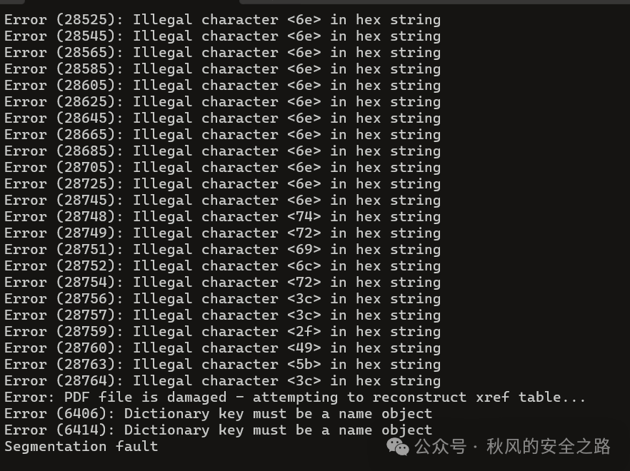  
  
OK也崩溃了  
  
  


---

> 来源：gelusus/wxvl（微信公众号漏洞文章自动归档，原始披露 URL 尚未确认，现有链接按来源追溯区分别标注）
