# CVE-2022-22583和CVE-2022-32800技术分析

<!-- vulwiki-editorial-rebuild:system-misc -->
## 条目范围与校订

- 本文对象：macOS PackageKit system_installd
- 文献类型：双SIP绕过技术分析转载
- 版本、权限及部署边界：本地已有root/安装Apple签名PKG与可操控临时或DMG卷路径；22583竞态两方法，32800不受保护SandboxState
- 核验状态：仅重建文本校订；未执行文中代码、PoC 或扫描，未把截图或转载声明记为本站复现

### 具体结论与待核项

以下为原归档的逐项勘误与证据缺口；可由文本确定的问题已在下文订正，仍缺来源的事实保持待核。

1. 元数据只22583需两实体；挂载与符号链接两方法属于同22583，不应拆两个CVE
2. 必须前置已root但无SIP特权，不能当普通用户直接提权或网络RCE；安装sandbox不是App Sandbox逃逸同义词
3. GitHub完整PoC和视频都提到但链接缺失，关键补丁源码仅截图；Trend Micro原始分析可追溯
4. .ssandbox与前文.sandbox、pKInstallSandox路径拼写及CVE-2022 2-32800明显排版错误
5. 22583只修复日期、32800只12.5缺各受影响/修复分支，补Apple公告；NSSecureCoding并不保证对象成员可信的独立经验应保留

### 操作风险

原文技术操作的实际副作用未复现核验；按其请求/代码评估状态变更、凭据暴露和业务影响

技术请求、代码与实验方法按原文保留；其中的破坏性动作仅限授权、可恢复的隔离环境。缺失代码、参数或版本事实不猜补。

### 来源追溯

- 原文参考链接（未重新核验）：<https://www.trendmicro.com/en_us/research/22/l/a-technical-analysis-of-cve-2022-22583-and-cve-2022-32800.html>
- 原始披露 URL 未确认；既有归档来源标签保留，不能替代原始公告

### 归档技术正文

gejigeji  嘶吼专业版   2023-02-15 12:00  
  
  
  
我们会在本文详细介绍如何使用不同的方法利用CVE-2022-22583的技术细节。我们还在本报告中讨论了CVE-2022-32800的技术细节。  
  
2022年1月26日，苹果公司修复了PackageKit框架中的系统完整性保护(SIP)绕过漏洞，该漏洞被识别为CVE-2022-22583。  
  
Perception Point发布了一篇关于该漏洞及其利用细节的文章后，我们确定我们利用该漏洞的方法与他们的不同。在深入挖掘CVE-2022-22583之后，我们还发现了一个新的漏洞CVE-2022-32800。  
  
这篇文章讨论了我们如何使用不同的方法利用CVE-2022-22583的技术细节。关于SIP和特殊守护进程服务的权利的更多详细信息可以在我们上个月的文章中找到。我们还会讨论在2022年社区力量安全会议（POC2022）期间向苹果披露的15个以上关键SIP绕过漏洞中的几个。  
  
  
      

    CVE-2022-22583     
  
    CVE-2022-22583的安全漏洞  
  
我们通过进程监控发现了这个漏洞。当我们将apple签名的软件安装包(PKG)文件安装到root volume时，我们注意到以下脚本是由特权“system_install”服务生成的：  
  
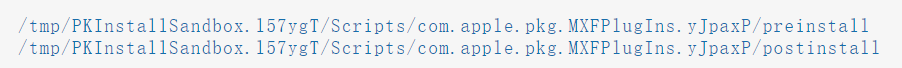  
  
因为“system_installd”服务具有特殊的“com.apple.rootless.install.heritable”权限，所以这两个脚本将在SIP绕过上下文中执行。  
  
在看到这两个脚本位于“/tmp/PKInstallSandbox.l57ygT”目录后，我想到了以下问题：  
  
我们可以修改临时位置内的脚本吗？  
  
谁创建了带有随机后缀的临时文件夹“PKInstallSandbox”？  
  
新创建的文件夹是否受SIP保护？  
  
在这些问题的启发下，我们开始了调查。  
  
通过反转和调试，我们发现临时文件夹是由" -[PKInstallSandbox prepareForCommitReturningError:] "函数创建的：  
  
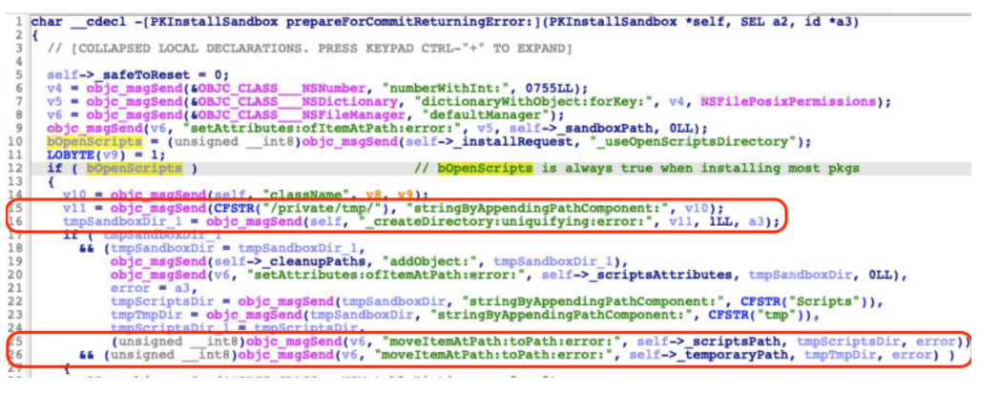  
  
“prepareForCommitXXX”函数的实现  
  
在第16行，它调用另一个函数“-[PKInstallSandbox _createDirectory:uniquifying:error:]”，该函数在内部调用API“mkdtemp”来不受任何限制地创建文件夹。  
  
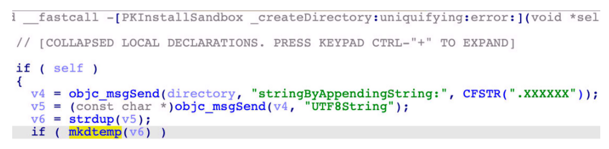  
  
“_createDirectory:uniquifying:”函数的实现  
  
在看到“PKInstallSandbox.XXXXXXX”文件夹未受保护后，我们最初认为它可以被利用和操纵。然而，我们未能直接修改文件夹中的脚本。这是因为子文件夹“Scripts”受到限制，它从受限制的沙盒路径中移动，如上第25行所示。  
  
至少有两种不同的方法来克服这个特殊的挑战并利用这个安全漏洞。  
  
  
      

    漏洞1：使用挂载技巧  
  
第一个漏洞使用挂载技巧。Perception Point在其文章中对此进行了详细讨论。根据调查，挂载技巧可以通过以下步骤完成：  
  
创建虚拟映像文件并将其装载到“/private/tmp”上；  
  
使用安装后脚本安装Apple签名的软件包；  
  
等待安装程序完成脚本目录的提取，并收集提取路径的随机部分；  
  
卸载映像文件，这将恢复到提取前的“/private/tmp”内容；  
  
创建脚本目录（使用我们之前获得的随机路径），并将我们想要的任何脚本放入其中。  
  
Perception Point的文章还指出，这里讨论的漏洞取决于时间，可能不会一直成功。  
  
  
      

    漏洞2：使用符号链接  
  
我们的漏洞使用了另一种方法：符号链接。此漏洞可通过以下步骤实现：  
  
监视“/tmp/PKInstallSandbox.XXXXXXX”目录的创建，并将其替换为指向另一个“/tmp/fakebox”位置的符号链接，以将受限制的脚本重定向到那里；  
  
一旦脚本位于“/tmp/fakebox”中，请删除符号链接并重新创建相同的“/tmp/PKInstallSandbox.XXXXXXX”目录，然后将有效负载脚本放在“/tmp/pKInstallSandox.XXXXXXX/scripts/pkgid.XXXXXX/”目录中；  
  
等待有效负载脚本执行；  
  
此漏洞的完整概念证明已上传到了GitHub上。我们的概念验证演示也可以在下图中看到。  
  
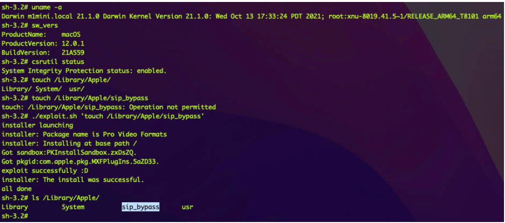  
  
使用symlink的漏洞演示  
  
即使我们是root用户，也无法在受限目录“/Library/Apple”中创建文件，因为SIP状态已启用。但是在利用程序的帮助下，我们可以在SIP绕过上下文中执行任意命令，并在受限目录中成功创建文件。  
  
  
      

    苹果CVE-2022-22583的补丁  
  
“installd”服务和“system_installd”服务的操作方式有点混乱。在下图中，我们可以看到第17行和第18行的补丁代码区分了这两种服务：  
  
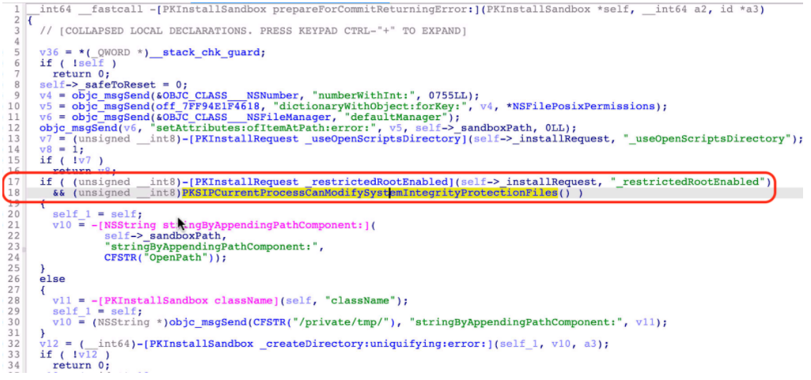  
  
CVE-2022-22583的补丁  
  
对于苹果签署的软件包，该补丁使用“OpenPath”及其自己的受限沙盒路径。对于其他包，它仍然使用“/tmp”目录中的随机路径。  
  
  
      

    安装沙盒  
  
在介绍CVE-2022-32800之前，我们需要了解一些与“安装沙盒”相关的概念。  
  
  
      

    Sandbox Repository  
  
首先，让我们看一下“Sandbox Repository”，这是一个由“-[PKInstallSandboxManager _sandboxRepositoryForDestination:forSystemSoftware:create:error:]”函数返回和创建的目录。  
  
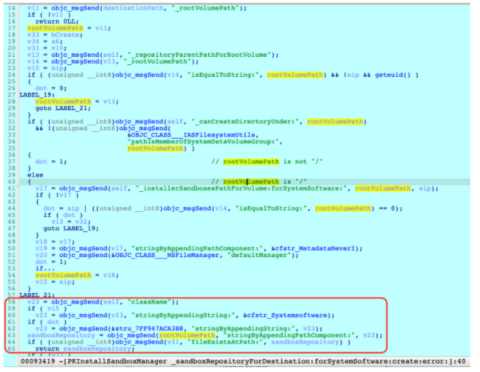  
  
“_sandboxRepositoryForDestination:XXX”函数的实现  
  
总之，有四种Sandbox Repository：  
  
安装目标为root volume“/”:  
  
a.对于Apple签名的pkg: /Library/Apple/System/Library/InstallerSandboxes/.PKInstallSandboxManager-SystemSoftware；  
  
b.其他pkg: /Library/InstallerSandboxes/.PKInstallSandboxManager；  
  
安装目标不是root volume:  
  
a.对于apple签名的pkg: $targetVolume/.PKInstallSandboxManager-SystemSoftware；  
  
b.其他pkg: $targetVolume/.PKInstallSandboxManager；  
  
需要注意的是，只有当apple签名包安装到root volume时，Sandbox Repository才会受到限制。  
  
  
      

    沙盒路径  
  
“沙盒路径”用于在安装期间存储脚本和有效载荷等文件。  
  
它是“Sandbox Repository”中的一个目录，由“[PKInstallSandboxManager addSandboxPathForDestination:forSystemSoftware:]_block_invoke”方法创建：  
  
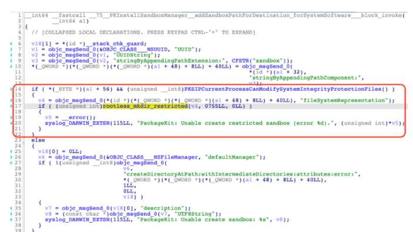  
  
实现“addSandboxPathForDestination:XXX”函数  
  
沙盒路径有四种，每种路径都有一个通用唯一标识符(UUID)名称，表示它们特定的沙盒状态：  
  
UUID.sandbox：创建的第一个状态；  
  
UUID.activeSandbox：激活状态，正在使用中；  
  
UUID.trashedSandbox：停用状态，被丢弃；  
  
UUID.orphanedSandbox：孤立状态，如果磁盘空间不足，将进行清理；  
  
  
      

    PKInstallSandbox  
  
" PKInstallSandbox "是一个用于抽象和封装的Objective-C类名：  
  
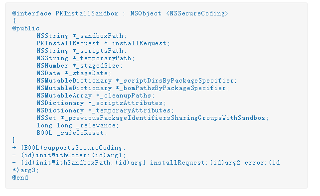  
  
通过“-[PKInstallSandbox initWithSandboxPath:installRequest:error:]”方法初始化“PKInstallSandbox”的新实例，这取决于沙盒路径和安装请求。  
  
请注意，该实例是可序列化的，并且该类实现了“NSSecureCoding”协议。“system_installd”服务可以通过“-[PKInstallSandboxManager saveSandboxAsStaged:]”方法将实例保存或序列化到沙盒路径中名为“SandboxState”的文件中：  
  
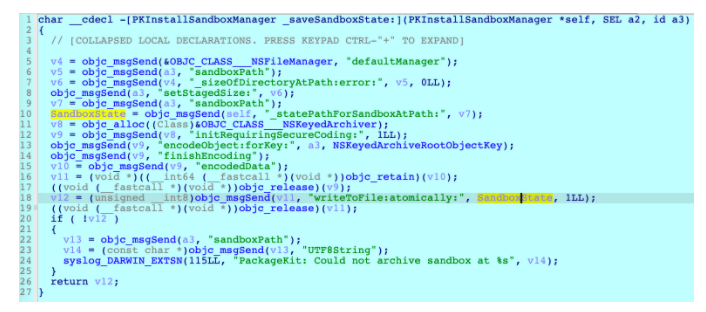  
  
“saveSandboxAsStaged”函数的实现  
  
“PKInstallSandbox”实例也可以稍后通过“-[PKInstallSandboxManager_sandboxAtPath:matchingRequest:forUse:]”方法从“SandboxState”文件还原或反序列化：  
  
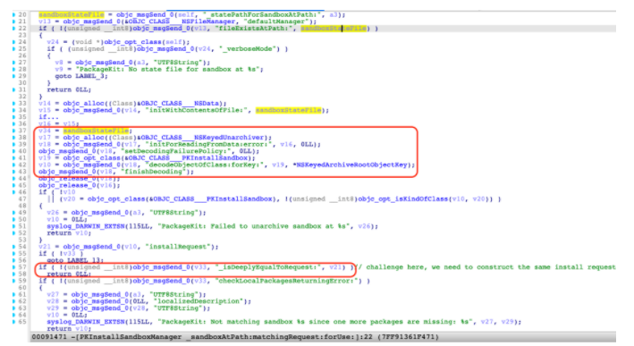  
  
“sandboxAtPath:matchingRequest:XXX”函数的实现  
  
注意，在第57行有一个检查，它要求恢复的安装请求与从安装客户端传递的安装请求深度相等。这项检查给我们的开发程序带来了一个小小的挑战。  
  
在安装之前，“system_installd”服务需要根据“-[PKInstallSandboxManagersandboxForRequest:created:error:]”函数中的安装请求获取“PKInstallSandbox”的实例。  
  
该函数的核心逻辑如下：  
  
首先，它将从“sandbox Repository”中枚举所有带有“.ssandbox”后缀的文件夹，然后从内部的“SandboxState”文件中恢复“PKInstallSandbox”实例。  
  
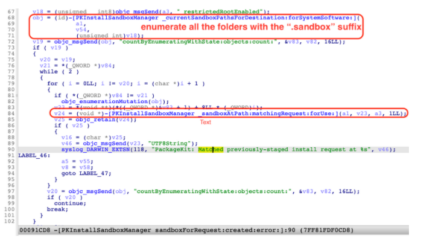  
  
枚举带有“.ssandbox”后缀的所有文件夹  
  
接下来，如果它找不到与安装请求匹配的“PKInstallSandbox”实例，那么它将枚举带有“.activeSandbox”后缀的所有文件夹，并尝试从这些位置还原它们。  
  
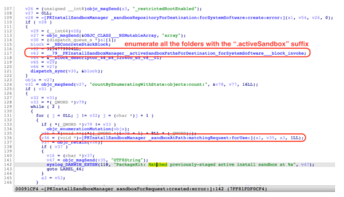  
  
枚举带有“.activeSandbox”后缀的所有文件夹  
  
最后，如果它仍然不能匹配这样的沙盒，它将创建一个新的“沙盒路径”，并构造一个新的“PKInstallSandbox”实例。  
  
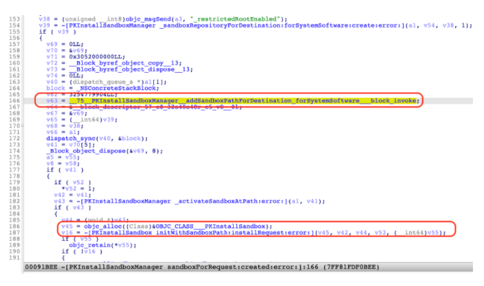  
  
创建一个新的“沙盒路径”和实例  
  
  
      

    CVE-2022-32800  
  
  
      

    漏洞详细信息  
  
CVE-2022-32800漏洞允许攻击者劫持“SandboxState”文件以获取SIP绕过原语。  
  
“SandboxState”文件存储在“Sandbox路径”中，该路径位于“Sandbox Repository”中。在正常情况下，“Sandbox存储库”仅限于Apple签名的软件包。  
  
但是，如果安装目标是DMG（磁盘映像）卷，则根本不限制“Sandbox Repository”。“SandboxState”文件也是如此。因此，我们可以制作一个特制的“SandboxState”文件，在反序列化过程中劫持新的“PKInstallSandbox”实例。然后可以控制“PKInstallSandbox”实例的所有成员变量。  
  
  
      

    漏洞利用  
  
有不同的方法可以利用这个漏洞。例如，在下图中，我们劫持了成员“_cleanupPaths”，以获取一个原语来删除任意的SIP保护路径。  
  
安装完成后，无论是否成功，它都将调用“-[PKInstallSandboxManager_removeSandbox:]”函数删除沙盒，并删除“_cleanupPaths”成员指定的所有文件和文件夹。  
  
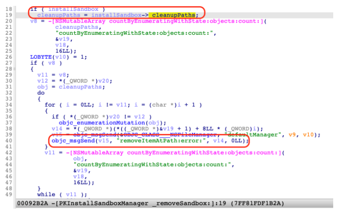  
  
“_removeSandbox”函数的实现  
  
该漏洞的完整概念证明可以在GitHub找到，演示视频可以在此查看。  
  
苹果CVE-2022-32800的补丁  
  
苹果在macOS 12.5中修复了这一安全漏洞。  
  
补丁位于“-[PKInstallSandboxManager _sandboxAtPath:matchingRequest:forUse:]”函数中:  
  
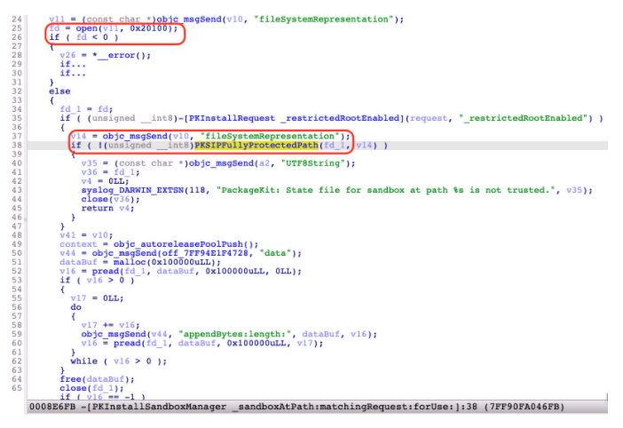  
  
CVE-2022-32800补丁  
  
正如我们在第38行检查中看到的，它在内部调用“PKSIPFullyProtectedPath”函数:  
  
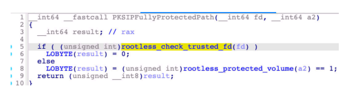  
  
“PKSIPFullyProtectedPath”函数的实现  
  
对于Apple签名的软件包，“SandboxState”文件需要受信任或限制。  
  
  
      

    安全建议  
  
为了成功地保护系统免受漏洞攻击，用户必须定期更新其操作系统。定期应用安全补丁将阻止攻击者利用漏洞提升权限并发起恶意攻击。关于此处讨论的漏洞，CVE-2022-22583于2022年1月修补，CVE-2022 2-32800于2022年7月修补。  
  
最终用户可以受益于安全解决方案，如趋势科技Mac版防病毒软件和趋势科技防护套件，它们有助于检测和阻止利用此类漏洞的攻击。  
  
参考及来源：https://www.trendmicro.com/en_us/research/22/l/a-technical-analysis-of-cve-2022-22583-and-cve-2022-32800.html  
  
  
  
  
  
  

---

> 来源：gelusus/wxvl（微信公众号漏洞文章自动归档，原始披露 URL 尚未确认，现有链接按来源追溯区分别标注）
