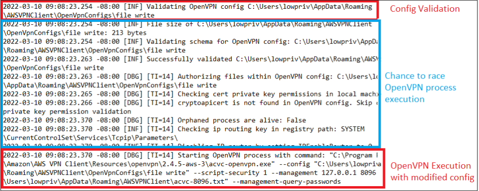
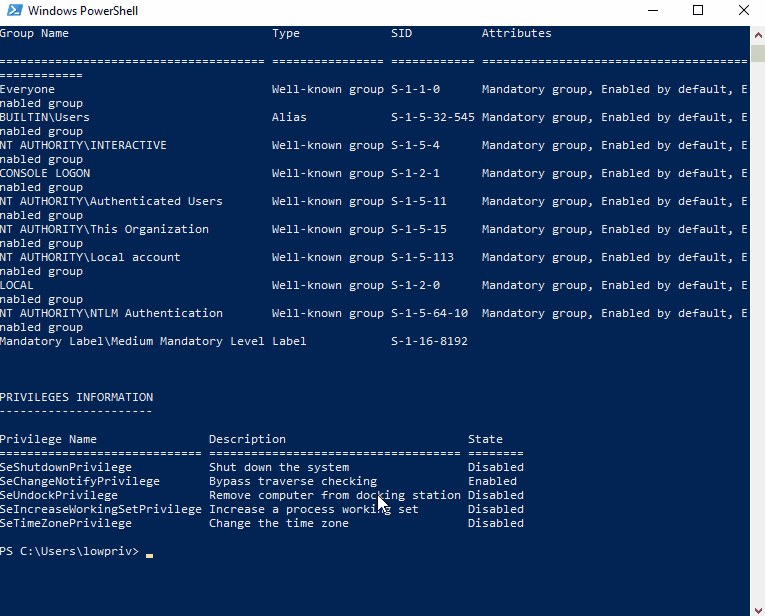
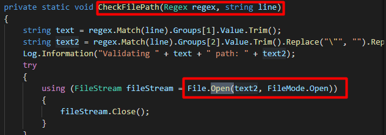
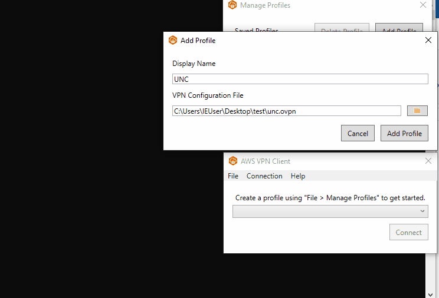

# CVE-2022-25165：AWS VPN 客户端中的 SYSTEM 权限提升

<!-- vulwiki-editorial-rebuild:system-misc -->
## 条目范围与校订

- 本文对象：AWS VPN Client for Windows
- 文献类型：AWS VPN双漏洞研究转载
- 版本、权限及部署边界：测试2.0.0、3.0.0修复；25166本地低权竞争配置到SYSTEM日志写入，25165用户导入UNC配置外发认证
- 核验状态：仅重建文本校订；未执行文中代码、PoC 或扫描，未把截图或转载声明记为本站复现

### 具体结论与待核项

以下为原归档的逐项勘误与证据缺口；可由文本确定的问题已在下文订正，仍缺来源的事实保持待核。

1. 标题25165 SYSTEM提权与正文明确25166文件写入错配，元数据25166亦不能代表全文两漏洞，应拆实体
2. 低级用户例如log为误译，log是OpenVPN指令不是用户
3. script-security1阻外部执行已说明，文件写入到提权需日志内容可控和后续执行触发，不能省略
4. Net-NTLMv2为挑战响应而非存储密码哈希，泄漏不自动等同SYSTEM权限；UNC出站认证策略需限定
5. 实际桌面客户端不是AWS云控制面漏洞，迁客户端；保留Rhino原研究及两个独立GitHub来源
6. 仅确认2.0.0不要扩为所有<3.0.0，清理广告/空推荐链接

### 操作风险

标题25165 SYSTEM提权与正文明确25166文件写入错配，元数据25166亦不能代表全文两漏洞，应拆实体；script-security1阻外部执行已说明，文件写入到提权需日志内容可控和后续执行触发，不能省略

技术请求、代码与实验方法按原文保留；其中的破坏性动作仅限授权、可恢复的隔离环境。缺失代码、参数或版本事实不猜补。

### 来源追溯

- 原文标注出处：<https://mp.weixin.qq.com/s/IN8c4Iqi3pbuw36S4w6N0A>
- 原文参考链接（未重新核验）：<http://ksria.com/simpread/>
- 原文参考链接（未重新核验）：<https://rhinosecuritylabs.com/aws/cve-2022-25165-aws-vpn-client/>
- 原文参考链接（未重新核验）：<https://aws.amazon.com/cn/vpn/client-vpn-download/>
- 原文参考链接（未重新核验）：<https://docs.aws.amazon.com/vpn/latest/clientvpn-user/connect-aws-client-vpn-connect.html>
- 原文参考链接（未重新核验）：<https://openvpn.net/community-resources/reference-manual-for-openvpn-2-4/#scripting-and-environmental-variables>

### 归档技术正文

<meta name="referrer" content="no-referrer"/>

> 本文由 [简悦 SimpRead](http://ksria.com/simpread/) 转码， 原文地址 [mp.weixin.qq.com](https://mp.weixin.qq.com/s/IN8c4Iqi3pbuw36S4w6N0A)

**每天一个CVE，赚钱变得好容易！**

本文为翻译文章，原文链接：https://rhinosecuritylabs.com/aws/cve-2022-25165-aws-vpn-client/

  

**漏洞概述**

  

AWS VPN应用程序存以 SYSTEM 身份写入任意文件，这可能导致提权和信息泄露漏洞。该漏洞可能导致用户的 Net-NTLMv2 哈希被VPN 配置文件中的 UNC 路径泄露。这些漏洞已确认影响版本 2.0.0，并已在版本 3.0.0 中修复。

要修复漏洞，请升级到可在此处下载的3.0.0版本 [1]

  

**受影响的产品**

  

*   供应商：Amazon Web Service (AWS)
    
*   产品：AWS VPN Client (Windows)
    
*   确认漏洞版本：2.0.0
    
*   固定版本：3.0.0
    

  

**CVE-2022-25166：任意文件写入**

  

在 Amazon AWS VPN Client 2.0.0 中发现了一个问题。在验证 VPN 配置文件期间存在 TOCTOU 竞争条件。这允许在 AWS VPN Client 服务（作为 SYSTEM 运行）处理文件之前将 AWS VPN Client 允许参数列表 [2]之外的参数注入到配置文件中。低级用户（例如 log）可以注入危险的参数，这将导致可在日志文件中写入任意内容。

  

**CVE-2022-25165：UNC 路径导致信息泄露**

  

在为指令（如 "auth-user-pass"）引用文件路径时，可以在OpenVPN配置文件中包含一个UNC路径。当此文件被导入 AWS VPN 客户端并且客户端尝试验证文件路径时，它会在路径上执行打开操作并将用户的 Net-NTLMv2 哈希泄漏给外部服务器。

  

**AWS VPN客户端介绍**

  

AWS VPN Client 是一个桌面应用程序，可用于连接到 AWS Client VPN。

官网网站介绍为：

**AWS Client VPN 的客户端是免费的。您可以将您的计算机直接连接到 AWS Client VPN 以获得端到端的 VPN 体验。该软件客户端与 AWS Client VPN 的所有功能兼容。**

  

**复现：任意文件写入漏洞**

  

AWS VPN 客户端安装一个 Windows 服务，以管理员身份运行，充当自定义 OpenVPN 客户端可执行文件的包装器。低权限用户可以使用 AWS VPN 客户端尝试使用导入的 OpenVPN 配置文件连接到 VPN。

有一些已知的危险 OpenVPN 指令 [3]会在 VPN 连接期间执行，例如：运行命令或将日志文件写入特定目录等操作。AWS VPN 客户端尝试禁止在配置文件中使用的 OpenVPN 指令 [4]的操作，但是限制不全，导致可以在执行 OpenVPN 可执行文件之前执行的。

**这使得在配置文件被检查后，OpenVPN可执行文件可通过条件竞争来执行，在文件中注入不允许的指令。**

您可以在下面看到由 AWS VPN 服务生成的日志文件，其中显示了从成功验证配置到执行 OpenVPN 客户端之间的时间。

  

  

接着可以很容易使用Powershell脚本监控日志文件，并在成功验证配置文件后，在OpenVPN可执行文件处理之前立即将恶意指令写入配置文件。

此时便可以写入不允许执行指令，就像在配置文件中正常添加一条允许指令这么简单，此时便可以轻易的进行权限提升了。注意：AWS VPN 服务使用“–script-security 1”标志启动 OpenVPN 可执行文件，这会阻止执行外部二进制文件或脚本。

尽管我们不能直接运行命令，但仍然可以使用“log”指令将日志输出重定向到我们选择的任何路径或文件。由于执行是以SYSTEM用户的身份进行的，这就给了我们一个写文件的特权。在最简单的情况下，这可以用来写一个批处理脚本到一个管理员的根目录。

CVE-2022-25166 相关脚本可以查看我的Github [5]

  

  

**复现：UNC路径导致信息泄露**

  

AWS VPN客户端对作为VPN配置文件导入客户端的配置文件进行验证的过程中，其中一个验证步骤是当任何文件路径被提供给接受文件路径作为参数的指令时，检查文件路径是否存在。

接受文件路径的有效指令的一些示例是：

*   auth-user-pass
    
*   ca
    

AWS VPN Client 的验证是通过对路径执行文件打开操作以确保其存在来完成的。

  

  

AWSVPNClient.Core.dll 包含 OvpnConfigParser.cs，它主要用“CheckFilePath”方法来检查文件路径是否有效。如上图代码中可发现：函数中调用了File.Open（）。

**重点来了！**

此时我们可以通过提供一个包含 UNC 路径作为文件路径的文件来利用。当文件在导入前经过验证时，它将打开 UNC 路径并将用户的 Net-NTLMv2 哈希发送到外部服务器。

  

  

CVE-2022-25165 相关脚本可以查看我的Github [6]

  

**参考链接**

  

**[1] 3.0.0 版本：**  
https://aws.amazon.com/cn/vpn/client-vpn-download/  

**[2] AWS VPN Client 允许参数列表：**  
https://docs.aws.amazon.com/vpn/latest/clientvpn-user/connect-aws-client-vpn-connect.html

**[3] 危险 OpenVPN 指令：**  
https://openvpn.net/community-resources/reference-manual-for-openvpn-2-4/#scripting-and-environmental-variables

**[4] OpenVPN 指令：**  
https://docs.aws.amazon.com/vpn/latest/clientvpn-user/connect-aws-client-vpn-connect.html

**[5] Github：**  
https://github.com/RhinoSecurityLabs/CVEs/tree/master/CVE-2022-25166

  

**[6] Github：**  
https://github.com/RhinoSecurityLabs/CVEs/tree/master/CVE-2022-25165

  

  

**【火线Zone云安全社区群】**

进群可以与技术大佬互相交流

进群有机会免费领取节假日礼品

进群可以免费观看技术分享直播

识别二维码回复**【社区群】**进群

  

**【火线Zone社区周激励】**

2022.6.13～ 2022.6.19公告

  

**【相关精选文章】**

  

  

  

火线Zone是[火线安全平台]运营的云安全社区，内容涵盖云计算、云安全、漏洞分析、攻防等热门主题，研究讨论云安全相关技术，助力所有云上用户实现全面的安全防护。欢迎具备分享和探索精神的云上用户加入火线Zone社区，共建一个云安全优质社区！

如需转载火线Zone公众号内的文章请联系火线小助手：hxanquan（微信）  

  

//  火线Zone //

微信号 : huoxian_zone

  

点击阅读原文，加入社区，共建一个有技术氛围的优质社区！

---

> 来源：MrWQ/vulnerability-paper（https://github.com/MrWQ/vulnerability-paper）
