## 2026-10-03 编号核验

CNA 将 CVE-2023-24860 对应为 Microsoft Defender 拒绝服务，将 CVE-2024-24860 对应为 Linux Bluetooth 驱动竞争条件；后者与本文 Windows Defender / EDR 场景不符，已从主编号转为历史引用。保留 2023 编号不等于确认本文全部日志删除方法属于该漏洞：具体检测签名、策略、文件类型及应用写入条件仍需核验。原文号码、地址、公开测试值和方法完整保留，不执行旧校订中替换目标地址的建议。

# CVE-2023-24860 拒绝服务攻击

<!-- vulwiki-editorial-rebuild:system-misc -->
## 条目范围与校订

- 本文对象：Windows Defender/EDR反恶意软件处置及接收外部字符串的应用
- 文献类型：EDR日志触发隔离研究与实验
- 版本、权限及部署边界：需目标应用将受控输入落盘且EDR扫描/隔离策略命中；引擎、签名库、路径保护及应用写入权限未给出
- 核验状态：仅重建文本校订；未执行文中代码、PoC 或扫描，未把截图或转载声明记为本站复现

### 具体结论与待核项

以下为原归档的逐项勘误与证据缺口；可由文本确定的问题已在下文订正，仍缺来源的事实保持待核。

1. 标题和元数据为2023-24860，正文首段为2024-24860，主漏洞身份冲突必须回源，不可静默择一
2. CVE-2010-3333出现在检测签名名称，属于被借用样本特征而非本次漏洞编号
3. 命中特征后文件隔离/删除取决于处置策略；不能泛称任何EDR都能删除任意Windows日志、虚拟机配置或数据库
4. 具体证据主要为文本/访问日志实验，跨文件类型和服务拒绝服务后果未逐一证明；未给版本或修复信息
5. 保留初始样本失败和最小化过程，不能将最终特征视为通用稳定签名；WMI字段ServerityId拼写需校正
6. 攻击命令硬编码看似公网目标需改保留地址示例；该流程有破坏性，不宜标无损检测
7. 有SafeBreach EDRaser和Black Hat Asia24研究来源，宣传与泛化安全描述可删

### 操作风险

攻击命令硬编码看似公网目标需改保留地址示例；该流程有破坏性，不宜标无损检测

技术请求、代码与实验方法按原文保留；其中的破坏性动作仅限授权、可恢复的隔离环境。缺失代码、参数或版本事实不猜补。

### 来源追溯

- 原文参考链接（未重新核验）：<https://github.com/SafeBreach-Labs/EDRaser>
- 原文参考链接（未重新核验）：<https://i.blackhat.com/Asia-24/Presentations/Asia-24_Bar-EDREraseDataRemotelyReloaded.pdf>
- 原始披露 URL 未确认；既有归档来源标签保留，不能替代原始公告

### 归档技术正文

relaysec  Relay学安全   2025-01-17 09:11  
  
欢迎加入我的知识星球，目前正在更新免杀相关的东西，129/永久，每100人加29，每周更新2-3篇上千字PDF文档。文档中会详细描述。目前已更新101+ PDF文档，《2025年了，人生中最好的投资就是投资自己！！！》  
  
加好友备注(星球)！！！  
  
  
  
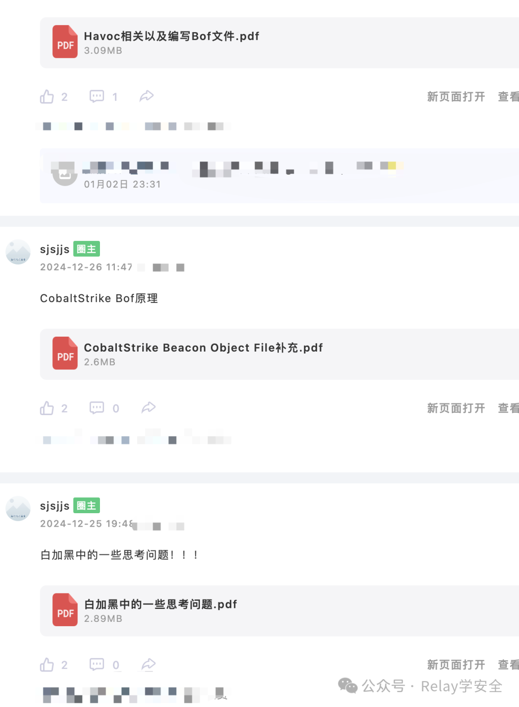  
  
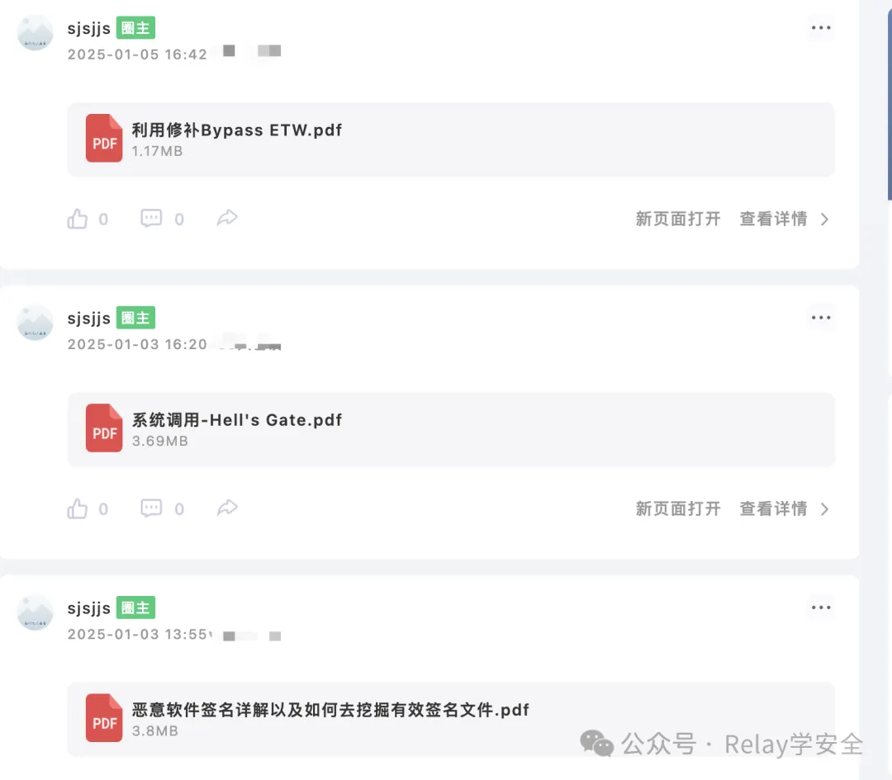  
  
  
  
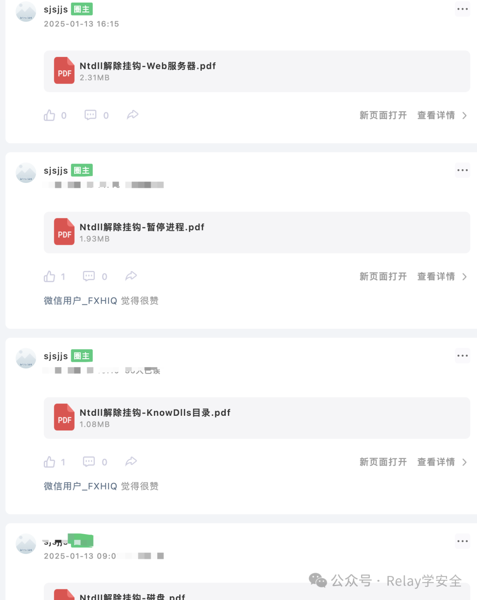  
  
CVE-2024-24860这个漏洞是用于拒绝服务攻击的漏洞。利用该漏洞可以删除  
Windows  
事件日志，删除主机上的  
VMX  
文件，  
Web  
服务日志，  
数据库  
等等。  
  
那么该漏洞非常简单，其实就是利用了  
EDR  
的特性来进行删除的，例如如果我们在  
Windows  
主机上放置一个恶意文件。那么肯定是会被  
Defender  
检测到的，那么检测到之后就会被删除。  
  
那么我们在想，  
Web  
服务器的日志文件又不是恶意文件，  
Defender  
怎么会删除呢？那么我们是不是可以将其恶意签名写入到  
Web  
日志文件中，那么  
Defender  
是不是就删除了？  
  
例如我们将其这个字符串  
{\rtf1{\shp{\sp  
写入到一个  
.txt  
文件中。  
  
当我们尝试保存的时候，会发现  
Defender  
已经阻止我们保存该文件了。  
  
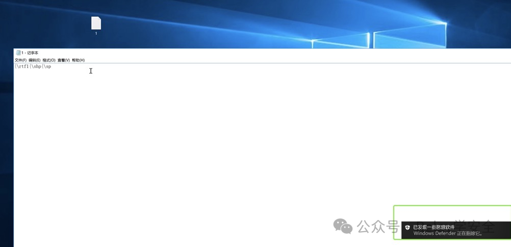  
  
我们可以来看一下  
Defender  
到底爆的是什么？它其实报的是  
CVE-2010-3333.PB  
。它会立即删除这个文件。  
  
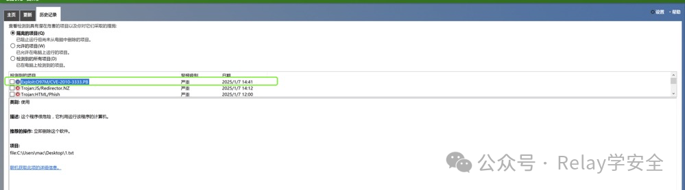  
  
现在让我们来了解一点前置的知识。  
#### 前置知识  
##### 恶意签名的最小部分  
  
恶意签名的最小部分指的是构成恶意软件特征的小组最小字节，字符串，或代码片段。这部分内容能够唯一的标识恶意软件。即使文件内容发生一些变化时，这部分内容仍然能够被用来识别恶意文件。  
  
那么我们为什么要找最小部分的恶意签名？恶意软件通常会通过各种方式来躲避检测，比如:   
文件加密或压缩  
   
代码混淆或修改  
   
隐藏或替换某些部分  
。那么如果能够找到  
最小部分  
的恶意签名，就能够更好的应对这些躲避技术。  
  
我们这里举一个例子:  
  
假设一个恶意文件的内容是   
XABCY  
，它被反病毒软件检测为恶意文件。  
1. 测试删除   
X  
 去掉  
X  
后，文件内容变成  
ABCY  
。如果这个文件仍然被检测为恶意文件，那么说明  
X  
不是恶意签名的一部分。  
  
1. 测试删除  
A  
 去掉  
A  
后，文件内容变成  
BCY  
。如果文件不再检测为恶意文件，那么说明  
A  
是恶意软件签名的一部分。  
  
1. 测试删除  
B  
 去掉  
B  
后，文件内容变成  
ACY  
，如果文件不再检测为恶意文件，那么说明  
B  
是恶意软件签名的一部分。即使  
A  
仍然存在，但是  
B  
的删除会导致文件不再被检测到恶意。也就是说虽然  
A  
还在，删除  
B  
后文件不再恶意，表明  
B  
是恶意签名的一部分。  
  
1. 测试删除  
C  
 去掉  
C  
后，文件内容变成  
ABY  
，那么说明  
C  
是恶意签名的一部分。  
  
1. 测试删除  
Y  
 去掉  
Y  
后，文件内容变成  
ABC  
，文件仍然被检测到是恶意文件，说明  
Y  
不是恶意签名的一部分。  
  
其实使用的就是排除法这种。  
#### Windwos Defender签名  
  
首先我们来了解一下  
Defender  
这个类:   
MSFT_MpThreat  
。这个类是  
Windows Defender  
内部用于定义威胁状态的类。  
  
如下字段:  
```
class MSFT_MpThreat : BaseStatus
{
    string SchemaVersion;    // 定义架构版本，例如 "1.0.0.0"。
    sint64 ThreatID;         // 威胁的唯一标识符。
    string ThreatName;       // 威胁的名称，例如病毒名、恶意软件名等。
    uint8 SeverityID;        // 威胁的严重性级别（低、中、高、严重）。
    uint8 CategoryID;        // 威胁类别，例如病毒、木马、间谍软件等。
    uint8 TypeID;            // 威胁类型 ID，进一步细分类别。
    uint32 RollupStatus;     // 聚合状态，例如是否被检测到多次。
    string Resources[];      // 受威胁影响的资源（如文件、注册表路径等）。
    boolean DidThreatExecute; // 威胁是否执行过，`true` 表示已执行。
    boolean IsActive;         // 是否是活动威胁，`true` 表示威胁仍在。
};
```  
  
这里我们唯一需要注意的是  
ServerityId  
这个字段，该字段表示威胁严重性的级别。分为低，中，高，严重。  
  
接下来就是需要查找最小的签名以及出现的次数，如下图:  
  
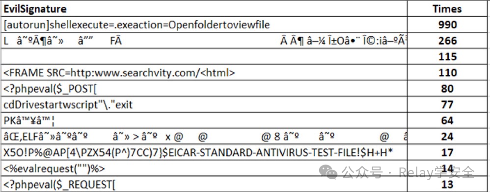  
  
需要注意的是我们查找的签名必须能够唯一标识恶意行为或软件。签名应在恶意软件经过轻微变异（如混淆或打包处理）时仍然有效。应针对潜在的恶意软件家族设计，覆盖更广泛的变种。  
  
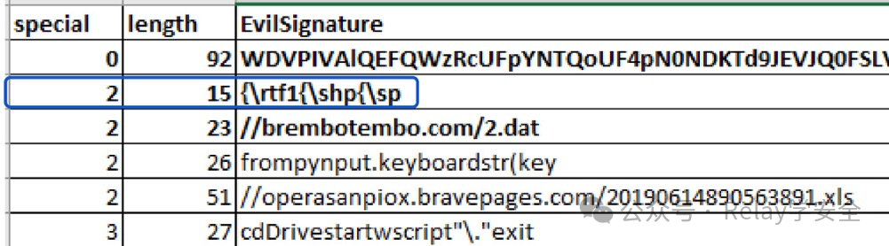  
  
最后该签名是比较合适的:   
{\rtf1{\shp{\sp  
。  
  
当我们将其保存到  
.txt  
文件中时我们会发现  
Defender  
检测到了。并且会删除自身。  
  
但是删除自身肯定是没有任何意义的，所以我们需要删除其他的文件才有意义，那么我们可以尝试将其签名写入到其他文件中。  
  
比如我们将其签名写入到其他  
.txt  
文件中，但是我们会发现是无效的。  
  
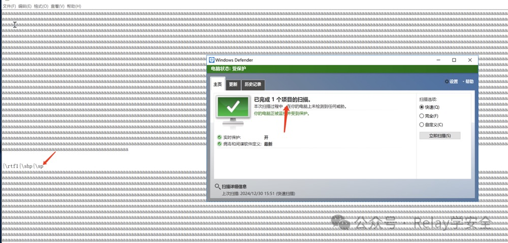  
  
攻击的话就很简单了。  
  
使用该脚本即可:  
```
https://github.com/SafeBreach-Labs/EDRaser
```  
```
python EDRaser.py -attack access_logs -ip 88.88.88.110 -p 80
```  
  
执行之后。  
  
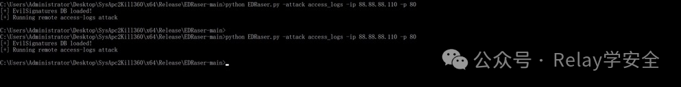  
  
当我们查看  
log  
日志文件的时候，当打开文件时会发现被  
Defender  
检测到了。  
  
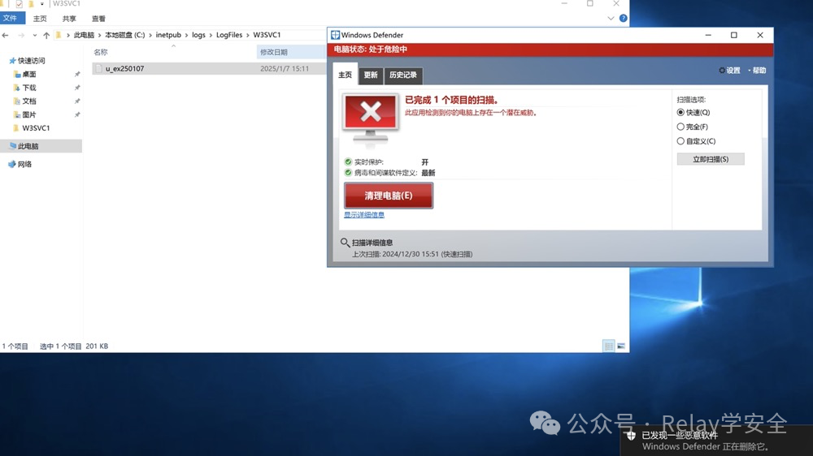  
  
如果我们查看该文件，我们会发现该脚本对其在  
.txt  
文件中插入了很多恶意签名。  
  
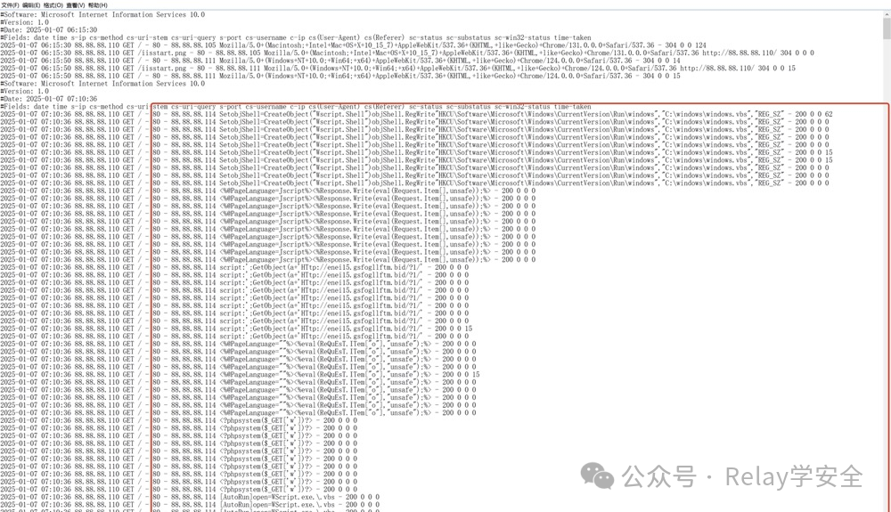  
  
参考:  
  
https://i.blackhat.com/Asia-24/Presentations/Asia-24_Bar-EDREraseDataRemotelyReloaded.pdf  
  


---

> 来源：gelusus/wxvl（微信公众号漏洞文章自动归档，原始披露 URL 尚未确认，现有链接按来源追溯区分别标注）
