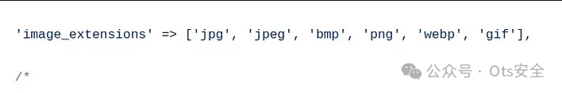
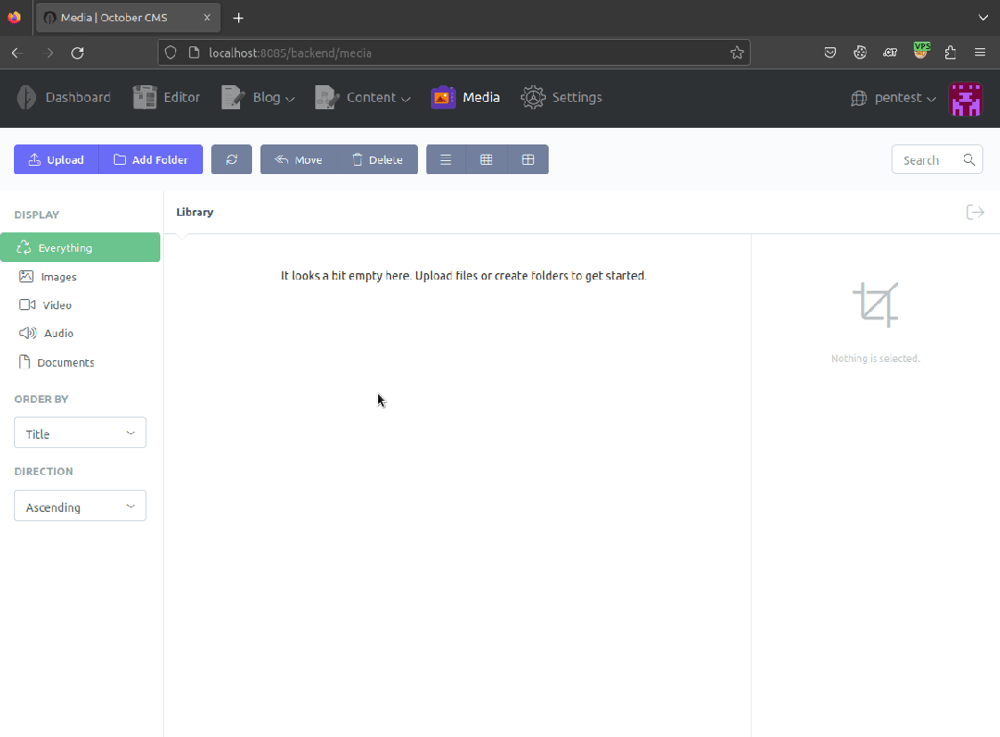
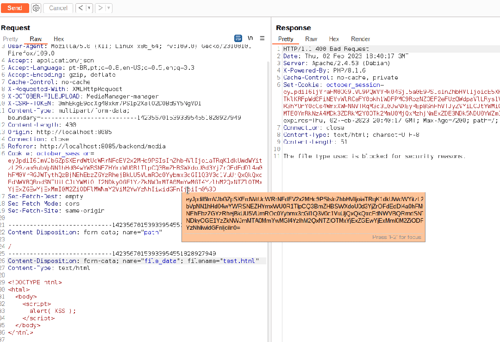

# CVE-2023-25365 - Bypass通过文件上传XSS

<!-- vulwiki-editorial-rebuild:system-misc -->
## 条目范围与校订

- 本文对象：October CMS
- 文献类型：文件上传XSS简析
- 版本、权限及部署边界：需可上传文件并诱导访问上传URL；版本、后台角色、响应Content-Type和浏览器嗅探策略未给
- 核验状态：仅重建文本校订；未执行文中代码、PoC 或扫描，未把截图或转载声明记为本站复现

### 具体结论与待核项

以下为原归档的逐项勘误与证据缺口；可由文本确定的问题已在下文订正，仍缺来源的事实保持待核。

1. 正文主产品October CMS未入标题，应迁CMS分类
2. 将.html改为.mp3只证明扩展名过滤绕过，脚本执行还依赖HTTP响应类型、nosniff和访问上下文，缺这些关键条件
3. 不使用文件名的文字与更改扩展名叙述不清；上传路径通过mask.jpg推导但完整请求及响应缺失
4. 无受影响/修复版本、原始研究或公告链接；多个核心步骤仅GIF，尾部大量互动图片噪声

### 操作风险

原文技术操作的实际副作用未复现核验；按其请求/代码评估状态变更、凭据暴露和业务影响

技术请求、代码与实验方法按原文保留；其中的破坏性动作仅限授权、可恢复的隔离环境。缺失代码、参数或版本事实不猜补。

### 来源追溯

- 原始披露 URL 未确认；既有归档来源标签保留，不能替代原始公告

### 归档技术正文

 Ots安全   2024-03-09 13:55  
  
  
  
October CMS是一个基于Laravel PHP框架的自托管获奖平台。最初，我们试图上传，但这是不可能的，该应用程序有一个过滤器和分析源代码的源代码，我们意识到，它只允许以下扩展上传：  
  
  
  
  
  
根据下面的gif，我们试图上传一个.html文件，但没有成功，消息如下：  
  
  
  
**Bypass**  
  
我们发现可以不使用文件名上传，只需使用应用程序接受的扩展名。我尝试上传a.php上传文件失败  
  
但是通过拦截请求并将.html更改为系统接受的.mp3扩展名，我们能够成功。  
  
  
  
我们插入一个简单的html文件，在访问页面时触发脚本。  
```
<!DOCTYPE html>
<html>
  <body>
    <script>
      alert('XSS');
</script>
  </body>
</html>
```  
  
在我们成功上传.mp3文件后，**它被隐藏在系统中**，所以我们**上传了一个“mask.jpg”**图片，并查看图片看到了文件路径。  
  
这样我们就可以将其**图片更改为隐藏的.mp3文件**，该文件不验证文件类型并运行我们的脚本）  
  
  
  
  
  
感谢您抽出  
  
  
  
.  
  
  
  
.  
  
  
  
来阅读本文  
  
  
  
**点它，分享点赞在看都在这里**  
  


---

> 来源：gelusus/wxvl（微信公众号漏洞文章自动归档，原始披露 URL 尚未确认，现有链接按来源追溯区分别标注）
