# CVE-2023-32243踩坑

<!-- vulwiki-editorial-rebuild:system-misc -->
## 条目范围与校订

- 本文对象：WordPress Essential Addons for Elementor Lite
- 文献类型：失败复现与版本边界纠错笔记
- 版本、权限及部署边界：对比插件5.5.5失败与5.7.1成功；WordPress6.2、Elementor3.23.3实验；需公开nonce和存在的用户名
- 核验状态：仅重建文本校订；未执行文中代码、PoC 或扫描，未把截图或转载声明记为本站复现

### 具体结论与待核项

以下为原归档的逐项勘误与证据缺口；可由文本确定的问题已在下文订正，仍缺来源的事实保持待核。

1. 开头广列5.4.0–5.7.1，结论又排除5.5.5，需将流传范围与作者实测分栏
2. 作者称5.5.5代码已打补丁但没有插件包哈希、官方tag或提交对照，失败样本不能单独证明所有5.5.5安全
3. 网上PoC和关键SQL代码块为空，源码/错误输出全是截图，无法独立复核具体调用分支
4. 保留负面实验、reset key参数为空及5.7.1差异，不能与成功复现文章机械合并后丢失版本争议
5. 无原始公告和修复版本来源，实际产品为插件而非WordPress核心

### 操作风险

原文技术操作的实际副作用未复现核验；按其请求/代码评估状态变更、凭据暴露和业务影响

技术请求、代码与实验方法按原文保留；其中的破坏性动作仅限授权、可恢复的隔离环境。缺失代码、参数或版本事实不猜补。

### 来源追溯

- 原始披露 URL 未确认；既有归档来源标签保留，不能替代原始公告

### 归档技术正文

原创 超级兵  攻防实验室   2024-07-27 22:02  
  
本文较短，赶时间的朋友直接看最后面的结论  
  
  
wordpress cve-2023-32243  
  
漏洞插件：essential-addons-for-elementor-lite 版本：5.4.0 - 5.7.1  
  
  
某次渗透中，发现目标版本：5.5.5，在可利用范围内  
  
网传poc：  
> 原文此处代码块为空，内容未归档；无法从空块证明或复现所述结果。
  
  
其中  
eael-resetpassword-nonce  
来自网站前端源码：  
var localize = {"...,"nonce":"xxxxxx",...  
部分。  
  
rp_login  
为现有用户  
  
  
利用效果：  
  
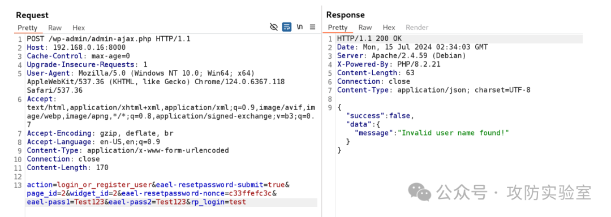  
  
有问题  
  
  
目标wp版本为6.2，搭建本地环境进行测试  
  
添加插件：essential-addons-for-elementor-lite.5.5.5.zip  
  
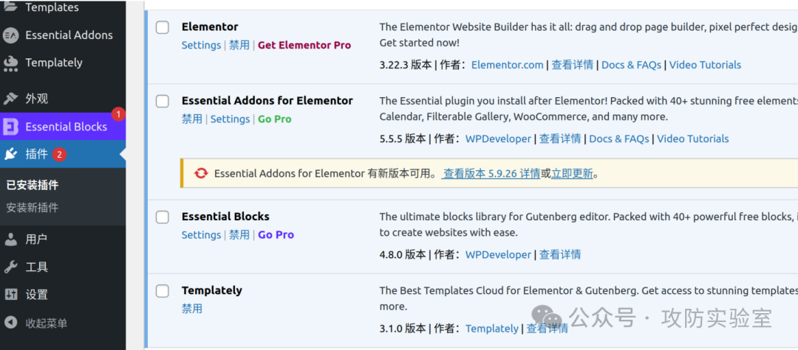  
  
配置本地环境时发现此插件需要配合插件  
Elementor(版本3.23.3)  
一同安装才能使用  
  
  
测试发现和上面的报错一样，下断点跟进代码  
  
根据上面的报错信息  
Invalid user name found!  
，我们直接定位到  
  
myweb.com\wp-content\plugins\essential-addons-for-elementor-lite\includes\Traits\Login_Registration.php  
  
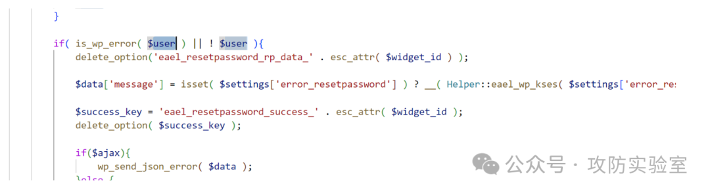  
  
$user错误导致报错，再往上看  
  
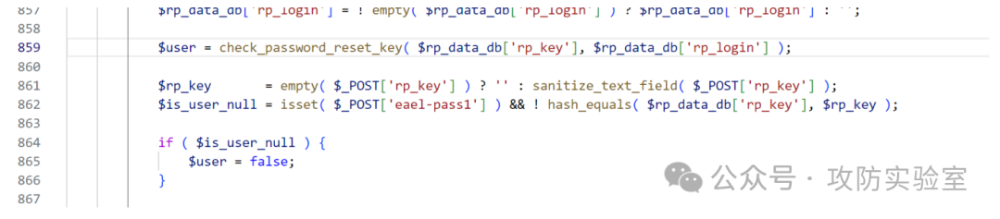  
  
这里的  
check_password_reset_key  
函数，需要传入两个参数，动态调试一下  
  
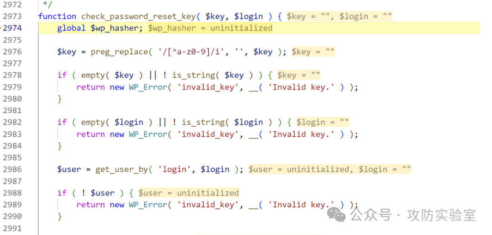  
  
跟进发现这两个参数都为空  
  
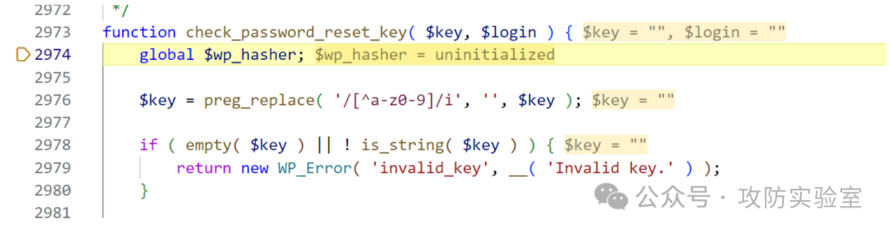  
  
key为空，直接导致$user报错  
  
再往上看，  
$rp_data_db  
是设置key和login的关键  
  
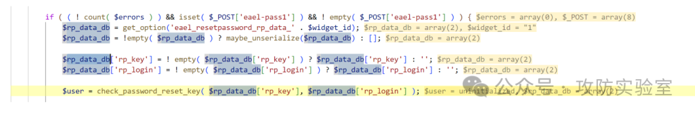  
  
跟进  
get_option  
函数  
  
注意到  
  
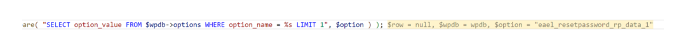  
  
对应的sql语句  
> 原文此处代码块为空，内容未归档；无法从空块证明或复现所述结果。
  
将这条语句直接去执行：  
  
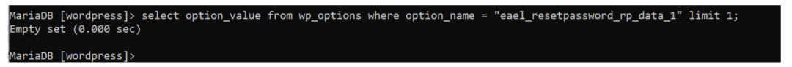  
  
使用可视化工具进行查看  
  
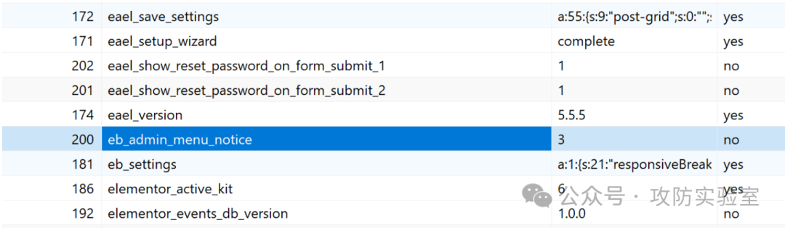  
  
没有此项，没有类似的数据  
  
  
想办法构造此项  
  
找到唯一可能有关的地方  
  
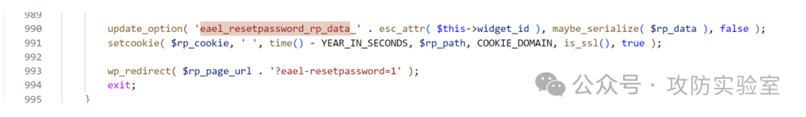  
  
且此处位于上面  
check_password_reset_key  
代码逻辑之下，无法利用  
  
后查看其它资料发现，上面这套逻辑为已经打补丁修复后的代码  
  
那我还玩个锤子🔨！！！  
  
  
结论：5.5.5版本不存在CVE-2023-32243漏洞，公开消息不一定准确！  
  
  
补充：  
  
版本5.7.1确实存在此漏洞，对于上面的那条sql语句，确实有  
update_option  
的操作（将对应值添加到数据库），但是在后续重置密码之前，未利用该语句。  
  

---

> 来源：gelusus/wxvl（微信公众号漏洞文章自动归档，原始披露 URL 尚未确认，现有链接按来源追溯区分别标注）
