# CVE-2023-38902的详细研究

<!-- vulwiki-editorial-rebuild:system-misc -->
## 条目范围与校订

- 本文对象：未明确厂商型号的LuCI eweb路由器固件
- 文献类型：认证后路由器命令注入详细逆向
- 版本、权限及部署边界：登录管理后台获取auth；实机217、仿真219，文称226修复；旧204匿名/auth链属于34644
- 核验状态：仅重建文本校订；未执行文中代码、PoC 或扫描，未把截图或转载声明记为本站复现

### 具体结论与待核项

以下为原归档的逐项勘误与证据缺口；可由文本确定的问题已在下文订正，仍缺来源的事实保持待核。

1. 作者主动区分匿名旧链与认证后新链，须保留此权限与版本差异，不能按相似Lua分析整篇去重
2. 厂商和型号被匿名化，217/219/226不是可唯一识别固件版本；应回源补完整产品、镜像哈希和补丁公告
3. 几乎所有代码、仿真脚本、最终报文为空代码块，现存文章仅文字调用链和截图，不能声称附完整PoC
4. dev_cap.lua与dev_sta.lua在fetch链段落混用；coroutine.create仅创建协程不直接运行，需说明后续resume路径
5. remotePwd类型检查Bug使注入失败与remoteIP成功链应分栏，不可概括所有字段均可注入
6. 修复函数数字/点白名单仅是本文描述，尚无正式固件链接；MITRE链接name值缺CVE前缀需核验

### 操作风险

原文技术操作的实际副作用未复现核验；按其请求/代码评估状态变更、凭据暴露和业务影响

技术请求、代码与实验方法按原文保留；其中的破坏性动作仅限授权、可恢复的隔离环境。缺失代码、参数或版本事实不猜补。

### 来源追溯

- 原文参考链接（未重新核验）：<https://bbs.kanxue.com/thread-277386.htm#msg_header_h2_4>
- 原文参考链接（未重新核验）：<https://people.debian.org/~aurel32/qemu/mipsel/进行下载>
- 原文参考链接（未重新核验）：<https://cve.mitre.org/cgi-bin/cvename.cgi?name=2023-38902>
- 原文参考链接（未重新核验）：<https://bbs.kanxue.com/user-home-953233.htm>
- 原文参考链接（未重新核验）：<http://mp.weixin.qq.com/s?__biz=MjM5NTc2MDYxMw==&mid=2458528787&idx=2&sn=113d5c21a4e165a96690bcf94fce0ad9&chksm=b18d1c9986fa958f49768bd9660ebd8c100dd21eeb6e3d607ec36534666aca166b7b49590b7f&scene=21#wechat_redirect>
- 原文参考链接（未重新核验）：<https://mp.weixin.qq.com/s?__biz=MjM5NTc2MDYxMw==&mid=2458532403&idx=1&sn=3cb169db2b7587d7679fdb4ab1b1e7db&scene=21#wechat_redirect>
- 原始披露 URL 未确认；既有归档来源标签保留，不能替代原始公告

### 归档技术正文

ZIKH26  看雪学苑   2024-02-13 18:00  
  
##   
  
> 原文此处代码块为空，内容未归档；无法从空块证明或复现所述结果。
  
  
## 这是我收获的第一个CVE编号，在复现了winmt师傅的CVE-2023-34644后，他告诉我最新的固件虽然做了一些简单的处理，导致无法在未授权的情况下RCE，但因为没有从根源上对命令执行点做限制，所以在授权后，仍然可以进行RCE。我对最新的固件进行了分析，完整记录了授权后的RCE漏洞从分析到利用的过程。从提交漏洞到现在也有半年的时间了，并且某厂商官网也已经发布了最新的固件，现将该文章分享出来，供大家进行学习和研究。  
  
  
PS:本文记录的部分内容和之前发布过的复现CVE-2023-34644文章中的部分内容有相似之处，因为对前期的lua文件分析基本一致。为了保证读任何一篇单独的文章都较为通顺和连贯，因此就保留了两篇文章中相似的部分。  
  
  
##   
  
> 原文此处代码块为空，内容未归档；无法从空块证明或复现所述结果。
  
  
## 仿真环境搭建请参考：https://bbs.kanxue.com/thread-277386.htm#msg_header_h2_4  
  
  
  
该文章详细记录了某厂商路由器的仿真过程。  
  
  
qemu的启动脚本如下：  
  
> 原文此处代码块为空，内容未归档；无法从空块证明或复现所述结果。
  
  
  
其中的vmlinux-3.2.0-4-4kc-maltadebian_squeeze_mipsel_standard.qcow2文件从https://people.debian.org/~aurel32/qemu/mipsel/进行下载。  
  
  
在执行qemu启动脚本之前，执行下面的脚本，创建一个网桥。  
  
> 原文此处代码块为空，内容未归档；无法从空块证明或复现所述结果。
  
##   
  
##   
  
> 原文此处代码块为空，内容未归档；无法从空块证明或复现所述结果。
  
### lua文件调用链分析  
#### 新版本219调用链分析  
  
在usr/lib/lua/luci/modules/cmd.lua文件中有如下代码，容易让初学者搞混，所以在此简单说明一下：  
  
> 原文此处代码块为空，内容未归档；无法从空块证明或复现所述结果。
  
  
  
首先是先定义了一个表opt里面装了字符串adddelupload等字符串，然后又定义了四张空表acConfigdevConfigdevStadevCap，接下来是一个for循环来遍历opt表。  
  
  
以devSta[opt[i]] = function(params)这行代码为例，假设现在opt[i]是元素add，function(params)这里是声明了一个匿名函数，因为函数也是一个变量，这个变量被直接存储到了devSta表中，以键值的形式存在，键就是字符串add而值就是这个函数，之后调用这个函数的话可以直接写devSta`["add"]`  
  
> 原文此处代码块为空，内容未归档；无法从空块证明或复现所述结果。
  
  
  
为什么特别说明这里呢？  
  
  
因为我在开始分析的时候，我一直以为这里是匹配到对应的键值后直接去执行函数，导致在此处执行了doParamsfetch函数（实际上通过上面的分析也知道，这里只是定义了这些函数，并没有进行调用）  
  
下面开始正式从入口分析/api/cmd的这条链，在/usr/lib/lua/luci/controller/eweb/api.lua文件中存在entry({"api", "cmd"}, call("rpc_cmd"), nil)这行代码，意味着授权后访问/api/cmd路径时，可以调用rpc_cmd函数。  
  
> 原文此处代码块为空，内容未归档；无法从空块证明或复现所述结果。
  
  
  
通过分析rpc_cmd函数得知_tbl已经包含了cmd.lua中所有变量的定义（上文已经分析过了），主要是ac_configdev_configdev_sta这三个表包含了adddelupdategetsetcleardoc这些操作，而devCap表只有get。  
  
  
相关代码如下：  
  
> 原文此处代码块为空，内容未归档；无法从空块证明或复现所述结果。
  
  
  
然后来看rpc_cmd函数中的这行代码ltn12.pump.all(jsonrpc.handle(_tbl, http.source()), http.write)  
  
jsonrpc.handle函数的参数是_tbl，看下luci.utils.jsonrpc文件中的handle函数，发现又将参数tbl传给了resolve，同时传入的还有报文中的method字段。  
  
> 原文此处代码块为空，内容未归档；无法从空块证明或复现所述结果。
  
  
  
resolve函数主要是将mod表中存放键值对中的函数提取出来，假设method为devCap.get，那么下面的代码最后可以将匿名函数devCap["get"]赋值给mod并返回：  
  
> 原文此处代码块为空，内容未归档；无法从空块证明或复现所述结果。
  
  
  
分析proxy(method, json.params or {})发现，将刚刚解析的返回值method被proxy函数当做参数，这里的method又传入了luci.util文件中的copcall函数。  
  
> 原文此处代码块为空，内容未归档；无法从空块证明或复现所述结果。
  
  
  
copcall函数主要是对coxpcall的一个封装：  
  
> 原文此处代码块为空，内容未归档；无法从空块证明或复现所述结果。
  
  
  
终于在coxpcall函数内部发现调用了f：  
  
> 原文此处代码块为空，内容未归档；无法从空块证明或复现所述结果。
  
  
  
oldpcall(coroutine.create, f)这行代码的目的是在一个新的协程中运行函数f。至此开始执行上面提到的匿名函数，重新回顾一下它的代码，该函数调用了doParams对json数据进行解析，随后调用了fetch函数。  
  
> 原文此处代码块为空，内容未归档；无法从空块证明或复现所述结果。
  
  
  
这个fetch函数在cmd.lua文件中已经定义了，这里调用了fn也就是fetch函数传入进来的第一个参数：  
  
> 原文此处代码块为空，内容未归档；无法从空块证明或复现所述结果。
  
  
  
fetch函数的第一个参数为model.fetch，model是require "dev_cap.lua"后的结果，所以在cmd.lua的fetch函数内部调用了dev_sta.lua文件中定义的fetch函数，该函数定义如下，能够看到最后是调用了/usr/lib/lua/libuflua.so文件中的client_call函数。  
  
> 原文此处代码块为空，内容未归档；无法从空块证明或复现所述结果。
  
  
  
用IDA打开/usr/lib/lua/libuflua.so文件，发现并没有看到有定义的client_call函数，不过发现了uf_client_call函数，猜测可能是程序内部进行了关联。shift+f12搜索字符串发现并没有看到client_call（如下图）。  
  
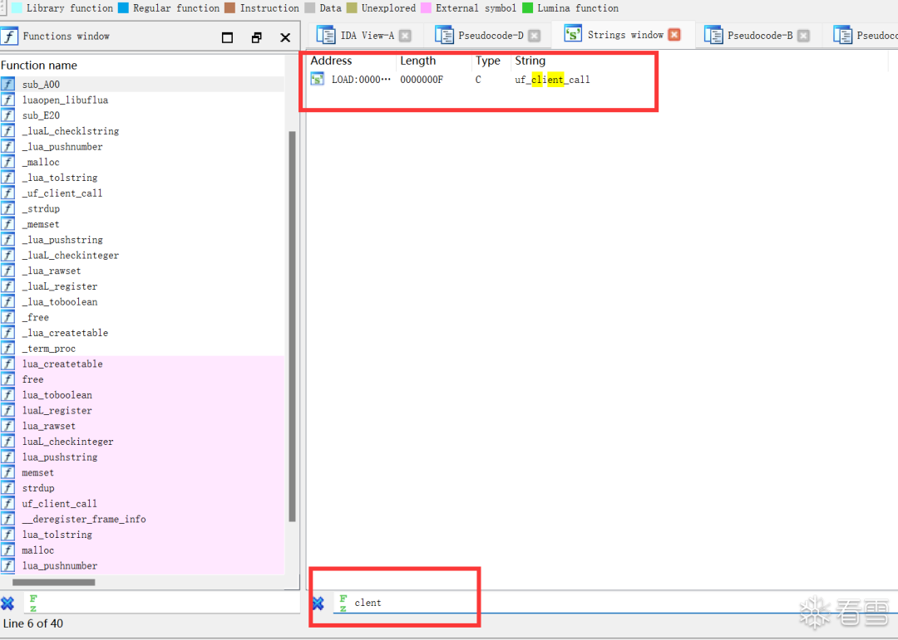  
  
  
大概率说明IDA没有把client_call解析成字符串，而是解析成了代码。我这里用010Editor打开该文件进行搜索字符串client_call，成功搜索到后发现其地址位于0xff0处。  
  
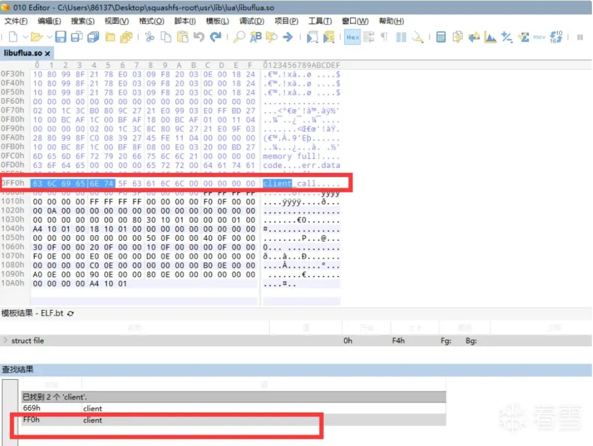  
  
  
可以看到IDA确实是将0xff0位置的数据当做了代码来解析，选中这部分数据，按a，就能以字符串的形式呈现了。  
  
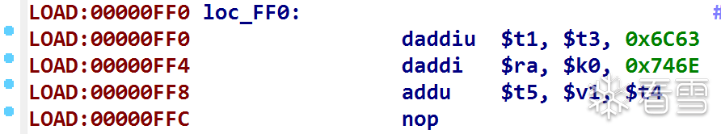  
  
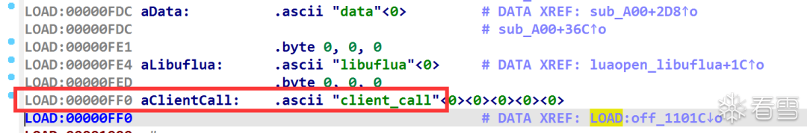  
  
  
对字符串client_call进行交叉引用，发现最终调用位置如下，luaL_register是Lua中注册C语言编写的函数，它作用是将C函数添加到一个Lua模块中，使得这些C函数能够从Lua代码中被调用。  
  
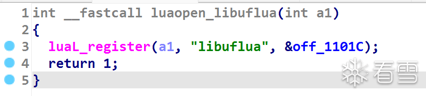  
  
  
该函数的原型如下：  
  
> 原文此处代码块为空，内容未归档；无法从空块证明或复现所述结果。
  
  
  
◆lua_State *L：Lua状态指针，代表了一个Lua解释器实例。  
  
◆const char *libname：模块的名称，这个名称会在Lua中作为一个全局变量存在，存放模块的函数。  
  
◆const luaL_Reg *l：一个结构体数组，包含要注册到模块中的函数的信息。每个结构体包含函数的名称和相应的C函数指针  
  
  
这里重点关注第三个参数，这就说明0x1101C的位置存放的是一个字符串以及一个函数指针（如下图），因此判断出client_call实际就定义在了sub_A00中。  
  
  
  
  
sub_A00函数定义如下，可以看到最后是调用了uf_client_call函数，而在这之前的很多赋值操作如*(_DWORD *)(v3 + 12) = lua_tolstring(a1, 4, 0);，很容易能猜测到其实是在解析Lua传入的各个参数字段。  
  
  
在Lua的代码中uf_call.client_call(ctype, cmd, module, param, back, ip, password, force, not_change_configId, multi)这里传入了多个参数，但是sub_A00函数就一个参数a1，结合的操作分析出这里是在解析参数。  
  
> 原文此处代码块为空，内容未归档；无法从空块证明或复现所述结果。
  
  
  
uf_client_call函数是一个引用外部库的函数，用grep在整个文件系统搜索字符串uf_client_call，结合/usr/lib/lua/libuflua.so文件中引用的外部库进行分析，最终判断出uf_client_call函数定义在/usr/lib/libunifyframe.so。  
  
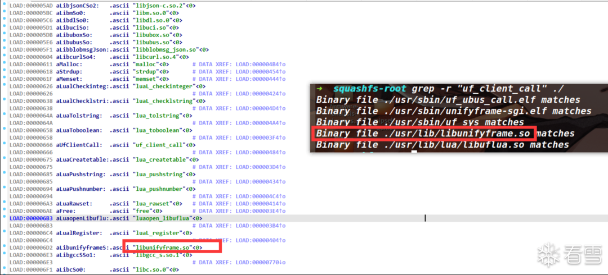  
  
  
uf_client_call函数首先判断了method的类型，然后解析出报文中各字段的值，并将其键值对添加到一个JSON对象中，接着将最终处理好的JSON对象转换为JSON格式的字符串，通过uf_socket_msg_write用socket套接字进行数据传输。  
  
> 原文此处代码块为空，内容未归档；无法从空块证明或复现所述结果。
  
  
  
既然存在uf_socket_msg_write进行数据发送，那么肯定就在一个地方有用uf_socket_msg_read函数进行数据的接收，用grep进行字符串搜索，发现/usr/sbin/unifyframe-sgi.elf文件，并且该文件还位于/etc/init.d目录下，这意味着该进程最初就会启动并一直存在，所以判断出这个unifyframe-sgi.elf文件就是用来接收libunifyframe.so文件所发送过来的数据。  
  
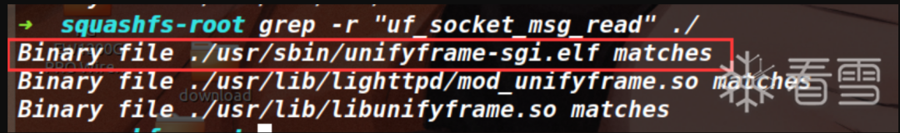  
#### 219版本之前的调用链  
  
该调用链是**winmt**师傅在**CVE-2023-34644**利用的，在219之前该调用链可以通杀该厂商大部分设备。下面介绍的这条调用链所出示的代码均来自某型号的204版本。  
  
  
在/usr/lib/lua/luci/controller/eweb/api.lua文件中，配置了路由entry({"api", "auth"}, call("rpc_auth"), nil).sysauth = false  
  
这意味着当用户访问/api/auth路径时，将调用rpc_auth。在luci框架中sysauth属性控制是否需要进行系统级的用户认证才能访问该路由，这里的sysauth属性为false，表示无需进行系统认证即可访问。  
  
  
rpc_auth函数首先引入了一些模块，然后获取HTTP_CONTENT_LENGTH的长度是否大于1000字节，如果不大于的话会将准备HTTP响应的类型设置为application/json，下面的handle函数第一个参数_tbl传入的是luci.modules.noauth文件返回的内容。  
  
> 原文此处代码块为空，内容未归档；无法从空块证明或复现所述结果。
  
  
  
到了handle函数内部后的流程与分析最新版的步骤一样，就不再赘述，最后的结果就是能在这里触发noauth文件中的merge函数（前提是报文中要设置method字段的值为merge）  
  
  
noauth的文件中定义了merge函数：  
  
> 原文此处代码块为空，内容未归档；无法从空块证明或复现所述结果。
  
  
  
merge函数又调用了/usr/lib/lua/luci/modules/cmd.lua文件中的devSta.set函数，之后的过程又和上文中分析最新版的步骤一样，也不再重复记录。  
  
> 原文此处代码块为空，内容未归档；无法从空块证明或复现所述结果。
  
####   
#### 为什么最新版不能再走这条链了？  
  
在219版本，在noauth.lua文件中的merge函数，加入了对params中危险字符的过滤，调用了includeXxs和includeQuote函数，对换行符、回车符、反引号、&、$、;、|等符号都做了过滤，这就意味着后续无法再进行命令注入了。而219版本只在这里进行了危险字符的过滤，只要从其他地方调用到诸如dev_capdev_sta表中的函数依然可以进行命令注入。  
  
> 原文此处代码块为空，内容未归档；无法从空块证明或复现所述结果。
  
###   
### 漏洞文件分析  
  
下面开始分析/usr/sbin/unifyframe-sgi.elf文件，整体流程是在main函数调用了三个关键函数uf_socket_msg_readparse_contentadd_pkg_cmd2_task，他们的作用分别为**接收数据、解析数据、执行命令。**  
#### 字段解析  
  
由uf_socket_msg_read函数将json数据读入到内存中，地址为v31+1。  
  
> 原文此处代码块为空，内容未归档；无法从空块证明或复现所述结果。
  
  
  
通过gdb来查看读入的数据**这里只为说明gdb可以查看内存中读入的数据，文章前后发送的报文并不一样。**  
  
> 原文此处代码块为空，内容未归档；无法从空块证明或复现所述结果。
  
  
  
json数据的各字段进行解析在parse_content函数中完成，该函数首先判断了params和method字段是否存在，然后在method字段不为cmdArr的情况下，调用parse_obj2_cmd函数进一步对字段进行解析。  
  
> 原文此处代码块为空，内容未归档；无法从空块证明或复现所述结果。
  
  
  
parse_obj2_cmd函数中具体的解析了各个字段及类型并把它们记录到一个堆块中，最终返回该堆块地址，便于之后的访问。**想知道POC的编写格式就要对此处进行逆向分析**，具体分析结果已写在注释中。  
  
> 原文此处代码块为空，内容未归档；无法从空块证明或复现所述结果。
  
  
  
将这个堆块装的各种数据绘制成图片可能更直观一些（如下）xxx代表有些保留字段，或者是一些标志位，它们在后续利用过程中并不重要，暂不详细记录。  
  
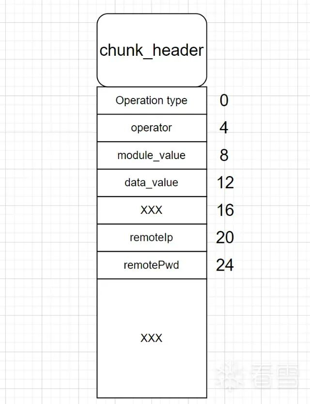  
  
  
使用GDB调试到此处看到的各字段信息如下：  
  
  
parse_obj2_cmd函数结束后，会执行pkg_add_cmd(a1, v15)，它的核心作用就是在a1这个数据结构中记录了v15的指针，使得后续操作通过a1访问到刚刚解析出来的各个字段。不过这pkg_add_cmd函数里有一个谜之操作，在这行代码中*(_DWORD *)(a1 + 92) = a2 + 13是把a2也就是v15的值加上了13存储到了a1中，而通过后续的分析得知，之后访问这个v15的堆块是通过*(a1+92)-13得到的地址。存的时候+13，访问的时候-13，这里没太理解但并不影响我们后续的分析。  
#### 触发漏洞的调用链分析  
  
> 原文此处代码块为空，内容未归档；无法从空块证明或复现所述结果。
  
  
  
json数据解析完成后，会调用add_pkg_cmd2_task，该函数通过访问之前解析出的各个字段，判断method是不是devCap，如果是的话可以调用后续的漏洞函数（不是devCap也可以触发漏洞但是调用链走的并不是我分析的这条）。  
  
> 原文此处代码块为空，内容未归档；无法从空块证明或复现所述结果。
  
  
  
uf_cmd_call函数：  
  
> 原文此处代码块为空，内容未归档；无法从空块证明或复现所述结果。
  
  
  
remote_call函数：  
  
> 原文此处代码块为空，内容未归档；无法从空块证明或复现所述结果。
  
  
  
最终存在命令注入的函数sub_41A148。  
  
> 原文此处代码块为空，内容未归档；无法从空块证明或复现所述结果。
  
  
  
上述的调用链已经分析的很清楚了并且都标注在了注释中，理清楚这些后攻击报文的构造就显而易见了，下面说一下我认为有必要提及的两点。  
#### 为什么remotePwd字段无法注入命令？  
  
在204固件中，其实是可以从remotePwd字段中注入命令并执行的，而且在最新的固件中，也可以看到这里判断了remotePwd是否存在，如果存在的话也可以进行拼接，最终导致命令执行，相关代码如下。  
  
> 原文此处代码块为空，内容未归档；无法从空块证明或复现所述结果。
  
  
  
但在最新的固件中对remotePwd字段注入命令是不成功的。  
  
  
因为发现在parse_obj2_cmd函数中对json数据解析时，对于remotePwd字段的处理是存在Bug的，它限制了remotePwd字段要为array类型（如下代码所示），但是前端对于array类型的remotePwd会报错。  
  
  
这里其实能猜测出remotePwd字段是string类型，实际上代码应该是json_object_get_type(v37) == 6。这就导致设置remotePwd类型时要么是前端报错，要么是二进制程序中判断这个类型错误，从而阴差阳错的阻止了从这里进行注入。  
  
> 原文此处代码块为空，内容未归档；无法从空块证明或复现所述结果。
  
  
  
而在204固件中，它的功能实现都是由lua语言来完成的，最终命令执行的漏洞点如下（fetch_sid函数的参数password就为remotePwd字段），因此在该固件版本中可以从remotePwd字段进行注入，而之后的版本因为Bug的原因无法进行注入。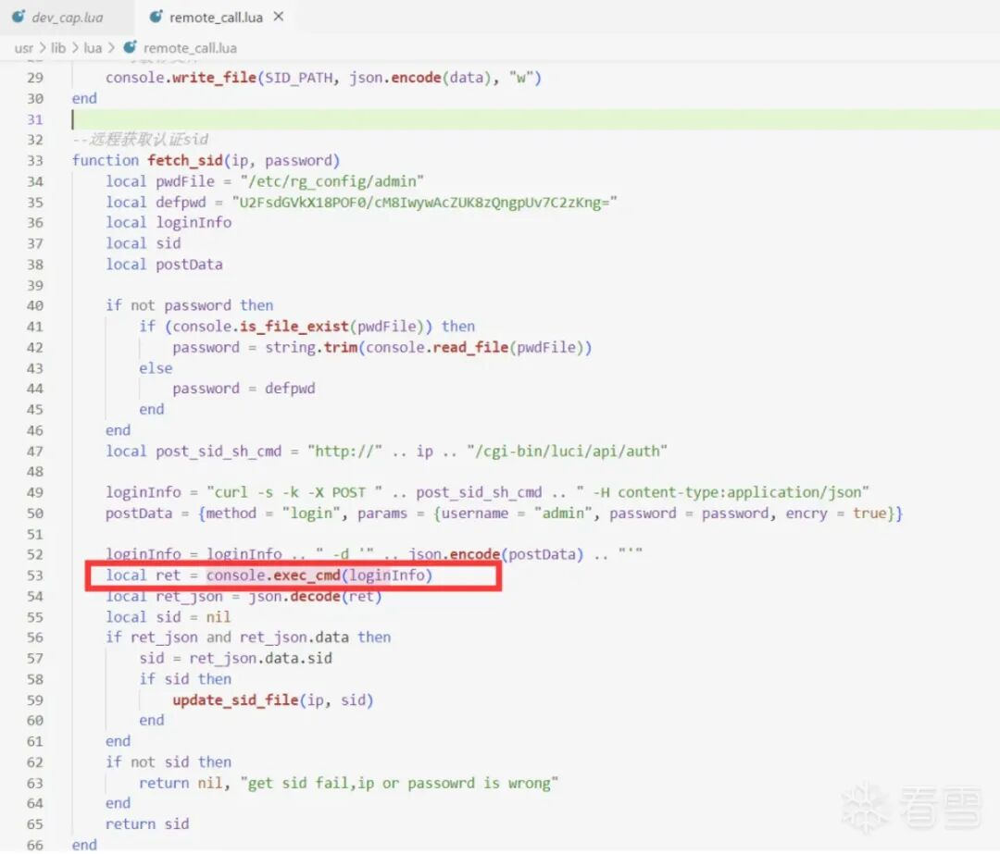  
  
####   
#### 攻击报文为什么这么构造？  
  
攻击报文如下，这些字段都是缺一不可的。而没有出现的字段都是可有可无的。  
  
> 原文此处代码块为空，内容未归档；无法从空块证明或复现所述结果。
  
  
  
下面来贴出证明这几个字段缺一不可的关键代码（其实上文的分析中都有提到，这里再汇总一下）。  
  
  
method和params不能为空，因为这里有如下检查，如果他们不存在的话会直接返回-1。  
  
> 原文此处代码块为空，内容未归档；无法从空块证明或复现所述结果。
  
  
  
而module也必须存在，并且module字段是params中的一个值。可以看到这里解析出了params，给到v38。  
  
  
而后module字段是从v38也就是params中解析出来的，如果module字段不存在的话，会执行return 0：  
  
> 原文此处代码块为空，内容未归档；无法从空块证明或复现所述结果。
  
  
  
而操作类型要设置为devCap，下面if(v3 == 3)才可以执行到remote_call函数。  
  
> 原文此处代码块为空，内容未归档；无法从空块证明或复现所述结果。
  
  
  
操作符为get是因为在Lua文件中只有opt[i]为get的时候才在devCap表中定义了字符串get所对应函数：  
  
> 原文此处代码块为空，内容未归档；无法从空块证明或复现所述结果。
  
##   
  
##   
  
> 原文此处代码块为空，内容未归档；无法从空块证明或复现所述结果。
  
  
  
这里拿在某鱼上买的真机进行测试，目标路由器某型号的版本是217。但搭建了219的仿真环境也是可以攻击成功的。  
  
  
首先登录路由器的管理后台：  
  
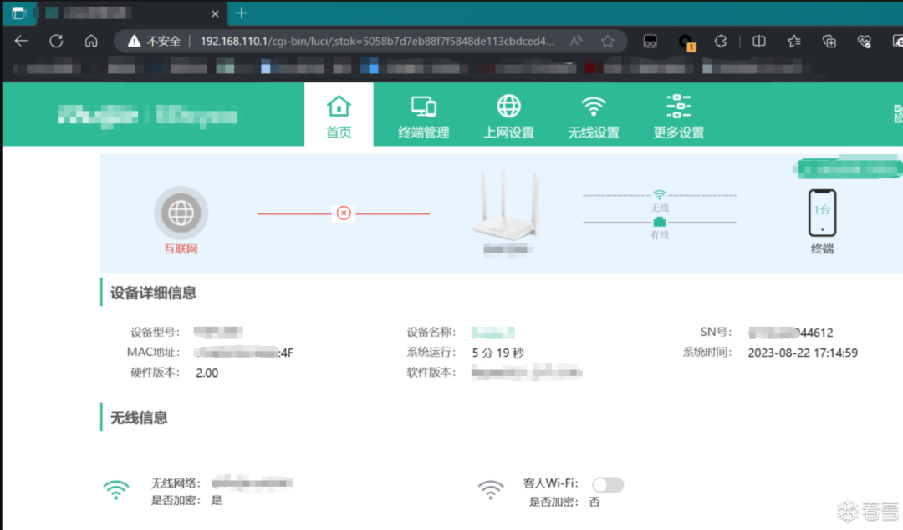  
  
  
然后用Burp Suite抓包，拿到auth的值：  
  
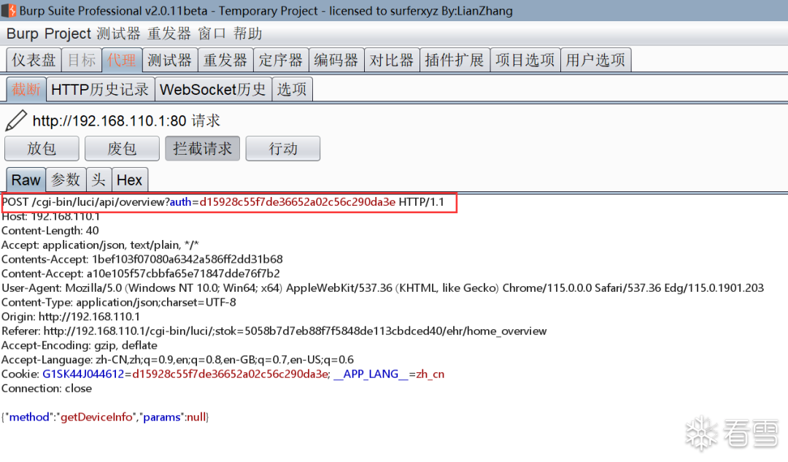  
  
向/cgi-bin/luci/api/cmd发送POST报文。  
### POC  
  
> 原文此处代码块为空，内容未归档；无法从空块证明或复现所述结果。
  
  
  
  
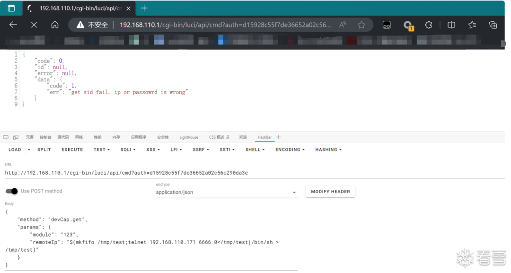  
### 攻击效果  
  
可以看到反弹shell成功，此时拿到了路由器的最高权限：  
  
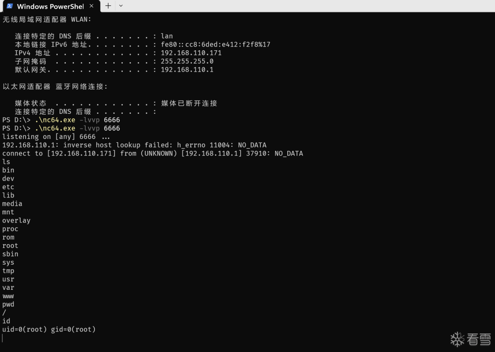  
##   
  
##   
  
> 原文此处代码块为空，内容未归档；无法从空块证明或复现所述结果。
  
  
  
官方在226版本，对上述漏洞发布了补丁。  
  
  
新添加了一个detect_remoteIp_invalid函数，该函数检查了remoteIP字段是否为纯数字或者字符.，因为正常的IP应该为xx.xx.xx.xx。这相当于对命令注入的字段做了一个过滤。  
  
> 原文此处代码块为空，内容未归档；无法从空块证明或复现所述结果。
  
##   
## 参考信息  
  
https://cve.mitre.org/cgi-bin/cvename.cgi?name=2023-38902  
  
  
  
  
  
  
  
**看雪ID：ZIKH26**  
  
https://bbs.kanxue.com/user-home-953233.htm  
  
*本文为看雪论坛精华文章，由 ZIKH26 原创，转载请注明来自看雪社区  
  
  
  
  
  
  
**#****往期推荐**  
  
1、[区块链智能合约逆向-合约创建-调用执行流程分析](https://mp.weixin.qq.com/s?__biz=MjM5NTc2MDYxMw==&mid=2458532403&idx=1&sn=3cb169db2b7587d7679fdb4ab1b1e7db&scene=21#wechat_redirect)  
  
  
2、[在Windows平台使用VS2022的MSVC编译LLVM16](https://mp.weixin.qq.com/s?__biz=MjM5NTc2MDYxMw==&mid=2458532326&idx=2&sn=1f474e4a32960bd62ca80b5172485589&scene=21#wechat_redirect)  
  
  
3、[神挡杀神——揭开世界第一手游保护nProtect的神秘面纱](https://mp.weixin.qq.com/s?__biz=MjM5NTc2MDYxMw==&mid=2458531968&idx=1&sn=f5d10b971479f00b4ba1b4bc43d63f21&scene=21#wechat_redirect)  
  
  
4、[为什么在ASLR机制下DLL文件在不同进程中加载的基址相同](https://mp.weixin.qq.com/s?__biz=MjM5NTc2MDYxMw==&mid=2458531931&idx=2&sn=c6d3d71c15a29a24e9fa288f963c82bc&scene=21#wechat_redirect)  
  
  
5、[2022QWB final RDP](https://mp.weixin.qq.com/s?__biz=MjM5NTc2MDYxMw==&mid=2458531697&idx=1&sn=ce28e8201aee34f0be6a8b6a97c4d9e4&scene=21#wechat_redirect)  
  
  
6、[华为杯研究生国赛 adv_lua](https://mp.weixin.qq.com/s?__biz=MjM5NTc2MDYxMw==&mid=2458531696&idx=1&sn=31c1dabbd80a62307ad24f4c119170fe&scene=21#wechat_redirect)  
  
  
  
  
  
  
  
  
**球分享**  
  
  
  
**球点赞**  
  
  
  
**球在看**  
  
  
  
  
  
点击阅读原文查看更多  
  

---

> 来源：gelusus/wxvl（微信公众号漏洞文章自动归档，原始披露 URL 尚未确认，现有链接按来源追溯区分别标注）
