# CVE-2023-4208复现笔记

<!-- vulwiki-editorial-rebuild:system-misc -->
## 条目范围与校订

- 本文对象：Linux cls_u32/DRR网络调度
- 文献类型：Linux网络调度UAF复现笔记
- 版本、权限及部署边界：CONFIG_NET_SCHED=y与CONFIG_NET_CLS_U32=y；需配置网络调度权限及相应命名空间、eBPF喷射可用；完整配置未收录
- 核验状态：仅重建文本校订；未执行文中代码、PoC 或扫描，未把截图或转载声明记为本站复现

### 具体结论与待核项

以下为原归档的逐项勘误与证据缺口；可由文本确定的问题已在下文订正，仍缺来源的事实保持待核。

1. 替换filter复用res却减少旧引用导致drr_class提前释放的根因有清晰叙述，与4207利用相似但不是同一触发漏洞
2. 触发命令、内核下载、配置、poc.c和pg_vec.h全部为空代码块，不能标完整PoC
3. 明确capability/user namespace及非特权eBPF限制、版本和修复提交；孤立commit并不能定义所有受影响系统
4. 从pg_vec重占到控制流/core_pattern链仅叙述和截图，调试器辅助及硬编码布局需分离
5. 引用Google security-research固定commit可追溯，openEuler objtool PR只是编译兼容修补而非4208安全修复

### 操作风险

原文技术操作的实际副作用未复现核验；按其请求/代码评估状态变更、凭据暴露和业务影响

技术请求、代码与实验方法按原文保留；其中的破坏性动作仅限授权、可恢复的隔离环境。缺失代码、参数或版本事实不猜补。

### 来源追溯

- 原文参考链接（未重新核验）：<https://gitee.com/openeuler/kernel/pulls/141/files>
- 原文参考链接（未重新核验）：<https://bbs.kanxue.com/thread-283073.htm>
- 原文参考链接（未重新核验）：<https://github.com/google/security-research/blob/499284a767851f383681ea68e485a0620ccabce2/pocs/linux/kernelctf/CVE-2023-4208_lts_cos_mitigation/docs/exploit.md>
- 原文参考链接（未重新核验）：<https://bbs.kanxue.com/user-home-975602.htm>
- 原文参考链接（未重新核验）：<https://mp.weixin.qq.com/s?__biz=MjM5NTc2MDYxMw==&mid=2458565463&idx=1&sn=e03e9773326308fa63d18676470a6824&scene=21#wechat_redirect>
- 原文参考链接（未重新核验）：<http://mp.weixin.qq.com/s?__biz=MjM5NTc2MDYxMw==&mid=2458563181&idx=1&sn=1dd42dbb95362d9678431b94473ab1f4&chksm=b18d82e786fa0bf1681d92f0d13b064eeae9530e5b2e86f78fd7f4d2662bfaffe5e99993d08f&scene=21#wechat_redirect>
- 原始披露 URL 未确认；既有归档来源标签保留，不能替代原始公告

### 归档技术正文

mb_btcapvow  看雪学苑   2024-09-07 17:59  
  
> 原文此处代码块为空，内容未归档；无法从空块证明或复现所述结果。
  
  
  
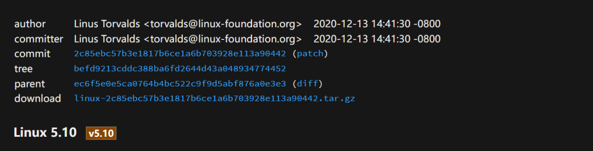  
  
  
commit：2c85ebc57b3e1817b6ce1a6b703928e113a90442  
  
  
内核源码下载：  
  
  
> 原文此处代码块为空，内容未归档；无法从空块证明或复现所述结果。
  
  
> 原文此处代码块为空，内容未归档；无法从空块证明或复现所述结果。
  
  
> 原文此处代码块为空，内容未归档；无法从空块证明或复现所述结果。
  
  
  
编辑 .config:  
  
  
> 原文此处代码块为空，内容未归档；无法从空块证明或复现所述结果。
  
  
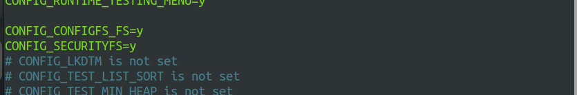  
  
> 原文此处代码块为空，内容未归档；无法从空块证明或复现所述结果。
  
  
  
遇到问题：  
  
  
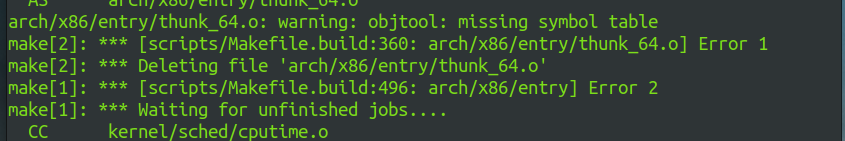  
  
  
objtool: Don't fail on missing symbol table · Pull Request !141 · openEuler/kernel（https://gitee.com/openeuler/kernel/pulls/141/files）  
  
  
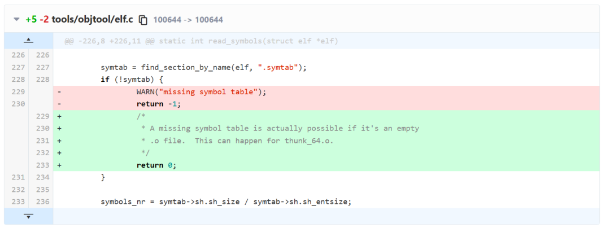  
  
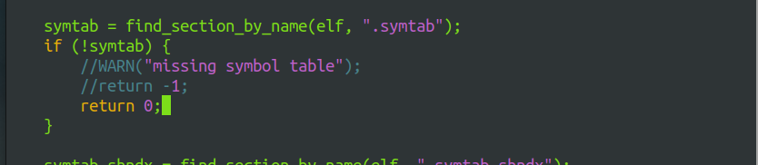  
  
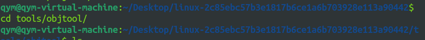  
  
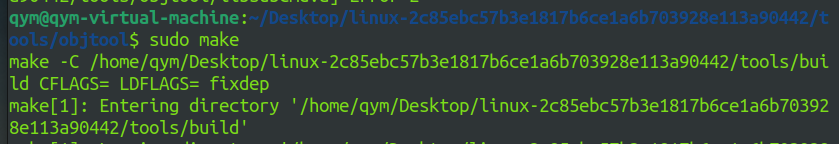  
#   
  
  
> 原文此处代码块为空，内容未归档；无法从空块证明或复现所述结果。
  
  
  
◆Kernel configuration: CONFIG_NET_SCHED=y, CONFIG_NET_CLS_U32=y  
  
  
所以总的config就是：  
  
  
defconfig+menuconfig  
  
  
> 原文此处代码块为空，内容未归档；无法从空块证明或复现所述结果。
  
  
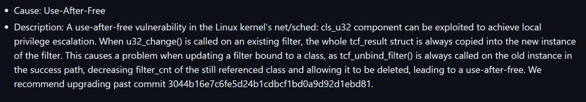  
  
> 原文此处代码块为空，内容未归档；无法从空块证明或复现所述结果。
  
#   
#   
  
> 原文此处代码块为空，内容未归档；无法从空块证明或复现所述结果。
  
  
  
在复现本CVE时，笔者已经有了CVE-2023-4207的复现经历，所以这里参照与之相同的思路进行复现，不过相关细节可能不再赘述，有不清楚的地方可以参照笔者的这一篇文章：[  
原创]CVE-2023-4207复现笔记（https://bbs.kanxue.com/thread-283073.htm）  
  
  
以下是一些触发漏洞的命令行：  
  
  
> 原文此处代码块为空，内容未归档；无法从空块证明或复现所述结果。
  
#   
#   
  
> 原文此处代码块为空，内容未归档；无法从空块证明或复现所述结果。
  
  
  
相关源码路径如下：  
  
  
> 原文此处代码块为空，内容未归档；无法从空块证明或复现所述结果。
  
  
  
在添加filter和替换filter的时候都会调用到这个函数；  
  
  
这里的n应该就是旧的filter：  
  
  
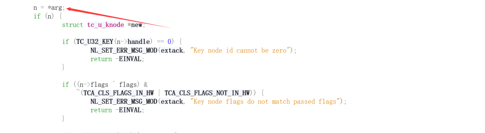  
  
  
这里通过u32_init_knote分配新的过滤器：  
  
  
  
  
  
可以看到在该函数中直接将旧的过滤器的res分配给新的过滤器：  
  
  
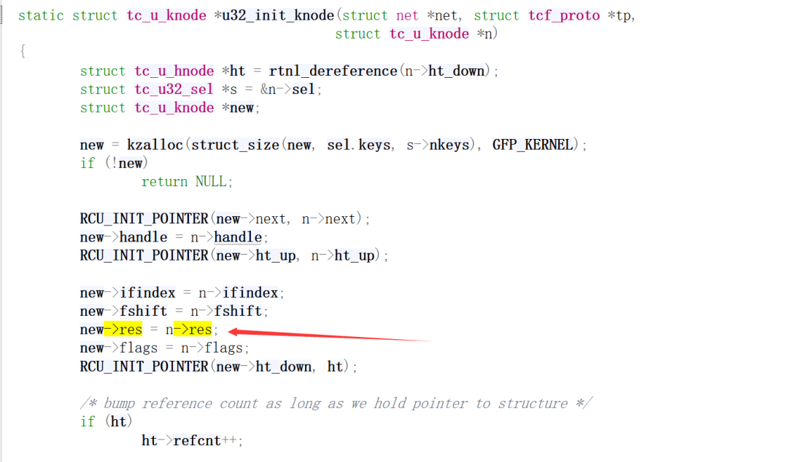  
  
  
然后tcf_unbind_filter旧的过滤器：  
  
  
  
  
  
具体函数如下：  
  
  
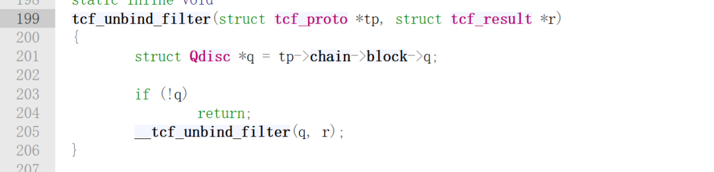  
  
  
继续跟进到__tcf_unbind_filter:  
  
  
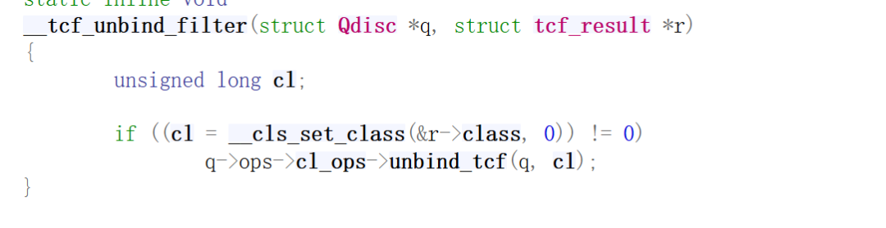  
  
  
这里调用了函数指针，通过调试后可以得知是这个函数（其实用的是drr，基本就是这个函数）：  
  
  
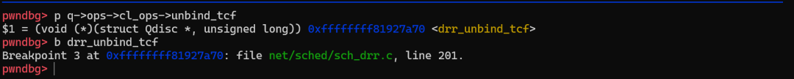  
  
  
下面看该函数的具体定义：  
  
  
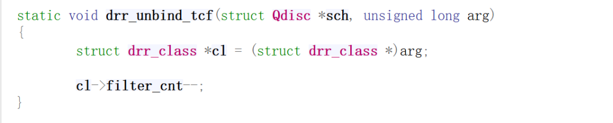  
  
  
在这里将drr_class的filter_cnt减一；然而实际上，我们的class只是换了一个filter而已，其引用数不应该被减少；  
  
  
剩下的就和CVE-2023-4207一样了，我们删除drr_class的时候会调用drr_delete_class函数：  
  
  
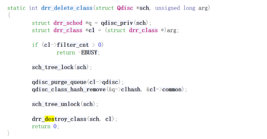  
  
  
如果引用计数<=0，就可以调用到drr_destroy_class：  
  
  
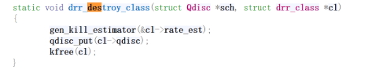  
  
  
这样就错误地释放了对应的qdisc和drr_class；  
  
  
下面还是贴一张笔者分析的图：  
  
  
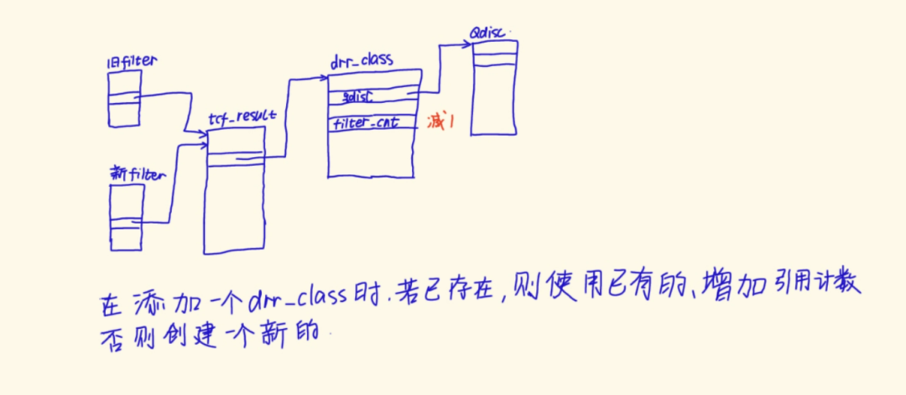  
  
  
  
> 原文此处代码块为空，内容未归档；无法从空块证明或复现所述结果。
  
  
  
> 原文此处代码块为空，内容未归档；无法从空块证明或复现所述结果。
  
  
  
主要是在drr_destroy_class下断点，然后查看cl，在后续喷射完pg_vec（当然也可以使用其他结构体）之后，可依据需使用该命令查看是否覆盖成功：  
  
  
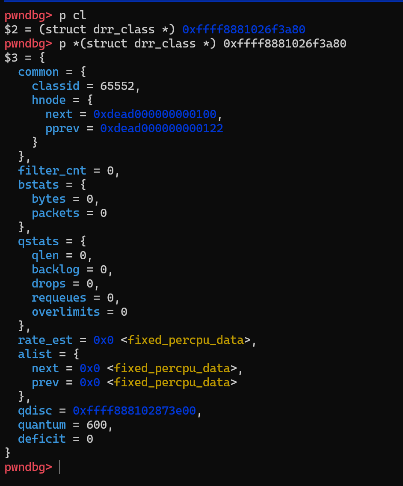  
  
  
  
> 原文此处代码块为空，内容未归档；无法从空块证明或复现所述结果。
  
  
  
后边的攻击思路和CVE-2023-4207就一样了，提前喷射eBPF，是的在内核加载模块地址内部署好我们的代码片段，然后构造uaf，之后使用pg_vec喷射出来已经释放但是仍然被使用的drr_class，此时它的偏移0x60处的qdisc成员被填入了pg_vec申请的虚拟地址，虽然我们不知道这个地址，然后通过mmap可以映射这个地址，我们就有了写这个地址的权限，写其前8个字节为我们的目标地址，也就是我们喷射的eBPF地址，即可劫持控制流；然后实现地址泄露+覆盖core_pattern，最后在另一个进程触发crash，使得root1得到执行，提权成功！  
  
  
  
> 原文此处代码块为空，内容未归档；无法从空块证明或复现所述结果。
  
  
  
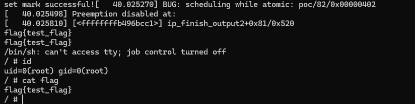  
#   
  
  
> 原文此处代码块为空，内容未归档；无法从空块证明或复现所述结果。
  
  
  
poc.c:  
  
  
> 原文此处代码块为空，内容未归档；无法从空块证明或复现所述结果。
  
  
  
pg_vec.h:  
  
  
> 原文此处代码块为空，内容未归档；无法从空块证明或复现所述结果。
  
#   
  
# 参考  
  
  
https://github.com/google/security-research/blob/499284a767851f383681ea68e485a0620ccabce2/pocs/linux/kernelctf/CVE-2023-4208_lts_cos_mitigation/docs/exploit.md  
  
  
objtool: Don't fail on missing symbol table · Pull Request !141 · openEuler/kernel  
  
（https://gitee.com/openeuler/kernel/pulls/141/files）  
  
  
  
  
  
  
  
**看雪ID：mb_btcapvow**  
  
https://bbs.kanxue.com/user-home-975602.htm  
  
*本文为看雪论坛精华文章，由 mb_btcapvow 原创，转载请注明来自看雪社区  
  
  
  
  
  
  
**# 往期推荐**  
  
1、[Alt-Tab Terminator注册算法逆向](http://mp.weixin.qq.com/s?__biz=MjM5NTc2MDYxMw==&mid=2458563181&idx=1&sn=1dd42dbb95362d9678431b94473ab1f4&chksm=b18d82e786fa0bf1681d92f0d13b064eeae9530e5b2e86f78fd7f4d2662bfaffe5e99993d08f&scene=21#wechat_redirect)  
  
  
2、[恶意木马历险记](http://mp.weixin.qq.com/s?__biz=MjM5NTc2MDYxMw==&mid=2458562562&idx=2&sn=1d66bb3141b820c717f86d349660e9ec&chksm=b18d808886fa099efc353521af0839c9bf5fbd4cae2985cf3a9a6ea28fa617f8300c0ab115a7&scene=21#wechat_redirect)  
  
  
3、[VMP源码分析：反调试与绕过方法](http://mp.weixin.qq.com/s?__biz=MjM5NTc2MDYxMw==&mid=2458562488&idx=2&sn=fe5bd1498948137775db5f454bd5a6a2&chksm=b18d9f3286fa162491072b9cd141784c1a60b2b00fd8203f865c51ef753e3f45573a78810949&scene=21#wechat_redirect)  
  
  
4、[Chrome V8 issue 1486342浅析](http://mp.weixin.qq.com/s?__biz=MjM5NTc2MDYxMw==&mid=2458562487&idx=2&sn=b2d6ad2776d37f416933e1439f244430&chksm=b18d9f3d86fa162b5edfd1c8e616c9ea5460cf21afc5d41cfd8122fbc73830c61f125c8a4960&scene=21#wechat_redirect)  
  
  
5、[Cython逆向-语言特性分析](http://mp.weixin.qq.com/s?__biz=MjM5NTc2MDYxMw==&mid=2458562186&idx=1&sn=bd95ad7951c93578ed5f0cbb1971332c&chksm=b18d9e0086fa1716382e78c54135a0a296fa215688b9a741576d41897729625284287e598faf&scene=21#wechat_redirect)  
  
  
  
  
  
  
  
  
**球分享**  
  
  
  
**球点赞**  
  
  
  
**球在看**  
  
  
  
  
  
点击阅读原文查看更多  
  

---

> 来源：gelusus/wxvl（微信公众号漏洞文章自动归档，原始披露 URL 尚未确认，现有链接按来源追溯区分别标注）
